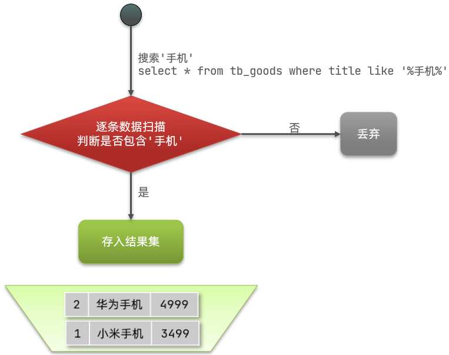
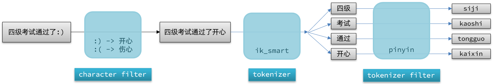

# Elasticsearch 入门

## Elasticsearch 简介

### ES 的作用

Elasticsearch 是一款非常强大的开源搜索引擎，可以帮助我们从海量数据中快速找到需要的内容，一般用来实现搜索、日志统计和分析、系统监控等功能。

举例：

- 在 GitHub 上搜索代码

  

- 在电商网站上搜索商品

  

- 在谷歌上搜索答案

  

- 在打车软件上搜索附近的车

  

### ELK 技术栈

Elasticsearch 结合 Kibana、Logstash、Beats，也就是 Elastic Stack（ELK）。被广泛应用在日志数据分析、实时监控等领域。


Elasticsearch 是 Elastic Stack 的核心，负责存储、搜索、分析数据。


### Elasticsearch 和 Lucene

Elasticsearch 底层是基于 **Lucene** 来实现的。

**Lucene** 是一个 Java 语言的搜索引擎类库，是 Apache 公司的顶级项目，由 DougCutting（Hadoop 作者） 于1999年研发。官网地址：[https://lucene.apache.org/](https://lucene.apache.org/) 。

Lucene 的优势：

- 易扩展
- 高性能（基于倒排索引）

Lucene 的缺点：

- 只限于 Java 开发
- 学习曲线陡峭
- 不支持水平扩展

Elasticsearch 的发展历史：

- 2004 年 Shay Banon 基于 Lucene 开发了 Compass 给她老婆网上搜索食谱用
- 2010 年 Shay Banon 重写了 Compass，取名为 Elasticsearch 

Elasticsearch 官网地址：[https://www.elastic.co/cn/elasticsearch](https://www.elastic.co/cn/elasticsearch)，相比于 Lucene，Elasticsearch 具备以下优势： 

- 支持分布式，非常容易做到水平扩展
- 提供 Restful 接口，可被任何语言调用

### 为什么不是其他的搜索技术

DB ranking 网站上，全球搜索引擎技术排名：


1. Elasticsearch：开源的分布式搜索引擎
2. Splunk：商业项目
3. Solr：Apache 的开源搜索引擎

虽然在早期，Apache Solr 是最主要的搜索引擎技术，但随着时代发展，Elasticsearch 已经渐渐超越了 Solr：


## 倒排索引

倒排索引的概念是相对于 MySQL 这样的正向索引而言的。

### 正向索引

传统数据库（如 MySQL）采用正向索引，例如给下表（tb_goods）中的 id 创建索引：

| id   | title          | price |
| ---- | -------------- | ----- |
| 1    | 小米手机       | 3499  |
| 2    | 华为手机       | 4999  |
| 3    | 华为小米充电器 | 49    |
| 4    | 小米手环       | 49    |
| ……   | ……             | ……    |

如果根据 id 进行查询，那么直接走索引（比如 B+ 树），查询速度会非常快。

但如果是基于 title 做模糊查询，只能是逐行扫描数据，流程如下：

1. 用户搜索数据，条件是 title 符合 `"%手机%"`
2. 逐行获取数据，比如 id 为1的数据
3. 判断数据中的 title 是否符合用户搜索条件
4. 如果符合则放入结果集，不符合则丢弃且回到步骤 1



**逐行扫描，也就是全表扫描，随着数据量增加，其查询效率也会越来越低，当数据量达到百万级别时，就是一场灾难。**

### 倒排索引

倒排索引中有两个非常重要的概念：

- 文档（`Document`）：用来搜索的数据，其中的 **每一条数据就是一个文档**。例如一个网页、一个商品信息
- 词条（`Term`）：对文档数据或用户搜索数据，利用某种算法分词，得到的具备含义的词语就是词条。例如：我是中国人，就可以分为：我、是、中国人、中国、国人这样的几个词条

**创建倒排索引 **是对正向索引的一种特殊处理，流程如下：

- 将每一个文档的数据利用算法分词，得到一个个词条
- 创建表，每行数据包括词条、词条所在文档 id、位置等信息
- 因为词条唯一性，可以给词条创建索引，例如 hash 表结构索引


使用倒排索引的 **搜索流程** 如下（以搜索"华为手机"为例）：

1. 用户输入条件 `"华为手机"` 进行搜索
2. 对用户输入内容 **分词**，得到词条：`华为`、`手机`
3. 拿着词条在倒排索引中查找，可以得到包含词条的文档 id：1、2、3
4. 拿着文档 id 到正向索引中查找具体文档


虽然要先查询倒排索引，再查询正向索引，但是无论是词条、还是文档 id 都建立了索引，查询速度非常快，无需全表扫描。

### 正向和倒排

那么为什么一个叫做正向索引，一个叫做倒排索引呢？

- **正向索引** 是最传统的，根据 id 索引的方式。但根据词条查询时，必须先逐条获取每个文档，然后判断文档中是否包含所需要的词条。是 **根据文档找词条的过程**。

- 而 **倒排索引 **则相反，是先找到用户要搜索的词条，根据词条得到包含词条的文档的 id，然后根据 id 获取文档。是 **根据词条找文档的过程**。

### 优缺点比较

**正向索引**：

优点：
- 可以给多个字段创建索引
- 根据索引字段搜索、排序速度非常快

缺点：
- 根据非索引字段，或者索引字段中的部分词条查找时，只能全表扫描

**倒排索引**：

优点：
- 根据词条搜索、模糊搜索时，速度非常快

缺点：
- 只能给词条创建索引，而不是字段
- 无法根据字段做排序

## Elasticsearch 的一些概念

Elasticsearch 中有很多独有的概念，与 MySQL 中略有差别，但也有相似之处。

### 文档和字段

Elasticsearch 是面向 **文档（Document）**存储的，文档可以是数据库中的一条商品数据，一个订单信息。

文档数据会被序列化为 JSON 格式后存储在 Elasticsearch 中。


而 JSON 文档中往往包含很多的 **字段（Field）**，类似于数据库中的列。

### 索引和映射

**索引（Index）**，就是相同类型的文档的集合。

例如：

- 所有用户文档，就可以组织在一起，称为用户的索引；
- 所有商品的文档，可以组织在一起，称为商品的索引；
- 所有订单的文档，可以组织在一起，称为订单的索引；


因此，我们可以把索引当做是数据库中的表。

数据库的表会有约束信息，用来定义表的结构、字段的名称、类型等信息。因此，索引库中就有 **映射（mapping）**，是索引中文档的字段约束信息，类似表的结构约束。

### MySQL 与 Elasticsearch

MySQL 与 Elasticsearch 的概念对比：

| **MySQL** | **Elasticsearch** | **说明**                                                     |
| --------- | ----------------- | ------------------------------------------------------------ |
| Table     | Index             | 索引（index），就是文档的集合，类似数据库的表（table）       |
| Row       | Document          | 文档（Document），就是一条条的数据，类似数据库中的行（Row），文档都是 JSON 格式 |
| Column    | Field             | 字段（Field），就是 JSON 文档中的字段，类似数据库中的列（Column） |
| Schema    | Mapping           | Mapping（映射）是索引中文档的约束，例如字段类型约束。类似数据库的表结构（Schema） |
| SQL       | DSL               | DSL 是 Elasticsearch 提供的 JSON 风格的请求语句，用来操作 Elasticsearch，实现 CRUD |

两者的擅长领域：

- MySQL：擅长事务类型操作，可以确保数据的安全和一致性

- Elasticsearch：擅长海量数据的搜索、分析、计算

因此在企业中往往是两者结合使用：

- 对安全性要求较高的 **写操作**，使用 MySQL 实现
- 对查询性能要求较高的 **搜索需求**，使用 Elasticsearch 实现
- 两者再基于某种方式，实现 **数据的同步**，保证一致性


### 分词器

作用场景：

- 在创建倒排索引时对文档进行分词
- 在用户搜索时，对输入的内容进行分词

IK 分词器的模式：

- ik_smart：智能切分，对文本做最粗粒度的拆分
- ik_max_word：最细切分，对文本做最细粒度的拆分

IK 分词器如何拓展词条，如何停用词条：

- 利用 config 目录的 `IkAnalyzer.cfg.xml` 文件添加拓展词典和停用词典
- 在词典中添加拓展词条或者停用词条

## 索引库操作

索引库就类似数据库表，mapping 映射就类似表的结构。

要向 ES 中存储数据，必须先创建“库”和“表”。

### mapping 映射属性

mapping 是对索引库中文档的约束，常见的 mapping 属性包括：

- type：字段数据类型，常见的简单类型有：
  - 字符串：text（可分词的文本）、keyword（精确值，例如：品牌、国家、ip 地址）
  - 数值：long、integer、short、byte、double、float、
  - 布尔：boolean
  - 日期：date
  - 对象：object
- index：是否创建索引，默认为 true
- analyzer：使用哪种分词器
- properties：该字段的子字段

例如下面的 JSON 文档：

```json
{
    "age": 21,
    "weight": 52.1,
    "isMarried": false,
    "info": "黑马程序员Java讲师",
    "email": "zy@itcast.cn",
    "score": [99.1, 99.5, 98.9],
    "name": {
        "firstName": "云",
        "lastName": "赵"
    }
}
```

对应的每个字段映射（mapping）：

- age：类型为 integer；参与搜索，因此需要 index 为 true；无需分词器
- weight：类型为 float；参与搜索，因此需要 index 为 true；无需分词器
- isMarried：类型为 boolean；参与搜索，因此需要 index 为 true；无需分词器
- info：类型为字符串，需要分词，因此是 text；参与搜索，因此需要 index 为 true；分词器可以用 ik_smart
- email：类型为字符串，但是不需要分词，因此是 keyword；不参与搜索，因此需要 index 为 false；无需分词器
- score：虽然是数组，但是我们只看元素的类型，类型为 float；参与搜索，因此需要 index 为 true；无需分词器
- name：类型为 object，需要定义多个子属性
  - name.firstName；类型为字符串，但是不需要分词，因此是 keyword；参与搜索，因此需要 index 为true；无需分词器
  - name.lastName；类型为字符串，但是不需要分词，因此是 keyword；参与搜索，因此需要 index 为true；无需分词器

### type 属性的变化

在 ES 的最新版本中，文档类型（`type`）的概念已经被逐渐弃用。在 ES 的早期版本中，一个索引可以包含多种类型的文档，这些类型用于表示索引中不同种类的数据集合。但是，从 6.x 版本开始，ES 团队决定逐步移除这种类型概念，原因包括：

1. **性能和复杂性**：多类型索引在内部实际上是在单个 Lucene 索引中共享，这导致了复杂的映射和存储管理，增加了性能负担。
2. **逻辑上的问题**：多类型索引意味着不同类型的文档共享同一个字段可能会有不同的数据类型，这违反了字段映射的一致性原则，可能导致数据不一致。
3. **简化API和用例**：移除类型概念有助于简化 API 的使用，使 ES 更加容易理解和使用，尤其是对于新用户。

重要的变化和版本

- **Elasticsearch 6.x**：引入了单类型索引的概念，即一个索引只能有一个类型。但是，它允许索引中存在名为 `_doc` 的类型，为全面移除类型概念做准备。
- **Elasticsearch 7.x**：类型参数在索引创建 API 中变成了可选项，而且默认情况下，文档的类型被命名为 `_doc`。在这个版本中，即使类型仍然在 URL 中可见，实际上它的作用已经大大减少。
- **Elasticsearch 8.x**：预计将完全移除文档类型的概念。

### 创建索引库

**基本语法**：

- 请求方式：PUT
- 请求路径：/索引库名，可以自定义
- 请求参数：mapping 映射

格式：

```json
PUT /{索引库名称}
{
  "mappings": {
    "properties": {
      "字段名":{
        "type": "text",
        "analyzer": "ik_smart"
      },
      "字段名2":{
        "type": "keyword",
        "index": "false"
      },
      "字段名3":{
        "properties": {
          "子字段": {
            "type": "keyword"
          }
        }
      },
      // ...略
    }
  }
}
```

### 查询索引库

**基本语法**：

- 请求方式：GET

- 请求路径：/索引库名

- 请求参数：无

**格式**：

```
GET /{索引库名称}
```

### 删除索引库

**语法：**

- 请求方式：DELETE

- 请求路径：/索引库名

- 请求参数：无

**格式：**

```
DELETE /{索引库名称}
```

### 修改索引库

ES 中的索引映射（mapping）是用来定义索引中字段的数据类型和其他属性的。在 ES 的设计中，**一旦一个字段的映射被创建，这个字段的映射就不能再被修改**。这是因为修改已有字段的映射可能会导致索引中已经存储的数据与新的映射不兼容，进而影响索引的整体一致性和查询的准确性。例如，如果一个字段最初被映射为一个整数类型，然后修改为字符串类型，那么已经存储为整数的数据就不能正确地被处理为字符串。

然而， **ES 允许向映射中添加新的字段**。这是因为添加新字段不会影响到已经存在的数据。新字段只会在新索引的文档或更新的文档中存在，而不会影响旧文档的结构。这种灵活性使得用户可以逐渐扩展他们的数据模型而无需重新索引现有数据。

如果需要修改已有字段的映射，通常的做法是创建一个新的索引，并在这个新索引中定义正确的映射。然后，可以将旧索引中的数据重新索引到新索引中。这种方法虽然成本较高，但可以确保数据的一致性和完整性得到维护。

**语法说明**：

```json
PUT /{索引库名称}/_mapping
{
  "properties": {
    "新字段名":{
      "type": "integer"
    }
  }
}
```

## 文档操作

### 新增文档

**语法：**

```json
POST /{索引库名称}/_doc/{文档id}
{
    "字段1": "值1",
    "字段2": "值2",
    "字段3": {
        "子属性1": "值3",
        "子属性2": "值4"
    },
    // ...
}
```

### 查询文档

根据 Restful 风格，新增是 post，查询应该是 get，不过查询一般都需要条件，这里我们把文档 id 带上。

这个请求是根据索引名称和文档的 ID 来精确查询的，返回的内容包括文档的详细信息，如果该文档存在的话。

**语法：**

```json
GET /{索引库名称}/_doc/{文档id}
```

如果文档存在，Elasticsearch 将返回包含以下信息的JSON对象：

- `_index`：返回文档所在的索引名称。
- `_type`：文档的类型（在最新版本的 Elasticsearch 中，默认为 `_doc`）。
- `_id`：查询的文档的ID。
- `_version`：文档的版本号，每次文档更新时，版本号会递增。
- `_source`：文档的源数据，即存储在索引中的原始数据。
- `_seq_no` 和 `_primary_term`：这些是内部版本控制字段，用于乐观并发控制。
- `found`：一个布尔值，指示是否找到文档。如果文档存在，此值为 `true`；如果不存在，则为 `false`。

### 删除文档

删除使用DELETE请求，同样，需要根据id进行删除：

**语法：**

```js
DELETE /{索引库名称}/_doc/{文档id}
```

### 修改文档

#### 全量修改

全量修改是覆盖原来的文档，其本质是：

- 根据指定的 id 删除文档
- 新增一个相同 id 的文档

**注意**：如果根据 id 删除时，id 不存在，第二步的新增也会执行，也就是说修改操作变成了新增操作。

**语法：**

```json
PUT /{索引库名}/_doc/{文档id}
{
    "字段1": "值1",
    "字段2": "值2",
    // ... 略
}
```

#### 增量修改

增量修改是只修改指定 id 匹配的文档中的部分字段。

**语法：**

```json
POST /{索引库名}/_update/{文档id}
{
    "doc": {
         "字段名": "新的值",
    }
}
```

## DSL 查询语法

### DSL 查询的分类

Elasticsearch 提供了基于 JSON 的 DSL（[Domain Specific Language](https://www.elastic.co/guide/en/elasticsearch/reference/current/query-dsl.html)）来定义查询。常见的查询类型包括：

- **查询所有**：查询出所有数据，一般测试用。例如：`match_all`

- **全文检索（full text）查询**：利用分词器对用户输入内容分词，然后去倒排索引库中匹配。例如：
  - `match_query`
  - `multi_match_query`
- **精确查询**：根据精确词条值查找数据，一般是查找 keyword、数值、日期、boolean 等类型字段。例如：
  - `ids`
  - `range`
  - `term`
- **地理（geo）查询**：根据经纬度查询。例如：
  - `geo_distance`
  - `geo_bounding_box`
- **复合（compound）查询**：复合查询可以将上述各种查询条件组合起来，合并查询条件。例如：
  - `bool`
  - `function_score`

### DSL 查询的基本语法

查询的基本语法如下：

```json
GET /{索引库名称}/_search
{
  "query": {
    "查询类型": {
      "查询条件": "条件值"
    }
  }
}
```

我们以 **查询所有** 为例，其中：

- 查询类型为 `match_all`
- 没有查询条件

```json
// 查询所有
GET /{索引库名称}/_search
{
  "query": {
    "match_all": {
    }
  }
}
```

其它查询无非就是 **查询类型**、**查询条件** 的变化。

### 查询的常规返回值

从 Elasticsearch 进行查询时，返回的响应包含多个重要的字段，每个字段都有其特定的含义和用途：

`took`：表示 Elasticsearch 执行查询所花费的时间，单位是毫秒。用来帮助了解查询的性能，方便性能调优。

`timed_out`：布尔值，表示查询是否因为超时而没有完成。监控和警报系统中常用，用以检测可能的性能问题。

`_shards：`：包含关于查询涉及的分片的信息，包括总分片数、成功查询的分片数、失败的分片数等。用来诊断分布式查询中可能的问题，如某个分片的故障。

- `total`：查询涉及的分片总数。
- `successful`：成功返回结果的分片数。
- `skipped`：在查询过程中跳过的分片数（通常在使用分片路由或有缓存结果时出现）。
- `failed`：查询失败的分片数。

`hits`：包含实际的查询结果，是查询最重要的部分。展示查询结果，用于后续的数据处理或显示.

- `total`：匹配查询条件的文档总数。从 ES 7.x 开始，这个字段返回一个对象，包含 `value`（匹配数）和`relation`（表示是否精确）。
- `hits`：包含一个数组，每个元素代表一个匹配的文档。
  - `_index`：文档所在的索引名。
  - `_type`：文档的类型（在 ES 7.x 中基本废弃，所有文档类型默认为 `_doc`）。
  - `_id`：文档的 ID。
  - `_score`：文档的相关性得分，根据查询的 relevancy 计算得出。
  - `_source`：文档的原始数据（如果查询请求中指定返回）。

`aggregations`：如果查询中包含聚合操作，该字段包含聚合的结果。进行统计分析和数据汇总。

### 全文检索查询

全文检索查询的基本流程如下：

- 对用户搜索的内容做分词，得到词条
- 根据词条去倒排索引库中匹配，得到文档id
- 根据文档 id 找到文档，返回给用户

比较常用的场景包括：

- 商城的输入框搜索
- 百度输入框搜索

因为是拿着词条去匹配，因此参与搜索的字段也必须是可分词的 text 类型的字段。

#### 基本语法

常见的全文检索查询包括：

- `match` 查询：单字段查询
- `multi_match` 查询：多字段查询，任意一个字段符合条件就算符合查询条件

`match` 查询语法如下：

```json
GET /{索引库名称}/_search
{
  "query": {
    "match": {
      "{字段名称}": "TEXT"
    }
  }
}
```

`mulit_match` 语法如下：

```json
GET /{索引库名称}/_search
{
  "query": {
    "multi_match": {
      "query": "TEXT",
      "fields": ["FIELD1", " FIELD12"]
    }
  }
}
```

但是，参与查询的字段越多，对查询性能影响越大，因此建议采用 `copy_to`，然后单字段查询的方式。

### 精准查询

精确查询一般是查找 keyword、数值、日期、boolean 等类型字段。所以 **不会** 对搜索条件分词。常见的有：

- `term`：根据词条精确值查询
- `range`：根据值的范围查询

#### term 查询

因为精确查询的字段搜索的是不分词的字段，因此查询的条件也必须是 **不分词** 的词条。

查询时，用户输入的内容跟字段值完全匹配时才认为符合条件。

如果用户输入的内容是多个词语形成的短语，反而搜索不到数据。

语法说明：

```json
// term查询
GET /{索引库名称}/_search
{
  "query": {
    "term": {
      "FIELD": {
        "value": "VALUE"
      }
    }
  }
}
```

#### range 查询

范围查询，一般应用在对数值类型做范围过滤的时候。比如做价格范围过滤。

基本语法：

```json
// range查询
GET /{索引库名称}/_search
{
  "query": {
    "range": {
      "{字段名称}": {
        "gte": 10, // 这里的 gte 代表大于等于，gt 则代表大于
        "lte": 20 // lte 代表小于等于，lt 则代表小于
      }
    }
  }
}
```

### 地理坐标查询

所谓的地理坐标查询，其实就是根据经纬度查询，官方文档：[https://www.elastic.co/guide/en/elasticsearch/reference/current/geo-queries.html](https://www.elastic.co/guide/en/elasticsearch/reference/current/geo-queries.html)

常见的使用场景包括：

- 携程：搜索我附近的酒店
- 滴滴：搜索我附近的出租车
- 微信：搜索我附近的人

#### 矩形范围查询

`geo_bounding_box`：查询 `geo_point` 落在某个矩形范围的所有文档。

查询时，需要指定矩形的 **左上**、**右下 **两个点的坐标，然后根据其生成的矩形，落在其中的都是符合条件的点。


语法如下：

```json
// geo_bounding_box查询
GET /{索引库名称}/_search
{
  "query": {
    "geo_bounding_box": {
      "{字段名称}": {
        "top_left": { // 左上点
          "lat": 31.1,
          "lon": 121.5
        },
        "bottom_right": { // 右下点
          "lat": 30.9,
          "lon": 121.7
        }
      }
    }
  }
}
```

这种方式并不适合“附近的人”这样的圆形范围查询需求。

#### 附近查询（距离查询）

`geo_distance`：查询到指定中心点小于某个距离值的所有文档。

换句话来说，在地图上找一个点作为圆心，以指定距离为半径，画一个圆，落在圆内的坐标都算符合条件。


语法如下：

```json
// geo_distance 查询
GET /{索引库名称}/_search
{
  "query": {
    "geo_distance": {
      "distance": "15km", // 半径
      "{字段名称}": "31.21,121.5" // 圆心
    }
  }
}
```

### 复合查询

复合（compound）查询：复合查询可以将其它简单查询组合起来，实现更复杂的搜索逻辑。常见的有两种：

- `fuction score`：算分函数查询，可以控制文档相关性算分，控制文档排名
- `bool query`：布尔查询，利用逻辑关系组合多个其它的查询，实现复杂搜索

#### 相关性算分

当我们利用 `match` 查询时，文档结果会根据与搜索词条的关联度打分（`_score`），返回结果时按照分值降序排列。

例如，我们搜索 "虹桥如家"，结果如下：

```json
[
  {
    "_score" : 17.850193,
    "_source" : {
      "name" : "虹桥如家酒店真不错",
    }
  },
  {
    "_score" : 12.259849,
    "_source" : {
      "name" : "外滩如家酒店真不错",
    }
  },
  {
    "_score" : 11.91091,
    "_source" : {
      "name" : "迪士尼如家酒店真不错",
    }
  }
]
```

在 Elasticsearch 5.x 之前，搜索的相关性打分主要依据 TF/IDF（词频/逆文档频率）模型。这个模型考虑了两个主要因素：

- **TF（Term Frequency）**：词频，即一个词在文档中出现的频率。词出现得越频繁，它对文档的重要性越高。
- **IDF（Inverse Document Frequency）**：逆文档频率，衡量一个词的普遍重要性。如果一个词在很少的文档中出现，则认为它具有很高的区分度，IDF 值较高。

公式如下：


从 Elasticsearch 5.x 版本开始，默认使用的打分算法是 BM25，这是一种更为现代的、基于概率的排名函数，用于替代传统的 TF/IDF 方法。BM25 被设计用来克服 TF/IDF 模型的一些限制，特别是在处理长文档或短查询时的性能问题。

BM25 的公式考虑了以下几个要素：

- **词频（TF）**：在 BM25 中，词频的影响经过了优化，以防一个词在文档中大量出现时对整体打分的影响过大。
- **文档频率（DF）**：类似于 IDF，但在 BM25 中使用的是文档频率的逆向非线性函数。
- **文档长度**：BM25 还考虑了文档长度的因素，对长文档和短文档进行了归一化处理，以避免长文档仅因为单词总数多而获得过高的评分。

公式如下：


TF/IDF 算法有一各缺陷，就是词条频率越高，文档得分也会越高，单个词条对文档影响较大。

而 BM25 则会让单个词条的算分有一个上限，曲线更加平滑：


#### Function Score Query

根据相关度打分是一种比较合理的算分方式，但 **合理的不一定是产品经理需要** 的。

以百度搜索为例，并不是相关度越高排名越靠前，而是谁掏的钱多排名就越靠前。

要想更精细地控制搜索结果的排名，就需要利用 Elasticsearch 中的 **Function Score Query** 了，它是一种非常强大的查询，可以根据多种函数来修改或增强查询结果的相关性得分。

使用这种查询，我们可以在查询结果的排序中加入自定义的逻辑，例如基于某些字段的数值、随机化处理、地理位置信息等来调整得分。

语法说明：


function score 查询中包含四部分内容：

- **原始查询条件**：query 部分，基于这个条件搜索文档，并且基于 BM25 算法给文档打出 **原始算分**（query score)
- **过滤条件**：filter 部分，符合该条件的文档才会 **重新算分**
- **算分函数**：符合 filter 条件的文档要根据这个函数做运算，得到的 **函数算分**（function score），有四种函数
  - weight：函数结果是常量
  - field_value_factor：以文档中的某个字段值作为函数结果
  - random_score：以随机数作为函数结果
  - script_score：自定义算分函数
- **运算模式**：算分函数的结果、原始查询的相关性算分，两者之间的运算方式，包括：
  - multiply：相乘
  - replace：用 function score 替换 query score
  - 其它，例如：sum、avg、max、min

function score 的运行流程如下：

1. 根据 **原始查询条件 **查询搜索文档，并且计算相关性算分，称为 **原始算分**（query score）
2. 根据 **过滤条件**，过滤文档
3. 符合 **过滤条件** 的文档，基于 **算分函数** 运算，得到 **函数算分**（function score）
4. 将 **原始算分** （query score）和 **函数算分**（function score）基于 **运算模式** 做运算，得到最终结果，作为相关性算分

因此，其中的关键点是：

- 过滤条件：决定哪些文档的算分被修改
- 算分函数：决定函数算分的算法
- 运算模式：决定最终算分结果

#### Boolean Query

**Boolean Query** 是一种复杂的查询类型，它允许我们结合多个查询条件，通过逻辑操作符（如 AND、OR、NOT）来构建更复杂的查询逻辑。这种查询在实际应用中非常常见，尤其是当我们需要在搜索中包含多个条件或排除某些文档时。

Boolean Query 主要由以下四个部分组成：

1. **must**：查询中的这部分条件必须满足（逻辑 AND）。如果添加多个查询到 `must` 部分，返回的文档必须满足所有这些条件，**`must` 会参与算分**。
2. **should**：查询中的这部分条件至少满足一个（逻辑 OR）。`should` 查询可以用于 **增加那些匹配的文档的相关性得分**，使其在结果列表中排名更高。如果 `should` 查询是 `boolean` 查询中唯一的条件，那么至少需要匹配一个 `should` 条件，但如果 `boolean` 查询中也包含了 `must` 或 `filter`，则 `should` 可以不匹配也可以返回结果。
3. **must_not**：查询中的这部分条件必须不满足（逻辑 NOT）。它用于排除包含特定条件的文档。
4. **filter**：这与 `must` 类似，查询中的这部分条件必须满足，但是与 `must` 不同的是，**`filter` 不会影响得分，仅用于过滤文档**。这使得 `filter` 在性能上通常比 `must` 更优，特别是当你只是想过滤数据而不关心得分时。

比如在搜索酒店时，除了关键字搜索外，我们还可能根据品牌、价格、城市等字段做过滤。

每一个不同的字段，其查询的条件、方式都不一样，必须是多个不同的查询，而要组合这些查询，就必须用 bool 查询了。

需要注意的是，搜索时 **参与打分的字段越多，查询的性能越差**。

因此，这种多条件查询时建议：

- 搜索框的关键字搜索，是全文检索查询，使用 must 查询，参与算分
- 其它过滤条件，采用 filter 查询。不参与算分

语法示例：

```json
GET /hotel/_search
{
  "query": {
    "bool": {
      "must": [
        { "term": {"city": "上海" }}
      ],
      "should": [
        { "term": {"brand": "皇冠假日" }},
        { "term": {"brand": "华美达" }}
      ],
      "must_not": [
        { "range": { "price": { "lte": 500 } }}
      ],
      "filter": [
        { "range": {"score": { "gte": 45 } }}
      ]
    }
  }
}
```

## 搜索结果处理

### 排序

Elasticsearch 默认是根据相关度算分（`_score`）来排序，但是也支持自定义方式对搜索[结果排序](https://www.elastic.co/guide/en/elasticsearch/reference/current/sort-search-results.html)。可以排序字段类型有：keyword 类型、数值类型、地理坐标类型、日期类型等。

#### 普通字段排序

keyword、数值、日期类型排序的语法基本一致。

**语法**：

```json
GET /{索引库名称}/_search
{
  "query": {
    "match_all": {}
  },
  "sort": [
    {
      "{排序字段}": "desc"  // 排序字段、排序方式 ASC、DESC
    }
  ]
}
```

排序条件是一个数组，也就是可以写多个排序条件。

按照声明的顺序，当第一个条件相等时，再按照第二个条件排序，以此类推。

#### 地理坐标排序

地理坐标排序略有不同。

**语法说明**：

```json
GET /{索引库名称}/_search
{
  "query": {
    "match_all": {}
  },
  "sort": [
    {
      "_geo_distance" : {
          "{排序字段}" : "纬度，经度", // 文档中 geo_point 类型的字段名、目标坐标点
          "order" : "asc", // 排序方式
          "unit" : "km" // 排序的距离单位
      }
    }
  ]
}
```

这个查询的含义是：

- 指定一个坐标，作为目标点
- 计算每一个文档中，指定字段（必须是 geo_point 类型）的坐标到目标点的距离是多少
- 根据距离排序

### 分页

Elasticsearch 默认情况下只返回 top10 的数据。而如果要查询更多数据就需要修改分页参数了。

Elasticsearch 中通过修改 from、size 参数来控制要返回的分页结果：

- from：从第几个文档开始
- size：总共查询几个文档

类似于 MySQL 中的 `limit ?, ?`

#### 基本的分页

分页的基本语法如下：

```json
GET /{索引库名称}/_search
{
  "query": {
    "match_all": {}
  },
  "from": 0, // 分页开始的位置，默认为0
  "size": 10, // 期望获取的文档总数
  "sort": [
    {"price": "asc"}
  ]
}
```

#### 深度分页问题

现在，我要查询 990~1000 的数据，查询逻辑要这么写：

```json
GET /{索引库名称}/_search
{
  "query": {
    "match_all": {}
  },
  "from": 990, // 分页开始的位置，默认为0
  "size": 10, // 期望获取的文档总数
  "sort": [
    {"price": "asc"}
  ]
}
```

不过，Elasticsearch 内部分页时，必须先查询第 0~1000 条，然后截取其中的 990~1000 的这 10 条。

这导致但这种方法在处理非常大的数据集时可能会遇到性能问题。随着 `from` 值的增大，查询的成本也增大，尤其是在高 `from` 值时，Elasticsearch 需要处理和跳过更多的结果。

在 Elasticsearch 的单节点部署中，查询 TOP1000 数据通常不会造成太大的性能问题。

然而，在面对集群部署时，情况则变得复杂许多。

假设 Elasticsearch 集群由 5 个节点组成，单纯地从每个节点查询 TOP200 并不能保证得到整个集群的 TOP1000 数据。

因为某个节点的 TOP200 数据，在集群中的整体排名可能远低于10000 名。

要准确获得集群范围内的 TOP1000 数据，必须从每个节点提取 TOP1000 的结果，然后对这些数据进行汇总和重新排名，最后才能截取出真正的 TOP1000。

那么，如果需要查询第 9900 到 10000 名的数据怎么办？这可能需要在每个节点上查询前 10000 名的数据，再**将所有节点的数据汇总到内存中进行排序和筛选**，这是一个资源消耗极大的操作。

当查询涉及到较深的分页时，如尝试检索非常靠后的数据，会对内存和 CPU 造成重大压力。为了防止这种情况，Elasticsearch 默认禁止执行 `from + size` 超过 10000 的请求，以避免过大的性能开销。

针对深度分页，ES 提供了三种解决方案，[官方文档](https://www.elastic.co/guide/en/elasticsearch/reference/current/paginate-search-results.html)：

- **Scroll API**：原理将排序后的文档 id 形成快照，保存在内存。官方已经不推荐使用。
- **Search After**：分页时需要排序，原理是以上一次查询结果中最后一条记录的排序值，以此作为下一次查询的起点。官方推荐使用的方式。
- **Point In Time (PIT) API**：这是 Elasticsearch 7.10 引入的新特性，用于提供像 Scroll 那样的稳定视图，但与 Search After 结合使用，以支持更有效的分页。

#### 分页查询的常见实现方案以及优缺点：

- `from + size`：
  - 优点：支持随机翻页
  - 缺点：深度分页问题，默认查询上限（from + size）是10000
  - 场景：百度、京东、谷歌、淘宝这样的随机翻页搜索
- `after search`：
  - 优点：没有查询上限（单次查询的 size 不超过10000）
  - 缺点：只能向后逐页查询，不支持随机翻页
  - 场景：没有随机翻页需求的搜索，例如手机向下滚动翻页

- `scroll`：
  - 优点：没有查询上限（单次查询的 size 不超过10000）
  - 缺点：会有额外内存消耗，并且搜索结果是非实时的
  - 场景：海量数据的获取和迁移。从 ES7.1 开始不推荐，建议用 after search 方案。

### 高亮

我们在百度，京东搜索时，关键字会变成红色，比较醒目，这叫高亮显示。

高亮显示的实现分为两步：

1. 给文档中的所有关键字都添加一个标签，例如 `<em>` 标签
2. 页面给 `<em>` 标签编写 CSS 样式

语法如下：

```json
GET /{索引库名称}/_search
{
  "query": {
    "match": {
      "{字段名称}": "TEXT" // 查询条件，高亮一定要使用全文检索查询
    }
  },
  "highlight": {
    "fields": { // 指定要高亮的字段
      "{字段名称}": {
        "pre_tags": "<em>",  // 用来标记高亮字段的前置标签
        "post_tags": "</em>" // 用来标记高亮字段的后置标签
      }
    }
  }
}
```

**注意**：

- 高亮是对关键字高亮，因此 **搜索条件必须带有关键字**，而不能是范围查询
- 默认情况下，**高亮的字段，必须与搜索指定的字段一致**，否则无法高亮
- 如果要对 **非搜索指定的字段** 高亮，则需要添加一个属性：`"required_field_match"： "false"`

## 数据聚合

[聚合](https://www.elastic.co/guide/en/elasticsearch/reference/current/search-aggregations.html)（aggregations）可以让我们极其方便的实现对数据的统计、分析、运算。例如：

- 什么品牌的手机最受欢迎？
- 这些手机的平均价格、最高价格、最低价格？
- 这些手机每月的销售情况如何？

ES 实现这些统计功能，比关系型数据库要方便的多，而且查询速度非常快，可以实现近乎实时搜索的效果。

### 聚合的种类

聚合常见的有三类：

- **桶（Bucket）**聚合：用来对文档做分组
  - TermAggregation：按照文档字段值分组，例如按照品牌值分组、按照国家分组
  - Date Histogram：按照日期阶梯分组，例如一周为一组，或者一月为一组

- **度量（Metric）**聚合：用以计算一些值，比如：最大值、最小值、平均值等
  - Avg：求平均值
  - Max：求最大值
  - Min：求最小值
  - Stats：同时求 max、min、avg、sum 等
- **管道（pipeline）**聚合：以其它聚合的结果为基础再做聚合

**注意**：参加聚合的字段必须是keyword、日期、数值、布尔类型

### DSL 实现聚合

现在，我们要统计所有数据中的酒店品牌有几种，其实就是按照品牌对数据分组。此时可以根据酒店品牌的名称做聚合，也就是Bucket聚合。

#### Bucket 聚合语法

语法如下：

```json
GET /{索引库名称}/_search
{
  "size": 0,  // 设置 size 为0，仅返回聚合数据，不返回任何搜索结果文档
  "aggs": { // 定义聚合操作
    "brandAgg": { // 自定义聚合名称，此例中聚合品牌信息
      "terms": { // 聚合的类型，这里使用 terms 聚合，对文档中的品牌字段进行分组
        "field": "brand", // 指定聚合字段为 brand
        "size": 20 // 限制返回的品牌数量为前 20 个最常见的品牌，默认为 10 个
      }
    }
  }
}
```

结果如图：


#### 聚合结果排序

默认情况下，Bucket 聚合会统计 Bucket 内的文档数量，记为 \_count，并且按照 \_count 降序排序。

我们可以指定 order 属性，自定义聚合的排序方式：

```json
GET /{索引库名称}/_search
{
  "size": 0, 
  "aggs": {
    "brandAgg": {
      "terms": {
        "field": "brand",
        "order": {
          "_count": "asc" // 按照 _count 升序排列
        },
        "size": 20
      }
    }
  }
}
```

#### 限定聚合范围

默认情况下，Bucket 聚合是对索引库的所有文档做聚合，但真实场景下，用户会输入搜索条件，因此聚合必须是对搜索结果再进行聚合。

那么聚合必须添加限定条件。

我们可以限定要聚合的文档范围，只要添加 query 条件即可，这种方法是在查询结果上执行聚合：

```json
GET /{索引库名称}/_search
{
  "query": {
    "range": {
      "price": {
        "lte": 200 // 只对 200 元以下的文档聚合
      }
    }
  }, 
  "size": 0, 
  "aggs": {
    "brandAgg": {
      "terms": {
        "field": "brand",
        "size": 20
      }
    }
  }
}
```

#### Metric 聚合语法

上节课，我们对酒店按照品牌分组，形成了一个个桶。现在我们需要对桶内的酒店做运算，获取每个品牌的用户评分的 min、max、avg等值。

这就要用到 Metric 聚合了，例如 stat 聚合，就可以获取 min、max、avg 等结果。

语法如下：

```json
GET /{索引库名称}/_search
{
  "size": 0, // 不返回搜索结果，仅返回聚合数据
  "aggs": {
    "brandAgg": { // 定义一个名为 "brandAgg" 的聚合任务
      "terms": { // 使用 terms 聚合，对文档中的 "brand" 字段值进行分组
        "field": "brand", // 指定进行分组的字段名为 "brand"
        "size": 20 // 限制返回的品牌分组数量为前 20 个
      },
      "aggs": { // 在每个品牌分组内进行进一步的聚合
        "score_stats": { // 子聚合的名称为 "score_stats"
          "stats": { // 使用 stats 聚合来计算统计信息
            "field": "score" //  对 score 字段进行统计，计算 min、max、avg 等值
          }
        }
      }
    }
  }
}
```

这里的 score_stats 聚合是在 brandAgg 的聚合内部嵌套的子聚合，因为我们需要在每个桶分别计算。

另外，我们还可以给聚合结果做个排序，例如按照每个桶的酒店平均分做排序：


## 自动补全

当用户在搜索框输入字符时，我们应该提示出与该字符有关的候选搜索项，这种根据用户输入的内容，提示完整词条的功能，就是自动补全了。

在 Elasticsearch 中，自动补全是一个强大的功能，用于提高用户搜索体验，尤其是在实时搜索场景中。

### 拼音分词器

要想根据拼音字母来做补全，就必须对文档按照拼音分词。

在 GitHub 上有 Elasticsearch 的拼音分词插件，插件地址：[https://github.com/medcl/elasticsearch-analysis-pinyin]https://github.com/medcl/elasticsearch-analysis-pinyin()

安装步骤可以参考 IK 分词器的安装过程。

使用 Elasticsearch 的 `_analyze` API 测试分词器是如何拆分文本的：

```json
POST /_analyze
{
  "text": "如家酒店还不错",
  "analyzer": "pinyin"
}
```

结果：


### 自定义分词器

默认的拼音分词器会将每个汉字单独分为拼音，而我们希望的是每个词条形成一组拼音，需要对拼音分词器做一些个性化定制，形成我们的自定义分词器。

Elasticsearch 中分词器（analyzer）的组成分为三部分，并按照特定的顺序来处理文本：

- **Character Filters**：在分词之前对原始文本进行预处理。常用于修正文本，如去除HTML编码、替换特定字符等。例如 `html_strip` 移除 HTML 标记，`pattern_replace` 使用正则表达式替换文本。
- **Tokenizer**：将字符串分解为单独的词条（terms 或 tokens）。这是分词器的核心。例如 `keyword`：不进行分词，整个字符串作为一个单独的词条。`ik_smart`：使用 IK 分词器进行智能分词，适合中文文本分析。
- **Token Filters**：对 tokenizer 输出的词条进行后处理，可以修改、添加或删除词条。例如 `lowercase`：将词条转换为小写。`synonym`：处理同义词。`pinyin`：将中文词条转换为拼音。



创建、使用自定义分词器的语法如下：

```json
PUT /{索引库名称}
{
  "settings": {
    "analysis": {
      "analyzer": { // 自定义分词器
        "my_analyzer": {  // 分词器名称
          "tokenizer": "ik_max_word",
          "filter": "py"
        }
      },
      "filter": { // 自定义 tokenizer filter
        "py": { // 过滤器名称
          "type": "pinyin", // 过滤器类型，这里是pinyin
		  "keep_full_pinyin": false,
          "keep_joined_full_pinyin": true,
          "keep_original": true,
          "limit_first_letter_length": 16,
          "remove_duplicated_term": true,
          "none_chinese_pinyin_tokenize": false
        }
      }
    }
  }
  "mappings": {
    "properties": {
      "name": {
        "type": "text",
        "analyzer": "my_analyzer",
        "search_analyzer": "ik_smart"
      }
    }
  }
}
```

注意：拼音分词器适合在创建倒排索引的时候使用，但不适合在搜索的时候使用，因为容易搜索到预期之外的同音字。

### 自动补全查询

Completion Suggester 是专为 **快速提供搜索建议** 而设计的功能。它基于一个自定义的数据结构，允许快速的查询和低延迟的响应，非常适合于实现自动补全功能。

**设置和使用：**

为了使用 Completion Suggester，你首先需要在索引的映射中定义一个类型为 `completion` 的字段。这里是一个基本的配置示例：

```json
PUT /music
{
  "mappings": {
    "properties": {
      "suggest": {
        "type": "completion"
      },
      "title": {
        "type": "text"
      }
    }
  }
}
```

然后，你可以在索引文档时填充这个字段：

```json
POST /music/_doc/1
{
  "title": "Nevermind",
  "suggest": {
    "input": ["Nevermind", "Nirvana"],
    "weight": 10 // 为建议项设置权重
  }
}
```

使用 Completion Suggester 查询建议：

```json
GET /music/_search
{
  "suggest": {
    "song-suggest": {
      "prefix": "nev",
      "completion": {
        "field": "suggest"
      }
    }
  }
}
```

在这个查询中，我们搜索以 "nev" 开始的所有建议。Elasticsearch 将返回所有匹配的建议，根据设置的权重进行排序。

## 数据同步

### 数据同步问题分析

Elasticsearch 中的酒店数据来自于 MySQL 数据库，因此 MySQL 数据发生改变时，Elasticsearch 也必须跟着改变，这就是 Elasticsearch 与 MySQL 之间的 **数据同步**。

在微服务中，负责操作 MySQL 的业务与负责操作 Elasticsearch 的业务可能在两个 **不同** 的微服务上，数据同步该如何实现呢？

#### 方案一：同步调用


流程如下：

1. hotel-demo 对外提供 **可以修改 elasticsearch 中的数据** 的接口
2. 酒店管理服务在完成数据库操作后，直接调用 hotel-demo 提供的接口

优点：

- **简单直接**：同步调用直接与数据库或目标服务进行通信，简化了实现过程，易于理解和实施。

缺点：

- **高耦合性**：同步调用通常意味着调用方和被调用方之间业务逻辑密切相关，一个服务的更改可能直接影响到另一个服务。
- **阻塞性质**：同步调用会阻塞调用方直到操作完成，这可能导致性能瓶颈，特别是在高并发场景下。

#### 方案二：异步通知


流程如下：

1. hotel-admin 对 MySQL 数据库数据完成增、删、改操作后，给 MQ 发送消息
2. hotel-demo 监听 MQ，接收到消息后对 Elasticsearch 进行数据修改

优点：

- **解耦业务逻辑**：采用异步通知方式，各服务通过消息队列通信，降低了直接依赖，增加了系统的灵活性。
- **提高响应性能**：由于操作是非阻塞的，系统可以继续处理其他任务，从而提高整体效率。

缺点：

- **消息系统依赖**：此方法的可靠性高度依赖于消息队列的稳定性和持久性，任何消息系统的故障都可能导致数据不一致。
- **复杂性增加**：需要额外管理消息队列和处理可能的消息重复、消息丢失或顺序错乱的问题。

#### 方案三：监听 binlog


流程如下：

1. 给 MySQL 开启 binlog 功能
2. MySQL 完成增、删、改操作都会记录在 binlog 中
3. hotel-demo 基于 canal 监听 binlog 变化，实时更新 Elasticsearch 中的内容

优点：

- **服务解耦**：通过监听数据库的 binlog 实现数据同步，不直接依赖于具体的应用逻辑，服务间完全解耦。
- **实时性**：binlog 提供了数据库变动的实时记录，可以快速响应数据库的更改。

缺点：

- **数据库压力**：开启 binlog 可能会增加数据库的 I/O 压力，特别是在大量写入的环境下。
- **实现复杂**：需要处理 binlog 的解析、网络延迟和数据转换等技术挑战。

## 集群

### 单机 Elasticsearch 的问题

**海量数据存储问题**：

- **描述**：单机服务器的存储容量有限，当数据量增长到一定规模时，单个服务器可能无法存储所有数据或处理所有的搜索请求。
- **解决策略**：通过在 Elasticsearch 中启用 **分片机制**，可以将一个索引逻辑上分割成多个分片。每个分片本身是一个完全功能的索引，可以分布在集群中的不同节点上。这不仅有助于数据的横向扩展，也提高了数据处理能力。

**单点故障问题**：

- **描述**：在单机部署中，如果服务器发生硬件故障或软件故障，可能会导致整个 Elasticsearch 服务不可用，数据丢失风险增加。
- **解决策略**：实施 **副本策略**，即为每个分片创建一个或多个副本（replicas），并将这些副本分布在不同的节点上。在主分片所在节点出现故障时，任一副本都可以提升为新的主分片，保证服务的持续可用和数据的完整性。

### 基本概念

**节点（Node）**：

- 一个节点是 Elasticsearch 的一个实例，它是集群的一部分，可以存储数据，参与集群的索引和搜索操作。
- 节点类型包括：数据节点、主节点、协调节点、机器学习节点等。

**集群（Cluster）**：

- 集群是一个或多个节点的集合，这些节点共同承载整个数据，并一起提供索引和搜索功能。
- 集群由一个唯一的标识名（cluster name）标识，确保节点加入正确的集群。

**索引（Index）**：

- 索引是具有相似特征的文档集合。每个索引由一个或多个分片组成。
- 索引可以被定义为特定的文档类型的集合，例如客户数据、产品目录等。

**分片（Shard）**：

- 分片是索引的一个部分，每个分片本身是一个功能完备、独立的 "索引"，可以被放置在集群中的任何节点上。
- 分片类型包括主分片和副本分片。副本是主分片的一个复制，可以提供数据冗余，保障高可用和故障转移。

### Elasticsearch 数据分片与备份策略

在 Elasticsearch 中，为了增强数据的可用性和提高查询性能，数据会被分散存储在多个分片中。这些分片可以进一步被细分为两类：

- **主分片（Primary Shard）**：每个索引的数据首先存储在主分片中。这是数据写入的起点。
- **副本分片（Replica Shard）**：每个主分片可以配置一个或多个副本。这些副本是主分片的精确复制，用于提供数据冗余，增强故障恢复能力，并提升读取操作的响应速度。

虽然数据备份提供了高可用性，但副本的数量增加也意味着需要更多的硬件资源和成本。为了平衡高可用性和成本，可以采取以下策略：

- **数据分片**：将数据均匀分布到不同的物理节点上。
- **分片备份**：为每个分片创建至少一个副本，并将副本存储在不同的节点上，以实现互相备份。

假设我们有三个节点和三个分片，每个分片有一个副本：

- **Node0**：存储 `shard0`（主）和 `shard1`（副本）
- **Node1**：存储 `shard1`（主）和 `shard2`（副本）
- **Node2**：存储 `shard2`（主）和 `shard0`（副本）

通过这种方法，即便单个节点出现故障，由于每个分片都有至少一个副本存在于其他节点，这种配置优化了资源使用，避免了不必要的成本开销。

### 集群脑裂问题

在 Elasticsearch 中，集群由多个节点组成，每个节点可以承担不同的角色或职责。根据节点配置和集群的需求，Elasticsearch 支持不同类型的节点，使得集群可以更加灵活地进行扩展和优化。

#### 节点职责划分

| 节点类型                 | 配置参数                                   | 默认值 | 节点职责                                                     |
| ------------------------ | ------------------------------------------ | ------ | ------------------------------------------------------------ |
| master（主节点）         | node.master                                | true   | 主节点可以管理和记录集群状态，<br />决定分片在哪个节点，处理创建和删除索引库的请求 |
| data（数据节点）         | node.mdata                                 | true   | 存储数据、搜集、聚合、CRUD                                   |
| ingest（摄取节点）       | node.ingest                                | true   | 数据存储之前的预处理                                         |
| coordinating（协调节点） | 上面3个参数都为false，则为coordinating节点 | 无     | 路由请求到其他节点，合并其他节点处理的结果并返回给用户       |

默认情况下，每个节点都可以承担所有角色，即主节点（master node）、数据节点（data node）、协调节点（coordinating node）、和摄取节点（ingest node）。

这种配置在小型或开发环境中可能足够，但在生产环境或处理大规模数据时，将集群职责分离是一种更优的做法。

#### 为什么要进行职责分离

**性能优化**：

- **专用资源**：不同类型的节点需要不同的硬件资源。例如，数据节点可能需要更多的磁盘空间和 I/O 优化，而主节点则可能需要更快的 CPU 来处理集群状态变更。
- **避免资源竞争**：单一节点同时处理太多职责会导致资源竞争，如 CPU 和内存，从而影响性能。

**增强稳定性**：

- **隔离故障**：将职责分开可以减少单点故障的影响。例如，主节点的问题不会影响到数据节点的数据服务能力。
- **管理复杂性**：简化节点角色可以使集群管理更加直观和可控。

**提高可扩展性**：

- **灵活扩展**：根据需要独立增加特定类型的节点，例如在数据量增加时添加数据节点，或在查询量增加时添加协调节点。

一个典型的大型生产 Elasticsearch 集群可能包括几个专用主节点（避免选举问题），多个数据节点（提供存储和查询处理能力），若干摄取节点（处理数据预处理），以及一个或多个专用协调节点（处理客户端请求和结果聚合）。


通过这种方式，每个节点可以根据其职责进行优化配置，从而最大化整个集群的性能和效率。

#### 脑裂问题

脑裂（split-brain）主要指的是集群中的节点因为某些原因（通常是网络问题）失去联系，从而造成集群被分成两个或多个独立的部分，每个部分都可能自行选举出一个新的主节点。

这种情况下，每个分割的集群部分都会认为自己是有效的集群并独立接受数据更新，导致数据不一致的问题。

**原因**：

- **网络分区**：最常见的原因是网络问题，导致集群中的节点之间无法通信。
- **硬件故障**：服务器硬件故障或数据中心问题也可能导致节点间通信中断。
- **配置错误**：错误的配置也可能导致节点之间通信失败或不稳定。

**后果**：

- **数据不一致**：不同的集群部分可能会对相同的数据执行不同的更新操作，导致数据状态不一致。
- **数据丢失**：当网络恢复后，集群需要解决冲突的数据版本，可能会导致一些更新被回滚。
- **资源浪费**：集群的资源可能会因为处理分裂后额外的负载而被过度消耗。

### 防止脑裂问题的策略

为了避免脑裂问题，Elasticsearch 提供了多种机制和最佳实践：

- **正确配置主节点的数量**：
  - 建议配置奇数个主节点（通常是3个），以确保总是有一个多数派可以选举出一个唯一的主节点。
  - 使用 `discovery.zen.minimum_master_nodes` 设置在 Elasticsearch 6.x 或更早版本中确保至少有 N/2+1（N 是主节点总数）的节点同意才能形成一个主节点。在 Elasticsearch 7.x 及更高版本中，这一配置已被自动处理，通过设置 `cluster.initial_master_nodes` 列表中的节点来参与首次选举。

- **使用专用主节点**：配置一些节点专门作为主节点，这些节点不存储数据，只负责集群状态的管理，从而减少因为资源争用导致的问题。

- **网络和硬件的可靠性**：确保集群的网络连接稳定可靠，并在数据中心内部署高质量的硬件。

- **监控和警报**：实施监控系统来监控集群状态和网络状况，一旦检测到异常立即报警。

- **分散节点部署**：物理上分散部署节点，可以降低单一事件（如数据中心故障）影响整个集群的风险。

### 分布式存储的流程

当新增文档时，为了保证数据均衡，应该尽量将数据保存到不同的分片中：

- 当文档被索引到 Elasticsearch 时，它首先通过一致性哈希算法被路由到一个特定的主分片。
- 每个文档都根据其 ID 或自定义路由值被分配到特定的主分片。这确保了数据均匀分布在所有可用的主分片上。

一致性哈希算法：


注意，算法与分片数量有关，所以索引中的主分片数量在创建索引时就要确定，并且在索引的生命周期中不能更改！

### 分布式查询的流程

1. **接收查询请求**：当客户端发送查询请求到 Elasticsearch 集群时，该请求首先被路由到集群中的一个节点。这个节点被称为协调节点（coordinating node）。
2. **查询解析和路由**：协调节点解析查询请求，确定需要涉及哪些索引和分片。因为每个索引都可能被分割成多个主分片和副本分片，且这些分片分布在不同的节点上，协调节点需要计算出哪些节点持有相关的分片。
3. **分发子查询**：协调节点将查询分发到持有相关分片的所有节点。这些节点称为数据节点（data nodes）。每个数据节点将针对其持有的分片本地执行查询。
4. **本地查询执行**：每个数据节点对其分片内的数据执行查询操作，并生成局部结果。这一步涉及到搜索数据、评分（如果是全文搜索）和聚合等操作。
5. **结果收集和汇总**：一旦各个数据节点完成了对其分片的查询，它们将结果发送回协调节点。协调节点随后将这些结果合并或汇总，以形成最终的查询结果。
6. **返回最终结果**：协调节点将最终的查询结果返回给客户端。这一结果可能包含了来自多个分片的数据，经过排序、过滤和聚合处理。

### 故障转移

在 Elasticsearch 集群中，故障转移是一个关键的机制，旨在保证服务在面对硬件或软件故障时仍能继续运行，确保数据的可用性和搜索的连续性。

故障转移主要涉及自动检测节点失效、重新分配任务以及恢复服务。

#### 主节点故障转移

主节点负责集群的管理和元数据操作，如创建或删除索引、添加或删除节点等。主节点的故障转移过程：

1. **节点失效检测**：Elasticsearch 使用心跳和超时机制来监测节点状态。如果主节点在配置的超时时间内未发送心跳，它将被认为是失效的。
2. **新主节点的选举**：当集群检测到当前主节点失效后，剩余的 master-eligible 节点（即配置为可能成为主节点的节点）会进行新的主节点选举。通常需要集群中多数节点（`N/2 + 1`）的确认来完成新主节点的选举，以避免脑裂问题。
3. **集群状态恢复**：一旦新的主节点被选举出来，它将从最近的集群状态开始管理集群。这包括处理挂起的任务和确保集群元数据的最新性。

#### 数据节点故障转移

数据节点存储实际的索引数据，并执行数据查询和处理任务。数据节点的故障转移过程：

1. **副本分片激活**：每个主分片在集群中有一个或多个副本分片。当一个数据节点失效，其上的主分片如果有对应的副本分片，这些副本分片将会被提升为新的主分片。这个过程是自动的，确保数据的持续可用性和查询的无缝执行。
2. **分片重新分配**：当副本分片被提升为主分片后，Elasticsearch 将根据集群的当前状态和配置的分片分配策略，自动在其他健康的节点上创建新的副本分片。这帮助保持数据的冗余和负载均衡。
3. **数据同步**：新的副本分片需要从对应的主分片同步数据。这个过程确保了新副本分片的数据完整性和一致性。

#### 故障转移的挑战和最佳实践

- **数据一致性**：在故障转移过程中保持数据的一致性是一个挑战。Elasticsearch 通过同步写入主分片和所有副本分片的机制来保证一致性。
- **性能影响**：故障转移时，数据的重新分配和同步可能会对集群性能产生暂时影响。合理配置副本数量和分片大小可以帮助减轻这些影响。
- **监控和警告**：配置适当的监控和警报系统可以及时发现并响应节点故障，加速故障处理过程。


