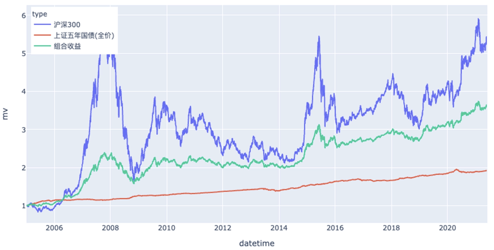
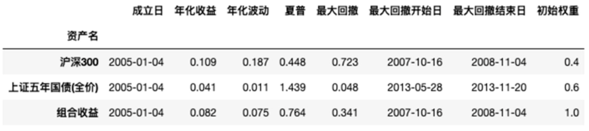

## 为什么要了解经典投资组合

上一篇介绍了资产配置的核心思想：**投资最重要的决策，不是买什么，而是如何分配资产。**

那么，一个新的问题自然出现了：**资产到底应该怎么配？有没有一种放之四海而皆准的比例？**答案是：没有。每个人的年龄、收入、风险承受能力和投资目标都不同，因此适合的资产配置也不同。

经典投资组合并不是一套可以照搬的”公式”，而是几种经过长期实践验证的**资产配置思想**：

- **股债组合**：股票负责增长，债券负责稳定；
- **永久组合**：不同资产共同应对不同经济环境；
- **风险平价**：追求的是风险均衡，而不是资金均分；
- **耶鲁模式**：尽可能增加收益来源，实现资产多元化。

因此，我们需要关注的不是**哪个组合最好**，而是了解 **每一种组合解决了什么问题，以及适合什么样的人。**

## 股债组合：现代资产配置的起点

股债组合（Stock-Bond Portfolio）是最经典、也是最容易实践的资产配置方案。

它的核心思想只有一句话：**股票负责长期增长，债券负责降低波动。**

股票具有更高的长期收益潜力，但价格波动较大；债券收益相对稳定，当股票市场表现不佳时，通常能够起到一定的缓冲作用。因此，把两者组合在一起，可以在收益和风险之间取得更好的平衡。

从长期来看，股票比例越高，组合的收益预期通常越高，但波动也会越大；债券比例越高，组合会更加稳定，但长期收益预期也会相应降低。





很多人会听到 **60/40**、**80/20**、**90/10** 等不同的股债比例，但这些数字都不是固定公式，而是针对不同风险偏好的配置方案。真正值得学习的，不是某一个比例，而是股债组合背后的思想：**股票负责创造财富，债券负责守住财富。**

之后，再根据自己的年龄、风险承受能力、现金流和投资目标，在两者之间找到适合自己的平衡点。

## **永久组合：应对不同的经济环境**

如果说股债组合回答的是：**如何在收益和风险之间取得平衡**。那么永久组合回答的是另一个问题：**如果未来不知道会发生什么，应该怎么办？**

1973 年，美国投资人 **Harry Browne** 提出了永久组合（Permanent Portfolio）。它的配置非常简单：25% 股票、25% 长期国债、25% 黄金、25% 现金（货币基金）乍一看，这个组合似乎有些奇怪。为什么不是全部投资股票？为什么还要配置黄金和现金？

原因在于，永久组合并不是围绕某一种资产设计的，而是围绕**不同的经济环境**设计的。

| **资产** | **主要作用**                         |
| -------- | ------------------------------------ |
| 股票     | 经济增长时创造收益                   |
| 长期国债 | 经济衰退时提供保护                   |
| 黄金     | 应对通货膨胀                         |
| 现金     | 保持流动性，应对高利率或市场剧烈波动 |

也就是说，它并没有试图预测未来，而是假设：**没有人能够准确预测未来。**因此，与其押注某一种资产，不如让不同资产分别应对不同的经济环境。这也是永久组合几十年来一直被讨论和研究的原因。

不过，它并不是追求最高收益，而是追求 **长期稳定地活下来。**因此，它通常会放弃一部分收益，换取更小的波动和更好的持有体验。另外，永久组合诞生于 1973 年，因此没有包含今天的数字资产等新兴投资标的。放到今天，很多投资者会比特币、Ethereum 等数字资产作为**卫星仓（Satellite）**配置，而股票、债券等仍然作为投资组合的核心资产。

因此，真正值得学习的不是：**25%、25%、25%、25%。**而是永久组合背后的思想：**不要预测未来，而是让不同资产共同应对未来。**

## 风险平价：资金平均，不等于风险平均

股债组合解决的是 **如何在收益和风险之间取得平衡**。风险平价（Risk Parity）则进一步提出了一个问题：**如果资产的风险不同，为什么还要投入相同的资金？**

举个简单的例子。

假设有两种资产：

```text
股票
波动：20%

债券
波动：5%
```

如果各投资 50%：

```text
股票 50%
债券 50%
```

看起来资金是平均的，但整个投资组合的大部分风险其实仍然来自股票。

因为股票的波动远高于债券，即使投入相同的资金，它对组合风险的影响也会更大。

因此，风险平价认为：

**应该让每种资产对整个投资组合贡献相近的风险，而不是投入相同的资金。**

这就是”风险平价”名字的由来。

与股债组合相比，它更关注的是：

**风险如何分配。**

而不是：

**资金如何分配。**

对于普通投资者来说，并不需要真的计算每种资产的波动率和风险贡献。

真正值得学习的是这种思维：

**资产配置不仅要看投入了多少钱，更要看承担了多少风险。**

这也是为什么很多机构投资者在构建投资组合时，会同时关注资产比例和风险贡献，而不仅仅是资金比例。

风险平价让我意识到：

**100 元股票 + 100 元债券，并不意味着承担了一样多的风险。**

资金是可以平均的，

但风险未必是平均的。

因此，优秀的资产配置不仅考虑资金的分配，还会考虑风险是否过于集中。

## 耶鲁模式：收益来源越多，组合越稳健

前面介绍的几种经典组合，大多围绕股票、债券、黄金等传统资产展开。

耶鲁模式（Yale Endowment Model）则提出了另一种思路：

**不要把收益来源局限于少数几类资产，而应该尽可能增加不同的收益来源。**

这一模式由耶鲁大学捐赠基金前首席投资官 **David Swensen** 提出。

在他的管理下，耶鲁大学捐赠基金长期取得了远超市场平均水平的投资表现，也因此成为机构投资者广泛研究的资产配置案例。

不过，很多人容易把重点放错。

耶鲁模式成功，并不是因为它投资了：

- 私募股权（PE）
- 风险投资（VC）
- 对冲基金
- 房地产

而是因为：

**它不断寻找具有长期价值、且与已有资产相关性较低的新收益来源。**

换句话说，它追求的是：

**收益来源的多元化（Diversification of Return Drivers）。**

------

对于普通投资者来说，复制耶鲁基金几乎是不可能的。

一方面，很多资产存在较高的投资门槛；另一方面，也需要专业团队进行持续研究和管理。

但它背后的思想仍然值得借鉴。

例如：

如果你的投资组合只有 A 股，那么未来可以逐步了解：

- 全球股票；
- REITs；
- 黄金；
- 不同期限的债券；
- 其他具有长期投资价值的资产。

这样做的目的，并不是为了追求”资产越多越好”，而是让投资组合拥有更多不同的收益来源，而不是依赖某一种资产。

因此，我认为普通投资者真正应该学习的，不是复制耶鲁组合，而是学习它的资产配置理念：

**不要把所有收益都押注在同一种资产上，而是让不同资产共同创造长期回报。**

------

## **四种经典组合的共同点**

回过头来看，这几种经典资产配置组合，其实都在回答同一个问题：

| **组合** | **核心思想**                                     |
| -------- | ------------------------------------------------ |
| 股债组合 | 用股票增长、债券稳定，在收益和风险之间取得平衡。 |
| 永久组合 | 不预测未来，让不同资产共同应对不同经济环境。     |
| 风险平价 | 关注风险贡献，而不是资金比例。                   |
| 耶鲁模式 | 增加收益来源，提高资产多样性。                   |

它们的配置比例各不相同，但背后的目标是一致的：

**通过分散化，而不是押注单一资产，获得更加稳健的长期回报。**

