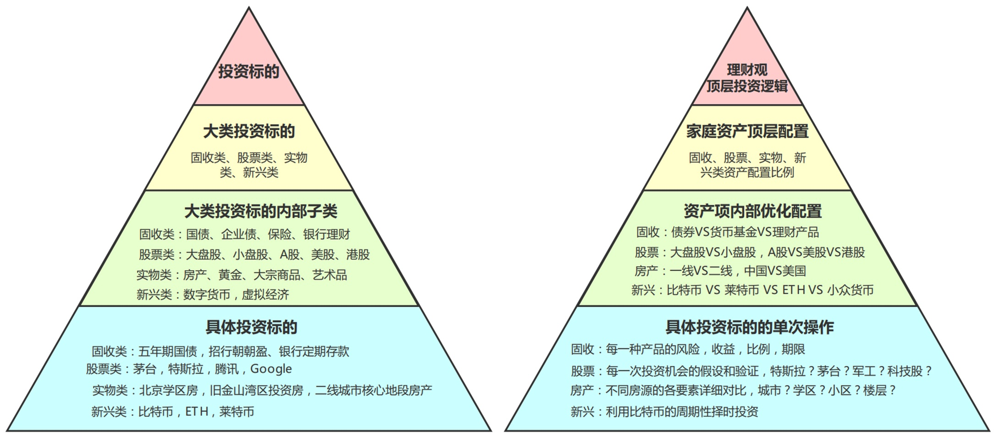
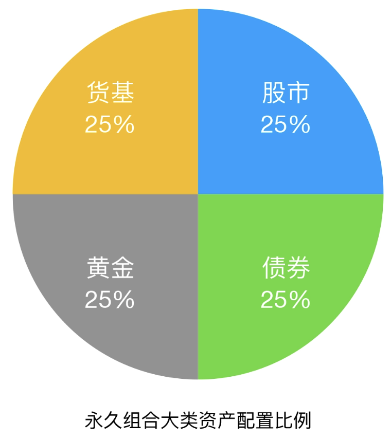

资产配置（Asset Allocation），就是决定自己的资金应该分配到哪些资产类别，以及各占多少比例。投资中最重要的决策，不是买哪只股票，而是先决定资产配置。

## 为什么要学习资产配置

很多人开始投资时都会问：**我应该买什么**？其实更重要的问题是： **我的钱应该如何分配？**

例如，同样都投资沪深 300 ETF，**方案 A：股票 80%、债券 20%** 和 **方案 B：股票 30%、债券 70%**，虽然买的是同一个产品，但整个投资组合的风险和预期收益已经完全不同。

因此，资产配置决定的是**整个投资组合的风险收益特征**；而选择具体产品，只是在既定资产配置下的实现方式。

## 世界上的资产有哪些

投资中经常会提到一个词：**投资标的（Asset）**。它指的是投资的对象，例如一只股票、一张国债、一套房产、一块黄金。

虽然投资产品看起来五花八门，但绝大多数都可以归纳到四大类资产。

### 固收类（Fixed Income）

**本质：把钱借给别人赚利息。**

典型代表：

- 银行存款
- 国债
- 企业债
- 同业存单
- 货币基金
- 债券基金
- 大部分银行理财

特点：收益主要来自利息；波动通常较小；更重要的作用是稳定组合，而不是追求高收益。

需要注意的是，“固定收益”并不意味着稳赚不赔。企业债可能违约，债券价格会波动，债券基金也可能出现亏损。“固定”更多指的是**收益主要来自利息，而不是资产价格上涨。**

### 股票类（Equity）

**本质：购买企业的一部分所有权。**

典型代表：

- A 股、港股、美股上市公司的股票；
- 股票指数基金；
- 股票 ETF，例如：
  - 沪深 300 ETF
  - 标普 500 ETF
  - 纳斯达克 100 ETF

特点：波动较大；长期收益潜力最高；收益主要来自企业价值的长期增长，并最终反映在股价上。

因此，在资产配置里，经常会说：**股票负责增长（Growth）。**对于普通投资者来说，与其频繁挑选个股，使用低费率、广泛分散的指数基金长期参与市场，已经成为越来越主流的投资方式。

### 实物类（Real Assets）

这一类资产具有真实的物理价值。例如：

- 房地产
- 黄金
- 白银
- 原油
- 大宗商品
- 艺术品
- 收藏品

黄金虽然经常被单独讨论，但本质上仍属于实物资产。

相比股票和债券，这类资产通常具有一定的抗通胀能力，与股票不同的风险收益特征，部分资产流动性相对较差。

### 新兴资产（Alternative Assets）

目前比较典型的是：

- 比特币
- Ethereum
- 其他数字资产

特点：波动极大；不确定性高；风险较高。

因此，大多数资产配置理论都不会把它们作为核心资产，而是作为小比例配置的补充。

上述四大类投资标的还可以往下细分子类，每一个子类中又有更加具体的投资标的。这样就可以组成一个从大类到小类排列的**投资标的金字塔**：

右半部分的**投资理财金字塔**，是与左半部分中各层级投资标的对应的投资方法。

在对个人资产进行配置时，最好遵循这种这种自顶向下的投资方法：

1. 在自己的理财观（顶层投资逻辑）的指导下，先做资产的顶层配置，确定上述四大类投资标的的配置比例。
2. 根据对每类资产的了解程度，做资产项内部的进一步优化。
3. 落实到每一次具体的投资操作上。

## 为什么要做资产配置

原因很简单：**没有任何一种资产能够一直表现最好**。不同资产，在不同经济环境下通常会有不同表现。

| **经济环境** | **通常表现较好的资产** |
| ------------ | ---------------------- |
| 经济增长     | 股票                   |
| 经济衰退     | 国债                   |
| 通货膨胀     | 黄金、部分实物资产     |
| 高利率       | 现金、货币基金、短债   |

因此，资产配置并不是为了预测未来，而是为了让不同资产在不同环境下各自发挥作用。这也是一句经典投资原则背后的真正含义：**不要把鸡蛋放在同一个篮子里。**

资产配置的目标不是让所有资产同时赚钱，而是降低整个投资组合的波动，让财富能够更加稳定地长期增长。

## 经典案例：永久组合（Permanent Portfolio）

资产配置领域最经典的组合之一，就是 Harry Browne 在 1973 年提出的**永久组合**。它只有四种资产：25% 股票、25% 长期国债、25% 黄金、25% 现金（货币基金）。

为什么不是四大类资产各占 25%？原因在于，永久组合关注的是**不同资产在投资组合中承担的职责**，而不是资产类别是否平均。

| **资产** | **主要作用**         |
| -------- | -------------------- |
| 股票     | 长期增长（Growth）   |
| 长期国债 | 应对经济衰退         |
| 黄金     | 应对通货膨胀         |
| 现金     | 保持流动性、降低波动 |

可以看到，固收类实际上被拆成了两部分：长期国债负责经济衰退时期；现金负责流动性和应急。虽然都属于固收资产，但承担的是不同角色。

永久组合之所以经典，并不是因为它创造了最高收益，而是因为它在不同市场环境下都表现出了较好的稳定性。

2002～2020 年期间，永久组合在中国和美国市场的历史年化收益约为 **6.8%**，同时最大回撤分别约为 **27.2%** 和 **15.9%**，明显低于股票市场。这说明，合理的资产配置能够在一定程度上平滑波动，在追求收益的同时兼顾风险。

不过，这些数字来自特定时期的历史回测，并不代表未来仍会取得相同的收益。永久组合真正值得学习的，不是”年化 6.8%“这个数字，而是它背后的资产配置思想：**通过配置不同风险收益特征的资产，而不是押注单一资产，实现长期、稳定的财富增长。**

另外，永久组合诞生较早，因此没有包含今天的数字资产等新兴投资标的。放到现在，很多投资者会将数字资产作为 **卫星仓（Satellite）** 配置，而不是投资组合的核心部分。

永久组合追求的是**长期稳定，而不是最高收益**。但年轻、收入稳定、投资期限较长的投资者，通常可以适当提高股票比例，以换取更高的长期收益预期。

资产配置没有固定公式，每个人都应该根据自己的风险承受能力、现金流状况和投资目标，建立适合自己的投资组合。

## 资产配置不是一次性的

资产配置并不是配置完成就结束了。随着市场涨跌，各类资产的占比会不断发生变化，原本设定好的资产配置也会逐渐偏离。

例如，最初的配置为股票 50%、债券 50%。一年后，由于股票上涨，组合变成股票 70%、债券 30%。虽然什么都没做，但整个投资组合承担的风险已经高于最初的设定。

这时，就需要卖出一部分股票、买入一部分债券，使组合重新回到原来的配置比例。这个过程称为**资产再平衡（Rebalancing）**。资产再平衡的目的不是预测市场，也不是追涨杀跌，而是让投资组合始终保持与自己的风险承受能力相匹配。

