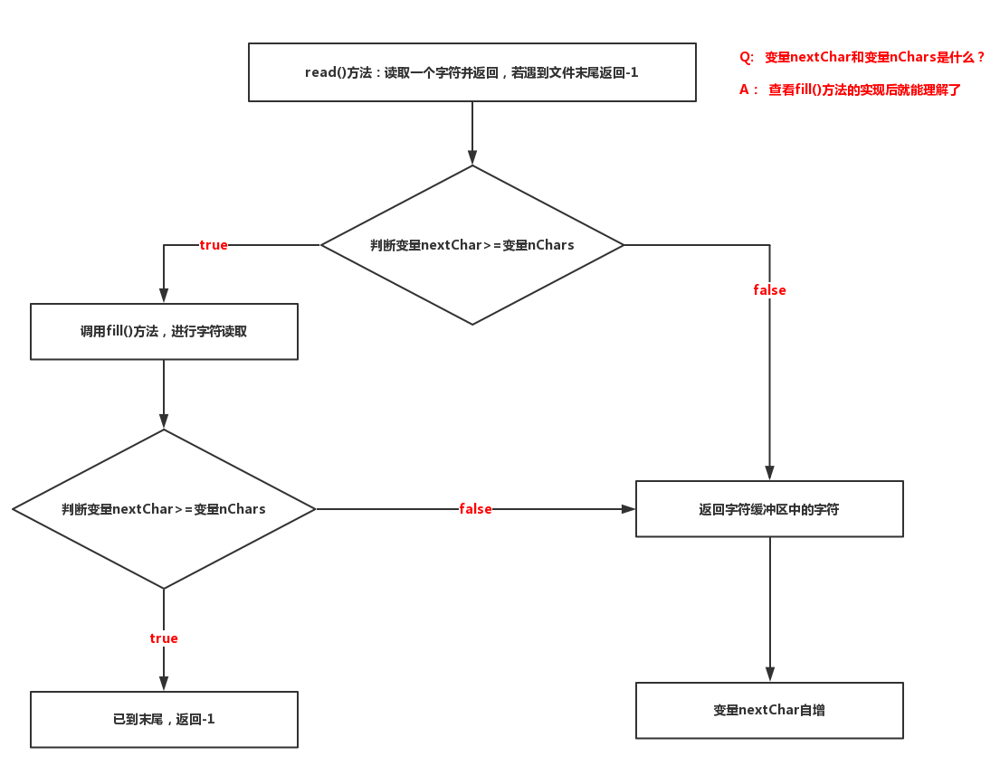
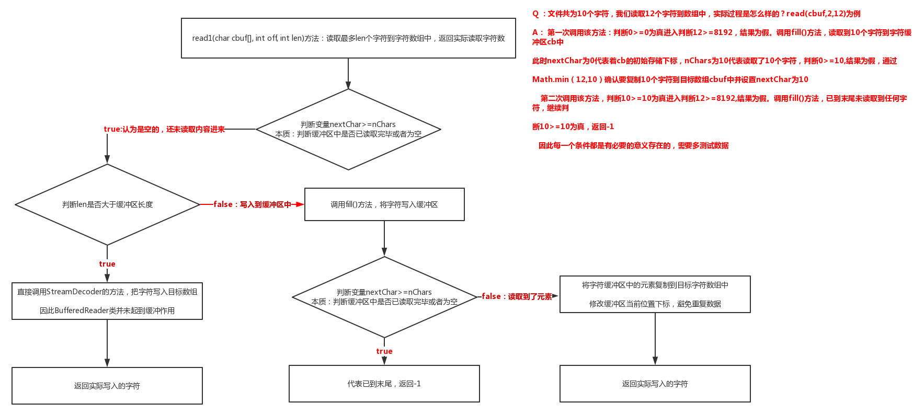

::: tip 

最近在写的项目里用到了 `BufferedReader.ReadLine()` 方法，却没有深入了解过，导致出现了一些信息阻塞的问题，特以此文，让自己重新系统化认识一下 Java 里的 BufferedReader 流

:::

# Java BufferedReader流

## 一、什么是 BufferedReader 类

 ::: tip API文档描述

BufferedReader 类从字符输入流中读取文本并缓冲字符，以便有效地读取字符，数组和行。

可以通过构造函数指定缓冲区大小也可以使用默认大小（在大多数情况下，默认值已经足够大了）

由 Reader 构成的每个读取请求都会导致相应的读取请求由基础字符或字节流构成，建议通过 BufferedReader 包装 Reader 的实例类以提高效率如：

```java
BufferedReader in  = new BufferedReader（new FileReader（“foo.in”））;
```

使用 DataInputStreams 进行文本输入的程序可以通过用适当的 BufferedReader 替换每个 DataInputStream 来进行本地化。

:::

### 1、从字符输入流中读取文本并缓冲字符，以便有效地读取字符，数组和行怎么理解？

 说明该类存在缓冲字符数组并且是该类可以高效读取字符的关键。

### 2、构造函数指定缓冲区大小也可以使用默认大小怎么理解？

意味着该类存在的构造方法既可以传递数值指定缓冲区大小也可以由类中的默认大小指定。

### 3、由Reader构成的每个读取请求都会导致相应的读取请求由基础字符或字节流构成，建议通过BufferedReader包装Reader的实例类以提高效率?

Reader构成的对象是字符对象，每次的读取请求都会涉及到字节读取解码字符的过程，而BufferedReader类中有设计减少这样的解码次数的方法，进而提高了转换效率 。

### 4、BufferedReader替代DataInputStreams进行本地化？

未知。

## 二、BufferedReader 类实例域

```java
//字符输入流
private Reader in;
 
//字符缓冲区
private char cb[];
 
//读取字符存储的最末下标+1
private int nChars;
 
//读取字符存储的起始下标
private int nextChar;

private static final int INVALIDATED = -2;
private static final int UNMARKED = -1;
private int markedChar = UNMARKED;

//仅在markedChar为0时有效
private int readAheadLimit = 0;

//如果下个字符是换行符，则跳过--专用于readLine()方法里面控制
private boolean skipLF = false;
 
//设置标志时的markedSkipLF--用于mark()方法的变量
private boolean markedSkipLF = false;
 
//默认的字符缓冲大小
private static int defaultCharBufferSize =8192;
    
//用于readLine()方法时初始化StringBuffer的初始容量
private static int defaultExpectedLineLength = 80;
```

## 三、BufferedReader 类构造函数

### 1、使用默认的缓冲区大小来创建缓冲字符输入流，默认大小为8192个字符

```java
private static int defaultCharBufferSize = 8192;

public BufferedReader(Reader in) {
    this(in, defaultCharBufferSize);
}

public BufferedReader(Reader in, int sz) {
    super(in);
    if (sz <= 0)
        throw new IllegalArgumentException("Buffer size <= 0");
    this.in = in;
    cb = new char[sz];
    nextChar = nChars = 0;
}
```

### 2）创建指定缓冲区大小的缓冲字符输入流，一般使用默认即可

```java
public BufferedReader(Reader in, int sz) {
    super(in);
    if (sz <= 0)
        throw new IllegalArgumentException("Buffer size <= 0");
    this.in = in;
    cb = new char[sz];
    nextChar = nChars = 0;
}
```

## 四、BufferedReader 类 API

### 1、read() 方法：读取1个或多个字节，返回一个字符，当读取到文件末尾时，返回 -1

```java
/**
 * 读取一个字符，若读取到末尾则返回-1
 */
public int read() throws IOException{
    synchronized (lock){
        ensureOpen();
        
        for (;;){
            //一般条件为真，除非是使用了skip方法跳跃字节
            if (nextChar >= nChars){
                fill();  //调用该方法读取字符
                if (nextChar >= nChars)
                    return -1;
            }
            
            //此方法暂时不用管，涉及跳过字节数和换行符问题
            if (skipLF) {
                skipLF = false;
                if (cb[nextChar] == '\n'){
                    nextChar++;
                    continue;
                }
            }
            return cb[nextChar++];
        }
    }
}
```

实际流程图解：



### 2、fill() 方法：从底层输入流中填充字符到缓冲区中，此方法会调用StreamDecoder的方法实现字节到字符的转换

```java
/**
 * 填充字符缓冲区，若有效则将标记考虑在内
 */
private void fill() throws IOException{
    int dst;
    
    //查看是否调用过make方法进行标记--若未使用make方法，则条件为真
    if (markedChar <= UNMARKED){
        dst = 0;
    }
    else{
        int delta = nextChar - markedChar;
        if (delta >= readAheadLimit){
            markedChar = INVALIDATED;
            readAheadLimit = 0;
            dst = 0;
        }
        else{
            if (readAheadLimit <= cb.length){
                System.arraycopy(cb, markedChar, cb, 0, delta);
                markedChar = 0;
                dst = delta;
            }
            else{
                char ncb[] = new char[readAheadLimit];
                System.arraycopy(cb, markedChar, ncb, 0, delta);
                cb = ncb;
                markedChar = 0;
                dst = delta;
            }
            nextChar = nChars = delta;
        }
    }

    int n;
    do{
      //调用InputStreamReader的方法，实际是调用StreamDecoder的read(char cbuf[], int offset, int length)方法   
        n = in.read(cb, dst, cb.length - dst);  
    }
    while (n == 0);
    //当读取到字符时
    if (n > 0){   
        nChars = dst + n;   //字符缓冲区存储读到的字符的最末下标
        nextChar = dst;     //字符缓冲区存储读到的字符的起始下标
    }
}
```

实际流程图解：注意根据read()方法先理解变量nChars和nextChar的意义


### 3、read(char cbuf[], int off, int len)：将最多length个字符读入数组中，返回实际读入的字符个数，当读取到文件末尾时，返回 -1

```java
/**
 * 字符读入数组的一部分，
 */
public int read(char cbuf[], int off, int len) throws IOException{
    synchronized (lock){
        ensureOpen();
        if ((off < 0) || (off > cbuf.length) || (len < 0)
                || ((off + len) > cbuf.length) || ((off + len) < 0)){
            throw new IndexOutOfBoundsException();
        }
        else if (len == 0){
            return 0;
        }

        int n = read1(cbuf, off, len); // 调用read1(cbuf, off, len)
        if (n <= 0)
            return n;
        while ((n < len) && in.ready()){ // 注意该while循环，多次测试发现并未进入该方法，即使进入，本质还是调用read1(cbuf, off, len)
            int n1 = read1(cbuf, off + n, len - n); 
            if (n1 <= 0)
                break;
            n += n1;
        }
        return n;
    }
}

private int read1(char[] cbuf, int off, int len) throws IOException{
    if (nextChar >= nChars){
        // 若请求的长度与缓冲区长度一样大时，直接会把字符读取到数组中，并未使用该类的字符缓冲区
        if (len >= cb.length && markedChar <= UNMARKED && !skipLF){
            return in.read(cbuf, off, len);
        }
        fill();
    }
    if (nextChar >= nChars)
        return -1;
    if (skipLF){ //若使用了换行、跳过字节数等才会考虑判断，暂时不用管
        skipLF = false;
        if (cb[nextChar] == '\n'){
            nextChar++;
            if (nextChar >= nChars)
                fill();
            if (nextChar >= nChars)
                return -1;
        }
    }

    int n = Math.min(len, nChars - nextChar); //取实际读取字符数与目标字符数len的最小数

    System.arraycopy(cb, nextChar, cbuf, off, n);  //从字符缓冲区中复制字符到目标数组中

    nextChar += n; //字符缓冲区存储下标位置前诺，避免重复取一样数据

    return n;
}
```

**实际流程图解：图解read1(cbuf, off, len)方法即可，本质是该方法在起作用**



### 4、读一行文字并返回该行字符，若读到文件末尾，则返回null：即当遇到换行符（'\ n'），回车符（'\ r'）时会终止读取表示该行文字读取完毕且返回该行文字（不包含换行符和回车符）

```java
/**
 * 阅读一行文字，任何一条线都被视为终止，返回包含该行内容的字符串，但是不含换行符等
 */
public String readLine() throws IOException{
    return readLine(false);
}

String readLine(boolean ignoreLF) throws IOException{
    StringBuffer s = null;
    int startChar;

    synchronized (lock){
        ensureOpen();
        boolean omitLF = ignoreLF || skipLF;  

        bufferLoop: for (;;){
            if (nextChar >= nChars) //判断是否有元素，没有则调用fill()方法取元素
                fill();
            if (nextChar >= nChars){ //判断是否已到文件末尾，若到文件末尾，则返回S   
                if (s != null && s.length() > 0)
                    return s.toString();
                else
                    return null;
            }
            boolean eol = false;
            char c = 0;
            int i;

           //如果遇到过换行符，则跳过该换行符继续读取
            if (omitLF && (cb[nextChar] == '\n'))
                nextChar++;
            skipLF = false;
            omitLF = false;

            charLoop: for (i = nextChar; i < nChars; i++){
                c = cb[i];
                if ((c == '\n') || (c == '\r')){
                    eol = true;
                    break charLoop;
                }
            }

            startChar = nextChar;
            nextChar = i;

            if (eol){
                String str;
                if (s == null){
                    str = new String(cb, startChar, i - startChar);
                }
                else{
                    s.append(cb, startChar, i - startChar);
                    str = s.toString();
                }
                nextChar++;
                if (c == '\r'){
                    skipLF = true;
                }
                return str;
            }

            if (s == null)
                s = new StringBuffer(defaultExpectedLineLength);
            s.append(cb, startChar, i - startChar);
        }
    }
}
```

实际流程图解：

  

### 5、close() 方法：关闭资源释放链接

```java
public void close() throws IOException{
    synchronized (lock){
        if (in == null)
            return;
        in.close();
        in = null;
        cb = null;
    }
}
```

### 6、其它的skip()、make()方法等

暂时不了解。

## 五、BufferedReader 类与 InputStreamReader 类比较

InputStreamReader 中的文档说明提到过：**为了获得最高效率，请考虑在BufferedReader中包装InputStreamReader？**

从 `read()` 方法理解，若使用 InputStreamReader 的 `read()` 方法，可以发现存在每2次就会调用一次解码器解码，但若是使用 BufferedReader 包装 InputStreamReader 后调用 `read()` 方法，可以发现只会调用一次解码器解码，其余时候都是直接从 BufferedReader 的缓冲区中取字符即可

从 `read(char cbuf[], int offset, int length)` 方法理解，若使用 InputStreamReader 的方法则只会读取 leng 个字符，但是使用 BufferedReader 类则会读取读取8192个字符，会尽量提取比当前操作所需的更多字节

例如文件中有20个字符，我们先通过 `read(cbuf,0,5)` 要读取5个字符到数组 cbuf 中，然后再通过 `read()` 方法读取1个字符。那么使用 InputStreamReader 类的话，则会调用一次解码器解码然后存储5个字符到数组中，然后又调用 `read()` 方法调用一次解码器读取2个字符，然后返回1个字符；等于是调用了2次解码器，若使用 BufferedReader 类的话则是先调用一次解码器读取20个字符到字符缓冲区中，然后复制5个到数组中，在调用 `read()` 方法时，则直接从缓冲区中读取字符，等于是调用了一次解码器

因此可以看出 BufferedReader 类会尽量提取比当前操作所需的更多字节，以应该更多情况下的效率提升，因此在设计到文件字符输入流的时候，我们使用 BufferedReader 中包装 InputStreamReader 类即可
