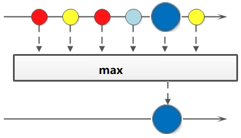
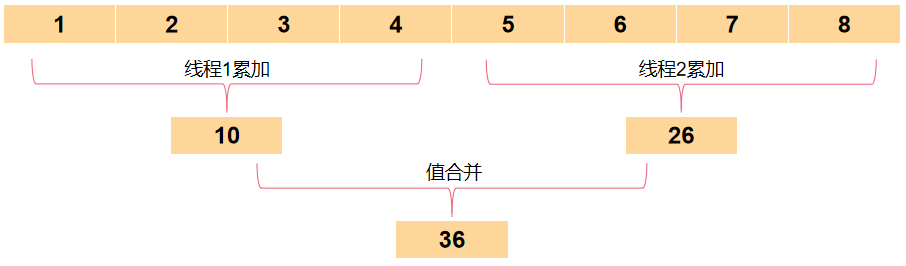

# Java Stream


## 一、Stream 概述

Stream 被定义于 java.util.stream （这个包里有若干流类型： `Stream < T >` 代表对象引用流，此外还有一系列特化流，如 IntStream，LongStream，DoubleStream等 ），Java 8 引入的的Stream，配合同版本出现的 Lambda，给我们操作集合（Collection）提供了极大的便利。

每个流代表一个值序列，流提供了一系列常用的聚集操作，可以便捷的在它上面进行各种运算，比如：筛选、排序、聚合等。

集合类库也提供了便捷的方式使我们可以以操作流的方式使用集合、数组以及其它数据结构；

## 二、Stream 的操作种类

Stream 可以由数组或集合创建，对流的操作分为两种：

- 中间操作
  - 当数据源中的数据上了流水线后，这个过程对数据进行的所有操作都称为“中间操作”；
  - 中间操作仍然会返回一个流对象，因此多个中间操作可以串连起来形成一个流水线；
  - Stream 提供了多种类型的中间操作，如 filter()、distinct()、map()、sorted() 等等；
- 终端操作
  - 当所有的中间操作完成后，若要将数据从流水线上拿下来，则需要执行终端操作；
  - Stream 对于终端操作，可以直接提供一个中间操作的结果，或者将结果转换为特定的 collection、array、String 等；

另外，Stream有几个特性：

- Stream 不存储数据，而是按照特定的规则对数据进行计算，一般会输出结果。
- Stream 不会改变数据源，通常情况下会产生一个新的集合或一个值。
- Stream 具有延迟执行特性，只有调用终端操作时，中间操作才会执行。

Stream API 和 SQL 设计类似，使用的是更加接近意图的声明式函数，看到函数名就大概明白含义了，使用方式也像 SQL 一样，**大大简化了这类处理的实现代码量与可读性**。

## 三、Stream 相对于 Collection 的优点

**无存储**：流并不存储值；流的元素源自数据源（可能是某个数据结构、生成函数或I/O通道等等），通过一系列计算步骤得到；

**函数式风格**：对流的操作会产生一个结果，但流的数据源不会被修改；

**惰性求值**：多数流操作（包括过滤、映射、排序以及去重）都可以以惰性方式实现。这使得我们可以用一遍遍历完成整个流水线操作，并可以用短路操作提供更高效的实现；

**无需上界**：不少问题都可以被表达为无限流（infinite stream）：用户不停地读取流直到满意的结果出现为止（比如说，**枚举完美数**这个操作可以被表达为在所有整数上进行过滤）；集合是有限的，但流可以表达为无限流；

**代码简练**：对于一些 collection 的迭代处理操作，使用 stream 编写可以十分简洁，如果使用传统的 collection 迭代操作，代码可能十分啰嗦，可读性也会比较糟糕；

## 四、Stream 的创建

Stream可以通过集合、数组创建。

1. 通过 `java.util.Collection.stream()` 方法用集合创建流对象

   ```java
   List<String> list = Arrays.asList("a", "b", "c");
   // 创建一个顺序流
   Stream<String> stream = list.stream();
   // 创建一个并行流
   Stream<String> parallelStream = list.parallelStream();
   ```

2. 使用 `java.util.Arrays.stream(T[] array)` 方法用数组创建流对象

   ```java
   int[] array={1,3,5,6,8};
   IntStream stream = Arrays.stream(array);
   ```

3. 使用 Stream 的静态方法：`of()`、`iterate()`、`generate()`

   ```java
   Stream<Integer> stream = Stream.of(1, 2, 3, 4, 5, 6);
   
   Stream<Integer> stream2 = Stream.iterate(0, (x) -> x + 3).limit(4);
   stream2.forEach(System.out::println);
   
   Stream<Double> stream3 = Stream.generate(Math::random).limit(3);
   stream3.forEach(System.out::println);
   ```

   输出结果：

   ```shell
   0 3 6 9
   0.6796156909271994
   0.1914314208854283
   0.8116932592396652
   ```

stream 和 parallelStream 的简单区分： stream 是顺序流，由主线程按顺序对流执行操作，而 parallelStream 是并行流，内部以多线程并行执行的方式对流进行操作，但前提是流中的数据处理没有顺序要求。

例如筛选集合中的奇数，两者的处理不同之处如下图：


如果流中的数据量足够大，并行流可以加快处速度。

除了直接创建并行流，还可以通过 `parallel()` 把顺序流转换成并行流：

```java
Optional<Integer> findFirst = list.stream().parallel().filter(x->x>6).findFirst(); 
```

## 五、Stream 的使用

在使用 stream 之前，先理解一个概念：Optional 。

Optional 类是一个可以为 null 的容器对象。如果值存在则 `isPresent()` 方法会返回true，调用 `get()` 方法会返回该对象。

Optional 是个容器：它可以保存类型T的值，或者仅仅保存null。Optional提供很多有用的方法，这样我们就不用显式进行空值检测。

Optional 类的引入很好的解决空指针异常。

更详细说明请见：[菜鸟教程 Java 8 Optional类](https://www.runoob.com/java/java8-optional-class.html)

**Stream里的简单函数：**

| 函数        | 用途                                                         |
| :---------- | :----------------------------------------------------------- |
| map()       | 转换Stream中的元素为另一类型元素                             |
| filter()    | 过滤Stream中元素                                             |
| sorted()    | 排序Stream中元素                                             |
| limit()     | 取前x个元素                                                  |
| distinct()  | 去重Stream中元素                                             |
| count()     | 计数                                                         |
| min()       | 计算最小值                                                   |
| max()       | 计算最大值                                                   |
| forEach()   | 消费Stream中的每个元素                                       |
| toArray()   | 转换为数组                                                   |
| findFirst() | 获取第1个元素                                                |
| findAny()   | 获取任一个元素，与findFirst区别是findAny可能是数据拆分后多线程处理的，返回值可能不稳定 |
| allMatch()  | Stream中元素全部匹配判定表达式                               |
| anyMatch()  | Stream中元素任一匹配判定表达式                               |
| noneMatch() | Stream中元素全部不匹配判定表达式                             |
| peek()      | 检查经过Stream的每个元素，但并不消费元素，一般用于调试目的   |

**接下来，我们将用20个案例将 Stream 的使用进行完全的掌握**。

```java
//这是后面案例中使用的员工类
List<Person> personList = new ArrayList<>();
personList.add(new Person("Tom", 8900, "male", "New York"));
personList.add(new Person("Jack", 7000, "male", "Washington"));
personList.add(new Person("Lily", 7800, "female", "Washington"));
personList.add(new Person("Anni", 8200, "female", "New York"));
personList.add(new Person("Owen", 9500, "male", "New York"));
personList.add(new Person("Alisa", 7900, "female", "New York"));

class Person {
	private String name;  // 姓名
	private int salary;   // 薪资
	private int age;      // 年龄
	private String sex;   // 性别
	private String area;  // 地区

	// 构造方法
	public Person(String name, int salary, int age,String sex,String area) {
		this.name = name;
		this.salary = salary;
		this.age = age;
		this.sex = sex;
		this.area = area;
	}
	// 省略了get、set和toString，请自行添加

}
```

### 1、遍历/匹配（foreach/find/match）

Stream 也是支持类似集合的遍历和匹配元素的，只是 Stream 中的元素是以 Optional 类型存在的。Stream 的遍历、匹配非常简单。


```java
// import已省略，请自行添加，后面代码亦是
public class StreamTest {
	public static void main(String[] args) {
        List<Integer> list = Arrays.asList(7, 6, 9, 3, 8, 2, 1);

        // 遍历输出符合条件的元素
        list.stream().filter(x -> x > 6).forEach(System.out::println);
        // 匹配第一个
        Optional<Integer> findFirst = list.stream().filter(x -> x > 6).findFirst();
        // 匹配任意（适用于并行流）
        Optional<Integer> findAny = list.parallelStream().filter(x -> x > 6).findAny();
        // 是否包含符合特定条件的元素
        boolean anyMatch = list.stream().anyMatch(x -> x > 6);
        System.out.println("匹配第一个值：" + findFirst.get());
        System.out.println("匹配任意一个值：" + findAny.get());
        System.out.println("是否存在大于6的值：" + anyMatch);
    }
}
```

### 2、筛选（filter）

筛选，是按照一定的规则校验流中的元素，将符合条件的元素提取到新的流中的操作。

`filter()` 函数过滤Stream流中的元素，传入的逻辑表达式则为过滤规则。


##### 案例一：筛选出 Integer 集合中大于7的元素，并打印出来。

```java
public class StreamTest {
	public static void main(String[] args) {
		List<Integer> list = Arrays.asList(6, 7, 3, 8, 1, 2, 9);
		Stream<Integer> stream = list.stream();
		stream.filter(x -> x > 7).forEach(System.out::println);
	}
}
```

输出：

```shell
8
9
```

##### 案例二：筛选员工中工资高于8000的人，并形成新的集合。

```java
public class StreamTest {
	public static void main(String[] args) {
		List<Person> personList = new ArrayList<>();
		personList.add(new Person("Tom", 8900, 23, "male", "New York"));
		personList.add(new Person("Jack", 7000, 25, "male", "Washington"));
		personList.add(new Person("Lily", 7800, 21, "female", "Washington"));
		personList.add(new Person("Anni", 8200, 24, "female", "New York"));
		personList.add(new Person("Owen", 9500, 25, "male", "New York"));
		personList.add(new Person("Alisa", 7900, 26, "female", "New York"));

		List<String> fiterList = personList.stream().filter(x -> x.getSalary() > 8000).map(Person::getName)
				.collect(Collectors.toList());
		System.out.println("薪资高于8000美元的员工：" + fiterList);
	}
}
```

输出：

```shell
薪资高于8000美元的员工：[Tom, Anni, Owen]
```

### 3、聚合（max/min/count）

max、min、count 这些字眼你一定不陌生，没错，在 mysql 中我们常用它们进行数据统计。

Java stream 中也引入了这些概念和用法，极大地方便了我们对集合、数组的数据统计工作。




##### 案例三：获取 String 集合中最长的元素。

```java
public class StreamTest {
	public static void main(String[] args) {
		List<String> list = Arrays.asList("adnm", "admmt", "pot", "xbangd", "weoujgsd");

		Optional<String> max = list.stream().max(Comparator.comparing(String::length));
		System.out.println("最长的字符串：" + max.get());
	}
}
```

输出：

```shell
最长的字符串：weoujgsd
```

##### 案例四：获取 Integer 集合中的最大值。

```java
public class StreamTest {
	public static void main(String[] args) {
		List<Integer> list = Arrays.asList(7, 6, 9, 4, 11, 6);

		// 自然排序
		Optional<Integer> max = list.stream().max(Integer::compareTo);
		// 自定义排序（从大到小排序）
		Optional<Integer> max2 = list.stream().max((o1, o2) -> o2 - o1);
		System.out.println("自然排序的最大值：" + max.get());
		System.out.println("自定义排序的最大值：" + max2.get());
	}
}
```
输出：

```shell
自然排序的最大值：11
自定义排序的最大值：4
```

##### 案例五：获取员工薪资最高的人。

```java
public class StreamTest {
	public static void main(String[] args) {
		List<Person> personList = new ArrayList<>();
		personList.add(new Person("Tom", 8900, 23, "male", "New York"));
		personList.add(new Person("Jack", 7000, 25, "male", "Washington"));
		personList.add(new Person("Lily", 7800, 21, "female", "Washington"));
		personList.add(new Person("Anni", 8200, 24, "female", "New York"));
		personList.add(new Person("Owen", 9500, 25, "male", "New York"));
		personList.add(new Person("Alisa", 7900, 26, "female", "New York"));

		Optional<Person> max = personList.stream().max(Comparator.comparingInt(Person::getSalary));
		System.out.println("员工薪资最大值：" + max.get().getSalary());
	}
}
```

输出：

```shell
员工薪资最大值：9500
```

##### 案例六：计算 Integer 集合中大于6的元素的个数。

```java
import java.util.Arrays;
import java.util.List;

public class StreamTest {
	public static void main(String[] args) {
		List<Integer> list = Arrays.asList(7, 6, 4, 8, 2, 11, 9);

		long count = list.stream().filter(x -> x > 6).count();
		System.out.println("list中大于6的元素个数：" + count);
	}
}
```

输出：

```shell
list中大于6的元素个数：4
```

### 4、映射（map/flatMap）

映射，可以将一个流的元素按照一定的映射规则映射到另一个流中。分为 map 和 flatMap：

- map()：接收一个函数作为参数，该函数会被应用到每个元素上，并将其映射成一个新的元素。
- flatMap()：接收一个函数作为参数，将流中的每个值都换成另一个流，然后把所有流连接成一个流。


##### 案例七：英文字符串数组的元素全部改为大写，整数数组的每个元素全部+3。

```java
public class StreamTest {
	public static void main(String[] args) {
		String[] strArr = { "abcd", "bcdd", "defde", "fTr" };
		List<String> strList = Arrays.stream(strArr).map(String::toUpperCase).collect(Collectors.toList());

		List<Integer> intList = Arrays.asList(1, 3, 5, 7, 9, 11);
		List<Integer> intListNew = intList.stream().map(x -> x + 3).collect(Collectors.toList());

		System.out.println("每个元素大写：" + strList);
		System.out.println("每个元素+3：" + intListNew);
	}
}
```

输出：

```shell
每个元素大写：[ABCD, BCDD, DEFDE, FTR]
每个元素+3：[4, 6, 8, 10, 12, 14]
```

##### 案例八：将员工的薪资全部增加1000。

```java
public class StreamTest {
	public static void main(String[] args) {
		List<Person> personList = new ArrayList<>();
		personList.add(new Person("Tom", 8900, 23, "male", "New York"));
		personList.add(new Person("Jack", 7000, 25, "male", "Washington"));
		personList.add(new Person("Lily", 7800, 21, "female", "Washington"));
		personList.add(new Person("Anni", 8200, 24, "female", "New York"));
		personList.add(new Person("Owen", 9500, 25, "male", "New York"));
		personList.add(new Person("Alisa", 7900, 26, "female", "New York"));

		// 不改变原来员工集合的方式
		List<Person> personListNew = personList.stream().map(person -> {
			Person personNew = new Person(person.getName(), 0, 0, null, null);
			personNew.setSalary(person.getSalary() + 10000);
			return personNew;
		}).collect(Collectors.toList());
		System.out.println("一次改动前：" + personList.get(0).getName() + "-->" + personList.get(0).getSalary());
		System.out.println("一次改动后：" + personListNew.get(0).getName() + "-->" + personListNew.get(0).getSalary());

		// 改变原来员工集合的方式
		List<Person> personListNew2 = personList.stream().map(person -> {
			person.setSalary(person.getSalary() + 10000);
			return person;
		}).collect(Collectors.toList());
		System.out.println("二次改动前：" + personList.get(0).getName() + "-->" + personListNew.get(0).getSalary());
		System.out.println("二次改动后：" + personListNew2.get(0).getName() + "-->" + personListNew.get(0).getSalary());
	}
}
```

输出：

```shell
一次改动前：Tom–>8900
一次改动后：Tom–>18900
二次改动前：Tom–>18900
二次改动后：Tom–>18900
```

##### 案例九：将字符串集合中的元素合并成一个新的字符数组。

```java
public class StreamTest {
	public static void main(String[] args) {
		List<String> list = Arrays.asList("m,k,l,a", "1,3,5,7");
		List<String> listNew = list.stream().flatMap(s -> {
			// 将每个元素转换成一个stream
			String[] split = s.split(",");
			Stream<String> s2 = Arrays.stream(split);
			return s2;
		}).collect(Collectors.toList());

		System.out.println("处理前的集合：" + list);
		System.out.println("处理后的集合：" + listNew);
	}
}
```

输出：

```shell
处理前的集合：[m-k-l-a, 1-3-5]
处理后的集合：[m, k, l, a, 1, 3, 5]
```

此外，map 系列还有 `mapToInt()`、`mapToLong()`、`mapToDouble()` 三个函数，它们以一个映射函数为入参，将流中每一个元素处理后生成一个新流。

以 `mapToInt()` 为例，看两个示例：

```java
public static void main(String[] args)  {
	// 输出字符串集合中每个字符串的长度
    List<String> stringList = Arrays.asList("mu", "CSDN", "hello", "world", "quickly");
    stringList.stream().mapToInt(String::length).forEach(System.out::println);
    // 将int集合的每个元素增加1000
    List<Integer> integerList = Arrays.asList(4, 5, 2, 1, 6, 3);
    integerList.stream().mapToInt(x -> x + 1000).forEach(System.out::println);
}
```

` mapToInt()`、`mapToLong()`、`mapToDouble()` 三个函数生成的新流，可以进行很多后续操作，比如求最大最小值、求和、求平均值：

```java
public static void main(String[] args) {
    List<Double> doubleList = Arrays.asList(1.0, 2.0, 3.0, 4.0, 2.0);
    double average = doubleList.stream().mapToDouble(Number::doubleValue).average().getAsDouble();
    double sum = doubleList.stream().mapToDouble(Number::doubleValue).sum();
    double max = doubleList.stream().mapToDouble(Number::doubleValue).max().getAsDouble();
    System.out.println("平均值：" + average + "，总和：" + sum + "，最大值：" + max);
}
```

### 5、归约（reduce）

归约，也称缩减，顾名思义，是把一个流缩减成一个值，能实现对集合求和、求乘积和求最值操作。


可以看到 Stream 提供了 min、max 操作，但并没有提供 sum、avg 这样的操作，如果要实现 sum、avg 操作，就可以使用 `reduce()` 函数来实现，reduce函数有3个，如下：

下面以订单金额的sum汇总操作为示例，如下：

#### 1）带初始值与累加器的 reduce 函数

```java
T reduce(T identity, BinaryOperator<T> accumulator);
```

汇总示例代码：

```java
List<Order> orders = getOrders();
BigDecimal sum = orders.stream()
                       .map(Order::getGoodsAmount)
                       .reduce(BigDecimal.ZERO, BigDecimal::add);
```

其中，`reduce()` 函数的 identity 参数 **BigDecimal.ZERO** 相当于是初始值，而 accumulator 参数 **BigDecimal::add** 是一个累加器，将 Stream 中的金额一个个累加起来。

`reduce()` 函数的执行逻辑大致如下：

```java
T result = identity;
for (T element : this stream){
	result = accumulator.apply(result, element)
}
return result;
```

#### 2）无初始值的 reduce 函数

```java
Optional<T> reduce(BinaryOperator<T> accumulator);
```

汇总示例代码：

```java
List<Order> orders = getOrders();
BigDecimal sum = orders.stream()
        			   .map(Order::getGoodsAmount)
                       .reduce(BigDecimal::add)
                       .orElse(BigDecimal.ZERO);
```

这个 `reduce()` 函数不传入初始值，只有累加器函数，返回 Optional，因此当 Stream 中没有元素时，它返回的 Optional 没有值，这种情况我使用 **Optional.orElse()** 函数给了一个默认值 **BigDecimal.ZERO**。

#### 3）带初始值、累加器、合并器的reduce函数

```java
<U> U reduce(U identity,
             BiFunction<U, ? super T, U> accumulator,
             BinaryOperator<U> combiner);
```

汇总示例代码：

```java
List<Order> orders = getOrders();
BigDecimal sum = orders.stream()
    				   .reduce(BigDecimal.ZERO, (s, o) -> s.add(o.getGoodsAmount()),BigDecimal::add);
```

这个 `reduce()` 函数的累加器和前面的不一样，前面的累加器的迭代元素与汇总结果都是 BigDecimal，而这个累加器的迭代元素是Order 类型，汇总结果是 BigDecimal 类型，它们可以不一样。

另外，这个 `reduce()` 函数还提供了一个合并器，它是做什么用的？

其实合并器用于并行流场景，当使用多个线程处理数据时，数据拆分给多个线程后，每个线程使用累加器计算出自己的汇总值，然后使用合并器将各个线程的汇总值再次汇总，从而计算出最后结果，执行过程如下图：



##### 案例十：求 Integer 集合的元素之和、乘积和最大值。

```java
public class StreamTest {
	public static void main(String[] args) {
		List<Integer> list = Arrays.asList(1, 3, 2, 8, 11, 4);
		// 求和方式1
		Optional<Integer> sum = list.stream().reduce((x, y) -> x + y);
		// 求和方式2
		Optional<Integer> sum2 = list.stream().reduce(Integer::sum);
		// 求和方式3
		Integer sum3 = list.stream().reduce(0, Integer::sum);
		
		// 求乘积
		Optional<Integer> product = list.stream().reduce((x, y) -> x * y);

		// 求最大值方式1
		Optional<Integer> max = list.stream().reduce((x, y) -> x > y ? x : y);
        // 求最大值写法2
		Optional<Integer> max2 = list.stream().reduce(Integer::max);
		// 求最大值写法3
		Integer max3 = list.stream().reduce(Integer.MIN_VALUE, Integer::max);

		System.out.println("list求和：" + sum.get() + "," + sum2.get() + "," + sum3);
		System.out.println("list求积：" + product.get());
		System.out.println("list求最大值：" + max.get() + "," + max2.get() + "," + max3);
	}
}
```

输出：

```shell
list求和：29,29,29
list求积：2112
list求最大值：11,11,11
```

##### 案例十一：求所有员工的工资之和和最高工资。

```java
public class StreamTest {
	public static void main(String[] args) {
		List<Person> personList = new ArrayList<>();
		personList.add(new Person("Tom", 8900, 23, "male", "New York"));
		personList.add(new Person("Jack", 7000, 25, "male", "Washington"));
		personList.add(new Person("Lily", 7800, 21, "female", "Washington"));
		personList.add(new Person("Anni", 8200, 24, "female", "New York"));
		personList.add(new Person("Owen", 9500, 25, "male", "New York"));
		personList.add(new Person("Alisa", 7900, 26, "female", "New York"));

		// 求工资之和方式1：
		Optional<Integer> sumSalary = personList.stream().map(Person::getSalary).reduce(Integer::sum);
		// 求工资之和方式2：
		Integer sumSalary2 = personList.stream().reduce(0, (sum, p) -> sum + p.getSalary(),
				(sum1, sum2) -> sum1 + sum2);
		// 求工资之和方式3：
		Integer sumSalary3 = personList.stream().reduce(0, (sum, p) -> sum + p.getSalary(), Integer::sum);

		// 求最高工资方式1：
		Integer maxSalary = personList.stream().reduce(0, (max, p) -> max > p.getSalary() ? max : p.getSalary(),Integer::max);
		// 求最高工资方式2：
		Integer maxSalary2 = personList.stream().reduce(0, (max, p) -> max > p.getSalary() ? max : p.getSalary(),(max1, max2) -> max1 > max2 ? max1 : max2);
		// 求最高工资方式3：
		Integer maxSalary3 = personList.stream().map(Person::getSalary).reduce(Integer::max).get();

		System.out.println("工资之和：" + sumSalary.get() + "," + sumSalary2 + "," + sumSalary3);
		System.out.println("最高工资：" + maxSalary + "," + maxSalary2 + "," + maxSalary3);
	}
}
```

输出：

```shell
工资之和：49300,49300,49300
最高工资：9500,9500
```

### 6、收集（collect）

collect（收集），可以说是内容最繁多、功能最丰富的部分了，一般用来处理一些比较复杂的使用场景。

它传入一个收集器 Collector 用来收集流中的元素，并做特定的处理（如汇总）。

Collector 定义如下：

```java
public interface Collector<T, A, R> {
    Supplier<A> supplier();
    BiConsumer<A, T> accumulator();
    BinaryOperator<A> combiner();
    Function<A, R> finisher();
    Set<Characteristics> characteristics();
}
```

其实，收集器与 reduce() 是比较类似的，只是比 reduce() 更加灵活了，如下：

- supplier：初始汇总值提供器，类似 reduce() 中的 identity，只是这个初始值是函数提供的。
- accumulator：累加器，将值累加到收集器中，类似 reduce() 中的accumulator。
- combiner：合并器，用于并行流场景，类似reduce()中的combiner。
- finisher：结果转换器，将汇总对象转换为最终的指定类型对象。
- characteristics：收集器特征标识，如是否支持并发等。

Collector 的执行过程如下：


可以发现，其实 Collector 相比 reduce()，就是把相关操作都封装到一个收集器里面去了，这样做的好处是，可以事先定义好一些Collector，然后使用方就可以直接拿来用了。

所以，Java 也为我们提供了一系列常用场景的 Collector，它们放在 Collectors 中，如下：

| 收集器                         | 用途                                 |
| :----------------------------- | :----------------------------------- |
| Collectors.toList()            | 将流中元素收集为 List                |
| Collectors.toSet()             | 将流中元素收集为 Set                 |
| Collectors.toMap()             | 将流中元素收集为 Map                 |
| Collectors.toCollection()      | 将流中元素收集为任意集合             |
| Collectors.mapping()           | 元素类型转换                         |
| Collectors.counting()          | 计数                                 |
| Collectors.minBy()             | 计算最小值                           |
| Collectors.maxBy()             | 计算最大值                           |
| Collectors.summingXXX()        | 求和                                 |
| Collectors.averagingXXX()      | 求平均数                             |
| Collectors.reducing()          | 迭代操作                             |
| Collectors.groupingBy()        | 分组汇总                             |
| Collectors.joining()           | 拼接字符串                           |
| Collectors.collectingAndThen() | 收集结果后，对结果再执行一次类型转换 |

可以发现，Java已经为我们提供了大量的收集器实现，对于绝大多数场景，我们并不需要自己去实现收集器啦！

#### 1）归集（toList/toSet/toMap）

因为流不存储数据，那么在流中的数据完成处理后，需要将流中的数据重新归集到新的集合里。`toList()`、`toSet()` 和 `toMap()` 比较常用，另外还有`toCollection()`、`toConcurrentMap()`等复杂一些的用法。

##### 案例十二：演示`toList()`、`toSet()`和`toMap()`：

```java
public class StreamTest {
	public static void main(String[] args) {
		List<Integer> list = Arrays.asList(1, 6, 3, 4, 6, 7, 9, 6, 20);
		List<Integer> listNew = list.stream().filter(x -> x % 2 == 0).collect(Collectors.toList());
		Set<Integer> set = list.stream().filter(x -> x % 2 == 0).collect(Collectors.toSet());

		List<Person> personList = new ArrayList<>();
		personList.add(new Person("Tom", 8900, 23, "male", "New York"));
		personList.add(new Person("Jack", 7000, 25, "male", "Washington"));
		personList.add(new Person("Lily", 7800, 21, "female", "Washington"));
		personList.add(new Person("Anni", 8200, 24, "female", "New York"));
		
		Map<String, Person> map = personList.stream().filter(p -> p.getSalary() > 8000)
				.collect(Collectors.toMap(Person::getName, p -> p));
		System.out.println("toList:" + listNew);
		System.out.println("toSet:" + set);
		System.out.println("toMap:" + map);
	}
}
```

输出：

```shell
toList：[6, 4, 6, 6, 20]
toSet：[4, 20, 6]
toMap：{Tom=Person{name='Tom', salary=8900, age=23, sex='male', area='New York'}, Anni=Person{name='Anni', salary=8200, age=24, sex='female', area='New York'}}
```

#### 2）统计（count/averaging）

Collectors 提供了一系列用于数据统计的静态方法：

- 计数：`count()`
- 平均值：`averagingInt()`、`averagingLong()`、`averagingDouble()`
- 最值：`maxBy()`、`minBy()`
- 求和：`summingInt()`、`summingLong()`、`summingDouble()`
- 统计以上所有：`summarizingInt()`、`summarizingLong()`、`summarizingDouble()`

##### 案例十三：统计员工人数、平均工资、工资总额、最高工资。

```java
public class StreamTest {
	public static void main(String[] args) {
		List<Person> personList = new ArrayList<>();
		personList.add(new Person("Tom", 8900, 23, "male", "New York"));
		personList.add(new Person("Jack", 7000, 25, "male", "Washington"));
		personList.add(new Person("Lily", 7800, 21, "female", "Washington"));

		// 求总数
		Long count = personList.stream().collect(Collectors.counting());
		// 求平均工资
		Double average = personList.stream().collect(Collectors.averagingDouble(Person::getSalary));
		// 求最高工资
		Optional<Integer> max = personList.stream().map(Person::getSalary).collect(Collectors.maxBy(Integer::compare));
		// 求工资之和
		Integer sum = personList.stream().collect(Collectors.summingInt(Person::getSalary));
		// 一次性统计所有信息
		DoubleSummaryStatistics collect = personList.stream().collect(Collectors.summarizingDouble(Person::getSalary));

		System.out.println("员工总数：" + count);
		System.out.println("员工平均工资：" + average);
		System.out.println("员工最高工资：" + max.get());
		System.out.println("员工工资总和：" + sum);
		System.out.println("员工工资所有统计：" + collect);
	}
}
```

输出：

```shell
员工总数：3
员工平均工资：7900.0
员工最高工资：8900
员工工资总和：23700
员工工资所有统计：DoubleSummaryStatistics{count=3, sum=23700.000000,min=7000.000000, average=7900.000000, max=8900.000000}
```

#### 3）分组（partitioningBy/groupingBy）

- 分区：将 Stream 按条件分为两个 Map，比如员工按薪资是否高于 8000 分为两部分。
- 分组：将集合分为多个Map，比如员工按性别分组。有单级分组和多级分组。


##### 案例十四：将员工按薪资是否高于8000分为两部分，将员工按性别和地区分组。

```java
public class StreamTest {
	public static void main(String[] args) {
		List<Person> personList = new ArrayList<>();
        personList.add(new Person("Tom", 8900, 23, "male", "New York"));
        personList.add(new Person("Jack", 7000, 25, "male", "Washington"));
        personList.add(new Person("Lily", 7800, 21, "female", "Washington"));
        personList.add(new Person("Anni", 8200, 24, "female", "New York"));
        personList.add(new Person("Owen", 9500, 25, "male", "New York"));
        personList.add(new Person("Alisa", 7900, 26, "female", "New York"));

		// 将员工按薪资是否高于8000分组
        Map<Boolean, List<Person>> part = personList.stream().collect(Collectors.partitioningBy(x -> x.getSalary() > 8000));
        // 将员工按性别分组
        Map<String, List<Person>> group = personList.stream().collect(Collectors.groupingBy(Person::getSex));
        // 将员工先按性别分组，再按地区分组
        Map<String, Map<String, List<Person>>> group2 = personList.stream().collect(Collectors.groupingBy(Person::getSex, Collectors.groupingBy(Person::getArea)));
        System.out.println("员工按薪资是否大于8000分组情况：" + part);
        System.out.println("员工按性别分组情况：" + group);
        System.out.println("员工按性别、地区：" + group2);
	}
}
```

输出：

```shell
员工按薪资是否大于8000分组情况：{false=[Person{name='Jack', salary=7000, age=25, sex='male', area='Washington'}, Person{name='Lily', salary=7800, age=21, sex='female', area='Washington'}, Person{name='Alisa', salary=7900, age=26, sex='female', area='New York'}], true=[Person{name='Tom', salary=8900, age=23, sex='male', area='New York'}, Person{name='Anni', salary=8200, age=24, sex='female', area='New York'}, Person{name='Owen', salary=9500, age=25, sex='male', area='New York'}]}
员工按性别分组情况：{female=[Person{name='Lily', salary=7800, age=21, sex='female', area='Washington'}, Person{name='Anni', salary=8200, age=24, sex='female', area='New York'}, Person{name='Alisa', salary=7900, age=26, sex='female', area='New York'}], male=[Person{name='Tom', salary=8900, age=23, sex='male', area='New York'}, Person{name='Jack', salary=7000, age=25, sex='male', area='Washington'}, Person{name='Owen', salary=9500, age=25, sex='male', area='New York'}]}
员工按性别、地区：{female={New York=[Person{name='Anni', salary=8200, age=24, sex='female', area='New York'}, Person{name='Alisa', salary=7900, age=26, sex='female', area='New York'}], Washington=[Person{name='Lily', salary=7800, age=21, sex='female', area='Washington'}]}, male={New York=[Person{name='Tom', salary=8900, age=23, sex='male', area='New York'}, Person{name='Owen', salary=9500, age=25, sex='male', area='New York'}], Washington=[Person{name='Jack', salary=7000, age=25, sex='male', area='Washington'}]}}
```

#### 4）接合（joining）

`joining()` 可以将 Stream 中的元素用特定的连接符连接成一个字符串，如果没有连接符的话，则直接连接。

##### 案例十五：演示 `join()`

```java
public class StreamTest {
	public static void main(String[] args) {
		List<Person> personList = new ArrayList<>();
		personList.add(new Person("Tom", 8900, 23, "male", "New York"));
		personList.add(new Person("Jack", 7000, 25, "male", "Washington"));
		personList.add(new Person("Lily", 7800, 21, "female", "Washington"));

		String names = personList.stream().map(Person::getName).collect(Collectors.joining(","));
		System.out.println("所有员工的姓名：" + names);
		List<String> list = Arrays.asList("A", "B", "C");
		String string = list.stream().collect(Collectors.joining("-"));
		System.out.println("拼接后的字符串：" + string);
	}
}
```

输出：

```shell
所有员工的姓名：Tom,Jack,Lily
拼接后的字符串：A-B-C
```

#### 5）归约（reducing）

Collectors 类提供的 reducing() 方法，相比于 Stream 本身的 reduce() 方法，增加了对自定义归约的支持。

##### 案例十六：演示 `reducing()`

```java
public class StreamTest {
	public static void main(String[] args) {
		List<Person> personList = new ArrayList<>();
		personList.add(new Person("Tom", 8900, 23, "male", "New York"));
		personList.add(new Person("Jack", 7000, 25, "male", "Washington"));
		personList.add(new Person("Lily", 7800, 21, "female", "Washington"));

		// 每个员工减去起征点后的薪资之和（这个例子并不严谨，但一时没想到好的例子）
		Integer sum = personList.stream().collect(Collectors.reducing(0, Person::getSalary, (i, j) -> (i + j - 5000)));
		System.out.println("员工扣税薪资总和：" + sum);

		// stream的reduce
		Optional<Integer> sum2 = personList.stream().map(Person::getSalary).reduce(Integer::sum);
		System.out.println("员工薪资总和：" + sum2.get());
	}
}
```

输出：

```shell
员工扣税薪资总和：8700
员工薪资总和：23700
```

### 7、排序（sorted）

sorted() 是一种中间操作，他有两种排序：

- sorted()：自然排序，流中元素需实现 Comparable 接口
- sorted(Comparator com)：Comparator 排序器自定义排序

##### 案例十七：将员工按工资由高到低（工资一样则按年龄由大到小）排序

```java
public class StreamTest {
	public static void main(String[] args) {
		List<Person> personList = new ArrayList<>();

		personList.add(new Person("Sherry", 9000, 24, "female", "New York"));
		personList.add(new Person("Tom", 8900, 22, "male", "Washington"));
		personList.add(new Person("Jack", 9000, 25, "male", "Washington"));
		personList.add(new Person("Lily", 8800, 26, "male", "New York"));
		personList.add(new Person("Alisa", 9000, 26, "female", "New York"));

		// 按工资升序排序（自然排序）
		List<String> newList = personList.stream().sorted(Comparator.comparing(Person::getSalary)).map(Person::getName)
				.collect(Collectors.toList());
		// 按工资倒序排序
		List<String> newList2 = personList.stream().sorted(Comparator.comparing(Person::getSalary).reversed())
				.map(Person::getName).collect(Collectors.toList());
		// 先按工资再按年龄升序排序
		List<String> newList3 = personList.stream()
				.sorted(Comparator.comparing(Person::getSalary).thenComparing(Person::getAge)).map(Person::getName)
				.collect(Collectors.toList());
		// 先按工资再按年龄自定义排序（降序）
		List<String> newList4 = personList.stream().sorted((p1, p2) -> {
			if (p1.getSalary() == p2.getSalary()) {
				return p2.getAge() - p1.getAge();
			} else {
				return p2.getSalary() - p1.getSalary();
			}
		}).map(Person::getName).collect(Collectors.toList());

		System.out.println("按工资升序排序：" + newList);
		System.out.println("按工资降序排序：" + newList2);
		System.out.println("先按工资再按年龄升序排序：" + newList3);
		System.out.println("先按工资再按年龄自定义降序排序：" + newList4);
	}
}
```

输出：

```java
按工资升序排序：[Lily, Tom, Sherry, Jack, Alisa]
按工资降序排序：[Sherry, Jack, Alisa, Tom, Lily]
先按工资再按年龄升序排序：[Lily, Tom, Sherry, Jack, Alisa]
先按工资再按年龄自定义降序排序：[Alisa, Jack, Sherry, Tom, Lily]
```

### 8、提取/组合

流也可以进行合并、去重、限制、跳过等操作。


##### 案例十八：演示合并、去重、限制、跳过。

```java
public class StreamTest {
	public static void main(String[] args) {
		String[] arr1 = { "a", "b", "c", "d" };
		String[] arr2 = { "d", "e", "f", "g" };

		Stream<String> stream1 = Stream.of(arr1);
		Stream<String> stream2 = Stream.of(arr2);
		// concat:合并两个流 distinct：去重
		List<String> newList = Stream.concat(stream1, stream2).distinct().collect(Collectors.toList());
		// limit：限制从流中获得前n个数据
		List<Integer> collect = Stream.iterate(1, x -> x + 2).limit(10).collect(Collectors.toList());
		// skip：跳过前n个数据
		List<Integer> collect2 = Stream.iterate(1, x -> x + 2).skip(1).limit(5).collect(Collectors.toList());

		System.out.println("流合并：" + newList);
		System.out.println("limit：" + collect);
		System.out.println("skip：" + collect2);
	}
}
```

输出：

```shell
流合并：[a, b, c, d, e, f, g]
limit：[1, 3, 5, 7, 9, 11, 13, 15, 17, 19]
skip：[3, 5, 7, 9, 11]
```

## 六、Stream 的性能分析

- 在少低数据量的处理场景中（size<=1000），Stream 的处理效率是不如传统的 iterator 外部迭代器处理速度快的，但是实际上这些处理任务本身运行时间都低于毫秒，这点效率的差距对普通业务几乎没有影响，反而 Stream 可以使得代码更加简洁；

- 在大数据量（szie>10000）时，Stream 的处理效率会高于 iterator，特别是使用了并行流，在 cpu 恰好将线程分配到多个核心的条件下（当然parallel Stream 底层使用的是 JVM 的 ForkJoinPool，这东西分配线程本身就很玄学），可以达到一个很高的运行效率，然而实际普通业务一般不会有需要迭代高于10000次的计算；

- Parallel Stream 受引 CPU 环境影响很大，当没分配到多个cpu核心时，加上引用 forkJoinPool 的开销，运行效率可能还不如普通的 Stream；

## 七、使用 Stream 的建议

- 简单的迭代逻辑，可以直接使用 iterator，对于有多步处理的迭代逻辑，可以使用 Stream，**损失一点几乎没有的效率，换来代码的高可读性是值得的**；

- **单核 cpu 环境，不推荐使用 parallel stream**，在多核 cpu 且有大数据量的条件下，推荐使用 paralle Stream；

- Stream 中含有装箱类型，在进行中间操作之前，最好**转成对应的数值流**，减少由于频繁的拆箱、装箱造成的性能损失；
