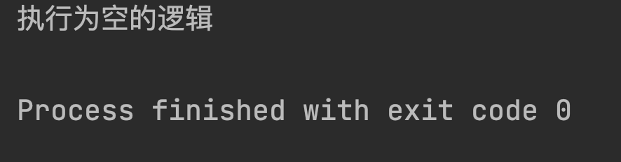
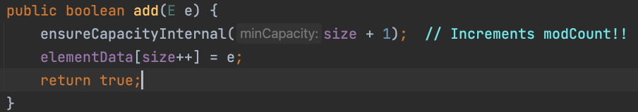
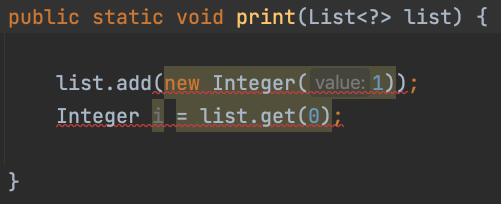
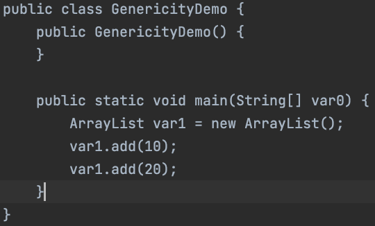

::: tip 

JDK 在 1.5 之后，引入了泛型概念，泛型的推出，是为了使用者能够写出通用性更强的代码。在编写代码时，对应的数据类型还不能确定，在被使用时才指定类型。

:::

# Java 泛型

## 什么是泛型

提到泛型，相信接触过Java的同学都应该比较了解泛型的概念，那么为什么要有泛型这个概念呢？泛型的作用是什么呢？

就拿 ArrayList 来说，如果没泛型的存在，想保存数据在List中，就要定义不同的类，用来支持不同类型， 如 IntegerList、FloatList、DoubleList等。

```java
public class ArrayList<E> extends AbstractList<E>
    implements List<E>, RandomAccess, Cloneable, java.io.Serializable{
    private static final long serialVersionUID = 8683452581122892189L;

    private static final int DEFAULT_CAPACITY = 10;

    private static final Object[] EMPTY_ELEMENTDATA = {};

    private static final Object[] DEFAULTCAPACITY_EMPTY_ELEMENTDATA = {};
    transient Object[] elementData; // non-private to simplify nested class access

    private int size;
    public boolean add(E e) {
        ensureCapacityInternal(size + 1);  // Increments modCount!!
        elementData[size++] = e;
        return true;
    }
}
```

可能也有人会说，为什么不能全部都用Object来接受，就不用编写那么多实现类， 也不用泛型了，确实是可以的，在泛型推出之前，确实一直是这样的。

但这样做会产生一些问题，因为 Object 是所有类的父类，可以接受所有类型的对象，当 List 中插入不同类型的元素时，编译时不会报错，在对类型处理时，就会出现类型转换错误。

其次就是，我们也只能通过变量命名来得知，这个 List 是用来保存什么类型的元素的，而不像使用泛型标识符可以清晰地指定集合中元素的类型。

```java
List intList = new ArrayList();

intList.add(1);
intList.add("我爱你中国");

for (Object item : intList) {
    System.out.println((int) item + 1);
}
```

执行结果：


综上所述，泛型有以下两点作用：

1、写出更加通用的代码，而无需编写过多的实现类。

2、在编译期提供类型检查功能，如类型不一致，编译器会报出编译错误，其次，可以清晰了解类/方法所使用的具体数据类型。

## 泛型的分类

泛型的用法主要分为泛型接口、泛型类、泛型方法。

接下来通过模仿 JDK 提供的 Optional 工具类，来介绍泛型的使用方法，Optional 是 JDK 提供的、更加更优雅的判断空值的工具类，可以简单理解为只能保存一个元素的集合。


### 泛型接口

首先，定义一个接口，并使用 \<T> 来指定泛型，包含两个方法注释如下，其中 `getObj()` 方法，返回的是 T 的类型和接口指定的泛型 T 是同一个类型，这里的泛型 T 是可以任意定义的，不过不同字母有不同的含义，后面会介绍。

```java
public interface CustomOptional<T> {
    /**
     * 判断是否为空
     * @return 是否为空
     */
    boolean ifPresent();
    /**
     * 获取内部保存的对象
     * @return 内部保存对象
     */
    T getObj();
}
```

### 泛型类 

泛型类在实现泛型接口时，要带上泛型参数\<T>，且要和泛型接口保持一致，否则编译报错，在类的内部可以使用 T 类型，如 obj 成员变量类型和 `getObj()` 的返回值类型。

```java
public class CustomOptionalImpl<T> implements CustomOptional<T> {
    public final T obj;
    public CustomOptionalImpl(T obj) {
        this.obj = obj;
    }
    
    @Override
    public boolean ifPresent() {
        return this.obj != null;
    }
    @Override
    public T getObj() {
        return this.obj;
    }
}
```

### 泛型方法 

现在我们想在 CustomOptionalImpl 中加一个静态的工厂方法，由于当前类指定的泛型只能给成员方法或成员变量使用，此时就可以使用泛型方法。

这个泛型 K 和之前定义的泛型 T 没有任何关系，泛型 K 只在泛型方法内生效，在入参传入 K 类型来指定泛型，在方法返回值前，定义泛型参数\<K>，定义返回值中也包含泛型 K，表示返回的对象中的泛型是 K 类型。

定义一个泛型方法的语法如下

```
方法作用域修饰符 <泛型类型> 返回值类型 方法名（泛型）{

}
```

```java
public static <K> CustomOptionalImpl<K> of(K obj) {
    return new CustomOptionalImpl<>(obj);
}
```

- public 与返回值类型中间的 **泛型类型** 非常重要，可以理解为声明此方法为泛型方法。

- 只有声明了泛型类型的方法才是泛型方法，泛型类中的使用了泛型的成员方法并不是泛型方法。
- 表明该方法将使用泛型类型 K，此时才可以在方法中使用泛型类型 K。
- 与泛型类的定义一样，此处 K 可以随便写为任意标识，常见的如 T、E、K、V 等形式的参数常用于表示泛型。

### 测试泛型案例

新建 User 类：

```java
public static class User {
    private String username;
    private Integer age;
    public String getUsername() {
        return username;
    }
    public void setUsername(String username) {
        this.username = username;
    }
    public Integer getAge() {
        return age;
    }
    public void setAge(Integer age) {
        this.age = age;
    }
}
```

测试 main 方法中，首先使用工厂方法 `of()` 创建一个 CustomOptional 对象，传入的类型就是定义的泛型 K，之后调用 `ifPresent()` 方法，来进行判空。

```java
public static void main(String[] args) {
    User user = null;
    CustomOptional<User> userCustomOptional = CustomOptionalImpl.of(user);
    if (userCustomOptional.ifPresent()) {
        System.out.println("执行不为空逻辑");
    } else {
        System.out.println("执行为空的逻辑");
    }
}
```

main方法执行结果：



## 泛型的继承

在 Java 中，父类可以接受子类对象，如 Number 类是 Integer 的父类，可以用 Number 类来接受 Integer 类的对象。

```java
Number number = new Integer(1);
```

但是在泛型中这样做是错误的，会报编译错误提示无法进行类型转换。

```java
List<Integer> integerList = new ArrayList<>();
List<Number> numberList = new ArrayList<>();
numberList = integerList;
```

### 泛型的上界通配符

那么在泛型中是否有这种子类和父类的继承关系呢？JDK 提供泛型的上界通配符，`<? extends T>`，表示可以接受所有继承自 T 的类型，也就是 **规定泛型的上界为 T**。

如下，定义一个方法 `print()` 来输出 numberList，该 List 所指定的泛型，`<? extends Number>` 表示 List 中保存的类型均为 Number 类的子类对象。

```java
public static void print(List<? extends Number> numberList) {
    Number result;
    for (Number number : numberList) {
        System.out.println(number);
    }
}
```

编写 main 方法，传入 integerList：

```java
public static void main(String[] args) {
    List<Integer> integerList = new ArrayList<>();
    
    integerList.add(1);
    integerList.add(2);
    integerList.add(3);
    
    print(integerList);
}
```

泛型的上界在使用过程中，还要注意一点的，当向 numberList 中添加元素时，会提示编译错误，为什么会出现这种情况？如下，Float确实是 Number 的子类。


打开 ArrayList 源码，来看 List 的 `add()` 方法，对于 numberList 来说，这里的E相当于也被替换成了 `<? extends Number>`。



JDK 出于类型安全考虑，当使用 `<? extends T>` 作为方法入参，就禁止传入 T 类的子类，也包括传入 T 类本身的对象（传入null除外）。

**对于集合来说，使用泛型上界无法进行元素修改、添加**，对于 `add()` 等入参是 `<？extends Number>` 的方法来说，这些方法是无法被使用的，因此 numberList 相当于是 **只读** 的。

### 泛型的下界通配符

除了前面介绍的上界通配符，JDK 还提供了下界通配符 `<? super T>` 表示类型必须是 T 的父类。

首先编写 Person 类和子类 Student 类：

```java
public static class Person {
    protected String name;

    public String getName() {
        return name;
    }

    public void setName(String name) {
        this.name = name;
    }

    @Override
    public String toString() {
        return "Person{" +
                "name='" + name + '\'' +
                '}';
    }
}

public static class Student extends Person {
    private String stuNo;

    public String getStuNo() {
        return stuNo;
    }

    public void setStuNo(String stuNo) {
        this.stuNo = stuNo;
    }

    @Override
    public String toString() {
        return "Student{" +
                "name='" + name + '\'' +
                ", stuNo='" + stuNo + '\'' +
                '}';
    }
}
```

接下来，编写 `print()` 方法，接收参数为 `List<? super Student>`，表示在调用 `print()` 方法时，需要传入的 List 的泛型类型为 Student 的父类，并循环输出 studentList 元素。

```java
public static void print(List<? super Student> studentList) {
    Student student;
    for (int i = 0; i < studentList.size(); i++) {
        student = studentList.get(i);
    }
}
```

创建 personList ，调用print方法：

```java
public static void main(String[] args) {
    List<Person> personList = new ArrayList<>();
    personList.add(new Student());
    print(personList);
}
```

实际上，这段代码根本无法运行，在 `print()` 方法中，会提示编译错误。


因为 JDK 出于类型安全考虑，方法签名返回值为 `<? super T>`，就无法使用任何 T 的父类来接收返回值，也包括返回 T 类本身的对象(Object除外)。

**对于集合来说，使用泛型下界，则无法进行元素获取，可以进行元素添加、修改**，对于 `get()` 等返回值是 `<？extends Student>` 的方法来说，这些方法是无法被使用的，因此 stutdentList 相当于是 **可写而不可读** 的。

### PECS 原则

PECS 原则即 Producer Extends Consumer Super，为了方便记忆上界（? extends T）和下界(? super T)，使用 ? extends T 表示可以读取，即为生产者，使用 ? super T 表示可以写入，即为消费者。

关于泛型上界、下界最好的例子就是，Collections.copy() 方法，方法有两个参数， dest 表示要复制的目标list，src表示源 list，正如我们前面得出的结论，dest 由于使用的下界，所以在方法内只能进行添加，src 使用上界，所以只能进行读取。

```java
public static <T> void copy(List<? super T> dest,
                            List<? extends T> src) {
    int srcSize = src.size();
    if (srcSize > dest.size())
        throw new IndexOutOfBoundsException("Source does not fit in dest");

    if (srcSize < COPY_THRESHOLD ||
        (src instanceof RandomAccess && dest instanceof RandomAccess)) {
        for (int i=0; i<srcSize; i++)
            dest.set(i, src.get(i));
    } else {
        ListIterator<? super T> di=dest.listIterator();
        ListIterator<? extends T> si=src.listIterator();
        for (int i=0; i<srcSize; i++) {
            di.next();
            di.set(si.next());
        }
    }
}
```

### <?>通配符

\<?> 无限定通配符没有指定上界和下界，即不支持读取也不支持修改，都会报编译错误，因此只能做一些判空操作，\<?>并不常用。



不过\<?>是所有\<T>类的父类，用法如下：

```java
List<Integer> integerList = new ArrayList<>();
List<?> list = integerList;
```

## Java 泛型的本质（泛型擦除）

Java 泛型的本质是伪泛型，泛型的限制只在编译器生效，编译期编译完带有 Java 泛型的程序后，其生成的 class 文件中与泛型相关的信息会被擦除掉，以此来保证程序运行的效率并不会受影响，也就说泛型类型在 jvm 中和普通类是一样的。

下面编写一段简单的使用泛型的代码。

```java
public class GenericityDemo {    
    public static void main(String[] args) {        
        List<Integer> integerList = new ArrayList<>();
        integerList.add(10);        
        integerList.add(20);
    }
}
```

使用 javac 编译之后，反编译查看 class 文件，发现泛型已经消失了。



再用一个例子来证明 Java 是伪泛型，先定一个 List\<Integer> 的list之后，使用反射调用 add 方法添加一个String元素。

```java
public static void main(String[] args) throws NoSuchMethodException, InvocationTargetException, IllegalAccessException {      
    List<Integer> integerList = new ArrayList<>();
    integerList.add(10);      
    integerList.add(20);
    Method addMethod = integerList.getClass().getDeclaredMethod("add", Object.class);
    addMethod.invoke(integerList, "我爱你中国");
    System.out.println(integerList.toString());  
}
```

执行 main 方法，发现没有任何错误，字符串被成功添加到List中，证明了 Java 是伪泛型，在编译之后泛型信息就被擦除了。


## 泛型字符的含义

**E**-Element: 用于在集合中使用，表示集合元素

**T**-Type：表示普通 Java 类

**K**-Key：表示key-value键值对的键

**V**-Value：表示key-value键值对的值

**N**-Number：表示该类型是数值类型

以上这些字符表示并不是强制要求，而是一些建议的做法。

## 总结

本文主要介绍了为什么要使用泛型，主要是为了写出通用性更强的代码，并且能避免类型转换出错。

接下来介绍了泛型的用法包括：泛型接口、泛型类、泛型方法，介绍了泛型的继承关系：上界、下界、无限定通配符等。

最后通过两个例子来验证 Java 的泛型是伪泛型，并介绍了常见的泛型字符的含义。

泛型是一个比较抽象的概念，它使用起来非常灵活，一时间理解不了可以反复思考，编写 Demo 进行验证，并把它应用在实际的场景中，这样才能真正的理解泛型的概念、思想和用法。
