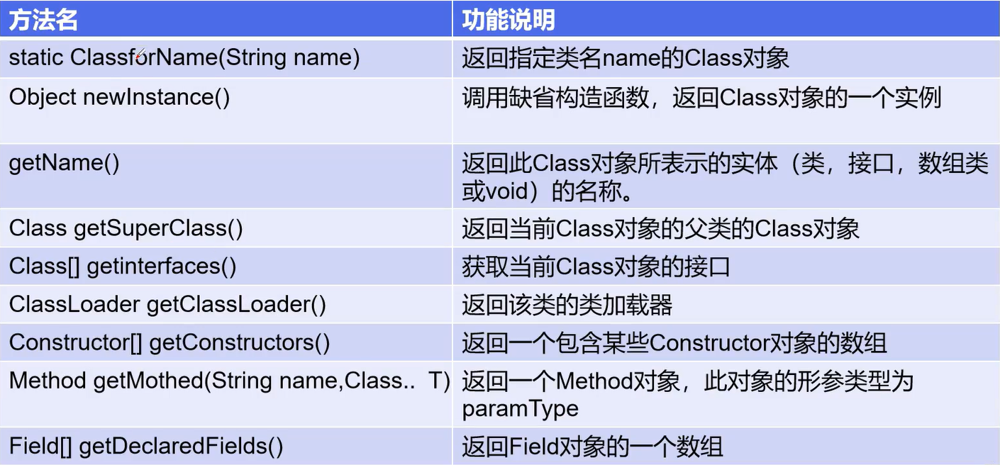

# Java的注解与反射机制

## 一、什么是注解

Annotation 是从 JDK5.0 开始引入的技术

Annotation 的作用：

- 不是程序本身，可以对程序作出解释（这一点和注释[comment]没什么区别）
- <font color='red'>**可以被其他程序（比如：编译器等）读取**</font>

Annotation 的格式：

注解是以 **@注释名** 在代码中存在的，还可以添加一些参数值，例如：**@SuppressWarnings(value="unchecked")**

Annotation 在哪里使用：
- 可以附加在 package , class , method , field 等上面，相当于给他们添加了额外的辅助信息，我们可以通过 **反射机制** 编程实现对这些元数据的访问

内置注释：

- **@Override**：定义在 java.lang.Override中，此注释只适用于修辞方法，表示一个方法声明打算重写超类中的另一个方法声明。

- **@Deprecated**：定义在 java.lang.Deprecated中，此注释可以用于修辞方法、属性、类，表示不鼓励程序员使用这样的元素，通常是因为它很危险或者存在更好的选择。

- **@SuppressWarnings**：定义在 java.lang.SuppressWarnings 中用来抑制编译时的警告信息。

  与前两个注释有所不同，我们需要添加一个参数才能正确使用，这些参数都是已经定义好了的，我们选择性的使用就好了。

  @SuppressWarnings("all")

  @SuppressWarnings("unchecked")

  @SuppressWarnings(value={"unchecked","deprecation"})

  ……

## 二、元注解

元注解的作用是负责注解其他注解，Java定义了4个标准的meta-annotation类型，他们被用来提供对其他annotation类型做说明

4个元注解分别为：

- **@Target**  用于描述注解的使用范围（即：被描述的注解可以用在什么地方）
- **@Retention**  用于表示需要在什么级别保存注解信息，用于描述注解的生命周期（SOURCE<CLASS<**RUNTIME**）
- **@Document**  说明该注解将被包含在 javadoc 中
- **@Inherited**  说明子类可以继承父类中的该注解

测试元注解：

```java
@Target(value = {ElementType.METHOD/*方法*/})
@Retention(RetentionPolicy.RUNTIME/*运行时有效*/)
@Documented //表示把注解生成在Javadoc中
@Inherited //表示可以被继承
@interface MyAnnotation{

}
```

## 三、自定义注解

使用 **@interface** 自定义注解时，自动继承了 **java.lang.annotation.Annotation** 接口

- **@interface** 用来声明一个注解，格式：**public @interface 注解名{定义内容}**
- 其中的每一个方法实际上是声明了一个配置参数
- 方法的名称就是参数的名称
- 返回值类型就是参数的类型（返回值只能是基本类型，Class，String，enum）
- 可以通过 default 来声明参数的默认值
- 如果只有一个参数成员，一般参数名为 value
- 注解元素必须要有值，我们定义注解元素时，经常使用空字符串，0作为默认值

```java
public class Test2 {
    //注解可以显式赋值，如果没有默认值，就必须给注解赋值
    @MyAnnotation1(schools = "BUPT")
    public void test(){
    }
    //如果注解只有一个参数可以省略参数名
    @MyAnnotation2("你好 ")
    public void test2(){
        
    }
}

@Target({ElementType.TYPE,ElementType.METHOD})
@Retention(RetentionPolicy.RUNTIME)
@interface MyAnnotation1{
    //注解的参数：类型+参数名()[default 默认值];
    String name() default "";
    int age() default 0;
    int id() default -1; //默认值为-1，代表不存在
    String[] schools();
}
@Target({ElementType.TYPE,ElementType.METHOD})
@Retention(RetentionPolicy.RUNTIME)
@interface MyAnnotation2{
    //注解的参数：类型+参数名()[default 默认值];
    String[] value();
}
```

## 四、什么是Java的反射机制

Java的反射（Reflection）机制是指在程序的运行状态中，（通过借助ReflectionAPI）可以构造任意一个类的对象，可以了解任意一个对象所属的类，可以获取任意一个类的成员变量和方法（类的内部信息），可以操作任意一个对象的属性和方法。这种动态获取程序信息以及动态调用对象的功能称为Java语言的反射机制。反射是java被视为动态语言的关键。

加载完类之后，在堆内存的方法区中就产生了一个Class类型的对象（一个类只有一个Class对象），这个对象就包含了完整的类的结构信息。我们可以通过这个对象看到类的结构。这个对象就像一面镜子，透过这个镜子看到类的结构，所以，我们形象的称之为：反射。

### 1、动态语言

是一类在运行时可以改变其结构的语言：例如新的函数、对象甚至代码可以被引进，已有的函数可以被删除或者是其他结构上的变化。通俗来说就是运行时代码可以根据一些条件来改变自身的结构

主要动态语言：Object-C、C#、JavaScript、PHP、Python等

### 2、静态语言 

与动态语言相对应的，运行时不能改变其结构，如 Java、C、C++

Java不是动态语言，但是 Java 可以称为是 **准动态语言**。即 Java 有一定的动态性，可以利用 **反射机制** 获得类似动态语言的特性。Java的动态性使得编程时更加灵活。

## 五、什么是类对象

对象照镜子后可以得到的信息：某个类的属性、方法和构造器、某个类到底实现了哪些接口

对于每个类而言，JRE都为其保留一个不变的Class类型的对象

一个Class对象包含了特定某个结构(class/interface/enum/annotation/primitive type/void/[])的有关信息

- Class 本身也是一个类
- Class 对象只能由系统建立对象
- 一个加载的类在 JVM 中只会有一个 Class 实例
- 一个 Class 对象对应的是一个加载到 JVM 中的一个 `.class` 文件
- 每个类的实例都会记得自己是由哪个Class实例所生成
- 通过 Class 可以完整地得到一个类中的所有被加载的结构
- Class 类是反射机制的根源，针对任何你想动态加载、运行的类，唯有先获得相应的Class对象

在理解类对象之前，先说我们熟悉的对象之间的区别：

- garen 和 teemo 都是**Hero对象**，他们的区别在于，各自有**不同的名称，血量，伤害值**。

然后说说类之间的区别：

- Hero 和 Item 都是类，他们的区别在于有**不同的方法，不同的属性**。

**类对象**，就是用于描述这种类，都有什么属性，什么方法的

## 六、Class类的常用方法



## 七、如何获取类对象

获取类对象主要有5种方式
1. `Class.forName`  已知一个类的全类名，且该类在类路径下，可通过Class类的静态方法 forName() 获取，可能抛出 ClassNotFoundException
2. `Hero.class`  若已知具体的类，通过类的 class 属性获取，该方法最为安全可靠，程序性能最高
3. `new Hero().getClass()`  已知某个类的实例（即对象），调用该实例的 getClass() 方法获取 Class 对象

4. `.Type`  内置基本数据类型可以直接用类名
  5. 还可以利用 `ClassLoader`

在一个 JVM 中，一种类，只会有一个类对象存在。所以以上几种方式取出来的类对象，都是一样的

准确的讲是一个 ClassLoader 下，一种类，只会有一个类对象存在。通常一个 JVM 下，只会有一个 ClassLoader

```java
Class pClass1 = Class.forName("charactor.Hero");
Class pClass2 = Hero.class;
Class pClass3 = new Hero().getClass();
```

## 八、获取类对象的时候，会导致类属性被初始化

无论什么途径获取类对象，都会导致静态属性被初始化，而且只会执行一次（除了直接使用 `Class c = Hero.class` 这种方式，这种方式不会导致静态属性被初始化）

## 九、通过反射机制创建对象

与传统的通过 new 来获取对象的方式不同

反射机制，会先拿到Hero的“类对象”，然后通过类对象获取“构造器对象”

再通过构造器对象创建一个对象

```java
// 传统的使用new的方式创建对象
Hero h1 =new Hero();
h1.name = "teemo";
	
// 使用反射的方式创建对象
String className = "charactor.Hero";
// 类对象
Class pClass=Class.forName(className);
// 构造器
Constructor c= pClass.getConstructor();
// 通过构造器实例化
Hero h2= (Hero) c.newInstance();
```

## 十、通过反射机制修改对象的属性

对于private修饰的成员，需要使用 `setAccessible(true)` 才能访问和修改

```java
Hero h =new Hero();
//使用传统方式修改name的值为garen
h.name = "garen";
//获取类Hero的名字叫做name的字段
Field f1= h.getClass().getDeclaredField("name");
//修改这个字段的值
f1.set(h, "teemo");
```

getField 和 getDeclaredField 的区别：
- 这两个方法都是用于获取字段
- getField **只能获取**public的，包括**从父类继承**来的字段。
- getDeclaredField 可以获取本类所有的字段，**包括private**的，但是**不能获取继承**来的字段。 (**注**： 这只能获取到private的**字段**，但并不能访问该private字段的**值**，除非加上 **setAccessible(true)**)

## 十一、通过反射机制，调用一个对象的方法

```java
Hero h = new Hero();
// 获取这个名字叫做setName，参数类型是String的方法
Method m = h.getClass().getMethod("setName", String.class);
// 对h对象，调用这个方法
m.invoke(h, "盖伦");
// 使用传统的方式，调用getName方法
System.out.println(h.getName());
```

## 十二、反射机制好在哪里

- 在运行时判断任意一个对象所属的类
- 在运行时构造任意一个类的对象
- 在运行时判断任意一个类所具有的成员变量和方法
- 在运行时获取泛型信息
- 在运行时调用任意一个对象的成员变量和方法
- 在运行时处理注解
- 生成动态代理

通常来说，需要在学习了**Spring**的**依赖注入**，**反转控制**之后，才会对反射有更好的理解。
