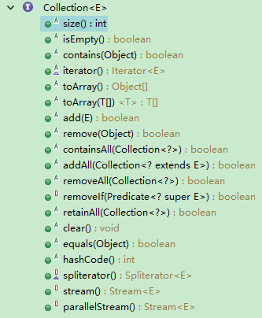

# Java集合框架综述

## 一、集合框架图


简化图：


**对于以上的框架图有如下几点说明：**

1、所有集合类都位于 `java.util` 包下。Java的集合类主要由两个接口派生而出：`Collection` 和 `Map` ，Collection和Map是Java集合框架的根接口，这两个接口又包含了一些子接口或实现类。

2、集合接口：6个接口（短虚线表示），表示不同集合类型，是集合框架的基础。

3、抽象类：5个抽象类（长虚线表示），对集合接口的部分实现，可扩展为自定义集合类。

4、实现类：8个实现类（实线表示），对接口的具体实现。

5、<mark>Collection 接口是一组允许重复的对象</mark>。

6、<mark>Set 接口继承 Collection，集合元素不重复</mark>。

7、<mark>List 接口继承 Collection，允许重复，维护元素插入顺序</mark>。

8、Map接口是键－值对象，**与Collection接口没有什么关系**。

**9、Set、List和Map可以看做集合的三大类：**

- List集合是有序集合，集合中的元素可以重复，访问集合中的元素可以根据元素的索引来访问。
- Set集合是无序集合，集合中的元素不可以重复，访问集合中的元素只能根据元素本身来访问（也是集合里元素不允许重复的原因）。
- Map集合中保存 Key-value 对形式的元素，访问时只能根据每项元素的key来访问其value。

## 二、总体分析


看上面的框架图，先抓住它的主干，即**Collection**和**Map**。

1、Collection是一个接口，是高度抽象出来的集合，**它包含了集合的基本操作和属性**。Collection包含了**List**和**Set**两大分支。

- **List是一个有序的队列**，每一个元素都有它的索引。第一个元素的索引值是0。List的实现类有LinkedList, ArrayList, Vector, Stack。
- **Set是一个不允许有重复元素的集合**。Set的实现类有HastSet和TreeSet。HashSet依赖于HashMap，它实际上是通过HashMap实现的；TreeSet依赖于TreeMap，它实际上是通过TreeMap实现的。

2、**Map是一个映射接口，即 key-value 键值对**。Map中的每一个元素包含“一个key”和“key对应的value”。AbstractMap是个抽象类，它实现了Map接口中的大部分API。而HashMap，TreeMap，WeakHashMap都是继承于AbstractMap。Hashtable虽然继承于Dictionary，但它实现了Map接口。

3、接下来，再看Iterator。它是**遍历集合**的工具，即我们通常通过Iterator迭代器来遍历集合。我们说Collection依赖于Iterator，是因为Collection的实现类都要实现iterator()函数，返回一个Iterator对象。**ListIterator是专门为遍历List而存在的。**

4、再看Enumeration，它是JDK 1.0引入的抽象类。**作用和Iterator一样**，也是遍历集合；但是Enumeration的功能要比Iterator少。在上面的框图中，Enumeration只能在Hashtable, Vector, Stack中使用。

5、最后，看Arrays和Collections。它们是操作数组、集合的两个工具类。

有了上面的整体框架之后，我们接下来对每个类分别进行分析。

## 三、Collection 接口

Collection接口是处理对象集合的根接口，其中定义了很多对元素进行操作的方法。Collection接口有两个主要的子接口List和Set，<font color='red'>**注意Map不是Collection的子接口，这个要牢记**</font>。

Collection接口中的方法如下：



其中，有几个比较常用的方法，比如 `add()`添加一个元素到集合中，`addAll()`将指定集合中的所有元素添加到集合中，`contains()` 检测集合中是否包含指定的元素，`toArray()` 返回一个表示集合的数组。

另外，Collection中有一个 `iterator()`，它的作用是返回一个Iterator接口。通常，我们通过Iterator迭代器来遍历集合。ListIterator是List接口所特有的，在List接口中，通过 `ListIterator()` 返回一个ListIterator对象。

Collection接口有两个常用的子接口，下面详细介绍

### List 接口

**List集合代表一个有序集合，集合中每个元素都有其对应的顺序索引。List集合允许使用重复元素，可以通过索引来访问指定位置的集合元素。**

List接口继承于Collection接口，它可以定义一个**允许重复**的**有序集合**。因为List中的元素是有序的，所以我们可以通过使用索引（元素在List中的位置，类似于数组下标）来访问List中的元素，这类似于Java的数组。

List接口为Collection直接接口。List所代表的是**有序的Collection**，即它用某种特定的插入顺序来维护元素顺序。用户可以对列表中每个元素的插入位置进行精确地控制，同时可以根据元素的整数索引（在列表中的位置）访问元素，并搜索列表中的元素。实现List接口的集合主要有：**ArrayList、LinkedList、Vector、Stack**。

#### ArrayList

ArrayList是一个**动态数组**，也是我们最常用的集合。它允许任何符合规则的元素插入甚至包括null。每一个ArrayList都有一个初始容量（10），该容量代表了数组的大小。随着容器中的元素不断增加，容器的大小也会随着增加。在每次向容器中增加元素的同时都会进行容量检查，当快溢出时，就会进行扩容操作。所以**如果我们明确所插入元素的多少，最好指定一个初始容量值，避免过多的进行扩容操作而浪费时间、效率。**

size、isEmpty、get、set、iterator 和 listIterator 操作都以固定时间运行。add 操作以分摊的固定时间运行，也就是说，添加 n 个元素需要 O(n) 时间（由于要考虑到扩容，所以这不只是添加元素会带来分摊固定时间开销那样简单）。

**ArrayList擅长于随机访问。同时ArrayList是非同步的。**

#### LinkedList

同样实现List接口的LinkedList与ArrayList不同，**ArrayList是一个动态数组，而LinkedList是一个双向链表**。所以它除了有ArrayList的基本操作方法外还额外提供了 get，remove 方法在LinkedList的首部或尾部。

由于实现的方式不同，**LinkedList不能随机访问**，它所有的操作都是要按照双重链表的需要执行。在列表中索引的操作将从开头或结尾遍历列表（从靠近指定索引的一端）。这样做的好处就是可以通过较低的代价在List中进行插入和删除操作。

与ArrayList一样，**LinkedList也是非同步的**。如果多个线程同时访问一个List，则必须自己实现访问同步。一种解决方法是在创建List时构造一个同步的List：

```java
List list = Collections.synchronizedList(new LinkedList(...));
```

#### Vector

与ArrayList相似，但是**Vector是同步的**。所以说**Vector是线程安全的动态数组**。它的操作与ArrayList几乎一样。

#### Stack

Stack继承自Vector，实现一个**后进先出的堆栈**。Stack提供5个额外的方法使得Vector得以被当作堆栈使用。基本的push和pop 方法，还有peek方法得到栈顶的元素，empty方法测试堆栈是否为空，search方法检测一个元素在堆栈中的位置。Stack刚创建后是空栈。

### Set 接口

Set是一种**不包括重复元素的Collection**。它维持它自己的内部排序，所以随机访问没有任何意义。与List一样，它同样允许null的存在但是仅有一个。由于Set接口的特殊性，**所有传入Set集合中的元素都必须不同**，同时要注意任何可变对象，如果在对集合中元素进行操作时，导致`e1.equals(e2)==true`，则必定会产生某些问题。Set接口有三个具体实现类，分别是**散列集HashSet、链式散列集LinkedHashSet和树形集TreeSet**。

**Set是一种不包含重复的元素的Collection，无序，即任意的两个元素e1和e2都有e1.equals(e2)=false，Set最多有一个null元素。**

此外需要说明一点，在set接口中的不重复是有特殊要求的：

- 举个例子，对象A和对象B，本来是不同的两个对象，正常情况下它们是能够放入到Set里面的，但是如果对象A和B的都重写了hashcode和equals方法，并且重写后的hashcode和equals方法是相同的话。那么A和B是不能同时放入到Set集合中去的（比如String对象），也就是Set集合中的去重和hashcode与equals方法直接相关。

#### HashSet

HashSet 是一个**没有重复元素的集合**。它是由HashMap实现的，**不保证元素的顺序**（元素插入的顺序与输出的顺序不一致），而且HashSet允许使用null 元素。HashSet是**非同步的**，如果多个线程同时访问一个哈希set，而其中至少一个线程修改了该set，那么它必须保持外部同步。 **HashSet按Hash算法来存储集合的元素，因此具有很好的存取和查找性能。**

HashSet的实现方式大致如下，通过一个HashMap存储元素，元素是存放在HashMap的Key中，而Value统一使用一个Object对象。

**HashSet使用和理解中容易出现的误区:**

- **HashSet 中存放null值** HashSet中是允许存入null值的，但是在HashSet中仅仅能够存入一个null值。

- **HashSet 中存储元素的位置是固定的** HashSet中存储的元素的是无序的，这个没什么好说的，但是由于HashSet底层是基于Hash算法实现的，使用了hashcode，所以HashSet中相应的元素的位置是固定的。

- **必须小心操作可变对象**（`Mutable Object`） 如果一个Set中的可变元素改变了自身状态使得`Object.equals(Object)=true`，那么将导致一些问题。

#### LinkedHashSet

LinkedHashSet继承自HashSet，其底层是**基于LinkedHashMap来实现的，有序，非同步**。LinkedHashSet集合同样是根据元素的hashCode值来决定元素的存储位置，但是它同时使用链表维护元素的次序。这样使得元素看起来像是以插入顺序保存的，也就是说，当遍历该集合时候，**LinkedHashSet将会以元素的添加顺序访问集合的元素。**

#### TreeSet

TreeSet是一个**有序集合**，其底层是**基于TreeMap实现的，非线程安全**。TreeSet可以确保集合元素处于排序状态。**TreeSet支持两种排序方式，自然排序和定制排序，其中自然排序为默认的排序方式。**当我们构造TreeSet时，若使用不带参数的构造函数，则TreeSet的使用自然比较器；若用户需要使用自定义的比较器，则需要使用带比较器的参数。

> 注意：TreeSet集合不是通过hashcode和equals函数来比较元素的。它是通过`compare`或者`comparaeTo`函数来判断元素是否相等的。`compare`函数通过判断两个对象的id，相同的id则判断为重复元素，不会被加入到集合中。

## 四、Map 接口

Map与List、Set接口不同，它是由一系列键值对组成的集合，提供了key到Value的映射。同时它也没有继承Collection。在Map中它保证了key与value之间的一一对应关系。也就是说一个key对应一个value，所以它**不能存在相同的key值，当然value值可以相同**。

#### HashMap

以哈希表数据结构实现，查找对象时通过哈希函数计算其位置，它是为快速查询而设计的，其内部定义了一个hash表数组（Entry[] table），元素会通过哈希转换函数将元素的哈希地址转换成数组中存放的索引，如果有冲突，则使用散列链表的形式将所有相同哈希地址的元素串起来，可以通过查看 `HashMap.Entry`的源码知道它是一个单链表结构。

#### LinkedHashMap

LinkedHashMap是HashMap的一个子类，它保留插入的顺序，如果需要输出的顺序和输入时的相同，那么就选用LinkedHashMap。

**LinkedHashMap是Map接口的哈希表和链接列表实现，具有可预知的迭代顺序。**此实现提供所有可选的映射操作，并允许使用null值和null键。此类不保证映射的顺序，特别是它不保证该顺序恒久不变。

LinkedHashMap实现与HashMap的不同之处在于，后者维护着一个运行于所有条目的双重链接列表。此链接列表定义了迭代顺序，该迭代顺序可以是插入顺序或者是访问顺序。

根据链表中元素的顺序可以分为：按插入顺序的链表，和按访问顺序(调用get方法)的链表。默认是按插入顺序排序，如果指定按访问顺序排序，那么调用get方法后，会将这次访问的元素移至链表尾部，不断访问可以形成按访问顺序排序的链表。

> 注意，此实现不是同步的。如果多个线程同时访问链接的哈希映射，而其中至少一个线程从结构上修改了该映射，则它必须保持外部同步。由于LinkedHashMap需要维护元素的插入顺序，因此性能略低于HashMap的性能，但在迭代访问Map里的全部元素时将有很好的性能，因为它以链表来维护内部顺序。

#### TreeMap

**TreeMap 是一个有序的key-value集合，非同步，基于红黑树（Red-Black tree）实现，每一个key-value节点作为红黑树的一个节点**。TreeMap存储时会进行排序的，会根据key来对key-value键值对进行排序，其中排序方式也是分为两种，一种是自然排序，一种是定制排序，具体取决于使用的构造方法。

**自然排序：**TreeMap中所有的key必须**实现Comparable接口**，并且所有的key都应该是同一个类的对象，否则会报ClassCastException异常。

**定制排序**：定义TreeMap时，**创建一个comparator对象**，该对象对所有的treeMap中所有的key值进行排序，采用定制排序的时候不需要TreeMap中所有的key必须实现Comparable接口。

TreeMap判断两个元素相等的标准：两个key通过`compareTo()`方法返回0，则认为这两个key相等。

如果使用自定义的类来作为TreeMap中的key值，且想让TreeMap能够良好的工作，则**必须重写自定义类中的`equals()`方法**，TreeMap中判断相等的标准是：两个key通过`equals()`方法返回为true，并且通过`compareTo()`方法比较应该返回为0。
