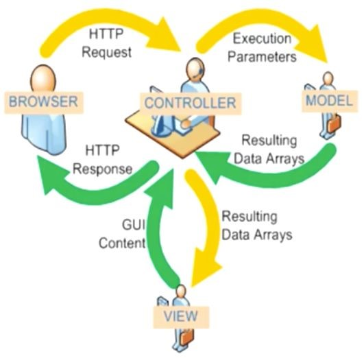

# Java开发的主流框架演变

## 架构设计的演变之路

- 随着互联网的快速发展，Web应用程序的规模不断扩大，最后我们发现传统的垂直体系结构（整体式）已无法满足需要。分布式服务体系结构和流计算体系结构势在必行，迫切需要一个治理系统来确保体系结构的有序发展。

### 单一应用架构

- 当流量非常低时，只有一个应用程序，所有功能都一起部署以减少部署节点和成本。在这一点上，数据访问框架（ORM）是简化 CRUD 工作量的关键。
- 刚开始创立时 **PHP + MySQL** 就可以形成网站了。这种模式支持中小型网站是没有问题的，但是一旦形成大型网站就支撑不住了。所以各大主流公司还是会选择 Java。
- 我们项目中的类会打包成一个 **WAR** 包运行在服务器里，最初所有模块是在一个 WAR 包的，也就是单一应用，随着用户量的提升、访问量的增大，WAR 包越来越大，单一应用运行起来越来越慢，所以单一架构就不再适合了。

**单一应用架构的好处**：

易于开发和测试；也十分方便部署；当需要拓展时，只需要将war复制多份，然后放到多个服务器上，再做个负载均衡就可以了。

**单一应用架构的缺点**：

哪怕我要修改一个非常小的地方，我都需要停掉整个服务，重新打包、部署这个应用war包。特别是对于一个大型应用，我们不可能把所有内容都放在一个应用里面，我们如何维护、如何分工合作都是问题。

### 垂直应用架构

- 当流量增加时，添加整体应用程序实例不能很好地加速访问，提高效率的一种方法是将整体结构拆分为离散的应用程序。在这一点上，用于加速前端页面开发的 **Web框架**（MVC）是关键。
- 把一个模块拆分成几个单独的模块以提升效率，一个 JAR 包分成几个 JAR 包运行在不同的服务器上，这就是 **MVC 的设计模式**

### 分布式服务架构

- 当垂直应用程序越来越多时，应用程序之间的交互是不可避免的，一些核心业务被提取并作为独立的服务提供服务，逐渐形成一个稳定的服务中心，这样前端应用程序就可以更好地响应变化多端的市场需求。很快。此时，用于业务重用和集成的 **分布式服务框架（RPC）**是关键。
- 随着业务量的剧增，几台服务器也已经不够用了，效率比较低，此时每个模块用 N 台服务器进行部署。当请求进来之后，会按照一些策略，把它随机分配到负载均衡的服务器。此时每个服务器的 request 就比较少了，提高了效率，这个就是 **分布式服务架构**

### 流动计算架构

- 当服务越来越多时，容量评估变得困难，而且小规模的服务也经常造成资源浪费。为了解决这些问题，应添加调度中心，以根据流量管理集群容量并提高集群利用率。目前，用于提高机器利用率的资源调度和治理中心（SOA）是关键。

## Java 开发的主流框架演变之路

### JSP + Servlet + JavaBean

- JSP = JavaServer Pages，即前端页面的控制

- Servlet = Server applet，即服务器端的应用程序

- JavaBean，就是我们定义的对象，当我们想用这些类来描述现实事物时，会定义属性、get/set 方法，父类的具体实现等等。

这样我们有了对象，有了后台接收请求处理的服务器，有了前端页面，就能够搭建一个从前端到后端的整体框架。

但这个搭配有点麻烦，因为 **JSP 既可以写标签，也可以内嵌 Java 代码**，<% (Java code) %>，所有东西耦合在一起变得非常麻烦；

而现在纯的 HTML，支持 JS, 支持 HTML 标签，支持 CSS 样式，**不支持插入 Java 代码**，这就是 **JSP 和 HTML 的最大的区别**。

现在企业中开发时比如 Spring Boot 的开发，更多的还是用 HTML，或者用一些前端框架比如 freemarker 进行代替，JSP 已经被慢慢淘汰掉了，但是核心思想是一样的。

> 这个框架的主要问题在于：一、效率低；二、性能低。

那么在做开发时会引入复杂的问题，当前端页面和后段服务器交互时，发送 N 多个 request，写 Servlet 时要写 N 多个对应的处理：

- 在用2.5及之前的版本时，也就意味着写 N 多个 xml 文件；
- 后面引入注解之后，依然要写 N 多个注解，非常麻烦。

### MVC = Model View Controller

这张图很好的展示了每个模块的功能和相互的联系：

- Browser: 提交请求，接收响应
- Controller: 处理请求并发送到数据库去查询 
- Model：数据库里的那些表
- View: 前端框架

完整的过程就是：

- 用户在浏览器中发送请求之后，browser 把这个请求发给了 controller，需要它做一些处理，然后发送到数据库中去查询，得到结果之后，把结果发给 View 层进行渲染，用 html 的标签好看的表示出来，渲染之后的结果再返回给 controller，再返回到浏览器里显示出来。

比如在我们在点外卖时，你发送请求给服务员，服务员就是 controller 层，他需要处理订单比如查一下仓库里还有没有这些原材料，排好先后顺序再交给厨师等等，厨师做好之后他还需要再包装一下再送到你手上。

### **EJB = Enterprise JavaBeans**

这是比较老的技术了，重量级框架，现在一般都不用了。

但有几个名词我们还是可以了解一下：

- 什么是**重**：在使用的时候，有过多的接口和依赖，侵入性比较强
- 什么是**侵入性**：在写代码的时候需要去继承或实现当前框架里的很多 class / interface，这就是侵入性比较强。侵入性强也就是和这个框架的耦合比较高，开发时会比较麻烦。

### SSH = Spring + Struts + Hibernate

这个框架虽然也上了年纪了，但是一些老的项目还在用它。

特别是金融 IT 这一块，数据库 dao 层还是使用的是 Hibernate；而科技公司因为要用到高并发，dao 层用的是 MyBatis，数据交互效率较快。

回到 SSH 框架上来，用过的都知道，它配起来真的麻烦：

- Struts 有自己的配置文件，叫 struts.xml；
- Hibernate 有自己的配置文件，叫 hibernate.cfg.xml
- Spring 有自己的配置文件
- 还有个 mapping 的一一映射的文件...

### SSM = Spring + SpringMVC + MyBatis

后面就有了 SSM，但其实现在的新项目中用的也比较少了，而更多的用 Spring Boot。

### Spring Boot

Spring Boot 确实配起来非常简单，省略了很多工作，配置文件不是那么多，更多的是用的注解的方式。
