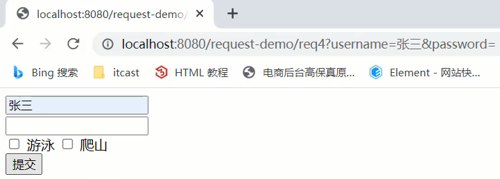

# Request和Response

## Request 和 Response 的概述

Request 是请求对象，Response 是响应对象。

这两个对象在我们使用 Servlet 的时候看到过：


那么，request 和 response 这两个参数的作用是什么呢？


* request：**获取请求数据**

  1. 浏览器会发送 HTTP 请求到后台服务器 [Tomcat]
  2. HTTP 的请求中会包含很多请求数据 [请求行+请求头+请求体]

  3. 后台服务器 [Tomcat] 会对 HTTP 请求中的数据进行解析并把解析结果存入到一个对象中

  4. 所存入的对象即为 request 对象，所以我们可以从 request 对象中获取请求的相关参数

  5. 获取到数据后就可以继续后续的业务，比如获取用户名和密码就可以实现登录操作的相关业务

* response：**设置响应数据**

  1. 业务处理完后，后台就需要给前端返回业务处理的结果即响应数据

  2. 把响应数据封装到 response 对象中

  3. 后台服务器 [Tomcat] 会解析 response 对象，按照 [响应行+响应头+响应体] 格式拼接结果

  4. 浏览器最终解析结果，把内容展示在浏览器给用户浏览

对于上述所讲的内容，下面通过一个案例来初步体验下 request 和 response 对象的使用。

```java
@WebServlet("/demo3")
public class ServletDemo3 extends HttpServlet {
    @Override
    protected void doGet(HttpServletRequest request, HttpServletResponse response) throws ServletException, IOException {
        //使用request对象 获取请求数据
        String name = request.getParameter("name");//url?name=zhangsan

        //使用response对象 设置响应数据
        response.setHeader("content-type","text/html;charset=utf-8");
        response.getWriter().write("<h1>"+name+",欢迎您！</h1>");
    }

    @Override
    protected void doPost(HttpServletRequest request, HttpServletResponse response) throws ServletException, IOException {
        System.out.println("Post...");
    }
}
```

启动成功后就可以通过浏览器来访问，并且根据传入参数的不同就可以在页面上展示不同的内容:


**总结**：

* request 对象是用来 **封装请求数据** 的对象
* response 对象是用来 **封装响应数据** 的对象

## Request 对象

### Request 继承体系

先思考一个问题，前面在介绍 Request 和 Reponse 对象的时候，比较细心的同学可能已经发现：

* 当我们的 Servlet 类实现的是 Servlet 接口的时候，service() 方法中的参数是 ServletRequest 和 ServletResponse
* 当我们的 Servlet 类继承的是 HttpServlet 类的时候，doGet() 和 doPost() 方法中的参数就变成 HttpServletRequest 和 HttpServletReponse

那么，请问：

* ServletRequest 和 HttpServletRequest 的关系是什么？
* request 对象是有谁来创建的？
* request 提供了哪些 API，这些 API 从哪里查？

首先，我们先来看下Request的继承体系:


从上图中可以看出，ServletRequest 和 HttpServletRequest 都是 Java 提供的，所以我们可以查看 JavaEE 提供的 API 文档：


所以 ServletRequest 和 HttpServletRequest 是继承关系，并且两个都是接口，接口是无法创建对象的，这就引发了下面的问题：


这个时候，我们就需要用到 Request 继承体系中的 **RequestFacade**：

* 该类实现了 HttpServletRequest 接口，也间接实现了 ServletRequest 接口。
* Servlet 类中的 service 方法、doGet() 方法或者是 doPost() 方法最终都是由 Web 服务器 [Tomcat] 来调用的，所以 Tomcat 提供了方法参数接口的具体实现类，并完成了对象的创建
* 要想了解 RequestFacade 中都提供了哪些方法，我们可以直接查看 JavaEE 的 API 文档中关于 ServletRequest 和 HttpServletRequest 的接口文档，因为 RequestFacade 实现了其接口就需要重写接口中的方法

对于上述结论，要想验证，可以编写一个 Servlet，在方法中把 request 对象打印下，就能看到最终的对象是不是 RequestFacade，代码如下：

```java
@WebServlet("/demo2")
public class ServletDemo2 extends HttpServlet {
    @Override
    protected void doGet(HttpServletRequest request, HttpServletResponse response) throws ServletException, IOException {
        System.out.println(request);
    }

    @Override
    protected void doPost(HttpServletRequest request, HttpServletResponse response) throws ServletException, IOException {
    }
}
```

启动服务器，运行访问 `http://localhost:8080/request-demo/demo2`，得到运行结果：


**总结**：

* Request 的继承体系为 ServletRequest-->HttpServletRequest-->RequestFacade
* Tomcat 需要解析请求数据，封装为 request 对象，并且创建 request 对象传递到 service 方法
* 使用 request 对象，可以查阅 JavaEE API 文档的 HttpServletRequest 接口中方法说明

### Request 获取请求数据

HTTP 请求数据总共分为三部分内容，分别是 **请求行、请求头、请求体**。

#### 获取请求行数据

请求行包含三块内容，分别是 **请求方式、请求资源路径、HTTP 协议及版本**


对于这三部分内容，request 对象都提供了对应的API方法来获取，具体如下:

* 获取请求方式：`GET`

```java
String getMethod()
```

* 获取虚拟目录（项目访问路径）：`/request-demo`

```java
String getContextPath()
```

* 获取 URL（统一资源定位符）：`http://localhost:8080/request-demo/req1`

```java
StringBuffer getRequestURL()
```

* 获取 URI（统一资源标识符）：`/request-demo/req1`

```java
String getRequestURI()
```

* 获取请求参数（GET 方式）：`username=zhangsan&password=123`

```java
String getQueryString()
```

介绍完上述方法后，咱们通过代码把上述方法都使用下:

```java
/**
 * request 获取请求数据
 */
@WebServlet("/req1")
public class RequestDemo1 extends HttpServlet {
    @Override
    protected void doGet(HttpServletRequest req, HttpServletResponse resp) throws ServletException, IOException {
        // String getMethod()：获取请求方式： GET
        String method = req.getMethod();
        System.out.println(method);//GET
        // String getContextPath()：获取虚拟目录(项目访问路径)：/request-demo
        String contextPath = req.getContextPath();
        System.out.println(contextPath);
        // StringBuffer getRequestURL(): 获取URL(统一资源定位符)：http://localhost:8080/request-demo/req1
        StringBuffer url = req.getRequestURL();
        System.out.println(url.toString());
        // String getRequestURI()：获取URI(统一资源标识符)： /request-demo/req1
        String uri = req.getRequestURI();
        System.out.println(uri);
        // String getQueryString()：获取请求参数（GET方式）： username=zhangsan
        String queryString = req.getQueryString();
        System.out.println(queryString);
    }
    @Override
    protected void doPost(HttpServletRequest req, HttpServletResponse resp) throws ServletException, IOException {
    }
}
```

启动服务器，访问 `http://localhost:8080/request-demo/req1?username=zhangsan&passwrod=123`，获取的结果如下:


#### 获取请求头数据

对于请求头的数据，格式为 `key: value`，如下:


所以根据请求头名称获取对应值的方法为:

```java
String getHeader(String name)
```

接下来，在代码中如果想要获取客户端浏览器的版本信息，则可以使用

```java
/**
 * request 获取请求数据
 */
@WebServlet("/req1")
public class RequestDemo1 extends HttpServlet {
    @Override
    protected void doGet(HttpServletRequest req, HttpServletResponse resp) throws ServletException, IOException {
        //获取请求头: user-agent: 浏览器的版本信息
        String agent = req.getHeader("user-agent");
		System.out.println(agent);
    }
    @Override
    protected void doPost(HttpServletRequest req, HttpServletResponse resp) throws ServletException, IOException {
    }
}
```

重新启动服务器后，`http://localhost:8080/request-demo/req1?username=zhangsan&passwrod=123`，获取的结果如下:


#### 获取请求体数据

**注意**：浏览器在发送GET请求的时候是没有请求体的，所以需要把请求方式变更为 POST，请求体中的数据格式如下:


对于请求体中的数据，Request 对象提供了如下两种方式来获取其中的数据，分别是:

* 获取字节输入流，如果前端发送的是字节数据，比如传递的是文件数据，则使用该方法：

```java
ServletInputStream getInputStream()
```

* 获取字符输入流，如果前端发送的是纯文本数据，则使用该方法：

```java
BufferedReader getReader()
```

**注意**：

BufferedReader 流是通过 request 对象来获取的，当请求完成后 request 对象就会被销毁，request 对象被销毁后，BufferedReader 流就会自动关闭，所以此处就不需要手动关闭流了。

#### 获取请求参数的通用方式

对于请求参数的获取，常用的有以下两种方式:

* GET 方式：

```java
String getQueryString()
```

* POST 方式：

```java
BufferedReader getReader();
```

有了上述的知识储备，我们来实现一个案例需求：

- 发送一个 GET 请求并携带用户名，后台接收后打印到控制台
- 发送一个 POST 请求并携带用户名，后台接收后打印到控制台

此处需要注意的是 GET 请求和 POST 请求接收参数的方式不一样，具体实现的代码如下：

```java
@WebServlet("/req1")
public class RequestDemo1 extends HttpServlet {
    @Override
    protected void doGet(HttpServletRequest req, HttpServletResponse resp) throws ServletException, IOException {
        String result = req.getQueryString();
        System.out.println(result);
    }
    
    @Override
    protected void doPost(HttpServletRequest req, HttpServletResponse resp) throws ServletException, IOException {
        BufferedReader br = req.getReader();
        String result = br.readLine();
        System.out.println(result);
    }
}
```

对于上述的代码，会存在什么问题呢：


如何解决上述重复代码的问题呢：


当然，可以在 doGet() 中调用 doPost()，在 doPost() 中完成参数的获取和打印，另外需要注意的是，doGet() 和 doPost() 方法都必须存在，不能删除任意一个。

GET 请求方式和 POST 请求方式区别主要在于获取请求参数的方式不一样，是否可以提供一种 **统一获取请求参数** 的方式，从而 **统一 doGet() 和 doPost() 方法内的代码**？

**解决方案一**：

```java
@WebServlet("/req1")
public class RequestDemo1 extends HttpServlet {
    @Override
    protected void doGet(HttpServletRequest req, HttpServletResponse resp) throws ServletException, IOException {
        //获取请求方式
        String method = req.getMethod();
        //获取请求参数
        String params = "";
        if("GET".equals(method)){
            params = req.getQueryString();
        }else if("POST".equals(method)){
            BufferedReader reader = req.getReader();
            params = reader.readLine();
        }
        //将请求参数进行打印控制台
        System.out.println(params);
      
    }
    @Override
    protected void doPost(HttpServletRequest req, HttpServletResponse resp) throws ServletException, IOException {
        this.doGet(req,resp);
    }
}
```

使用 request 的 getMethod() 方法来获取请求方式，根据请求方式的不同来分别获取请求参数值，这样就可以解决上述问题，但是如果以后每个 Servlet 都需要这样写代码，那实现起来太麻烦了，所以这种方案我们一般不采用。

**解决方案二**：

request 对象已经将上述获取请求参数的方法进行了封装，并且 request 提供的方法实现的功能更强大，以后只需要调用 request 提供的方法即可，在 request 的方法中都实现了哪些操作？

1. 根据不同的请求方式获取请求参数，获取的内容如下


2. 把获取到的内容进行分割，内容如下：


3. 把分割后的数据，存入到一个 Map 集合中：


**注意**：因为参数的值可能是一个，也可能有多个，所以 Map 的值的类型为 String 数组。

基于上述理论，request 对象为我们提供了如下方法:

* 获取所有参数Map集合

```java
Map<String,String[]> getParameterMap()
```

* 根据名称获取参数值（数组）

```java
String[] getParameterValues(String name)
```

* 根据名称获取参数值（单个值）

```java
String getParameter(String name)
```

总结：

* `req.getParameter()` 方法使用的频率会比较高

* 以后我们再写代码的时候，就只需要按照如下格式来编写：

  ```java
  public class RequestDemo1 extends HttpServlet {
      @Override
      protected void doGet(HttpServletRequest req, HttpServletResponse resp) throws ServletException, IOException {
         //采用request提供的获取请求参数的通用方式来获取请求参数
         //编写其他的业务代码...
      }
      @Override
      protected void doPost(HttpServletRequest req, HttpServletResponse resp) throws ServletException, IOException {
          this.doGet(req,resp);
      }
  }
  ```

### Request 请求参数中文乱码问题

问题引入：

1. 将 req.html 页面的请求方式修改为 get：

   ```html
   <!DOCTYPE html>
   <html lang="en">
   	<head>
           <meta charset="UTF-8">
       	<title>Title</title>
   	</head>
   	<body>
   		<form action="/request-demo/req2" method="get">
      	 		<input type="text" name="username"><br>
       		<input type="password" name="password"><br>
       		<input type="checkbox" name="hobby" value="1"> 游泳
       		<input type="checkbox" name="hobby" value="2"> 爬山 <br>
      	 		<input type="submit">
   		</form>
   	</body>
   </html>
   ```

2. 在 Servlet 中获取参数，并打印：

   ```java
   /**
    * 中文乱码问题解决方案
    */
   @WebServlet("/req4")
   public class RequestDemo4 extends HttpServlet {
       @Override
       protected void doGet(HttpServletRequest request, HttpServletResponse response) throws ServletException, IOException {
          //1. 获取username
          String username = request.getParameter("username");
          System.out.println(username);
       }
   
       @Override
       protected void doPost(HttpServletRequest request, HttpServletResponse response) throws ServletException, IOException {
           this.doGet(request, response);
       }
   }
   ```

3. 启动服务器，页面上输入中文参数：



4. 查看控制台打印内容


5. 把 req.html 页面的请求方式改成 post，再次发送请求和中文参数
6. 查看控制台打印内容，依然为乱码


通过上面的案例不难发现，不管是 GET 还是 POST 请求，在发送的请求参数中如果有中文，在后台接收的时候，都会出现中文乱码的问题。下面来讲述该如何解决乱码问题：

#### POST 请求解决方案

* 分析出现中文乱码的原因：
  
  - POST 的请求参数是通过 reques t的 getReader() 来获取流中的数据
  - Tomcat 在获取流的时候采用的编码是 ISO-8859-1
  - 而 ISO-8859-1 编码是不支持中文的，所以会出现乱码
  
* 解决方案：
  
  - 页面设置的编码格式为 UTF-8
  
  - 把 Tomcat 在获取流数据之前的编码设置为 UTF-8
  
  - 通过 request.setCharacterEncoding("UTF-8") 设置编码，UTF-8 也可以写成小写

修改后的代码为:

```java
/**
 * 中文乱码问题解决方案
 */
@WebServlet("/req4")
public class RequestDemo4 extends HttpServlet {
    @Override
    protected void doGet(HttpServletRequest request, HttpServletResponse response) throws ServletException, IOException {
        //1. 解决乱码: POST getReader()
        //设置字符输入流的编码，设置的字符集要和页面保持一致
        request.setCharacterEncoding("UTF-8");
        //2. 获取username
        String username = request.getParameter("username");
        System.out.println(username);
    }

    @Override
    protected void doPost(HttpServletRequest request, HttpServletResponse response) throws ServletException, IOException {
        this.doGet(request, response);
    }
}
```

重新发送 POST 请求，就会在控制台看到正常展示的中文结果。

至此 POST 请求中文乱码的问题就已经解决，但是这种方案不适用于 GET 请求，这个原因是什么呢，咱们下面再分析。

#### GET 请求解决方案

刚才提到一个问题是 **POST 请求的中文乱码解决方案为什么不适用 GET 请求**？

* GET 请求获取请求参数的方式是 `request.getQueryString()`
* POST 请求获取请求参数的方式是 `request.getReader()`
* request.setCharacterEncoding("utf-8")是设置 request 处理流的编码
* **getQueryString 方法并没有通过流的方式获取数据**

所以 GET 请求不能用设置编码的方式来解决中文乱码问题，那问题又来了，如何解决 GET 请求的中文乱码呢？

首先我们需要先分析下 GET 请求出现乱码的原因：


1. 浏览器通过 HTTP 协议发送请求和数据给后台服务器（Tomcat)
2. 浏览器在发送 HTTP 的过程中会对中文数据进行**URL编码**
3. 在进行 **URL编码** 的时候会采用页面 `<meta>` 标签指定的 UTF-8 的方式进行编码，`张三 ` 编码后的结果为 `%E5%BC%A0%E4%B8%89`
4. 后台服务器（Tomcat）接收到 `%E5%BC%A0%E4%B8%89` 后会默认按照 `ISO-8859-1` 进行**URL解码**
5. **由于前后编码与解码采用的格式不一样**，就会导致后台获取到的数据为乱码

思考：如果把 `req.html` 页面的 `<meta>` 标签的 charset 属性改成`ISO-8859-1`,后台不做操作，能解决中文乱码问题么?

答案是否定的，因为`ISO-8859-1`本身是不支持中文展示的，所以改了 `<meta>` 标签的 charset 属性后，会导致页面上的中文内容都无法正常展示了。

分析完上面的问题后，我们会发现，其中有两个我们不熟悉的内容就是 **URL编码 **和 **URL解码**，什么是 **URL编码**，什么又是 **URL解码** 呢？

URL 具体的编码过程分两步，分别是：

1. 将字符串按照编码方式转为二进制
2. 每个字节转为2个16进制数并在前边加上%

`张三 `按照 UTF-8 的方式转换成二进制的结果为:

```
1110 0101 1011 1100 1010 0000 1110 0100 1011 1000 1000 1001
```

在 Java 中已经为我们提供了编码和解码的 API 工具类可以让我们更快速的进行编码和解码:

编码：

```java
java.net.URLEncoder.encode("需要被编码的内容","字符集(UTF-8)")
```

解码：

```java
java.net.URLDecoder.decode("需要被解码的内容","字符集(UTF-8)")
```

接下来咱们对 `张三` 来进行编码和解码

```java
public class URLDemo {

  public static void main(String[] args) throws UnsupportedEncodingException {
        String username = "张三";
        //1. URL编码
        String encode = URLEncoder.encode(username, "utf-8");
        System.out.println(encode); //打印:%E5%BC%A0%E4%B8%89

       //2. URL解码
       //String decode = URLDecoder.decode(encode, "utf-8");//打印:张三
       String decode = URLDecoder.decode(encode, "ISO-8859-1");//打印:`å¼ ä¸ `
       System.out.println(decode);
    }
}
```

在进行编码和解码的时候，不管使用的是哪个字符集，他们对应的二进制值是一样的。

所以我们可以考虑把 `å¼ ä¸‰` 转换成字节，再把字节转换成 `张三`，在转换的过程中保持它们的编码一致，就可以解决中文乱码问题。

具体的实现步骤为：

1. 按照 ISO-8859-1 编码获取乱码 `å¼ ä¸‰` 对应的字节数组
2. 按照 UTF-8 编码获取字节数组对应的字符串

实现代码如下：

```java
public class URLDemo {

  public static void main(String[] args) throws UnsupportedEncodingException {
        String username = "张三";
        //1. URL编码
        String encode = URLEncoder.encode(username, "utf-8");
        System.out.println(encode);
        //2. URL解码
        String decode = URLDecoder.decode(encode, "ISO-8859-1");
        System.out.println(decode); //此处打印的是对应的乱码数据
        //3. 转换为字节数据,编码
        byte[] bytes = decode.getBytes("ISO-8859-1");
        for (byte b : bytes) {
            System.out.print(b + " ");
        }
		//此处打印的是:-27 -68 -96 -28 -72 -119
        //4. 将字节数组转为字符串，解码
        String s = new String(bytes, "utf-8");
        System.out.println(s); //此处打印的是张三
    }
}
```

至此对于GET请求中文乱码的解决方案，我们就已经分析完了，最后在代码中去实现下：

```java
/**
 * 中文乱码问题解决方案
 */
@WebServlet("/req4")
public class RequestDemo4 extends HttpServlet {
    @Override
    protected void doGet(HttpServletRequest request, HttpServletResponse response) throws ServletException, IOException {
        //1. 解决乱码：POST，getReader()
        //request.setCharacterEncoding("UTF-8");//设置字符输入流的编码
      
        //2. 获取username
        String username = request.getParameter("username");
        System.out.println("解决乱码前："+username);

        //3. GET,获取参数的方式：getQueryString
        // 乱码原因：tomcat进行URL解码，默认的字符集ISO-8859-1
        //3.1 先对乱码数据进行编码：转为字节数组
        byte[] bytes = username.getBytes(StandardCharsets.ISO_8859_1);
        //3.2 字节数组解码
        username = new String(bytes, StandardCharsets.UTF_8);*/
        username  = new String(username.getBytes(StandardCharsets.ISO_8859_1),StandardCharsets.UTF_8);
        System.out.println("解决乱码后："+username);
    }

    @Override
    protected void doPost(HttpServletRequest request, HttpServletResponse response) throws ServletException, IOException {
        this.doGet(request, response);
    }
}
```

**注意**：

* 把 `request.setCharacterEncoding("UTF-8")` 代码注释掉后，会发现 GET 请求参数乱码解决方案同时也可也把 POST 请求参数乱码的问题也解决了
* 只不过对于 POST 请求参数一般都会比较多，采用这种方式解决乱码起来比较麻烦，所以对于 POST 请求还是建议使用设置编码的方式进行。

另外需要说明一点的是 **Tomcat8.0 之后，已将 GET 请求乱码问题解决，设置默认的解码方式为 UTF-8**

### Request 请求转发

请求转发（forward）是一种在服务器内部的资源跳转方式。


1. 浏览器发送请求给服务器，服务器中对应的资源A接收到请求
2. 资源 A 处理完请求后将请求发给资源 B
3. 资源 B 处理完后将结果响应给浏览器
4. 请求从资源 A 到资源 B 的过程就叫 **请求转发****

请求转发的实现方式：

```java
req.getRequestDispatcher("资源B路径").forward(req,resp);
```

请求转发时，资源间共享数据用的是 Request 对象，需要使用 request 对象提供的三个方法:

* 存储数据到 request 域[范围， 数据是存储在request对象]中

```java
void setAttribute(String name,Object o);
```

* 根据 key 获取值

```java
Object getAttribute(String name);
```

* 根据 key 删除该键值对

```java
void removeAttribute(String name);
```

请求转发的特点：

* 请求被转发时，浏览器地址栏的路径并不会发生任何变化，仍然是被转发前的路径

* 只能转发到当前服务器的内部资源，不能从一个服务器通过转发访问另一台服务器

* 一次请求，可以在转发资源间使用 request 共享数据


## Response 对象

前面讲解完 Request 对象，接下来我们回到刚开始的那张图:


* Request：使用 request 对象来 **获取请求数据**
* Response：使用 response 对象来 **设置响应数据**

Reponse 的继承体系和 Request 的继承体系也非常相似：


### Response 设置响应数据功能介绍

HTTP 响应数据总共分为三部分内容，分别是 **响应行、响应头、响应体**。

1. 响应行


对于响应头，比较常用的就是设置响应状态码:

```java
void setStatus(int sc);
```

2. 响应头


设置响应头键值对：

```java
void setHeader(String name,String value);
```

3. 响应体


对于响应体，是通过字符、字节输出流的方式往浏览器写，

获取字符输出流:

```java
PrintWriter getWriter();
```

获取字节输出流

```java
ServletOutputStream getOutputStream();
```

### Respones 请求重定向

Response 重定向（redirect）是一种资源跳转方式。


1. 浏览器发送请求给服务器，服务器中对应的资源A接收到请求
2. 资源 A 现在无法处理该请求，就会给浏览器响应一个 302 的状态码+location 的一个访问资源 B 的路径
3. 浏览器接收到响应状态码为 302 就会重新发送请求到 location 对应的访问地址去访问资源 B
4. 资源 B 接收到请求后进行处理并最终给浏览器响应结果，这整个过程就叫 **重定向**

重定向的实现方式：

```java
resp.setStatus(302);
resp.setHeader("location","资源B的访问路径");
```

从设置重定向的两行代码来看，会发现每次重定向时，除了重定向的地址不一样，其他部分的内容都是一模一样的，所以request对象给我们提供了简化的重定向代码：

```java
resposne.sendRedirect("/request-demo/resp2")
```

重定向的特点：

* 当进行重定向访问的时候，由于是由浏览器发送的两次请求，所以浏览器地址栏路径会发生变化

* 可以重定向到任何位置的资源（服务内容、外部均可）

  因为第一次响应结果中包含了浏览器下次要跳转的路径，所以这个路径是可以任意位置资源

* 因为浏览器实际上发送了两次请求，是两个不同的 request 对象，所以就无法通过 request 对象进行共享数据


**请求重定向** 和 **请求转发** 的对比：

| 重定向的特点                                      | 请求转发的特点                                   |
| ------------------------------------------------- | ------------------------------------------------ |
| 浏览器地址栏的路径发生变化                        | 浏览器地址栏的路径不发生变化                     |
| 可以重定向到任意位置的资源（服务器内部、外部均可) | 只能转发到当前服务器的内部资源                   |
| 两次请求，不能在多个资源使用 request 共享数据     | —次请求，可以在转发的资源间使用 request 共享数据 |

以后到底用哪个，还是需要根据具体的业务来决定。

### 路径问题

- 问题1：请求转发的时候，目标路径上没有加 **项目根目录**，而请求重定向的时候加了，那么到底什么时候需要加，什么时候不需要加呢？

  其实判断的依据很简单，只需要明确路径是给谁使用的就行：

  - 浏览器使用：需要加虚拟目录（项目访问路径）
  - 服务端使用：不需要加虚拟目录

  对于转发来说，因为是在服务端进行的，所以不需要加虚拟目录；对于重定向来说，路径最终是由浏览器来发送请求，就需要添加虚拟目录。

- 问题2：在重定向的代码中，路径里的 **项目根目录** 是固定编码的，如果后期通过 Tomcat 插件重新配置了项目的访问路径，那么所有需要重定向的地方都需要重新修改吗，该如何优化呢？

  答案是我们可以在代码中动态去获取项目访问的虚拟目录，借助前面咱们所学习的 request 对象中的 getContextPath() 方法，修改后的代码如下：

  ```java
  @WebServlet("/resp1")
  public class ResponseDemo1 extends HttpServlet {
      @Override
      protected void doGet(HttpServletRequest request, HttpServletResponse response) throws ServletException, IOException {
          System.out.println("resp1....");
          //简化方式完成重定向
          //动态获取虚拟目录
          String contextPath = request.getContextPath();
          response.sendRedirect(contextPath+"/resp2");
      }
  
      @Override
      protected void doPost(HttpServletRequest request, HttpServletResponse response) throws ServletException, IOException {
          this.doGet(request, response);
      }
  }
  ```

  重新启动访问测试，功能依然能够实现，此时就可以动态获取项目访问的虚拟路径，从而降低了代码的耦合度。

### Response 响应字符数据

要想将字符数据写回到浏览器，我们需要两个步骤:

* 通过 Response 对象获取字符输出流： PrintWriter writer = resp.getWriter();

* 通过字符输出流写数据：writer.write("aaa");

注意：一次请求响应结束后，response 对象就会被销毁掉，所以不用手动关闭流。

### Response 响应字节数据

要想将字节数据写回到浏览器，我们需要两个步骤:

- 通过 Respons e对象获取字节输出流：ServletOutputStream outputStream = resp.getOutputStream();

- 通过字节输出流写数据: outputStream.write(字节数据);

接下来，我们实现通用字节流返回一个图片文件到浏览器：

```java
/**
 * 响应字节数据：设置字节数据的响应体
 */
@WebServlet("/resp4")
public class ResponseDemo4 extends HttpServlet {
    @Override
    protected void doGet(HttpServletRequest request, HttpServletResponse response) throws ServletException, IOException {
        //1. 读取文件
        FileInputStream fis = new FileInputStream("d://a.jpg");
        //2. 获取response字节输出流
        ServletOutputStream os = response.getOutputStream();
        //3. 完成流的copy
        byte[] buff = new byte[1024];
        int len = 0;
        while ((len = fis.read(buff))!= -1){
            os.write(buff,0,len);
        }
        fis.close();
    }

    @Override
    protected void doPost(HttpServletRequest request, HttpServletResponse response) throws ServletException, IOException {
        this.doGet(request, response);
    }
}
```

上述代码中，对于流的 copy 的代码还是比较复杂的，所以我们可以使用别人提供好的方法来简化代码的开发，具体的步骤是:

1. pom.xml添加依赖

   ```xml
   <dependency>
       <groupId>commons-io</groupId>
       <artifactId>commons-io</artifactId>
       <version>2.6</version>
   </dependency>
   ```

2. 调用工具类方法

   ```java
   //fis:输入流
   //os:输出流
   IOUtils.copy(fis,os);
   ```

3. 优化后的代码:

   ```java
   /**
    * 响应字节数据：设置字节数据的响应体
    */
   @WebServlet("/resp4")
   public class ResponseDemo4 extends HttpServlet {
       @Override
       protected void doGet(HttpServletRequest request, HttpServletResponse response) throws ServletException, IOException {
           //1. 读取文件
           FileInputStream fis = new FileInputStream("d://a.jpg");
           //2. 获取response字节输出流
           ServletOutputStream os = response.getOutputStream();
           //3. 完成流的copy
         	IOUtils.copy(fis,os);
           fis.close();
       }
   
       @Override
       protected void doPost(HttpServletRequest request, HttpServletResponse response) throws ServletException, IOException {
           this.doGet(request, response);
       }
   }
   ```
