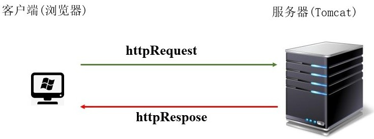
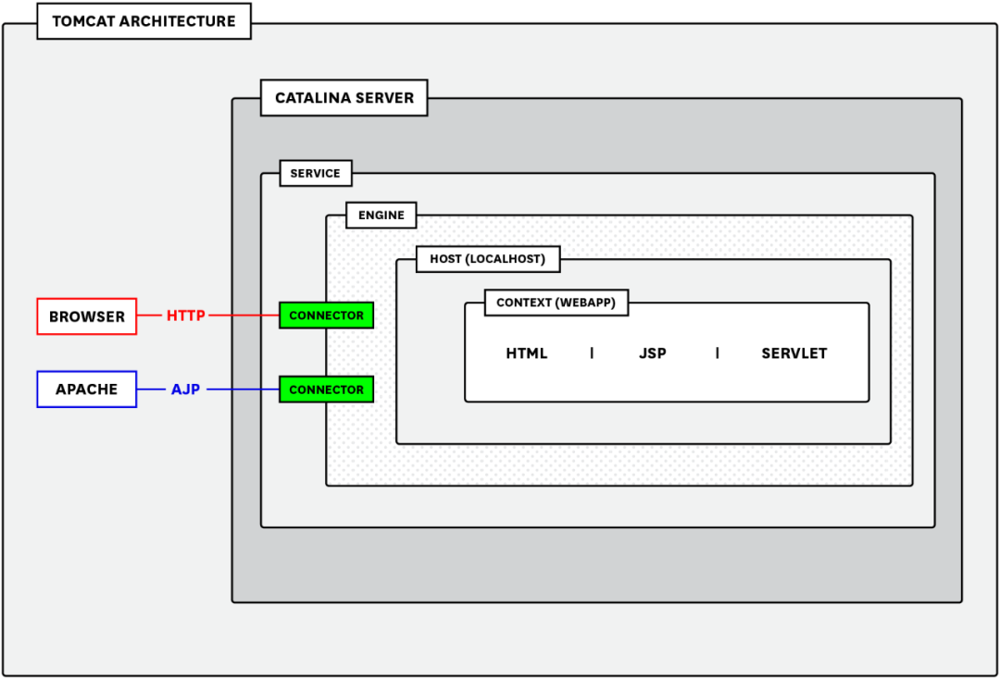

::: tip 

Tomcat 是做 Java Web 开发时部署服务最受欢迎的容器，关于它的运行机制和调优参数，本文会进行一定的整理。

:::

# Tomcat深入理解


在现在流行的互联网架构中，对一个应用来说，Tomcat 是首，SSM 是中，JVM 是尾，我们通常对于 SSM 是比较了解的，而忽略了首尾。

而 Tomcat 在网络编程中的作用是举足轻重的，但我们对 Tomcat 其实不太了解，比如：

- 如果我们能弄清楚 Tomcat 和 Socket、TCP 之间的关系，我们就能明白为什么 Tomcat 会出现端口冲突。
- 如果我们能准确的知道 Tomcat 中部署一个项目的 n 种方式，那么就能在工作中更加得心应手。
- Tomcat 中 **热部署** 和 **热加载** 的区别是什么，到底是如何实现的，弄明白它的实现原理，能很大程度上提高 Tomcat 的运行效率。
- 清楚 Tomcat 到底是如何处理一个请求的，有利于我们针对 Tomcat 进行性能调优。
- 目前的 Spring Boot 和 Dubbo 等框架中都是使用的内嵌 Tomcat，那么一个内嵌的 Tomcat 到底是如何运行的。
- Tomcat 的架构设计其实非常优秀的，如果能明白 Tomcat 为什么要那么设计，那么对于 Tomcat 的原理和自己的架构设计思维都能有很大提升。
- JSP 虽然过时，但是它的底层实现原理和思路依然保存着，那么 Tomcat 中到底是如何实现 JSP 功能的？

在说 Tomcat 之前，我们得先回顾一下 Java Web

## Java Web

Java Web 就是使用 Java 来编写浏览器可以访问的程序内容。

Java Web 包括 web 服务器和 web 客户端两个部分。

applet 程序是最早的 Java Web 客户端应用，目前已经过时。Servlet，jsp和第三方框架等是 Java Web的服务端应用。

Java Web 开发基于请求和响应，并且请求和响应是成对出现的：

- 请求：浏览器(客户端)向服务器发送信息
- 响应：服务器向客户端回送信息



## Web 资源种类

**Web 资源**：放在 互联网上供外界访问的文件或程序。

而根据 Web 资源呈现的不同效果和不同的原理，我们一般将 Web 资源划分为 **静态资源** 和 **动态资源**。

- **静态 Web 资源**：固定不变数据文件（静态网页 HTML、CSS文件、文本、音频、视频）
- **静态 Web 技术**：HTML+CSS+JavaScript
- **动态 Web 资源**：一段程序运行后，生成的数据文件
- **动态 Web 技术**：servlet，jsp，php， .net ，ruby、python等等

## Tomcat 服务器

Tomcat 就是一种由 Java 开发的开源小型 Web 服务器，免费，主要用于中小型 Web 项目，它还是一个满足 Servlet 和 jsp 等少量 javaEE 规范的容器。

那么想一想，Tomcat 和我们的 Web 应用是什么关系？

从感性上来说，我们一般需要把 Web 应用打成 war 包部署到 Tomcat 中，在我们的 Web 应用中，我们要指明 url 被哪个类的哪个方法所处理（不论是原始的 Servlet 开发，还是现在流行的 Spring MVC 都必须指明）。

由于我们的 Web 应用是运行在 Tomcat 中，那么显然，请求必定是先到达 Tomcat 的，而 Tomcat 再对于请求会进行以下的处理：

### 提供 Socket 服务

Tomcat 的启动，必然是 Socket 服务，只不过它支持 HTTP 协议而已。

这里其实可以扩展思考下，Tomcat 既然是基于 Socket，那么是基于 BIO 还是 NIO 还是 AIO呢？

### 进行请求的分发

要知道一个 Tomcat 可以为多个 Web 应用提供服务，那么很显然，Tomcat 可以把 url 下发到不同的 Web 应用。

### 需要把请求和响应封装成 request / response

我们在 Web 应用这一层，可从来没有封装过 request / response 的，我们都是直接使用的，这就是因为 Tomcat 已经为我们做了封装这一步。



## Tomcat 软件目录

- **bin**：服务脚本
- **conf**：存放 Tomcat 服务器的配置文件，例如 server.xml、web.xml
- **lib**：Tomcat 启动后需要依赖的 jar 包
- **logs**：Tomcat 运行的日志文件，例如 xx.txt、xx.log
- **webapps**：是 Tomcat 文件部署的根目录
- **work**：存放 jsp 编译后的 .class 文件


## Tomcat 的配置和结构

一个经典的 Tomcat 配置文件如下所示：

```xml
<?xml version='1.0' encoding='utf-8'?>
<Server port="8005" shutdown="SHUTDOWN">
      <Listener className="org.apache.catalina.core.AprLifecycleListener" />
      <Listener className="org.apache.catalina.core.JasperListener" />
      <Listener className="org.apache.catalina.core.JreMemoryLeakPreventionListener" />
      <Listener className="org.apache.catalina.mbeans.GlobalResourcesLifecycleListener" />
      <Listener className="org.apache.catalina.core.ThreadLocalLeakPreventionListener" />

   <Service name="Catalina">
     <Connector port="8080" protocol="HTTP/1.1"
                connectionTimeout="20000"
                redirectPort="8443" />
     <Connector port="8009" protocol="AJP/1.3" redirectPort="8443" />
     <Engine name="Catalina" defaultHost="www.testwebapp.com">
       <Host name="www.testwebapp.com"  appBase="webapps"
             unpackWARs="true" autoDeploy="true">
       </Host>
     </Engine>
   </Service>
</Server>
```

我们可以看到它的结构：

- Server 组件，顶级元素，是 Tomcat 的运行实例，一个 JVM 只包含一个 Server 组件
- Listener，内置的一些监听器，可以帮我们在发生特定事件的时候起到相应的作用
- Service 组件，可以有多个，它是将 Connector 组件与 Container 组件包装组合在一起，对外提供服务。该组件中会包含多个 Connector 组件以及一个Container组件
- Connector 组件，隶属于 Service 组件，可以有多个，如这里分别监听了 HTTP/1.1协议和 AJP/1.3 协议并分别绑定两个独立端口。负责将 Socket 请求过来的数据，都封装成 Request 请求对象，同时将该请求对象传递给容器进行下一步的处理
- Engine 引擎，用来管理多个站点， 一个 Service 最多只能有一个 Engine
- Host，代表一个站点，也可以叫虚拟主机。它指定具体的服务的部署位置，如 appBase 指定了代码的部署文件夹路径，并且是否支持自动部署和自动解压 war 包
- Context ：代表一个应用程序，即为我们开发的一个 war 服务在 webapp 目录下的各个应用，或者一个 WEB-INF 目录以及下面的 web.xml 文件
- Wrapper ：每个 Wrapper 封装着一个 servlet

可以从更深层次的视角来查看架构：


## HTTP 请求的处理流程

当一个 HTTP 请求到达 Tomcat 后，所经历的大致流程如下：

1. 在用户在浏览器中点击页面进行数据请求后，Tomcat 本机默认端口 8080 接收到数据请求，被在那里监听的 Coyote HTTP/1.1 Connector 获得
2. Connector 把封装好的 Request 请求交由其所在的 Service 的 Engine 来处理，并等待 Engine 的回应
3. Engine 获得请求 `localhost/test/index.jsp` ，匹配所有的虚拟主机 Host
4. Engine 匹配到名为 `localhost` 的 Host（即使匹配不到也会把请求交给该Host处理，因为该 Host 被定义为该 Engine 的默认主机），名为 `localhost` 的 Host 获得请求 `/test/index.jsp`，匹配它所拥有的所有的Context。Host匹配到路径为 `/test` 的Context（如果匹配不到就把该请求交给路径名为 “ ”的Context 去处理）
5. path=“/test” 的 Contex t获得请求 `/index.jsp`，在它的 mapping table 中寻找出对应的 Servlet。Context匹配到 URL PATTERN 为 `*.jsp` 的 Servlet，对应于 JspServlet 类
6. 构造 **HttpServletRequest** 对象和 **HttpServletResponse** 对象，作为参数调用 JspServlet 的 doGet() 或者 doPost()，执行业务逻辑、数据存储等程序
7. Context 把执行完之后的 **HttpServletResponse** 对象返回给 Host
8. Host 把 **HttpServletResponse** 响应对象返回至 Engine
9. Engine 将 **HttpServletResponse** 响应对象返回至 Connector
10. Connector 将 **HttpServletResponse** 响应对象返回给客户端的浏览器

## Connector

Connector 是 Tomcat 的核心组件，主要参数如下：

- **maxThreads**：默认200，表示任意时刻能够并行执行的最大线程数
- **minSpareThreads**：默认值10，表示任意时刻处于running状态的线程的最小值，包括 idle 和 active 两种状态的线程
- **maxConnections**：Tomcat 能够接收和处理的并发连接的最大值，超过这个值后的连接将会被放入一个 队列中，等待有空闲线程调用。默认值 10000（NIO/NIO2）或 8192（APR/native）
- **acceptCount**：默认值100，当没有空闲线程的时候新的 TCP 请求连接都会放入一个 队列中，这个是队列的长度值，超过就直接拒绝请求了
- **connectionTimeout**：单位毫秒，超过这个值 Connector 将会释放这个 idle 的连接

Tomcat启动的时候会首先创建 minSpareThreads 个线程，然后随着负载的增加一直增加到 maxThreads，如果此时所有线程都处于 busy 状态，此后再来的 请求将会被放入队列中（最大容纳 acceptCount）直到有空闲线程来执行。当queue满了并且连接数量达到了 maxConnections，后续再连接进来的 connection 将收到 `Connection Refused` 错误。此时应该对线程池的容量做适当调整， 但也不能调整过大，防止服务器负载升高。

## Executor

它可以更好的在多个 Connector 之间控制和调度线程池的资源，也便于控制服务器的负载。它的机制和 Connector 中的默认线程池一样，使用最小和最大线程池参数控制线程个数， 并通过 maxQueueSize 控制队列的大小，如果超过了能够容纳的容量，则抛出 `RejectedExecutionException` 错误。

## 线程模型

对照下面这张图，可以比较清晰的理解 Tomcat 的 Connector 和 nio 模型：


### Acceptor

接收 socket 线程，这里虽然是基于 NIO 的 connector，但是在接收 socket 方面还是传统的 serverSocket.accept() 方式， 获得 SocketChannel 对象，然后封装在一个 Tomcat 的实现类 org.apache.tomcat.util.net.NioChannel 对象中。然后将NioChannel对象封装在一个PollerEvent对象中，并将 PollerEvent 对象压入 events queue 里。这里是个典型的 **生产者-消费者模式**，Acceptor 与 Poller 线程之间通过 queue 通信，Acceptor 是 events queue 的生产者， Poller 是 events queue 的消费者。

### Poller

Poller 线程中维护了一个 Selector 对象，NIO就是基于 Selector 来完成逻辑的。在 connector 中并不止一个 Selector， 在 socket 的读写数据时，为了控制 timeout 也有一个 Selector。可以先把 Poller 线程中维护的这个 Selector 标记为主 Selector 。Poller是NIO实现的主要线程。首先作为 events queue 的消费者， 从 queue 中取出 PollerEvent 对象，然后将此对象中的 channel 以 OP_READ 事件注册到 主 Selector 中，然后主 Selector 执行 select 操作， 遍历出可以读数据的 socket，并从 Worker 线程池中拿到可用的Worker线程，然后将 socket 传递给 Worker。

### Worker 

Worker 线程拿到 Poller 传过来的 socket 后，将 socket 封装在 SocketProcessor 对象中。然后从 Http11ConnectionHandler 中取出Http11NioProcessor 对象，从 Http11NioProcessor 中调用 CoyoteAdapter 的逻辑。

