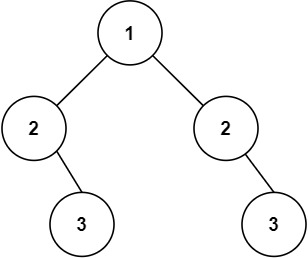

# 101.对称二叉树

**难度：容易**

给你一个二叉树的根节点 `root` ， 检查它是否轴对称。

**示例 1：**


```
输入：root = [1,2,2,3,4,4,3]  
输出：true
```

**示例 2：**



```
输入：root = [1,2,2,null,3,null,3]
输出：false
```

**提示：**

- 树中节点数目在范围 `[1, 1000]` 内
- `-100 <= Node.val <= 100`

**进阶：**你可以运用递归和迭代两种方法解决这个问题吗？

## 递归法

对于二叉树是否对称，要比较的是根节点的左子树与右子树是不是相互翻转的，理解这一点就知道了 **其实我们要比较的是两个树（这两个树是根节点的左右子树）**，所以在递归遍历的过程中，也是要同时遍历两棵树。

递归三部曲：

1. **确定递归函数的参数和返回值**

   因为我们要比较的是根节点的两个子树是否是相互翻转的，进而判断这个树是不是对称树，所以要比较的是两个树，参数自然也是左子树节点和右子树节点，返回值是bool类型。

   ```java
   bool compare(TreeNode left, TreeNode right)
   ```

2. **确定终止条件**

   要比较两个节点数值相不相同，首先要把两个节点为空的情况弄清楚！否则后面比较数值的时候就会操作空指针了。

   - 左右节点都为空，则对称，返回 `true`
   - 左右节点有一个为空，则不对称，返回 `false`

   此时已经排除掉了节点为空的情况，那么剩下的就是左右节点不为空的情况：

   - 左右节点都不为空，比较节点数值，不相同就返回 `false`

   此时左右节点不为空，且数值也不相同的情况我们也处理了。

   ```java
   if (left == null && right == null) {
       return true;
   } else if (left == null || right == null) {
       return false;
   } else if (left.val != right.val) {
       return false;
   }
   ```

3. **确定单层递归的逻辑**

   此时才进入单层递归的逻辑，单层递归的逻辑就是处理 **左右节点都不为空，且数值相同** 的情况。

   - 比较二叉树外侧是否对称：传入的是左节点的左孩子，右节点的右孩子。
   - 比较内侧是否对称，传入左节点的右孩子，右节点的左孩子。
   - 如果左右都对称就返回 `true`，有一侧不对称就返回 `false`。

   ```java
   return compare(left.left, right.right) && compare(left.right, right.left);
   ```

   如上代码中，我们可以看出使用的遍历方式，左子树左右中，右子树右左中，所以我把这个遍历顺序也称之为“后序遍历”（尽管不是严格的后序遍历）。

## 代码展示

```java
public boolean isSymmetric(TreeNode root) {
    if (root == null) {
        return true;
    }
    return compare(root.left, root.right);
}

public boolean compare(TreeNode left, TreeNode right) {
    if (left == null && right == null) {
        return true;
    } else if (left == null || right == null) {
        return false;
    } else if (left.val != right.val) {
        return false;
    }
    return compare(left.left, right.right) && compare(left.right, right.left);
}
```

时间复杂度：O(n)，其中 n 是二叉树的节点数。每一个节点恰好被遍历一次。

空间复杂度：O(1)，因为这种做法没有使用队列，所以大大降低了空间复杂度。

## 队列迭代法

首先我们引入队列，这是把递归程序改写成迭代程序的常用方法。

使用两个队列分别按照对称的顺序存储树的左半部分和右半部分的节点，然后逐一比较这些节点的值。

算法的核心逻辑：

1. 如果根节点为空，树自然是对称的，返回 `true`。
2. 初始化两个队列，分别用于存储从根节点出发的左子树和右子树的节点。
3. 同时从两个队列中取出节点进行比较：
   - 如果两个节点都为空，继续下一轮比较。
   - 如果一个节点为空而另一个不为空，树不对称，返回 `false`。
   - 如果两个节点都不为空但值不同，树不对称，返回 `false`。
   - 如果两个节点都不为空且值相同，按照对称的顺序将子节点加入相应的队列。
4. 如果两个队列都为空，则所有对称的节点都匹配成功，树是对称的，返回 `true`。

## 代码展示

```java
public boolean isSymmetric(TreeNode root) {
    // 如果根节点为空，则树自然是对称的
    if (root == null) {
        return true;
    }
    // 使用两个队列分别存储树的左半边和右半边的节点
    Deque<TreeNode> leftQueue = new LinkedList<>();
    Deque<TreeNode> rightQueue = new LinkedList<>();
    // 将根节点的左子节点加入左队列，右子节点加入右队列
    leftQueue.add(root.left);
    rightQueue.add(root.right);
    
    // 当两个队列都不为空时，循环进行
    while (!leftQueue.isEmpty() && !rightQueue.isEmpty()) {
        // 从各自队列中取出一个节点进行比较
        TreeNode left = leftQueue.poll();
        TreeNode right = rightQueue.poll();
        
        // 如果两个节点都为空，说明在这个位置上是对称的，继续下一轮循环
        if (left == null && right == null) {
            continue;
        }
        // 如果一个节点为空而另一个不为空，或者两个节点的值不相等，说明不对称，返回false
        else if (left == null || right == null || left.val != right.val) {
            return false;
        }
        // 按对称的方式将子节点加入各自的队列
        leftQueue.add(left.left);
        rightQueue.add(right.right);
        leftQueue.add(left.right);
        rightQueue.add(right.left);
    }
    // 如果所有的节点都符合对称性，返回true
    return true;
}
```

时间复杂度：O(n)，其中 n 是二叉树的节点数。每一个节点恰好被遍历一次。

空间复杂度：O(n)，最差情况下，即当树为满二叉树时，最多有 (n+1)/2 个树节点 **同时** 在 `queue` 中，故使用 O(n) 大小的额外空间。

可以考虑合并两个队列为一个队列，并成对地将节点加入队列。

这样，每次循环时取出两个节点比较，而不是分别从两个队列中各取一个节点。

这种方法减少了代码行数，同时保持了逻辑的清晰度。

```java
public boolean isSymmetric(TreeNode root) {
    // 如果根节点为空，则树自然是对称的
    if (root == null) {
        return true;
    }
    // 使用一个队列存储节点，成对地将节点加入队列
    Deque<TreeNode> queue = new LinkedList<>();
    // 成对地将根节点的左右子节点加入队列
    queue.add(root.left);
    queue.add(root.right);
    
    // 当队列不为空时，循环进行
    while (!queue.isEmpty()) {
        // 每次取出两个节点进行比较
        TreeNode left = queue.poll();
        TreeNode right = queue.poll();
        
        // 如果两个节点都为空，继续下一轮循环
        if (left == null && right == null) {
            continue;
        }
        // 如果一个节点为空而另一个不为空，或者两个节点的值不相等，说明不对称，返回false
        else if (left == null || right == null || left.val != right.val) {
            return false;
        }
        
        // 成对地将子节点加入队列，保持对称性
        queue.add(left.left);
        queue.add(right.right);
        queue.add(left.right);
        queue.add(right.left);
    }
    // 如果所有节点都符合对称性，返回true
    return true;
}
```

## 总结

针对二叉树的问题，解题之前一定要想清楚究竟是前中后序遍历，还是层序遍历。
