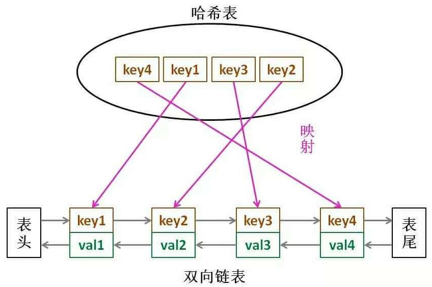

# 146.LRU缓存

**难度：中等**

请你设计并实现一个满足 [LRU (最近最少使用) 缓存](https://baike.baidu.com/item/LRU) 约束的数据结构。

实现 `LRUCache` 类：

- `LRUCache(int capacity)` 以 **正整数** 作为容量 `capacity` 初始化 LRU 缓存
- `int get(int key)` 如果关键字 `key` 存在于缓存中，则返回关键字的值，否则返回 `-1` 。
- `void put(int key, int value)` 如果关键字 `key` 已经存在，则变更其数据值 `value` ；如果不存在，则向缓存中插入该组 `key-value` 。如果插入操作导致关键字数量超过 `capacity` ，则应该 **逐出** 最久未使用的关键字。

函数 `get` 和 `put` 必须以 `O(1)` 的平均时间复杂度运行。

**示例：**

```
输入
["LRUCache", "put", "put", "get", "put", "get", "put", "get", "get", "get"]
[[2], [1, 1], [2, 2], [1], [3, 3], [2], [4, 4], [1], [3], [4]]
输出
[null, null, null, 1, null, -1, null, -1, 3, 4]

解释
LRUCache lRUCache = new LRUCache(2);
lRUCache.put(1, 1); // 缓存是 {1=1}
lRUCache.put(2, 2); // 缓存是 {1=1, 2=2}
lRUCache.get(1);    // 返回 1
lRUCache.put(3, 3); // 该操作会使得关键字 2 作废，缓存是 {1=1, 3=3}
lRUCache.get(2);    // 返回 -1 (未找到)
lRUCache.put(4, 4); // 该操作会使得关键字 1 作废，缓存是 {4=4, 3=3}
lRUCache.get(1);    // 返回 -1 (未找到)
lRUCache.get(3);    // 返回 3
lRUCache.get(4);    // 返回 4
```

**提示：**

- `1 <= capacity <= 3000`
- `0 <= key <= 10000`
- `0 <= value <= 105`
- 最多调用 `2 * 105` 次 `get` 和 `put`

## 解题思路

要让 `put` 和 `get` 方法的时间复杂度为 O(1)，我们可以总结出 `cache` 这个数据结构必要的条件：

1. 显然 `cache` 中的元素必须有序，以区分最近使用的和久未使用的数据，当容量满了之后要删除最久未使用的那个元素腾位置。
2. 我们要在 `cache` 中快速找某个 `key` 是否已存在并得到对应的 `val`；
3. 每次访问 `cache` 中的某个 `key`，需要将这个元素变为最近使用的，也就是说 `cache` 要支持在 **任意** 位置 **快速插入** 和 **快速删除** 元素。

那么，什么数据结构同时符合上述条件呢？

1. 哈希表查找快，但是数据无固定顺序；
2. 链表有顺序之分，插入删除快，但是查找慢。

所以结合一下，形成一种新的数据结构：**哈希链表 `LinkedHashMap`**。

LRU 缓存算法的核心数据结构就是哈希链表，双向链表和哈希表的结合体。这个数据结构长这样：



为什么必须要用双向链表？因为我们需要删除操作。删除一个节点不光要得到该节点本身的指针，也需要操作其前驱节点的指针，而双向链表才能支持直接查找前驱，保证删除操作的时间复杂度 O(1)。

先不慌去实现 LRU 算法的 `get` 和 `put` 方法。由于我们要同时维护一个双向链表和一个哈希表 `map`，这个时候很容易漏掉一些操作，比如说删除某个 `key` 时，在链表中删除了对应的 `Node`，但是却忘记在 `map` 中删除 `key`。

**解决这种问题的有效方法是：在这两种数据结构之间提供一层抽象 API**。

说的有点玄幻，实际上很简单，就是尽量让 LRU 的主方法 `get` 和 `put` 避免直接操作 `map` 和 `cache` 的细节，以实现解耦。

我们可以先定义双向链表的节点：

```java
// 定义双向链表的节点
class Node {
    public int key, value;
    public Node prev, next;
    public Node(int key, int value) {
        this.key = key;
        this.value = value;
    }
}
```

**注意**：在双向链表的实现中，使用一个伪头部（dummy head）和伪尾部（dummy tail）标记界限，这样在添加节点和删除节点的时候就不需要检查相邻的节点是否存在。

搭建 LRU 缓存的框架：

```java
class LRUCache {
    private HashMap<Integer, Node> map;
    // 最大容量
    private int capacity;
    // 实际大小
    private int count;
    // 虚拟头节点、尾节点
    private Node head, tail;
}
```

再实现下面几个函数用来操作双向链表：

```java
// 从双向链表中删除一个节点
public void removeNode(Node node) {
    node.prev.next = node.next;
    node.next.prev = node.prev;
}

// 添加一个节点到双向链表的头部
public void addToHead(Node node) {
    node.next = head.next;
    node.next.prev = node;
    node.prev = head;
    head.next = node;
}

// 移动一个链表内部的节点到链表头部
public void moveToHead(Node node) {
    removeNode(node);
    addToHead(node);
}
```

再实现几个函数用来提供对外接口：

```java
// 初始化LRU缓存
public LRUCache(int capacity) {
    this.capacity = capacity;
    this.count = 0;
    map = new HashMap<>();
    // 创建虚拟头节点、虚拟尾节点
    head = new Node(0, 0);
    tail = new Node(0, 0);
    // 初始化双向链表
    head.prev = null;
    head.next = tail;
    tail.prev = head;
    tail.next = null;

}

// 获取节点的值，如果节点存在于缓存中
public int get(int key) {
    if (map.get(key) != null) {
        Node node = map.get(key);
        int result = node.value;
        // 将节点移动到双向链表的头部，表示最近使用
        moveToHead(node);
        return result;
    }
    return -1; // 如果键不存在，则返回-1
}

// 放置节点或更新节点
public void put(int key, int value) {
    if (map.get(key) != null) {
        // 如果键已存在，更新其值并移动到头部
        Node node = map.get(key);
        node.value = value;
        moveToHead(node);
    } else {
        // 如果键不存在，创建新的节点
        Node node = new Node(key, value);
        if (count < capacity) {
            // 将节点放进map
        	map.put(key, node);
            // 如果当前缓存未满，直接将节点添加到头部
            addToHead(node);
            // 缓存大小更新
            count++;
        } else {
            // 如果当前缓存已满，从map中删除尾部节点（最近最少使用的节点）
            map.remove(tail.prev.key);
            // 从链表中删除尾部节点（最近最少使用的节点）
            removeNode(tail.prev);
            // 将节点放进map
        	map.put(key, node);
            // 然后添加新节点到链表头部
            addToHead(node);
        }
    }
}
```

## 完整代码

```java
class LRUCache {
    // 定义双向链表的节点
    class Node {
        int key, value;
        Node prev, next;

        public Node(int key, int value) {
            this.key = key;
            this.value = value;
        }
    }

    private HashMap<Integer, Node> map;
    private int capacity, count;
    private Node head, tail;

    public LRUCache(int capacity) {
        this.capacity = capacity;
        map = new HashMap<>();
        // 创建伪头部和伪尾部节点
        head = new Node(0, 0);
        tail = new Node(0, 0);
        // 初始化双向链表
        head.prev = null;
        head.next = tail;
        tail.prev = head;
        tail.next = null;
        count = 0;
    }

    // 从双向链表中删除一个节点
    public void removeNode(Node node) {
        node.prev.next = node.next;
        node.next.prev = node.prev;
    }

    // 添加一个节点到双向链表的头部
    public void addToHead(Node node) {
        node.next = head.next;
        node.next.prev = node;
        node.prev = head;
        head.next = node;
    }

    // 移动一个链表内部的节点到链表头部
    public void moveToHead(Node node) {
        removeNode(node);
        addToHead(node);
    }


    // 获取节点的值，如果节点存在于缓存中
    public int get(int key) {
        if (map.get(key) != null) {
            Node node = map.get(key);
            int result = node.value;
            // 移动到双向链表的头部，表示最近使用
            moveToHead(node);
            return result;
        }
        return -1; // 如果键不存在，则返回-1
    }

    // 放置或更新节点
    public void put(int key, int value) {
        if (map.get(key) != null) {
            // 如果键已存在，更新其值并移动到头部
            Node node = map.get(key);
            node.value = value;
            moveToHead(node);
        } else {
            // 如果键不存在，创建新的节点
            Node node = new Node(key, value);
            if (count < capacity) {
                // 将节点放进map
                map.put(key, node);
                // 如果当前缓存未满，直接将节点添加到头部
                addToHead(node);
                // 缓存大小更新
                count++;
            } else {
                // 如果当前缓存已满，从map中删除尾部节点（最近最少使用的节点）
                map.remove(tail.prev.key);
                // 从链表中删除尾部节点（最近最少使用的节点）
                removeNode(tail.prev);
                // 将节点放进map
                map.put(key, node);
                // 然后添加新节点到链表头部
                addToHead(node);
            }
        }
    }
}
```

时间复杂度：对于 put 和 get 都是 O(1)。

空间复杂度：O(capacity)，因为哈希表和双向链表最多存储 capacity+1 个元素。

## 总结

这个题主要就是考察 cache 的功底的，如果你有用到过 redis，那么这个就属于一个简化版的redis。 

之所以考这个题就是考察你是否理解从cache中取数据的操作方法，以及redis里的 lpush和rpush底层原理是什么，如果你去看了redis的大概原理以及源代码，那么应该能有一个很清晰的思路在里面，就算很久都没刷过这个题了，只要这个思路在，那么你就一定可以写对。

虽然实际运用和面试题并没有太多关系，因为也就是一个lpush和rpush，但是没有必要盯着这个题去背，不过背后的原理一定要弄明白，因为你在工程中用redis往里面push东西是经常用到的。
