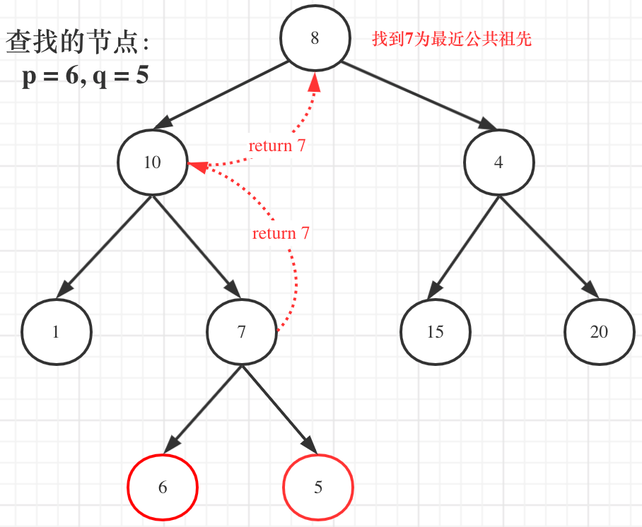

# 236.二叉树的最近公共祖先

**难度：中等**

给定一个二叉树, 找到该树中两个指定节点的最近公共祖先。

[百度百科](https://baike.baidu.com/item/最近公共祖先/8918834?fr=aladdin)中最近公共祖先的定义为：对于有根树 T 的两个节点 p、q，最近公共祖先表示为一个节点 x，满足 x 是 p、q 的祖先且 x 的深度尽可能大（**一个节点也可以是它自己的祖先**）。

**示例 1：**


```
输入：root = [3,5,1,6,2,0,8,null,null,7,4], p = 5, q = 1
输出：3
解释：节点 5 和节点 1 的最近公共祖先是节点 3 。
```

**示例 2：**


```
输入：root = [3,5,1,6,2,0,8,null,null,7,4], p = 5, q = 4
输出：5
解释：节点 5 和节点 4 的最近公共祖先是节点 5 。因为根据定义最近公共祖先节点可以为节点本身。
```

**示例 3：**

```
输入：root = [1,2], p = 1, q = 2
输出：1
```

**提示**：

- 树中节点数目在范围 `[2, 105]` 内
- `-109 <= Node.val <= 109`
- 所有 `Node.val` 互不相同
- `p != q`
- `p` 和 `q` 均存在于给定的二叉树中

## 解题思路

二叉树的很多问题都可以用递归解决。想象一下，如果我们能找到某个节点，它的左子树包含一个目标节点（指 p 或 q），右子树包含另一个目标节点，那么这个节点就是它们的最近公共祖先。

那么我们可以从根节点开始，递归地在左子树和右子树中查找这两个节点。

**递归三部曲**：

**1、确定递归函数返回值以及参数**：

需要递归函数返回值，来告诉我们是否找到节点 q 或 p，那么返回值为 boolean 类型就可以了。

但我们还要返回最近公共节点，可以利用上题目中返回值是 TreeNode，那么如果遇到 p 或 q，就把 q 或者 p返回，返回值不为空，就说明找到了 q 或者 p。

```java
TreeNode lowestCommonAncestor(TreeNode root, TreeNode p, TreeNode q)
```

**2、确定终止条件**：

如果当前节点是 `null`，直接返回 `null`

如果当前节点就是其中一个目标节点（指 p 或 q），直接返回当前节点。

代码如下：

```java
if (root == null || root == p || root == q) return root;
```

**3、确定单层递归逻辑**：

值得注意的是本题函数有返回值，是因为回溯的过程需要递归函数的返回值做判断。

**在递归函数有返回值的情况下：如果要搜索一条边，递归函数返回值不为空的时候，立刻返回，如果搜索整个树，直接用一个变量 left、right 接住返回值，这个 left、right 后续还有逻辑处理的需要，也就是回溯处理中间节点的逻辑**。

那么这个题我们需要遍历整棵树吗？直观上来看，找到一个最近公共祖先，直接一路返回是不是就可以了：



但事实上还要遍历根节点右子树（即使此时已经找到了最近公共祖先了），也就是图中的节点4、15、20。

因为上层得到返回值的时候，并不能仅仅依靠一侧的结果来判断该返回值到底代表着找到了最近公共祖先，还是只是找到了一个目标节点。

为了区分这两种情况，就必须两侧的返回值都要利用上，只有当 left 和 right 都不为空，才能说明此时 root 是最近公共节点。

这里有一种情况需要弄清楚：

比如如果要找上图中 10 和 5 的最近公共祖先，我们肯定是先找到了 10，这个时候会直接返回 10，并且不再往下遍历了。因为另一个节点，首先肯定不会出现在 10 上面了，不然我们不会来到 10 这里。而是要么在 10 这一侧下面，要么在另一侧。前者的话，10 就是公共祖先了，后者的话，更不用再查 10 的左右子树了，这是一种隐含的剪枝操作。

## 代码展示

```java
public TreeNode lowestCommonAncestor(TreeNode root, TreeNode p, TreeNode q) {
    if (root == null) return null;
    if (root == p || root == q) return root;
    
    TreeNode left = lowestCommonAncestor(root.left, p, q);
    TreeNode right = lowestCommonAncestor(root.right, p, q);
    
    if (left != null && right != null) return root;
    if (left != null && right == null) return left;
    if (left == null && right != null) return right;
    return null;
}
```

精简后：

```java
public TreeNode lowestCommonAncestor(TreeNode root, TreeNode p, TreeNode q) {
    if(root == null || root == p || root == q) return root;
    TreeNode left = lowestCommonAncestor(root.left, p, q);
    TreeNode right = lowestCommonAncestor(root.right, p, q);
    if(left == null) return right;
    if(right == null) return left;
    return root;
}
```

时间复杂度：O(n)，其中 n 为二叉树节点数；最差情况下，需要递归遍历树的所有节点。

空间复杂度：O(n)，最差情况下，递归深度达到 n ，系统使用 O(n) 大小的栈空间。

## 总结

`lowestCommonAncestor` 函数的返回值的含义：

- 对于最外层的递归调用者来说，返回值是最近公共祖先的意思。但是，在递归过程中，递归函数的返回值有多个含义，可以是空节点、节点 p、节点 q 或最近公共祖先。代码根据节点是否为空来进入不同的分支，左右子树的返回值具体是哪个节点，并不影响进入的分支。
