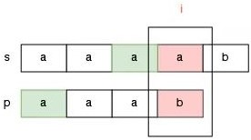
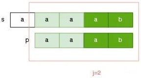
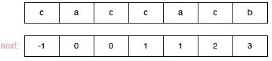
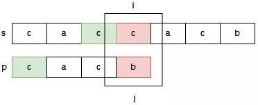
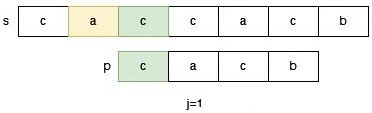
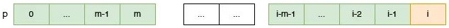

# 28.找出字符串中第一个匹配项的下标

**难度：容易**

给你两个字符串 `s` 和 `p` ，请你在 `s` 字符串中找出 `p` 字符串的第一个匹配项的下标（下标从 0 开始）。如果 `p` 不是 `s` 的一部分，则返回 `-1` 。

**示例 1：**

```
输入：s = "sadbutsad", p = "sad"
输出：0
解释："sad" 在下标 0 和 6 处匹配。
第一个匹配项的下标是 0 ，所以返回 0 。
```

**示例 2：**

```
输入：s = "leetcode", p = "leeto"
输出：-1
解释："leeto" 没有在 "leetcode" 中出现，所以返回 -1 。
```

**提示：**

- `1 <= s.length, p.length <= 104`
- `s` 和 `p` 仅由小写英文字符组成

## 解题思路（暴力匹配）

设置两个指针 `i` 和 `j`，都初始化为 0，我们对比 `s` 在 `i` 位置，`p` 在 `j` 位置的字符。

如果 `s[i] == p[j]`，那么 `i` 和 `j` 都移到下一个位置。

否则 `j` 回退到 0，`i` 回退到 1，继续上述过程，如果在下一次比较中，还是出现了不匹配的字符，那么 `j` 回退到 0，`i` 回退到 2，继续……，周而复始。

直到某一次匹配中，如果 `j` 到达越界位置，那么 `s` 包含 `p`，否则 `s` 不包含 `p`。

## 我的代码

```java
public int strStr(String s, String p) {
    int ls = s.length();
    int lp = p.length();
    int i = 0;
    int j = 0;
    while (i + lp <= ls) {
        int x = i;
        while (x < ls && j < lp && s.charAt(x) == p.charAt(j)) { // 若当前字符匹配成功
            x++;
            j++;
        }
        if (j == lp) { // 当前子串匹配成功
            return i;
        } else if (j != lp) { // 当前子串匹配失败
            i++;
            j = 0;
        }
    }
    return -1;
}
```

时间复杂度: O(n × m)，其中 n 是字符串 `s` 的长度，m 是字符串 `p` 的长度。最坏情况下我们需要将字符串 `p` 与字符串 `s` 的所有长度为 m 的子串均匹配一次。

空间复杂度: O(1)

## KMP 算法

KMP 算法是一个用来 **快速在原字符串中找到匹配字符串** 的算法。

此算法是由 Knuth，Morris 和 Pratt 这三位学者发明的，所以命名采用了他们名字的首字母 KMP。

上述的暴力匹配解法，最坏的情况下时间复杂度为 O(m ∗ n) ，而 KMP 算法的复杂度为 O(m + n)。

KMP 之所以能够在 O(m+n) 复杂度内完成查找，是因为其能在 **非完全匹配** 的情况下提取到 **有效信息** 进行 **再次利用**，以减少 **重复匹配** 的行为。

这么说似乎有点抽象，让我们从暴力匹配法存在的问题开始讲起。

### 暴力匹配法的不足

上面的暴力方法是基于这样的一个尝试的思路：

如果 `s` 中有一个子串和 `p` 是匹配的，因为任何一个子串都有一个 **开头位置**，那么这个和 `p` 匹配的子串当然也有一个 **开头位置**，又因为我们不知道哪个 **开头位置** 的子串和 `p` 是匹配的，因此我们尝试所有可能的开头。如果我们尝试完所有的 **开头位置**，都没有发现一个子串可以和 `p` 匹配，那么 `s` 中就没有一个子串和匹配，即 `s` 不包含 `p`，反之 `s` 包含 `p`。那么这个过程它为什么低效呢？我们来看一下 `s = "aaaaaaaaab"` 和 `p = "aaab"` 的匹配过程。

我们首先从开头为 0 的子串尝试，当我们发现 `s[3]` 和 `p[3]` 不匹配的时候，这说明什么？这只能说明 `s` 从 0 位置开始的子串不可能和 `p` 匹配了。


于是，我们只能放弃之前已经匹配的部分，选择下一个开始的位置，继续进行匹配。


当我们发现某一个开头的尝试已经宣告失败的时候，此时只能选择下一个开头，继续从头开始匹配。那么此时指向 `s` 的指针会回退，**之前已经匹配的部分结果完全抛弃**，从新开始，因此这个方法是低效的。

### 改进思路

如果某一次尝试失败了，那么之前已经匹配的部分（**之前做过的努力**）能否给我们提供一些帮助，加速我们的匹配过程，甚至能使得字符串 `s` 上的指针不回退呢？我们调整的时候，需要遵循什么原则呢？

如果要保证指针 `i` 不回退，那么此时我们需要调整指针 `j` 的位置，使得 `s[i]` 可以和 `p[j]` 继续比较。那么把指针 `j`  调整到哪就是一个值得思考的问题。


我们调整指针 `j` 要保证以下几个原则：

1. 毫无疑问，指针 `j` 一定要前移
2. 指针 `j` 调整以后，`s[i]` 和 `p[j]` 要继续比较，那么一定要保证 `s[i]` 和 `p[j]` 之前的部分（如果有的话）是匹配的，这是因为 `i` 不回退，如果之前的部分是不匹配的，那么后续的比较就是没有意义的
3. 指针 `j` 调整以后，**不能使我们漏掉可能的答案**

为了便于说明 `j` 的调整，下面我们举一个明显的例子。请看字符串 `s = "acacab"`，和字符串 `p = "acab"` 的匹配过程。


此时 `s[i]` 和 `p[j]` 不匹配了，那么我们需要调整指针 `j` ，我们可以把指针 `j` 调整到 `p[2]` 的位置吗？显然是不可以的，因为指针 `j` 到 `p[2]` 位置时，`s[1,2]` 和 `p[0,1]` 是不匹配的。


那么应该如何调整指针 `j` 的位置呢？我们知道，`j` 指向 `p[3]` 时 `s[0,2]` 和 `p[0,2]` 是匹配的，匹配的这一部分 `aca` 的前缀 `a` 和后缀 `a` 是匹配的，因此我们可以把指针 `j` 调整为指向 `p[1]`：


如果已经匹配的部分有多个前缀和后缀是匹配的情况，我们该怎么选择？请看 `s = "aaaab"` 和 `p = "aaab"` 的匹配过程。

此时已经匹配的部分是 `aaa`，那么这个字符串有两组前后缀匹配的情况，一种是前缀 `a` 和后缀 `a` 是匹配的：



还有一种情况是前缀 `aa` 和后缀 `aa` 匹配：


那么怎么选择呢？答案是：**选择最长的前后缀匹配**，否则可能会漏掉可能的答案。

例如，如果选择前后缀匹配长度为 1 的部分，那么指针 `j` 应该调整为 `p[1]`，此时我们得到的答案是：`aaaab` 不包含 `aaab`，因为指针 `i` 会提前到越界位置，但是 `aaaab` 不包含 `aaab` 显而易见是错误的答案。


如果选择前后缀匹配长度为 2 的部分，那么指针 `j` 应该调整到 `p[2]` 的位置，这样，我们就没有漏掉这个可能的答案：



**总结一下：**此时我们似乎找到了，保证 `s` 指针不回退的时候，`p` 的指针的调整方案，即当我们发现某一次匹配失败的时候，我们需要找出前面已经匹配部分的 **前后缀最大匹配长度**，假设为 `next`，那么我们只需要把指针 `j` 调整为指向 `p[next]`，继续进行匹配操作即可。

### next 数组

我们在进行真正的匹配之前，我们要先计算好，模式串 `p` 每一个元素的 `next` 值（`next` 值的含义就是当前元素不匹配的时候，它前面部分字符串的前后缀最大匹配长度，这个前后缀不包含自己），看下面对模式串 `caccacb` 的 `next` 值的定义过程：

- 0 位置前面没有字符串了，它不存在 `next` 的值的概念因此这位置的 `next` 值是人为规定的，我们设定它是 -1 ，是多少都无所谓。
- 1 位置前面的字符串只有一个字符 `c`，而前后缀不能包含自身，因此 1 位置的 `next` 值就是 0。
- 2 位置前面的字符串是 `ac`，它的前后缀里没有匹配的，因此这个位置的 `next` 值是 0。
- 3 位置前面的字符串是 `cac`，它的能够匹配的最长前后缀是 `c`，因此 3 位置的 `next` 值是 1。
- 4 位置前面的字符串是 `cacc`，它的能够匹配的最长前后缀是 `c`，因此 4 位置的 `next` 值是 1。
- 5 位置前面的字符串是 `cacca`，它的能够匹配的最长前后缀是 `ca`，因此 5 位置的 `next` 值是 2。
- 6 位置前面的字符中是 `caccac`，它的能够匹配的最长前后缀是 `cac`，因此 6 位置的 `next` 值是 3。



### 使用 next 数组加速匹配过程

如果我们在开始匹配之前，先得到了一个关于模式 `p` 的每一个位置 `index` 不匹配后，模式串的匹配指针应该调整为 `next[index]` 的 `next` 数组的话，那么我们的匹配过程可以变成这样：

```java
public int strStr(String s, String p) {
    int ls = s.length();
    int lp = p.length();
    int[] next = getNext(p);// 获取关于模式串 p 的 next 数组
    int i = 0;
    int j = 0;
    while (i <= ls) {// 注意边界条件
        if (i < ls && j < lp && s.charAt(i) == p.charAt(j)) {// 若当前字符匹配成功，但子串还未匹配完全
            i++;
            j++;
        } else if (j == lp) {// 若当前子串匹配成功
            return i - lp;
        } else if (j == 0) {// 如果模式串p的第一个字符p[0]和字符串s的当前字符s[i]都不匹配，
            				// 那么说明s中从i开始不可能匹配出p来，因此换下一个开头继续尝试
            i++;
        } else if (j != 0) {// 如果j位置不是0，说明它前面有匹配成功的部分，
                            // 那么此时j应该调整为next[j]的位置
            j = next[j];
        }
    }
    return -1;
}
```

`next` 数组能加速匹配过程，可以从下面两个方面来理解：

- **保证 `i` 指针不回退，指导 `j` 指针的调整**：在我们匹配失败的时候，它可以利用我们之前已经匹配的部分字符串（以前做过的努力），在保证指针 `i` 不回退的情况下，指导此时指针 `j` 应该做怎样的调整。

- **跳过了一些无需验证的可能性**：在暴力做法中，我们尝试字符串 `s` 中每一个可能的开头位置（即验证所有的可能性），而 `next` 数组指导指针 `j` 的调整，可以跳过一些根本不可能匹配出来模式串 `p` 的位置。

这两种理解是等价的。

### next 数组的正确性分析

我们举一个例子说明 `next` 数组能够指导 `j` 指针的调整，同时保证 `i` 指针不回退，并且还能跳过那些不可能的开头位置。

如下图字符串 `s = "caccacb"` 和字符串 `p = "cacb"` 的匹配过程所示。

此时我们正在尝试在 `s` 中从 0 位置开始的字符能否匹配出字符串 `p`，此时由于 `s[3] !=  p[3]`，于是根据 `next[3] = 1`，于是我们调整 `j = 1`：



当我们把 `j` 调整为 1 的时候，此时 `p[0]` 和 `s[2]` 对齐，我们在探索 `s` 中从 2 位置开始的字符串能否匹配出来 `p`，它直接跳过了 `s` 中 1 位置开始的字符串能否匹配出 `p` 的可能性。

为什么能跳过，因为 `next` 数组的 **最长匹配前后缀长度** 告诉我们 `s` 中 1 位置开始的字符串不可能匹配出来 `p`，即跳过的位置都是不可能匹配出 `p` 的位置。



为了更好的理解 `next` 数组的加速原理，我们可以尝试匹配一下 `s` 中的 1 位置开始的字符串，如下图所示。此时 `j` 需要调整为 2。我们可以看到，`j` 前面的部分 `p[0,1]` 和 `s[1,2]` 已经是不匹配的了。因此我们完全不用在意 `j` 调整为 `next[j]` 的时候所跳过的位置，因为这些位置根本不会匹配出来模式串 `p`。


### 构造 next 数组

在字符串 `p` 中，假设 `i` 位置以前的 `next` 值都求解好了，现在需要求解 `i` 位置的 `next` 值，假设 `next[i - 1] = m`，也就是 `p[0,m-1]` 和 `p[i-m-1,i-2]` 相互匹配：


首先提问，`next[i]` 有没有可能超过 `m + 1` 呢？答案是不可能。

假设 `next[i] = k`，且`k > m + 1`，那么必然存在一个长度为 `k` 的前缀 `p[0…k-1]`，和后缀 `p[i-k,i-1]` 是匹配的，那么 `p[0,k-2]` 和 `p[i-k,i-2]` 也是匹配的，即 `next[i - 1]` 可以达到 `k - 1`。

而 `k - 1` 是大于 `m` 的，和假设 `next[i - 1] = m` 矛盾，因此 `next[i]` 不会超过 `m + 1` ，即 `next[i] <= m + 1`。

得到这个前提的情况下，我们考察 `p[m]` 和 `p[i - 1]` 的关系：

- **第一种情况，`p[m] == p[i-1]`**

  

  此时 `p[0,i-1]` 中可以 **继承** 得到一个更长的匹配前缀 `p[0,m]` 和后缀 `p[i-m-1,i-1]`，显然 `next[i]` 至少是 `m + 1` ，即 `next[i] >= m + 1`。

  根据上述得到的前提 `next[i] <= m + 1`，可知此时 `next[i] = m + 1`。

- **第二种情况，`p[m] != p[i-1]`**

  

  根据上述得到的前提 `next[i] <= m + 1`，此时显然 `next[i]` 也不会等于 `m + 1` 了，也就是无法 **继承** `p[0,m]` 中的最长相同前后缀了。

  但这不代表 `next[i]` 的值就是 0 了。

  而是我们需要在`p[0,m-1]` 范围内找到一个`p[0,n]`，看看能否和 `p[i-n-1,i-1]` 匹配，此时 `0 <= n <= m`。

  我们把 `p[0,m]` 这部分当成模式串 `p`，把 `p[i-m-1,i-1]` 当成我们前面字符串模式匹配问题中的 `s` 字符串，**此时不就是关于某一次匹配失败的时候，字符串 `s` 的匹配指针不回退，如何调整模式串的匹配指针的问题吗**？

  那么我们此时让 `p[i-1]` 和 `p[next(m)]` 比较即可，匹配失败的时候，我们把 `m` 调整成 `next[m]`

  

### next 数组的代码实现

```java
public int[] getNext(String p) {
    // 构建 next 数组，数组长度为匹配串的长度（next 数组是和匹配串相关的）
    int lp = p.length();
    int[] next = new int[lp]; 
    next[0] = -1;
    if (lp > 1) {
        next[1] = 0;
        //i: 当前要求解next[i]
        //m: 始终记录next[i - 1]的值
        int i = 2;
        int m = next[i - 1];
        while (i < lp) {
            if (p.charAt(i - 1) == p.charAt(m)) {// p[m] == p[i-1]
                next[i] = m + 1;
                i++;
                m = next[i - 1];
            } else if (m == 0 && p.charAt(i - 1) != p.charAt(m)) {// p[m] != p[i-1]且前后缀没有匹配的可能
                next[i] = 0;
                i++;
            } else if (m != 0 && p.charAt(i - 1) != p.charAt(m)) {// p[m] != p[i-1]但前后缀还有匹配的可能
                m = next[m];
            } 
        }
    }
    return next;
}
```

这就是整个 `next` 数组的构建过程，时间复杂度和空间复杂度均为 O(lp)。

### KMP 算法的完整代码

```java
public int strStr(String s, String p) {
    int ls = s.length();
    int lp = p.length();
    int[] next = getNext(p);// 获取关于模式串 p 的 next 数组
    int i = 0;
    int j = 0;
    while (i <= ls) {
        if (i < ls && j < lp && s.charAt(i) == p.charAt(j)) {// 若当前字符匹配成功
            i++;
            j++;
        } else if (j == lp) {
            return i - lp;
        } else if (j == 0) {
            i++;
        } else if (j != 0) {
            j = next[j];
        }
    }
    return -1;
}

public int[] getNext(String p) {
    // 构建 next 数组，数组长度为匹配串的长度（next 数组是和匹配串相关的）
    int lp = p.length();
    int[] next = new int[lp];
    next[0] = -1;
    if (lp > 1) {
        next[1] = 0;
        //i: 当前要求解next[i]
        //m: cn始终记录next[i - 1]的值
        int i = 2;
        int m = next[i - 1];
        while (i < lp) {
            if (p.charAt(i - 1) == p.charAt(m)) {// p[m] == p[i-1]
                next[i] = m + 1;
                i++;
                m = next[i - 1];
            } else if (m == 0 && p.charAt(i - 1) != p.charAt(m)) {// p[m] != p[i-1]且前后缀没有匹配的可能
                next[i] = 0;
                i++;
            } else if (m != 0 && p.charAt(i - 1) != p.charAt(m)) {// p[m] != p[i-1]但前后缀还有匹配的可能
                m = next[m];
            } 
        }
    }
    return next;
}
```

时间复杂度: O(n+m)

空间复杂度: O(m)

## 总结

KMP 算法的应用范围要比 Manacher 算法广，Manacher 算法只能应用于「回文串」问题，相对比较局限，而「子串匹配」问题还是十分常见的。

背过这样的算法的意义在于：相当于大脑里有了一个时间复杂度为 O(n) 的 api 可以使用，这个 api 传入一个原串和匹配串，返回匹配串在原串的位置。
