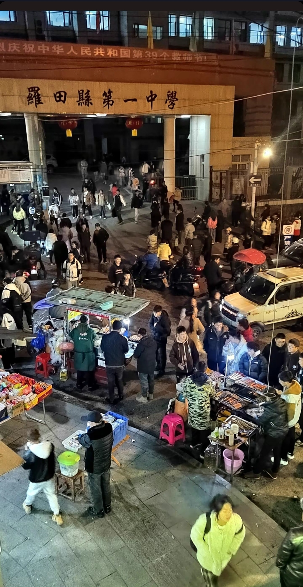

# 一遇风陵渡

半年前迷上狼人杀，它成了我在北京程式化生活里，一块难得的飞地。

过年回罗田，我索性找了家藏在老城街角的桌游店，让老板帮忙拼个局。纯陌生人的场子，对我来说，还是头一回。

店招旧得发暗，推门进去是昏黄的暖光，满屋子都是热闹的人声。老板拽来一把椅子，把我补进了局里。小地方自有它的好，不必死守规矩，能痛痛快快地玩一场，就够了。

桌上大半是新手，我本就不是冲着输赢来的，只需顺着节奏发言、盘逻辑，倒也轻松愉快。直到第三局，我才真正听清右手边那个声音。

她叫溪。

轮到她发言，指尖轻轻敲着桌面，利落的鲻鱼头垂下来，发间几缕浅蓝挑染，在暖黄的灯光里若隐若现。小巧的耳夹坠在耳尖，衬得脖颈线条干净清爽。开口是淡淡的烟嗓，不沙哑，只裹着点漫不经心的飒爽。逻辑清晰，语气从容，她像牌桌上不动声色的那个支点。

同队时，我们默契拉满；对立阵营时，也能毫无顾忌地针锋相对。

几轮博弈下来，对局里的刀光剑影失了味，我脑子里冒出一个念头：我想认识她。

散场时，我攥了攥手机，以日后组局为由朝她走去。活了二十五年，我极少这样主动，可那一刻，我只觉得就该这样。

巧的是，我们几乎在同一秒，朝对方亮出了自己的二维码，有趣。

夜里的闲聊，意外地合拍。没有刻意找话题的尴尬，只有话头自然地延伸。一个梗能接住，一个观点能拆开聊，连对方话里没说完的后半句，都能精准地懂。那不是暧昧上头的悸动，是我在北京挤了无数次地铁、改了无数版方案后，从未有过的松弛。

直到聊到年龄，我的手猛地一顿——她十八，刚上大学，像一卷才拆封的画纸，聊着迎新周的乌龙、社团的趣事，指尖轻快地敲着屏幕。我二十五，初入职场，适应着钢铁丛林的规则，对话框的上方，正弹出一条项目评审的日程提醒。

屏幕的光映在脸上，白日里昏黄灯光模糊掉的年岁差距，在这一刻骤然清晰。七年，这不是一个冰冷的数字，是一整个被社会打磨过的青春。

我为这年龄的差距清醒犯怵，可第二天，我还是鬼使神差地约了溪见面。她爽快地推掉了下午的安排，准时赴约。

聊下去才发现，我们在这座小城里，走过了几乎一模一样的路径：实中的重点班、各种预录考试、一中的实验班。那些共同的记忆像一条暗线，把对话拉得更深。

十八岁的她笑着说这是缘分，可二十五岁的我心里清楚，这座小城的初高中本就寥寥，所谓的路径重合，概率从来都不算小。

可看着对面眼睛发亮的她，我还是有一瞬间的恍惚 —— 仿佛坐着的，是七年前那个更锋利、更鲜活的自己。

多出来的七年阅历，给了我恰到好处的分寸：知道奶茶该点一杯冰的、一杯温的，明白有些心思不必宣之于口，懂得把欣赏放在妥帖的位置，更清楚什么话该说、什么对白该停，什么时候该往前一步，什么阶段该留白。

我不得不承认，心底藏着私心。我当真缺一个游戏搭子吗？我一年又能回罗田几次？那些都不过是体面的借口。她不符合我对未来的所有现实考量，可我还是忍不住想和她建立联结。是欣赏？是新鲜感？还是在她身上，照见了我残存无多的少年气？我说不清。

理性劝人不要沉溺；感性却偏要生出几分微弱的幻想。

聊得尽兴，可细细算来，或许连深交的朋友都算不上。时间太短，距离太远，那些翻涌的念头，终究会被现实冲淡。

所以，我决定为这段插曲落下文字的注脚，这近乎一种抵抗——抵抗它被风吹散，最终落得个了无痕迹。

我想起《神雕侠侣》里的郭襄。十六岁的她，在风陵渡口初遇杨过，一见倾心，误了半生。

那时的杨过，早已不是当年在全真教受欺、满身棱角的桀骜少年。历经江湖风雨、生死别离，他早已沉淀为行事洒脱、名动天下的神雕大侠。郭襄遇见的，是被岁月打磨过后，最耀眼的他。

她崇拜他的侠气，心疼他的过往，甚至遗憾到：“可惜我迟生了二十年。若早生二十年，在全真教外收留那个受人欺侮的小杨过，陪他长大，他心里的人，或许就不会是小龙女。”

可她不知道，他们之间真正隔着的，从来不是二十年的光阴，是那二十年里，他走过的风霜、受过的磨砺、摔过的跟头。若真回到二十年前，她遇见的，不过是一个敏感叛逆、四处碰壁的少年郎，哪里会生出什么倾慕。

我在想，溪眼里那个有趣、从容、有分寸的我，身上是不是也覆盖着这七年时光镀上的光晕呢？

七年前的那个人，他何尝不是一个愣头青。幼稚、怯懦、急于向世界证明自己，和那个在全真教里四处受挫的少年，没什么两样。那样的你我，大概也只是更加“不合时宜”的陌生人。

而此刻二十五岁的我，褪去了青涩，多了几分从容，才得以在这座小城里，拥有这段轻盈的交集。七年，没有把我变成另一个人，只是让我更自在地成为自己。

风陵渡口的相遇，误不了终身。

它只是两个刚好行至渡口的人，在交错的瞬间，互相照见了彼此的光。时光不可逆，岁月难回头，哪怕我们终将顺着河流，去往不同的远方。

但至少，这一刻相遇过。