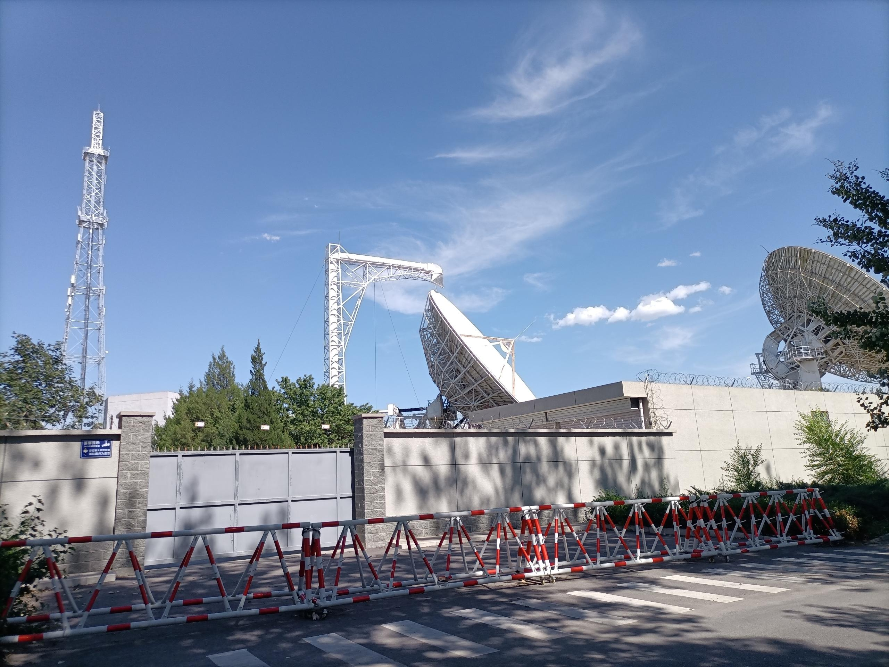

# 三体和蚁族

落脚这间不到20平的出租屋，“家”这个字总有点硌。它更像一个坐标——离公司3.6公里，是我每晚必须抵达的终点。

跟同事下班道别，“我先回家了哈”，还是脱口而出了。谁叫“回家”这个词太让人贪恋了呢，哪怕只是一个巴掌大的地方，这个词里似乎也裹着点模糊的暖意，可以融化一点早出晚归的冻霜。

我和合租的两个男孩碰面不多，只在客厅的冰箱里陈列着彼此的日常：A码得整齐的鸡蛋，B凝着水珠的啤酒，角落里是我采购的三明治。一种井水不犯河水的和谐，偏偏滋长出几分安顿感。当然，合同的期限、房东的钥匙，都时刻提醒着我：此地难以久留。

周末独自从影院回来，车子缓缓驶入京郊的夜色。后座的情侣和我年龄相仿，四个陌生人在方寸之地里不自觉地搭起话来。

北京太大了，孤单久了，谁也忍不住要和陌生人聊上几句。巧了，一问职业，连开车的大哥，清一色的程序员——得，这就是五环外的社交盲盒，开出来的多半都是同行。

行程将尽，司机师傅瞥了眼导航，忽然“哦”了一声：“这地方眼熟啊，好像拍过电视剧！”

我心里一动，那些昼夜静立的巨大天线几乎是这一带的地标：“《三体》对吧？这卫星站可是真取过景！……”

他摇摇头，语气带着点忆旧的肯定：“《三体》？没印象。我说的是《蚁族的奋斗》——就前些年讲合租、讲地下室、讲年轻人在北京打拼那部，拍的可不就是这儿么。”

