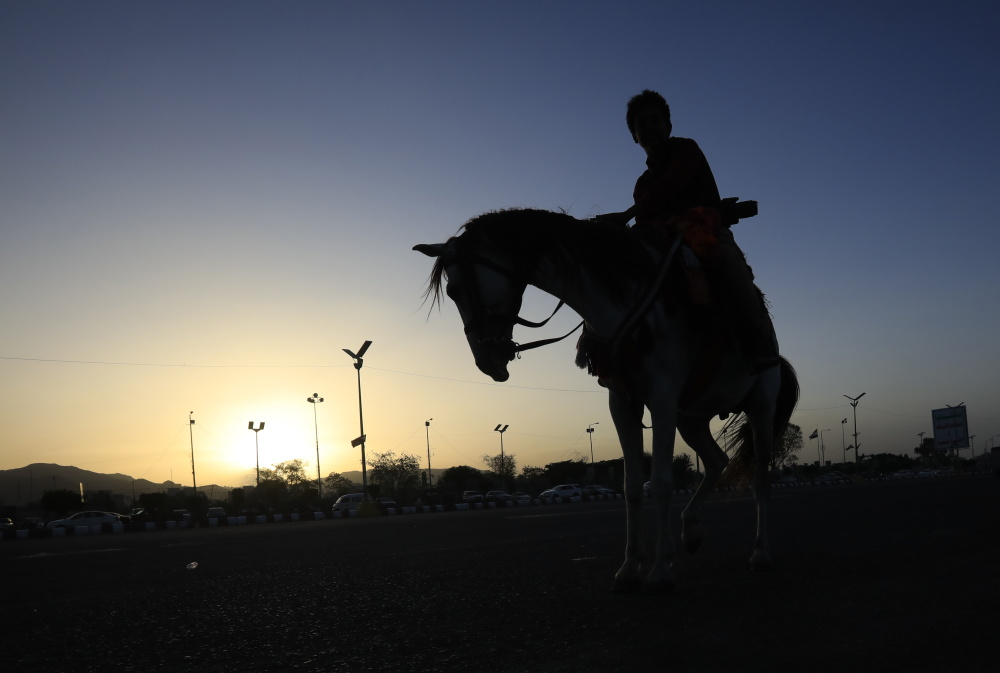

# 京城夜奔

土井东的马路窄了很多年，上个月市政的扩宽计划获批，只是眨眼的功夫，道路两岸的梧桐便被砍了个一干二净，工业机器在效率上的碾压，比年轮的生长要迅猛得多。

失去了绿荫覆盖的柏油路，只剩下一排被掏空的树桩。大兴的客机时常从头顶掠过，我偶尔会想，从高空俯瞰的人，会不会注意到这里出现了一条像手术缝线般的暗疤。

下班后的夜里，我常在这条路上骑车漫游。这里靠近昌平，既不繁华，也没有高楼大厦，倒与我的家乡有几分相似。夜里住户灯火次第亮起，街道上老人围坐打牌，小夫妻推着婴儿车散步——这样的景象让我一度忘了，这里其实从不是什么小城，只是北京罕见的一点安稳。

夏夜的晚风再没有可以吹动的林梢，让自行车链条的吱呀缺少了很多生动。

一个人的夜行，我总想象自己是在风雪中穿山越岭的林冲，伴随着外公收音机里的昆曲，在悲愤中婉转高歌：“遥瞻残月，暗度重关，奔走荒郊”。林冲的孤苦多于悲愤，儿时只觉情节过瘾，许多年后，才明白这故事是在讲一个人怎么竭力逃出去，怎么拼命活下来。

而这也是我们所有人的故事，奔命于风雪的山道，在黑暗的掩护下落荒而逃。

想借月色回家，却发现道路一段比一段颠簸。大概是运渣车日夜碾压，新铺的柏油被撕裂出无数裂纹，犬牙交错，在车灯下像一道道愈合不良的伤口。

正想着，忽然听见一声干脆的爆鸣——是一块翘起的路缝，从后轮上野蛮地掠过，将我那林冲夜奔的幻梦撕了个粉碎。

只好把车停在一个树桩旁，那棵树曾在夏天落下一地阴影，如今只剩一个空洞的根。

也许人生大抵如此——骑着一辆随时会爆胎的旧车，在不算光亮的路上小心往前，各自趟过自己的风雪山道。
