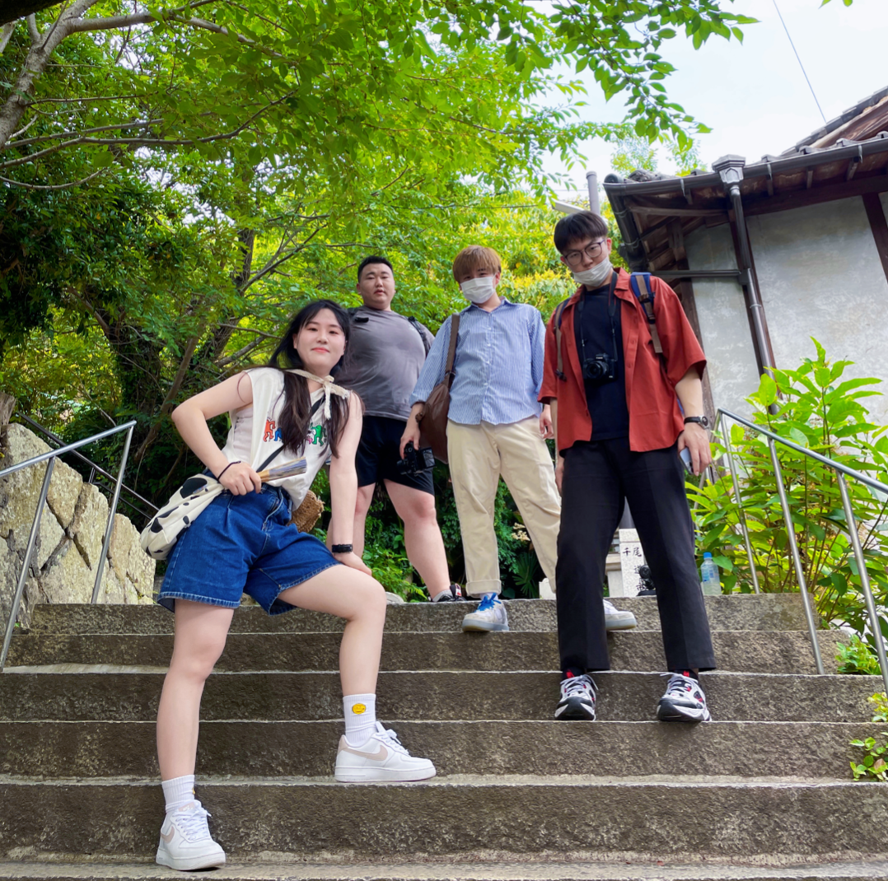

# 人间烟火气

去年冬天，我经常一个人在空荡荡的实验室里。

白天改论文，晚上健身，一个人吃饭，一个人回宿舍。那段时间，武汉还没开始下雪，但夜幕已经来得很早了。毕业、工作、去留、感情，全挤在同一个时间点上，像几条线拽着我往不同的方向走，我却哪一条都抓不稳。

也是在那段时间，我刷到了《平平出击》。

一开始，我以为你们是那种“条件很好，所以可以到处吃、到处玩”的团队。后来才慢慢发现，其实不是。你们和我一样，都是很普通的学生，日子有时候甚至有点紧巴，需要在日本不停兼职，算着钱过生活。

真正把我击中的，并不是探店有多新奇，而是你们在一起的状态。

你们唠嗑、互损、玩闹，接得住彼此的梗，有一种我很羡慕的松弛。平平的剪辑和介绍很用心，通哥看着五大三粗，吃东西却很文雅；辣魔对辣几乎免疫，说话还总能押韵，哪怕在东北人里，也显得格外有趣。你们的关系像《老友记》，也像《爱情公寓》，只是那些细碎却鲜活的细节，让我确信——这不是剧本，不是被设计过的情绪，而是确实发生在当下的生活。

你们能把一顿看起来再普通不过的饭，吃得很热闹；能因为买到打折促销的便当，真心觉得幸运。日子不算宽裕，却总能彼此打气、发笑。那种状态，在当时对我来说，真的很接地气，也很有生命力。

它不是告诉你“未来一定会更好”，而是让你意识到：哪怕现在不顺，生活也仍然可以被好好对待。不是等成功了才配快乐，而是人在一起，日子本身就能亮一点。

半年前，我和辣魔连麦聊天，问他是留在武汉好还是去北京好。那时我心里其实已有答案，只是不太敢承认。昨天再次连麦，话题轻松了不少，回首这半年，我知道我已经站在答案里了。

在北京，一个人租房，一个人下班，一个人回家。日子并不轻松，但也没有想象中那么冷。至少我明白，世界上有人正过着和我相似的生活。不是每个人都能活成传奇，但总有人能把普通日子过得不潦草。

这就够了。

谢谢你们把这样的生活展示出来。它不吵闹，不耀眼，却在我最迷茫的时候，给了我一点确定感——原来，平平安安地活着，本身就是一件值得认真对待的事。
