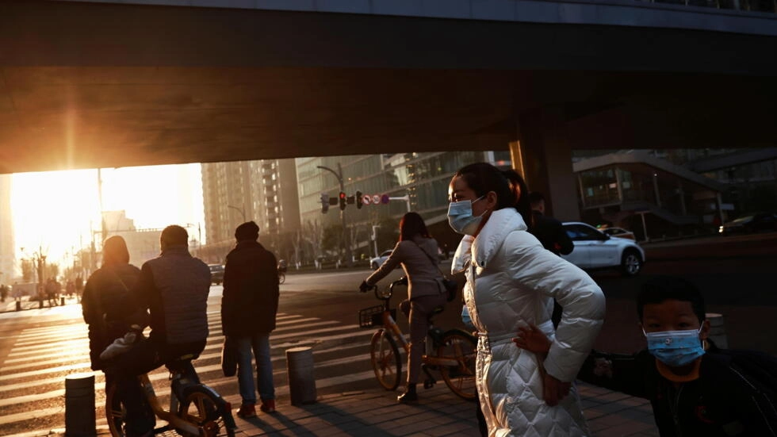

# 保护好眼睛

武汉的天气越发寒冷，街道上此起彼伏的咳嗽声，让人们脸上的口罩裹得更紧了些。

 “很幸运，不是青光眼！”接过病历，我心中的石头总算是落了地。半个月前第一次就诊时，黎医生让我“要积极地面对这个世界”的声音，犹在耳畔。

尽管该死的校医院没能仁慈地给我开出一份转诊单，但赎回了身体健康的好消息，也就接受了这次破财，笑纳了这份消灾，毕竟，虚惊一场已是万分难得。 

跋涉回学校已经到了半夜，寒风阵阵，东门外的小摊，却依然灯光明亮，让我感觉到些许安心和舒适。卖小吃的夫妻俩看起来毫无困意，我才知道，原来深夜醒着的人也可以这样气色不错。

“吃点什么？”“给我来个烤饼吧”，其实，我是想蹭一下那炉火的热气。 

乐呵的阿姨往炉子里添着柴，清扫着锅底阵阵下落的白灰。升腾的烟气里，我感觉人生就像这釜底之薪，越是用力，燃得越快，直到烧成灰烬，寥寥结束自己的使命，只剩下短短的尸体。 

早听人说，二十多岁的时候，身体就会给你一个陪伴终生的debuff，过去总是惶恐，但当这件事真正近在“眼前”的时候，我反而释然。尽管余生不想再有机会和黎医生重逢，但他真诚的告别词我可能还要记一阵子：人生苦短，在短暂的时间里，该做些什么，赶紧的。

