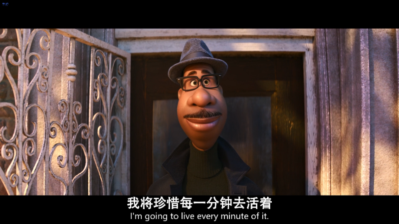

<!---->

# 元旦

如果今天的武汉没有飘起雪花，我都不会意识到，原来我们真的已经来到了2020年的最后几天。 

不知道从什么时候开始，即使到了年末，周围的朋友们已经不再对新的一年充满期待了。 

也许是每个人心里都清楚，元旦过后，除了日历会变成2021开头，其余的一切不会有任何变化。 这一年喜欢熬夜的我们，下一年还是会继续熬，拖延症晚期不会因为跨了个年就治好，新学期很可能要继续在深夜里赶项目进度，说了很多次要脱单的我们，好像也依旧享受着一个人的自由生活。 

大家似乎已经习惯了把去年的东西，通通带入下一年，无论是坏习惯，丧情绪，过期的物品，未兑现的车票，还是已经离开的人。 

不怪我们，“除旧迎新”这四个字，从来没有嘴上说起来那么简单。 

何况，今年的一切似乎都是糟糕的，封城、隔离、停工停学、科比的陨落、冲天的大火......但朋友告诉我，他觉得这不完全是一件坏事。 

“这起码说明你身处的时代不是特别平庸的，不是一成不变的，你正在目睹一个历史的转折点。” 

这是一种很乐观，但也很奇妙的体会。一件事的全貌到底是怎样的，或许只取决于你自己想从哪个角度去思考。2020的草草结束，其实也意味着2021的全新开始。 

晚上，雪已经停了。开完几个小时的会，在难得的闲暇里，我重温着李诞在脱口秀大会上的开场白，也回顾着过往一年自己遇到的人，做过的决定和选择。 

有人问李诞对这一年的感受，他的公司这一年丑闻不断，公演夭折，团队解散，台下的人们鼓着掌，等着看他的笑话。 

“It's a tough year（这是艰难的一年）.”

 “Yes，but the show must go on .” 

明明几个月前已经看到过这个桥段，也听到过这个回答了，但直到这一秒，我似乎才真正读懂了它…… 

抬起头，已是热泪盈眶。

