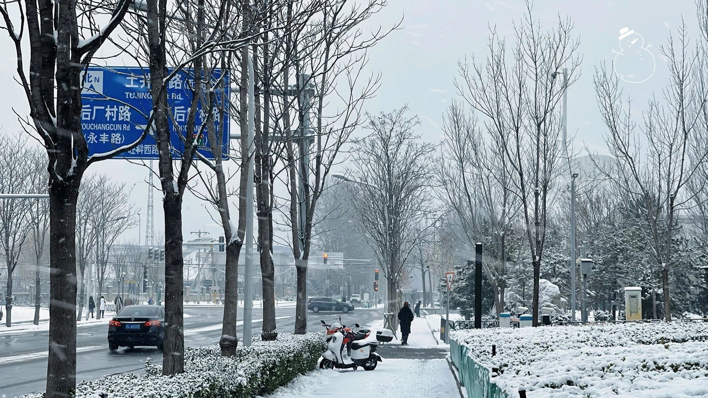

# 入冬之前

家里的厨房一直没有装热水器。

父母并不是没想过，只是每次提起，总会被他们自己压下去。冬天的自来水冷得很，洗菜洗碗都要快些，可他们说，忍一忍就过去了。忍，是他们这辈人最早学会、也最难放下的本事。参加工作后，我心里一直惦记着这件事，想着入冬前总要把它补上。不是多贵的东西，只是希望他们在厨房里能舒服一点。

可还没等我开口，他们已经自己买好了。在家庭群看到照片的一瞬间，我就知道不对劲了。

电话打过去的时候，父亲先接了。他说是店里的人推荐的，看着和正品差不多，也便宜些。父亲说这话时语速有点慢，像是在回忆当时的情景，又像是在反复确认。母亲在一旁接话，说退换太麻烦了，先用着也没什么。她讲得很快，像是只要停下来，这件事就会变得难以承认。

我坚持要退。“这个关系安全，不能将就。”母亲拗不过我，只能答应。之后的事，便顺理成章：下单、联系师傅，一件件都落了地。装好那天，他们发来一段视频，热水从龙头里流下来，冒着白气，厨房看起来终于不那么冷了。

事情办妥，我也就没再多想。

直到那天晚上，父亲在电话里忽然说了一句：“早知道你会这么操心，就不让你看到那个照片了。”

他说得很轻，像是随口一提，我却一下子明白了——那不是对我的埋怨，更像是对自己的责怪。怪自己买错了东西，怪自己让孩子费心，怪自己好像……不再像从前那样，能把这些事办妥。

也许，角色的更替就是这样发生的。没有仪式，也没有掌声，只是在某一天，一些从前由他们做主的事，悄悄落到了你手里。

“热水器用起来挺不错的，水温刚刚好”，母亲说这话时，我几乎能想象出那间厨房的样子：水声低低地响着，雾气贴着窗沿升起，她的动作也不再着急。

挂断电话，才发现北京开始下雪了。雪不大，风却已经起来，我起身关上窗，把夜色和风声一并留在了外面。
