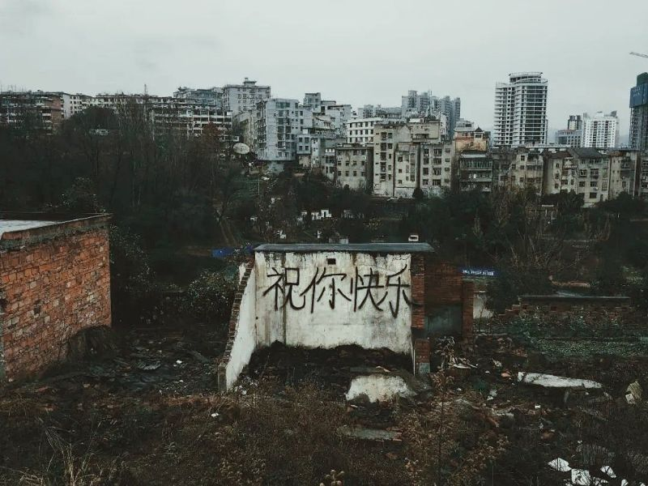

<!---->

# 关于受害者有罪论

受害者有罪的言论向来招人反感。但换个角度来看，这部分人未必是真的希望“受害者有罪”，而是为了从侧面证明“无罪者不会受害”。而这，却恰恰是广大守法者内心深处对这个社会的原始诉求和美好期望。 

看私矛盾的理论却能有着相同的内核，感性和理性的交织有时也会产生出奇的统一性。可我无从知晓，世间究竟还有多少动人的心意和美妙的思考，在开口的一瞬间，就化做了一地的误解和争吵。
