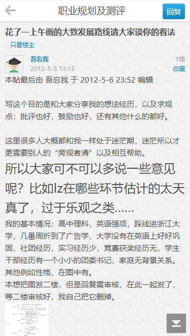
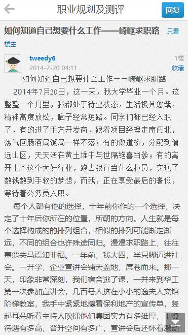
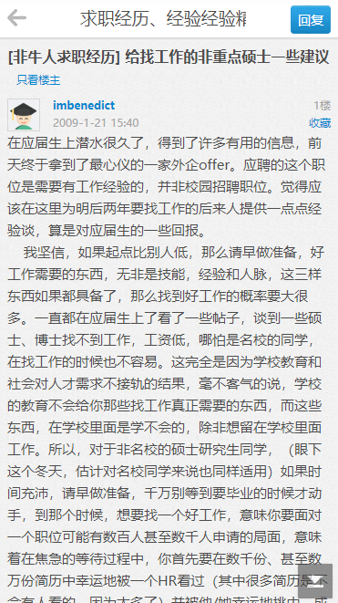

# 十年前的论坛

最近几天在学习有关“五险一金”、“就业协议”的知识。 

以前总觉得就业离自己还很远，以为到了某个时刻，自然而然地就会了解到这些社会游戏的规则和玩法。

而今毕业将至，复杂的薪资体系摆在面前，我竟发现自己全然不懂这些社会常识，“天真”恐怕是大学生的通病。

面对着在社会上摸爬滚打多年的招聘者，我这种初出茅庐的新兵蛋子，怕是很容易掉进他们的陷阱。

网上找资料的时候，意外寻到一个应届生求职论坛，不过已经很久没有内容更新了，多数帖子的发布时间，定格在了10年前。

那时候，社交网络正在腾飞，许多帖子的文本里夹杂着当年的流行语，读来饶有些复古的趣味。

有人窥见市场经济的转型，着手进军互联网；有人逃离土木的黄昏年代，等待着公务员的入职；有人在读研和就业间犹豫，感慨2014是不是未来最难的一年……

岁月变迁，很多帖子的已经不具备参考意义，但是仍能窥见那个时代背景下知识分子们的热忱和迷茫。

在论坛里“朝花夕拾”，时不时还能碰到失意者的诉苦，其描述的郁闷和无奈，竟和10年后的我们这一代如出一辙，别无二致。

和过去的年轻人心境相通的那一刻，颇为奇妙，也让我感到安慰。仿佛有人在时间长河的另一头，将他的人生经验娓娓道来，并拍着你的肩膀：“看吧，当年我也一样郁闷”。

我想，这就是写作的意义吧。阅读着有温度的文章，哪怕我和作者相隔了近十年，始终，见字如面。

