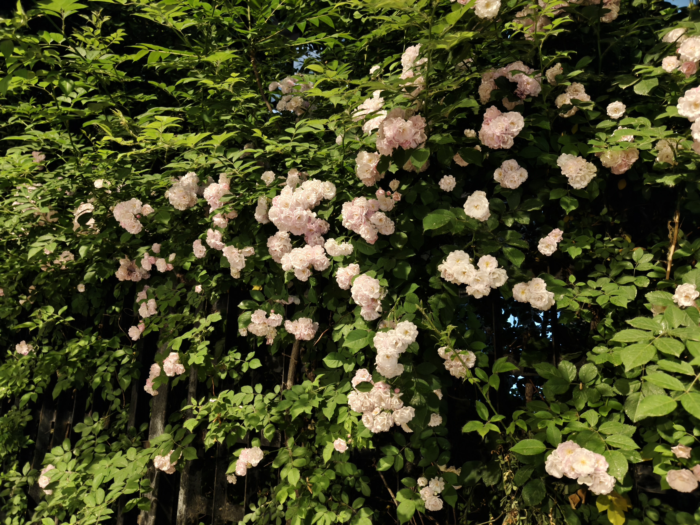

# 另一句话

“沟通成本高，产出不稳定”，打印机的墨迹早已干透，几行字却凉飕飕的。“我想想怎么改进。”我带上了门，那几行字却没有留在办公室里。

那时北京刚入春，楼下的白玉兰次第开放，爬山虎一点点爬上围墙，风里带着草木返青的气息。整个世界都在舒展，只有我像被什么困在身体里。

我害怕糟糕的绩效，害怕无望的晋升，害怕银行卡里的数字停下来……那些我以为已经翻篇的恐惧，其实只是化作了沉底的暗礁，一句评价，就足以让它们重新浮上来，把人从“还行”拖到“不行”，从“不行”拖到“无处可去”。

和朋友在书店散心。“职场与成功学”专区，书架被塞得满满当当：《向上管理》《高效沟通》……封面上的字很用力，催人成长，催人赢。还没抽出一本，我的心里先感到了一阵疲惫。

我已经太熟悉“如何赢”了。这些年，考试、升学、工作，我一路都在尝试成为那个被留下的人，可我好像从没学过，输了以后怎么办。难道真的只要掌握了足够多的方法，就永远不会从牌桌上掉下去吗？

《当下的力量》说：把心收回来，专注眼前。道理并不难，句句正确，却句句离我很远。想起去年年底，我常说大不了回家，大不了从头再来。可那些轻飘飘的“大不了”，现在竟不知道到底是说给谁听的。

转眼七月，公司角落里多了个写作业的小女孩。她缩在桌前，面前摊着一张皱巴巴的试卷。铅笔停了很久，她低声问身旁的妈妈：“我是不是很没用？”

“我不许你这样想。你很重要，你考多少分，妈妈都爱你。”

我端着水杯，有些走不动道。过去，我总以为考砸了，天就会塌下来。长大以后，试卷消失了，分数却没有。它换成了工资，换成了绩效，换成了别人谈起我时那句轻描淡写的“他还不错”……

前些天，我对女朋友说：“来北京看看吧。”

过去半年，我常去大连。沿着栈道漫步，海风迎面吹来，视野也渐渐铺开。在北京拧成一团的情绪，到了那里，总会松开不少。

她也在那里。

我总觉得，北京没什么值得她特地折腾一趟，这里只有工位、绩效和那些没完没了的担忧。可说着说着，心里却总会冒出另一句话：那我值得别人为我而来吗？

“你当然值得！”

看着屏幕，我笑了一下。

海淀的春天其实早已过去，树木长得浓密，蝉声落满下班后的林荫道。晚高峰的地铁依旧拥挤，工作还是一样的忙，老板的评价没有被撤回，我也没有变成一个多么妥当的大人。北京，还是那个北京。

只是这个七月，生活里多了一场等待。有人正从另一座城市出发，为我而来。