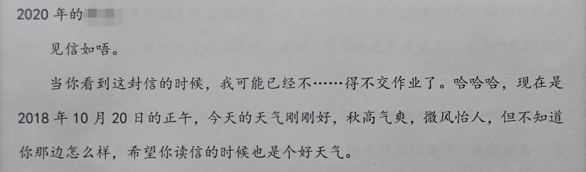
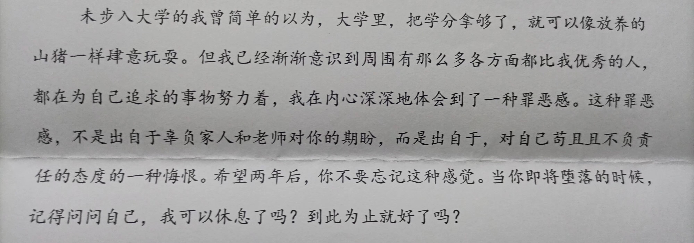

<!---->

# 四年前的信

收拾东西时，翻到刚进校园时给两年后的自己写的信，牛皮纸的朴素信封，上面还郑重地贴着8分钱买的邮票。 

文字似乎对人总会有种潜移默化的魔力，无形中推着每个人往自己理想的方向蜗行摸索。 

转眼快四年了，尽管仍有遗憾，但很幸运的是，自己并没有成为我曾讨厌的那种人。 

深刻的思辨和反省，读来仍然令我心惊肉跳，忍不住大吸几口冷气。

东方欲晓，莫道君行早，属于我的革命还未完全成功，以后的日子必将更加努力。
