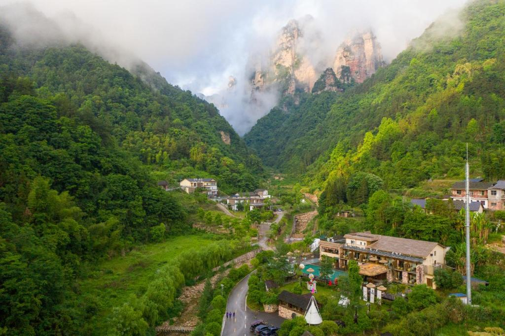

<!---->

# 回家散心

朋友说，越长大越觉得自己像条长江鲟鱼，无论游多远，总会想起记忆里有个金沙江，哪怕是遥隔三千公里，每年也要撞破头皮，溯洄而上。 

对我来说亦是如此，我总觉得，在所有放肆而又狂野、猛烈追求到头破血流的生活里，有一个可以不断回去的地方，特别幸福也特别重要。 

也不一定非得是某个地方，它可以是一个人，一段故事，一本书甚至只是一首歌。每当命运的狂风乍起，它就像是一根栓住风筝的线，催生了我们离开的力量，也在拽着我们往回拉扯。 

每个人都会有根自己的线，在你焦虑时它让你没那么心慌，在你暴躁时让你思绪平静，在你迷茫时让你知来路，也明去处。 

回望二十来载的人生旅途，好似一条首尾相接的衔尾蛇。每当卡在了生活的瓶颈处，在每一个失眠的早上醒来，和镜子里那个混乱的、不知所措而又满眼迷惘的自己四目相对时，我总会想起心里这根线。 

所以还是要回家，回到我那间打开窗户，便是蓝天白云、湖光山色的小房间里面去。 

我记得我在这窗前读过的诗，写过的字，朗照过的明月，听过的阵阵蛙鸣和闻过的槐树花香味。 

每次踏上故乡熟悉的青石板路，慢慢寻到石桥，绕过记忆里的小河，便总会顿悟，寻找到自己命运脉络里的一些基本问题的答案，心里的愁云也就自然而然地消解了。传言希腊神话中的安泰，只要站在大地之上，盖亚母亲就会给他无穷的力量，大概就是这个意思。 

回家，是回到一切都还没有开始的地方重整旗鼓。在那里，人生的篇章才刚刚开启，无论是糟糕的际遇，还是天上掉的馅饼都还没有来得及动笔。你不必激起自己的壮志雄心，也不必提醒自己的辛酸血泪，只需“偏安一隅”，纵情享受浮生里的半日闲，便是回家之旅最好的圆满。
