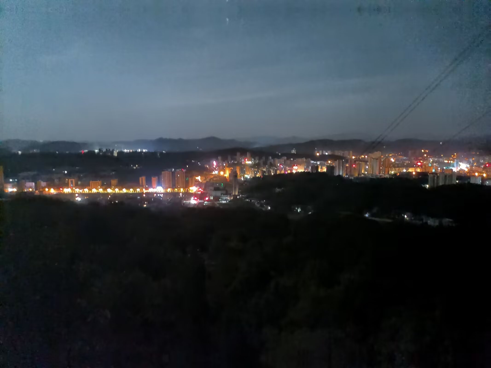

<!---->

# 大学最后的暑假

大学生涯的最后一个暑期，好像43°C的夏日里孩童手里的冰棍，还没来得及细细品味，就已经融化了大半。 

于是一时兴起，决定约朋友们凌晨两点出发去爬塔山，去看一看小镇日出的模样。 来得早的好处是一路上可以享受到大自然给予的足够多的静谧。没有了熙熙攘攘的嬉闹游客，只有远山人家偶尔传来的几声鸡鸣和清元寺里祥和安宁的僧人敲钟声。 

四点多，走过半山腰的观景台，可以看见在山峦与天空相连的地方，蒙着一层薄薄的云雾。尽管点亮了很多的灯火，但夜空下的罗田，在崇山峻岭之中依然显得那么渺小。 

记不起有多少年没有走过山林的夜路了，今夜的月光出奇明亮，很适宜地指引着一行人前进的方向。轻柔的晨风中夹杂着淡淡的槐树花香，从我们的身边拂过，仿佛带着我们回到了儿时的小镇。 

来到山顶已经是五点钟，东方天际开始现出一丝灰白，云层的颜色跟着发生七彩的变化，天空也越来越绚丽。 

“快看，快看！”，同伴指着前方，只见远处的云雾中开始挥洒出几缕霞光，朝阳似乎在云彩里跳舞。当一轮红日完全显露出来时，远远望去，那些山川河流，那些城镇田野，全都笼罩在这一片如薄纱般的金色晨㬢之中。 

和伙伴们并肩，沐浴在故乡亘古不变的星光和晨曦之下，心头是别样的惬意与感动。 

许多年后，也许我会忘了自己年少的模样，但我将始终记得这个夏天，记得我们见过的朝阳与彩霞、晨曦与红日、故乡和老友。

