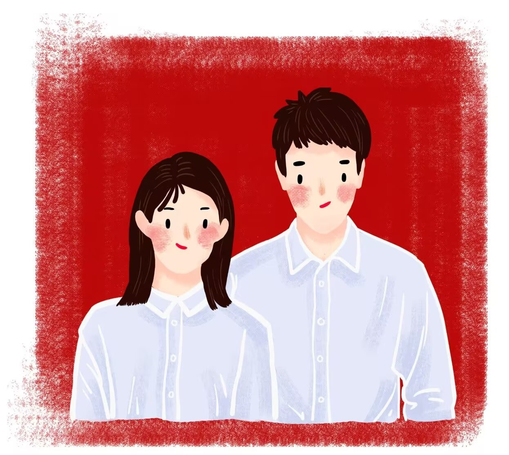

# 姐姐

2022年10月5日，我的姐姐结婚了。 

记得小学的时候，我的鞋子破了，姐姐就像哆啦A梦一样，用不知道从哪里弄来的针和线，帮我补得好好的。晚上放学的时候，姐姐照顾我，会给我塞她自己存的一块钱或者五毛，然后才去上自习……那时候没有觉得这些事有多么特别。长大后才意识到，那时候的姐姐也只是一个六年级的小孩子啊，她不需要掌握针线活的，也不需要把钱留着给别人用的，只是因为她有个弟弟，只是因为责任和偏爱，所以哪怕在学校，她也要给我撑起那片小小的天。 

后来初中我出了车祸，我还记得那天去医院的路上，姐姐把我抱得紧紧的。她的身体不住地颤抖，但她强忍着一路上没有哭，只是为了让我能少一些颠簸，可以安稳地在她的怀里靠一会。到了医院，医生帮我拉直错位的骨头，姐姐终于再也忍不住了，在我身边大哭起来，替我喊疼。她说我是最坚强的弟弟，我却觉得，她才是最可爱的姐姐，一直保护着我的姐姐。 

这么些年来，姐姐吃过的苦很多，经历的坎坷也不少，我和爸妈都看在眼里。我的姐姐总是很乐观的样子，但她其实真的很辛苦，也很不容易，只是因为她是家里大的那个，是姐姐，她就不得不为我们这个家庭操心，为我这个不懂事的弟弟操心。一个姐姐半个妈，有些恩情，可能一辈子也难以偿还。 

我很怀念2020年那半年的疫情时光，难得，我们一家四口有机会聚在一起生活那么久，朝夕相处，仿佛回到了无忧无虑的小时候。其实越长大，越感到人生中很多时候会身不由己，过去稀松平常的陪伴，在子女、兄弟姐妹离家之后也成了一种奢望，也开始用上“珍惜”这样的字眼。 

今天的姐姐打扮的很漂亮，我想我永远都忘不了那个画面，她和姐夫在婚纱店试妆，我远远的看着她，她向我招手，说：老弟，快过来。 直到那一刻我突然有种说不清的失落，我的姐姐，出嫁了。从此，家里不会有个人陪我说话，跟我打闹了，我不能事事跟她讲，不能事事麻烦她了。我知道她终将有她的家庭，她要开始新的生活，只是我总觉得我们还小，一直没有做好这种心理准备罢了。 

婚礼上的祝福语，我真的好不喜欢那句“早生贵子”，生孩子对人身体的伤害很大，我知道他们都是好心好意的祝福，我只是不希望我的姐姐受太多苦，希望她可以快活一些。 

中午吃完婚宴，姐姐在门口送亲戚。我问妈妈：姐姐不跟我们回去了吧。妈妈突然不说话了。走到门口，姐姐摸摸我的头，说：家里的顶梁柱以后就是你了，照顾好爸妈。那一刻我百感交集，但我只是点点头，说了句：姐，回去了奥。扭头坐上车，离开了酒店，我的眼泪才一颗一颗地掉下来。姐，我真的好担心你，面对一群不认识的男方亲戚，面对一个新的家庭环境，我真的好怕你受委屈，好怕他们对你不好。但……能看出来，姐夫是真的疼你，也是真的有作为的男人，他会是个不错的丈夫，肯定会好好保护你，好好照顾你的。 

姐，祝你和姐夫一直都幸福，一直都自由，一直都可以做你们想做的事，别再那么辛苦，别再那么操心。

