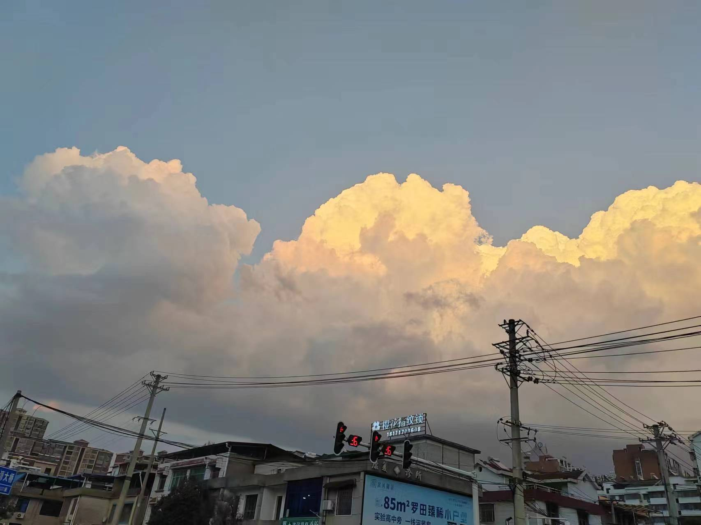

<!---->

# 寒假结束

“老黄，拜完年了出来玩，老地方！” “好，这就来！” 

给晚辈匆匆发完红包，当我赶到饭馆时，几个老朋友早已点好了我爱的菜。我们是初高中同学，青春期里的老角色，所以就算很久没见，也不会有疏远感，可以很自然地说些心里话：板砖在广州打拼的压力、花花国企工作的没劲、狗哥二战备考的孤单、金木买房买车的打算...... 当然，也祝福了同同，成为朋友圈里最早订婚的人。 

放在几年前，我可能会有种“没想到我们还是变成了乏味的大人”的挫败感。 但现在我只觉得，不聊这些聊什么呢，这就是每个人毕业后的真实生活。 那些现实又老成的话题，就算不去碰，也会自然而然地走到我们面前。 而跟老朋友见面的意义，大概就是为了提醒自己： 至少，你不是一个人在经历这些。 

酒过三巡，暮色四合，今夜天公作美，温度格外宜人。沿着少年时的足迹漫步江边，嬉笑打闹中，我们又走到了许多年前的义水桥头，永日说：“就到这吧，明天回武汉，有机会再见”。 小遂补了句：“下次见面，怕是明年过年了吧。” 

这句话在我耳边回荡良久，我似乎听过这句话很多次。在家里收拾行李时，父亲翻看着日历：“接下来没什么假期咯，要等五一才能回来了吧。” 母亲则是恨不得把冰箱里的食材都炖个遍，因为她知道她的儿子下一次吃到家里的饭，得是好几个月之后了。 

这让我意识到一件遗憾的事： 许多重要的人，都在不知不觉中，变成了“一年最多见两次”的关系。 

徒长年岁二十载，我从没习惯过离别，就像“下次见面是过年了”这句话里的无奈， 它意味着有人会留下，但总有人要离开。 可是反过来想，它也提醒着我们：总会再见的。而我们要做的，就是在不能见面的这段时间里，照顾好自己。唏嘘过后，还是要打起精神对抗生活，努力过好接下来的每一天。 

十字路口的绿灯终于亮起，我和朋友们挥手作别，月色下，每个人迈向各自人生不同的方向。谁怕人生到处相逢难，知己一程何必多善感，朋友们，愿下次重逢的时候，我们的生活会比此刻更加精彩。

