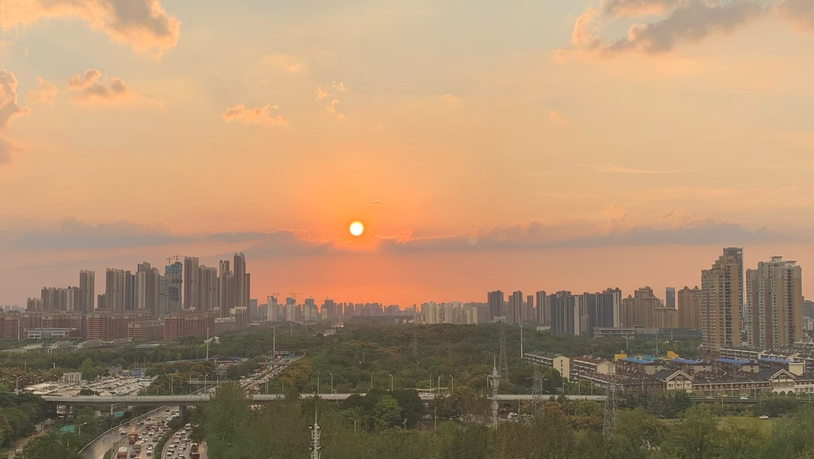

<!---->

# 寒露将至

落霞被晚风吹成了暖色调的油画，初秋时节的黄昏，总是暧昧得让人想来一场宿醉。

冷空气似乎是时间最好的朋友，依然在每年的寒露前夕准时就位，赶赴这场黄家湖畔的相约。然而北风可从来不是什么温柔的女人，没几个楞头小子敢冒着生命危险爱上她。 

在狠狠地打了几个寒颤之后，我终于扛不住她的挑逗，披了件衬衫，扑面而来的吻这才变得不那么刺骨。 

拨通家里的电话，念叨几句天冷，记得加衣。电话线那头的母亲应该会感到欣慰，毕竟她的孩子终于冷暖自知了。 

来去匆匆，武汉的秋天向来如此，短到没有什么存在感，可我总想写点什么，好珍藏这个间不容瞚的季节。提笔忘字的瞬间，或许，拍一张晚霞就足够了。 

恰逢今日季秋，愿和我的朋友们道一句，天寒露重，望君珍重。

