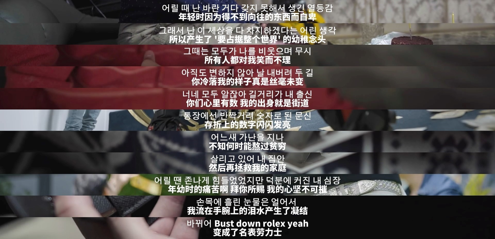

# 平凡生活，英雄梦想

昨天看热搜，琼瑶在生命尽头选择了烧炭自杀。倒不让人意外，一以贯之，她从来都是这样的潇洒。想起17年看她的访谈，她说写作是她的血液，去世的那一天，才是她封笔的那一天。

不敢说写作是我的血液，但我确实很喜欢记录生活，记录某天发生的事情、某个阶段的奇思妙想、闪现在脑海里的一段话，又或者只是近期的快乐、盘旋在心头几天的郁闷。

我总是愿意仔细描述它，刻画它。当一个人被生活的琐事磨损了心神，用文字记录下平凡日子里的闪光，其实是一种自我修复。

记忆有时候并不那么靠谱，再多姿多彩的生活，被你过惯了，也会逐渐失去在你眼里的不同。而文字和照片，就像是一块镜子，能映照出你没留意到的生活意义。

很难想象有一天我会辍笔不更，不似往日，那时我的大脑愚钝又迟缓，街头巷尾的所有人与物，都逐渐显露出无聊且单调的一面。

那么就是我输了，疲累无望、连小小闪光都不复存在的平淡日子终于将我打倒，而我也失去了文字，那本该是我对抗生活的最终武器。

也许，我该像琼瑶学习，不是自杀，而是尽力抵抗人生的坏结局。如她一般，不负人间一趟，活得潇潇洒洒。

