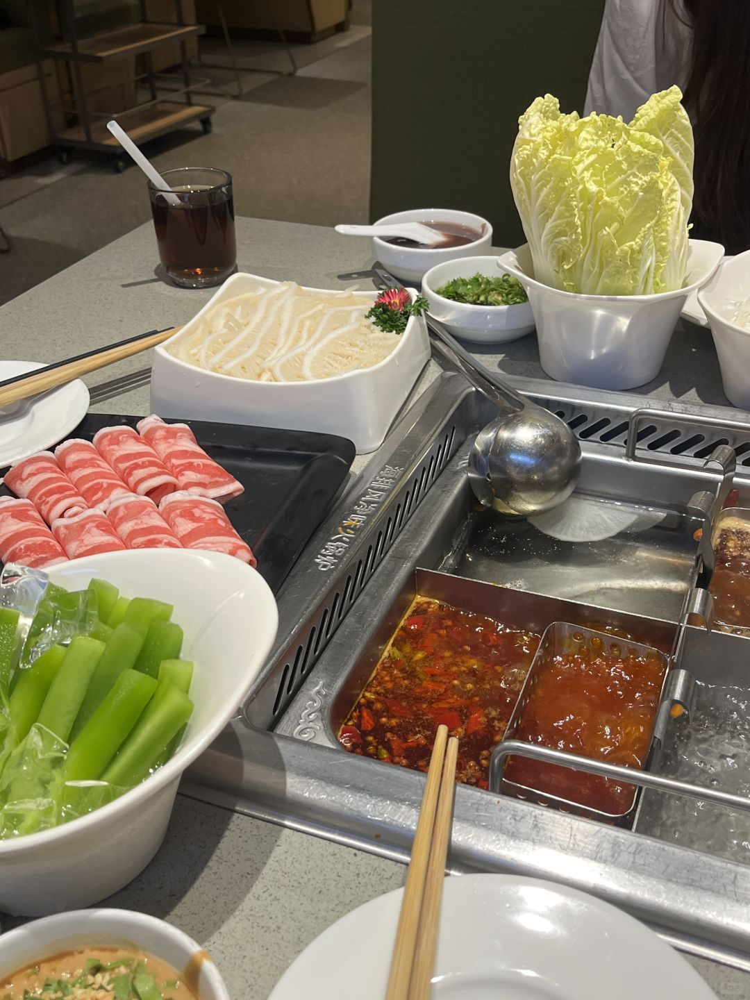
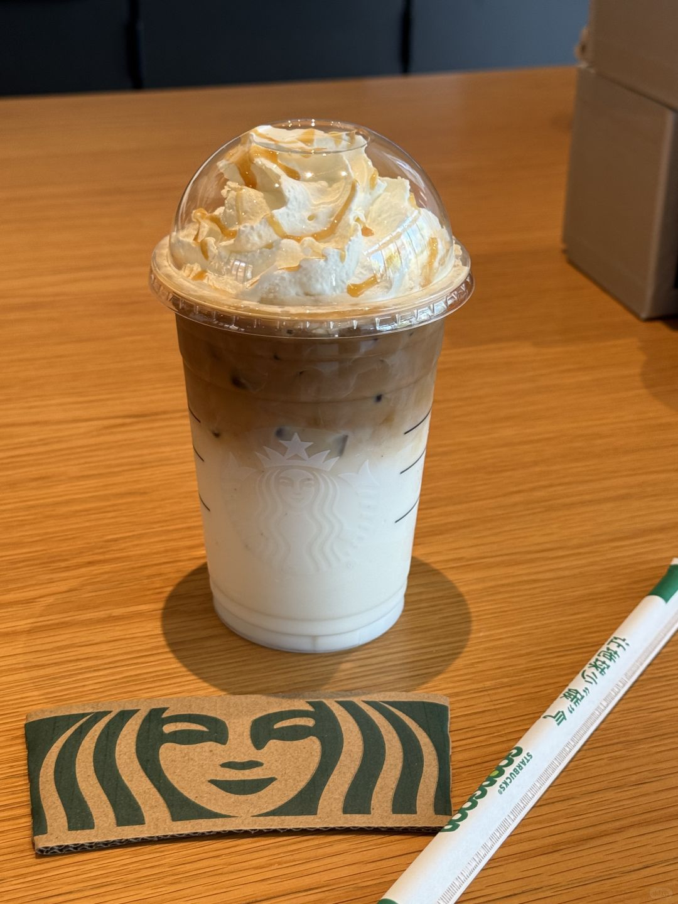
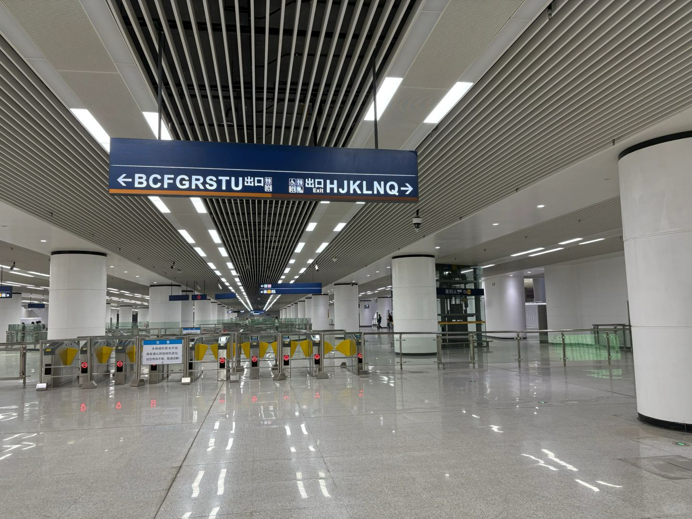

# 最后的六九折

写字楼玻璃映着霓虹水雾，我和潼爷在工作日的下午成功碰面。“你下班居然这么早，单位还缺人不？”原来是她请了病假。

三年的社会打磨让人成熟许多，擦拭完镜片上的火锅蒸汽，才看清当年课间讨论八卦的稚气面庞，如今也都生出了职业性的棱角。

邻桌的女生举着冰淇淋唱生日歌，男友的鼻尖上点缀着半融化的奶油。在她们的笑声中，我恍然发觉自己已成了被时光推出优惠区间的局外人——这将是我最后一次用学生证刷开六九折的夜晚。

“操，杭州那帮孙子…”潼爷的国骂卡在喉咙里，我笑她还是三年前那般豪爽，只是叫骂声现在只能爆发在挂断领导的电话之后。她翻着白眼，找出我凌晨加班的朋友圈，让我承认那天我比她更加崩溃。

捧起人生第一杯星巴克，焦糖玛奇朵居然甜得发腻。原来成年人标榜的仪式感，不过是青春期的寻常糖水换了层烫金的包装，如此平平无奇。

在二号线和潼爷挥手作别，我们都不知下一次相见还要再等几个三年。地铁外，川流不息的车灯依旧在舔舐夜色，只是玻璃幕墙上那些年轻的身影，早被雨水冲成了模糊的色块。

（光谷广场站真走麻了，从J口到B口能走一个世纪……）

