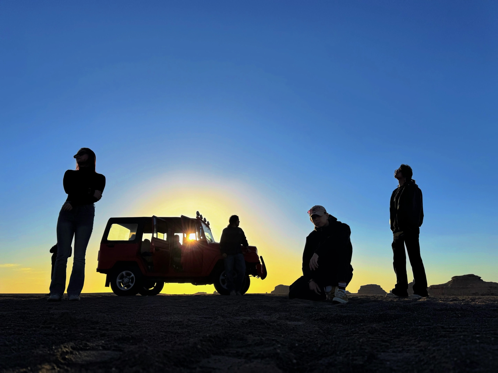

# 最重要的旅行

成都的最后一个夜晚，我们意外下榻在一个城乡结合部的小旅馆里。 

远离了市中心的繁华，没有纸醉金迷的酒吧和灯红酒绿的商业街，只有上了年份的小卖部和零星的几家老诊所。一天之内，这由奢入俭的落差让人有些无所适从。 望着美轮美奂的宣传图，闻着劣质消毒水的刺鼻味道，我们苦笑，这显然不是我们期望的终点站。 

一楼是几个在蹭 wifi 打王者的小青年，神态和衣着像极了初高中厕所里，那些抽烟染发的鬼火少年，让我对这个地方更加没有好感。 天色渐晚，我们在街边找了家餐馆坐下，却惊讶地发现这里的食物是出奇的物美价廉，菜单也丰富无比、内有乾坤。捧着免费而浓香的茉莉花茶，每个人的心中都宽慰了不少。 

一对情侣坐在隔壁桌，小伙的皮肤显现出劳动者特有的黝黑，女生的衣着并不华贵但非常整洁。男生讲着蹩脚而简单的笑话，逗得女生哈哈大笑。小遂感叹道：“如果有一个女生愿意陪我在这种地方吃饭，那我肯定要娶她了。”我们笑他是七夕到了所以思春，但心里对这种平淡的幸福其实也满是羡慕。 

回到旅馆时，一个老人在空调排水淋湿的地面上滑倒了，我还没反应过来，旅馆里那几个打王者的小青年就立刻跑了出来。他们小心翼翼地搀扶起了老人，背着就往旁边的诊所里走，没有丝毫的犹豫。 

我突然羞愧于自己之前对他们的蔑视，也意识到所有人、所有事物其实都有被尊重的理由。无论是见义勇为的鬼火少年，还是发生在城乡结合部里的爱情故事，也许他们不像奢侈品广告那样高级，他们或许肤浅、流气、庸俗，有时还带着一点点谄媚。但在这样一个猝不及防的夜晚，我却被自己曾轻视过、漠视过的东西深深地打动了。 

成都之行终究到了末尾。我想，旅行的意义从来不是在于目的地，而是和你一同出发的人。最后的夜晚里，小遂在考研和就业的纠结中做出了自己的选择，永日在“曲线救国”的道路上明确了目标，四火则认准了以后的就业方向，我也将继续在代码的世界里或摸索、或沉浮。 

迎着朝阳和拂面的清风，我和一楼的少年说了再见，和朋友们也道了离别。江湖再见，愿我们都有美好的未来。
