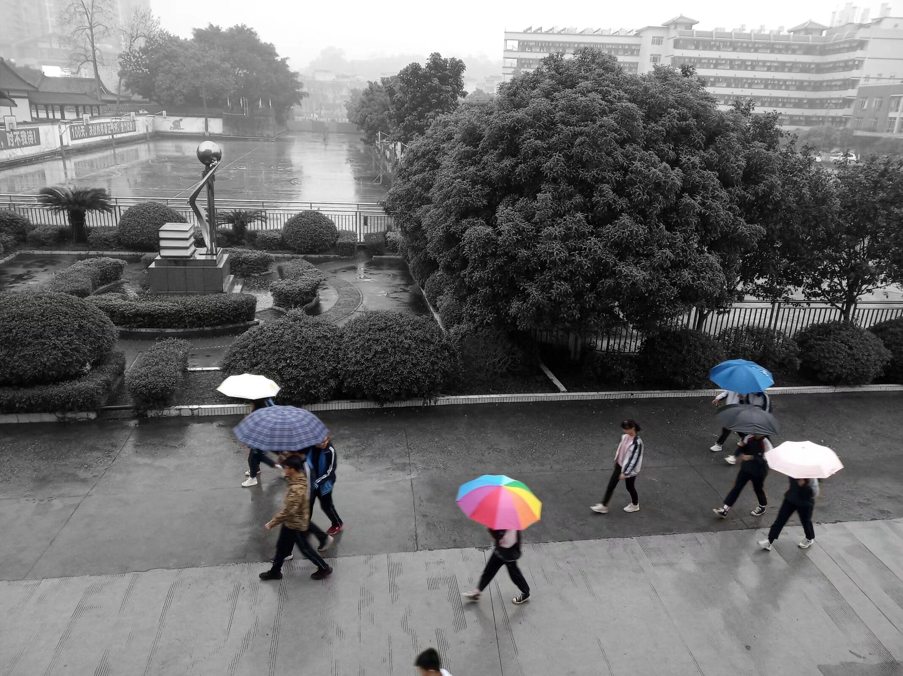

<!---->

# 樱花节后

三月中旬，樱花节落下帷幕，花瓣在细如发丝的春雨中落满草坪，通往教三的林间小路也因此增添了一抹粉色。但和赏花的熙攘人群一同离去的，还有黄家湖这几日的短暂暖阳。

春分未至，寒风像张牙舞爪的怪兽，肆意地穿过教室三楼的窗缝，在每个人耳边发出呼啸的鸣叫。

春寒料峭的日子里，我收到了朋友寄来的明信片，来自远方的几许笔墨，读来却蕴含着入木三分的珍重。“春信今年早，江头昨夜寒”，翻山越岭而来的礼物，使人在阴霾的天气里忘却了寒冷，带来的却是星城满满的阳光和新鲜。

从一堆泛黄的纸张旧物里，散落出了几片玉兰花瓣，那大概是高中同学在某年三月夹在信里的附赠。时过境迁，人生各自飘零，过去的信件再难以找到，内容我也早已忘的一干二净，但那些细碎的玉兰花瓣，却成为了记忆里永恒的斑驳，嵌在了故乡的绿瓦红砖里。

傍晚，室内的灯光亮起，窗外变得雾蒙蒙的，眼前的水杯里不再翻腾热气，旁边的哥们也冻的直流鼻涕。我终于放弃了对气温回暖的幻想，下定决心要从衣柜里翻出几条厚实的秋裤，加入这个春季的全新穿搭。

