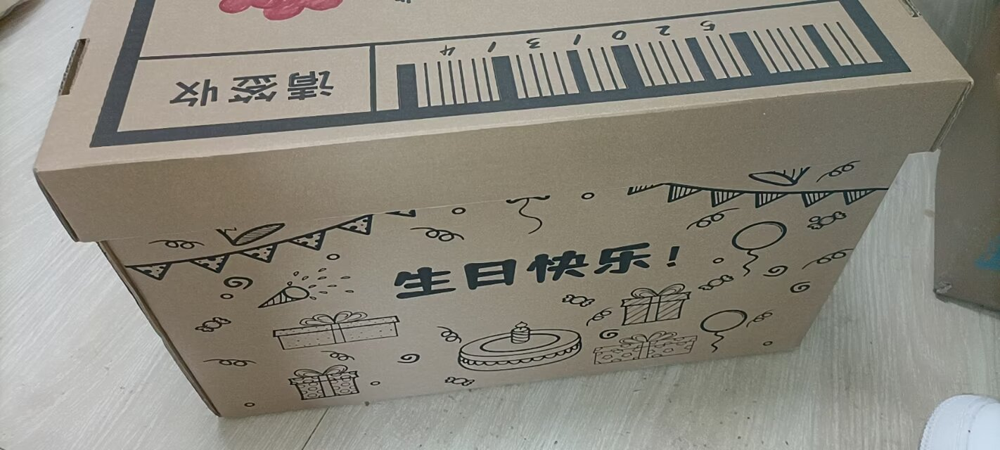

# 生日快乐

打扫完最后一个易拉罐，关上活动室里一盏夜灯，我22岁的生日终于画上了圆满的句号。 

武汉的疫情似乎没有个喘息的时候，封校和核酸检测来了一轮又一轮。自19年后，这样令人麻木又无奈的时刻有过太多次了。在新环境里，不知道有多少人同我一样按部就班地生活着，学习如何耐住性子，学习如何苦中作乐。 

回想没有疫情的时光，和朋友、恋人的每一次旅行，每一次的促膝长谈，都是那么的惬意。可现在呢？这样的机会稍纵即逝，这样的经历也越来越难得。过往的日常，如今成了一种奢侈的奇迹，而离开了熟悉的朋友，坦白讲，我不知道怎么度过今天，一如我完全不知道该怎么面对这扑面而来、迫在眉睫的22岁。

晚上，同门的电话打来，我想这大概又是组会的信号吧。然而，打开活动室的大门，眼前却是一桌佳肴，原来，是课题组里的朋友们替我预约到了场地，甚至还准备好了蛋糕……此刻，再不必多言，只需纵情举杯，把烦心事化作杯底的泡影狠狠碰碎。难得的觥筹交错，熟悉的推心置腹。疫情的苦涩，终究没能掩埋蛋糕的香甜，我很难想象如果没有他们，这会是多么无趣的一天。 

尽管没有出校的狂欢，但和朋友们一同举杯的当下，好像也称得上是另一种圆满。聚会的意义，本就是和朋友们聚在一起而已，环境和形式反而是细枝末节。我也终于理解到，只要身边有朋友相伴，再平淡朴素的生活，一样可以活色生香。 

此刻，22岁的人生画卷在我眼前渐渐铺开，但我似乎不再惶恐，不再不安。

