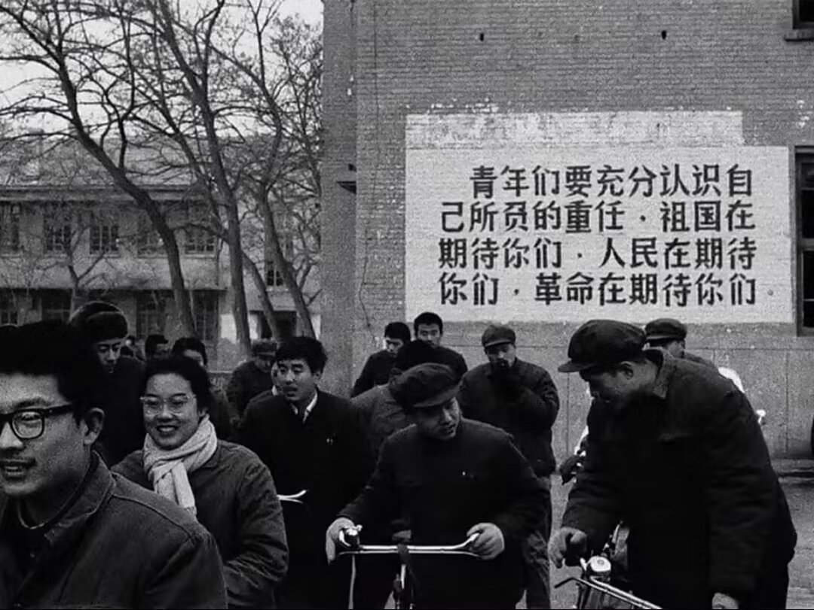

<!---->

# 登上讲台

待学生严厉、教书却一丝不苟的特级老师终究还是被高薪挖去了别的城市。 

懵懂无知的少年奔走相告，喜形于色，庆贺终于摆脱了“坏老师”的管教。 

他们不知道什么叫做教育资源倾斜，不懂得什么叫人往高处走，不了解什么叫阶级固化，什么叫上升通道，更不明白什么叫自我实现。 

他们不知道自己在庆贺的，是一件最不值得庆贺的事。 

给学生上课已经快两周了，有时候面对这些小县城里、甚至是乡镇里艰难求学的孩子或家长，真的忍不住会思考，双减政策到底是促进了教育公平，还是更加拉开了城乡学生间的差距呢？ 

他们10个人里可能只有3个人不戴眼镜。他们一个月可能只放一天半假，家在乡镇的孩子，大半天消耗在有序离校和回家的大巴上。更不用提他们每天要完成六到九门功课的学习和作业。 

点开手机，“易烊千玺考编不按照正常程序，免面试走特权”的新闻已经让人愤慨，而中国上下五千年，第一次有人拿寒窗苦读来嘲讽读书人，更是让我心寒万分。

“小镇做题家”是我听过的最可悲的称号，上一个，还是所谓的“人民富豪”。 

一个学生告诉我，他爸爸说他如果不好好读书，以后只能和他一样在炙热的太阳底下干苦力。我默默地鼓励着这个孩子，只是在自己的眼角里隐藏掉了许多的不安。 

站在三尺讲台前，我的心底渐渐泛起担忧，倘若所谓的少年风华竟不过是门户私计，那今时的堂前燕，还能飞入寻常百姓家吗？

