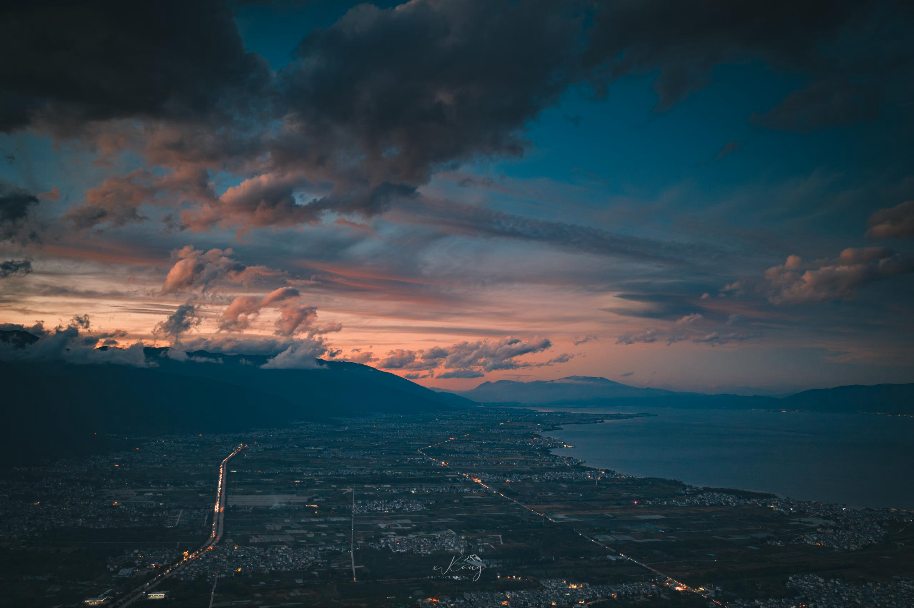

# 群山和人群

团建刚结束，生活又迅速被北京的节奏拉紧，几天前的松弛反而在此刻清晰起来。于是拿起笔——我怕再不写点什么，这种记忆的余温就要像水汽一样散了。

按理说，“团建”两个字本身就带着一点社交义务的味道，但相似的境遇，让几个同龄人的初次见面也能熟络得像一起翘课的同班同学。也对，成年人的距离感多半不是来自陌生，而是心里的戒备和疲乏。若彼此都愿意喘口气，倒也能轻松靠近。

抵达大理的时候是个阴雨天，浓雾把苍山吞没，洱海像张被揉皱的白纸，到处灰蒙蒙的。好在隔日天公作美，一早便云朗天晴。站在玉带云游路上俯瞰洱海，山和海都被淘洗得明彻而透亮。昨日什么都看不见，今天却豁然开朗，有些风景注定要靠一点运气。

我对那些为拍照而建的白墙打卡地实在兴致寥寥，好在崇圣寺的千年古刹能让人真正静下来。殿堂深处的佛像金身巨大，抬头仰望时，思绪仿佛也被引到了某个更高远的地方，凡尘喧嚣也显得渺小。可惜行程紧，停久了便会被催促，成年人的旅行自由，甚至不包含步伐的速度。

晚上在古镇里玩狼人杀，这家小店的主人很年轻，见缺一人便爽快入局，他的脸上洋溢着一种自在，是我羡慕的状态。工作后少有这种情绪外放的时刻，可以放肆争吵、辩解、拍桌大笑。折腾到半夜，一行人跑到龙龛码头，看了一个什么都看不见的日出。

那一刻，脑海里闪回两年前和朋友们爬山迎日出的夜晚——热闹总是相似的，可同行的人早就换了一批。

旅程将尽，我的心里多了一份安稳。不是因为谁在等我，也不是要去哪儿报到，而是我终于觉察到：哪怕身边的位置一个接一个地空下来，我依然能看到新的风景，依然能讲出新的故事。

想起返程那晚的航班，窗外，天光偶尔照亮群山，而人在城市的阴影里继续走路——光亮与自由都不常在，但偶尔一次，就足以继续往前。

