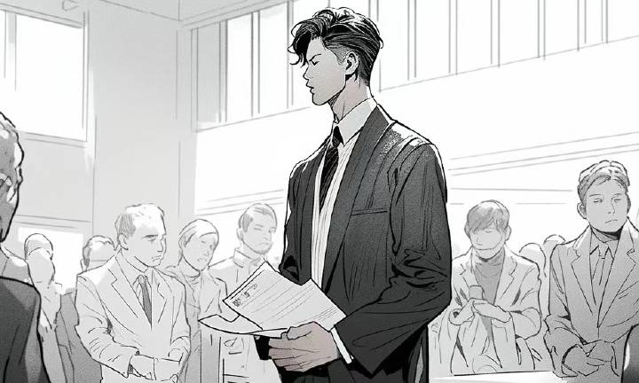

# 读研的另一种感受

你的痛苦，是面对如海般的文献，读来读去仍不知道自己到底要做什么；

是导师看见了你的迷惑，指给你一个“可能有突破”的方向，你却连问题本身都难以理解； 

是每天坐在工位上十几个小时，进展却微乎其微，留下的只有疲惫、迷茫，还有一点不敢言说的惶恐。

是你拼了半条命写完一份自以为不错的报告，却在组会开头就被一句质疑问得哑口无言；

是你推了很久的公式，导师看两分钟便让你推倒重来——理由是“结果不好”，甚至漏洞百出。

是好不容易看到一点起色，你以为总算写出一篇像样的文章，却又被老师大幅删改，还要求你立刻补充大量新数据。为了赶在投稿前完成，你不得不通宵达旦。

是好不容易有了向好的趋势，写出的文章又被老师大篇幅删改，并要求立刻补充大量新数据。你不得不为此通宵达旦，以求早日投稿。

是论文刚投出去，你刚想松口气，审稿人尖锐的责问又把你按回原地。不少实验需要重做，审稿人的无理要求还得反驳。但是，留给你的时间呢？真的不多了。

而当读研的日子终于走到尽头，你突然发现：这个世界并没有因为你读完了研就对你温柔一点。你依旧要和成千上万的毕业生一起排着长队，接受就业市场一次又一次的拷打。

——而这些，都算顺利的。

更糟糕的是你的导师有可能：是个放任的人，你的一切他都不管；是个苛刻的人，你的每一分钟都要被监视；是个把学生当工具的人，杂事全丢给你，科研却敷衍；甚至是个阴暗的人，贬损、斥责、情绪勒索，用毕业威胁你，让你不得不低头。

如果是这样，你会不会更痛苦？

也或许，你本来就不适合读研——但这不是你的错。你理想中的职位，以前专科也能胜任，现在却写着“硕士及以上”。为了就业，你不得不继续读下去。

而导师不会对你“网开一面”。他会告诉你，人才过剩就是因为培养注水，伪硕博遍地横行，为了“学位的严肃性”，他必须让学生“严进严出”。对此，你似乎完全无法指责这位“坚守原则”的导师。

但代价，是你压根没法在毕业和就业之间取得平衡。日复一日，你看着时间飞逝，感受着日复一日的疲劳和日渐增长的绝望，你是否更加痛苦？
