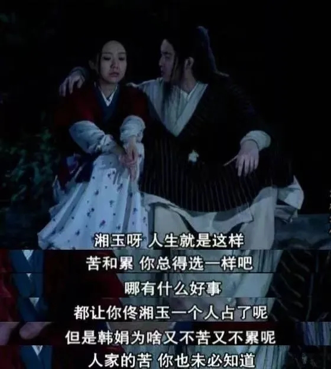

# 那天我没买任何套餐

理发那天，我随手进了小区旁的一家小店。玻璃门有些旧，本来没抱什么期待，里面的人意外地热情。给我洗头的是个瘦瘦的女生，动作轻，力气却不小。她一边按头一边闲聊，温柔的语气让人莫名放松。我顺手买了张按摩卡，算是礼貌性的回应。

今天去做按摩，她刚好负责。十来平的小屋，门一关，世界就安静下来了。她一边按，一边说起自己的事：河南的农村，农务的父母，留守的童年，早早辍学外出打工，来北京后的委屈和习惯性的忍耐——我知道这是听来很烂俗的桥段，对吧。

她说得很轻，没有渲染，也不博同情，反而透露出一些乐观。

但她轻描淡写的那部分，我知道有多重。她很瘦，却按得很卖力；明明在笑，眼角却藏着疲惫；生活不易，却把艰难讲得像天气一样平常。听着听着，人心里就有点发酸。

我也是北漂，也来自贫困县，也有务农的父母，也是在靠自己往前跑。我们都是从很远的地方走出来的人，一个不留神就会掉回去的那种人。只是命运在一些微妙的地方推了我一把，让我能多读几年书，多看一点世界……在别人举步维艰的地方，我侥幸能迈一步。

这些年的努力，我没有否认过，可出社会后我才明白：努力从来不是平等的；能努力，本身就是一种幸运。二十五岁以前，我信奉“只要努力就能改变命运”。现在回头看，这句话真够轻飘飘的，轻得配不上那么多人的辛苦，那么多人在台前幕后的挣扎。

有些人是在光里奔跑，有些人在暗里摸索；而我，只是碰巧被照亮了一秒罢了。

她在台子那边，我在躺椅这边，却像是被放在了同一张命运的桌面，她越是认真，我越是不好意思。出来时天已经黑了，小区里的路灯一盏盏亮起，风在楼缝间呼啸而过，吹的脸发疼。

北方的夜风真够冷的，可还是有这么多人，在咬着牙往前走。