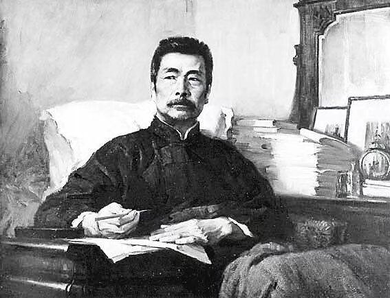

<!---->

# 重男轻女

三月后的高庙多少开始热闹起来了，家门口也有了行人的脚印，几家麻将馆忙不迭地赶去镇上警察局，拿回被扣押的麻将牌，生怕怠慢了那几家要钱不要命的座上宾。 

晒太阳本是一件惬意的事，但村里路过的一个中年人却让我的一天变成了折磨。

“你家里装修是给你装修的对吧，”我想这是玩笑话，并不在意。“你该早点找个媳妇，把你姐早点赶出去才好过日子呀，”我有些惊讶于他新中国时代的外貌打扮下，却有着封建王朝一般的腐朽思想。“哈哈，大叔，别开这种玩笑，”父母从小教导我要宽以待人，我也并不愿意和村里任何一个长辈起冲突。 

“早点娶媳妇不好吗？现在女生可少了，儿子是建设银行，女儿都是招商银行，你姐将来早晚是要……”“是啊，早点结婚，早点娶媳妇，就跟您家儿子一样对吧，您儿子可比我有出息！”当着姐姐的面，我不知道他怎么说得出口，我终于是忍无可忍，直接打断了他的话，但我一眼都懒得看他。他儿子，村里的人都熟，初中抽烟泡网吧夜不归宿的事没少干，高中没读完就辍学打工了，结婚也是潦草的“奉子成婚”，现在住着父母的房子，父母还得挣钱养他的孩子。“呵，哈哈……这话说得，怎么还生气了不成？走了走了……”  

晚上父亲回家，竟在饭桌上斥责我不该顶撞长辈的玩笑话，原来是父亲路过他家小店时，我被这“长辈”背后告状了……我怎么也想不到一个四五十岁的大人，怎么也好意思跟我一个小辈玩恶人先告状的游戏，一时让我分不清到底是谁在开玩笑，谁又在认真呢？姐姐替我说好话，但我也懒得跟父亲争辩了。  

晚上重读鲁迅的《故乡》，却发现杨二嫂的“圆规”形象竟开始渐渐和白天“长辈"的轮廓重合起来了，一时间我有些感同身受，也有些啼笑皆非。合上书，昏黄的灯光下，我却突然想起在儿时，这长辈的家里，我也曾见到过一个细声细气的大姐姐，不过似乎已经出嫁多年……我无话可说了，只觉得背后有些发寒。
