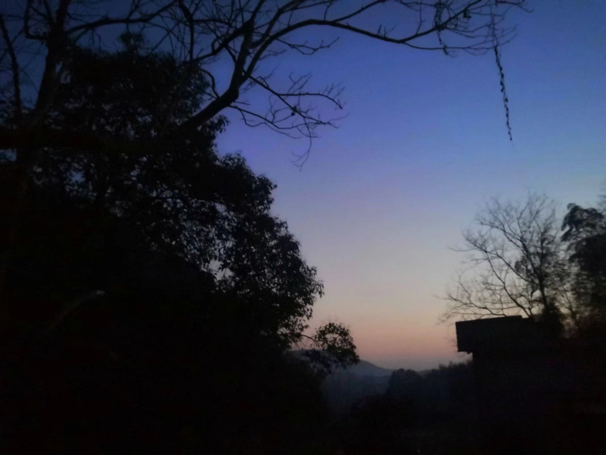

<!---->

# 重读父母

因为说了一句我想念室友们了，向来传统观念极强的老父亲竟警觉的诘问我是不是同性恋。 

我笑父亲多虑，但也惊讶于他如今观念的超前和对性向的宽容。 

窗外，依然是病毒肆掠。而与家人朝夕相处、寸步不离的这两个月，却让我意识到了父母的改变。 

比如父亲开始喜欢看缉毒片，而不再是以前的抗战片，比如母亲除了照顾家人的饮食起居外，其实还熟悉并热衷于调试各种电气设备……想来，我对父母的印象，竟也有些刻板，有些滞后了。 

我常说要关心父母，但这其实是老生长谈，理所当然的事。而“重读父母”，却是我一直所忽视的。 

以后的时光有多少能分给他们呢？我不太肯定，也不敢轻易地说“来日方长”了，但至少此时此刻，我相信我抓得住，也来得及。 

注：我是异性恋。
