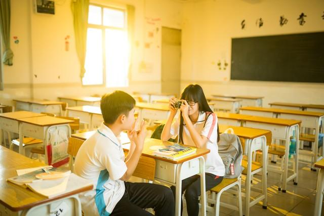

# 青少年恋爱手册

最近老有朋友找我咨询情感问题，想听取我的意见，如何赢得一份精彩的爱情，或者如何升华原本平淡的革命友谊……诚然，精彩而又深刻的爱情，是每个人的向往，但人生莫测，其实我也没有万能的攻略法。

但是，情人节在即，我十分想和朋友们分享自己一段非常难忘的感情经历——这段经历在我心里尘封已久，它地动山摇，悲壮痛彻，曾让不少朋友为之动容…… 

答应我，看完这个令人心碎的故事，你会找到想要的答案。 

事情发生在大一暑假，玉龙雅苑附近有家面馆，我时常去那里点上一份酸辣粉，边吃边看CCTV。 而故事的开端，也缘于这份平淡无奇的酸辣粉。 

那一夜，清风徐徐，我刚结束同学聚会回家，按照惯例地打包了一份酸辣粉。帮我打包的是一个年龄相仿的小妹，可能是在打暑假工。 

月光朦胧下，我们对视了几秒钟，小妹仿佛怀春的少女心被一眼看穿，娇羞低头。她是那种中规中矩的小妹，除了年轻之外给不了人任何感情色彩。 

随着日复一日地光顾这家面馆，我和小妹的见面次数越来越多了。一次吃面，我发现碗旁边多了一小碟醋，这让我有点惊讶。 

我吃酸辣粉时有个习惯，就是旁边多放一小碟醋增加风味。这个独家吃法，小妹知道也不怪，毕竟我在这家店一直持续着这种习惯，但贴心到事先帮你备好碟子，这不得不令人诧异。 

然而这种贴心绝非偶然，之后的几天每次到这家店吃面，小妹都事先帮我备好一小碟醋，这使得我有些慌张。而且，每次小妹给我收银时，总是一副超市促销员般的笑容，殷勤而别有用心。 

这小妹绝对不像外表那样质朴简单，她一定藏着不可告人的秘密…… 

万万没想到，事态比我想象中还要严峻许多，因为自那以后，我的酸辣粉明显比以前料足，分量也多了。

 这个迹象让我不安了好久，我已经感受到一些端倪： 这小妹多半是喜欢上我了。 

我在想她到底喜欢我什么呢，是我狼吞虎咽的可爱吃相，还是我性感诱人的后脑勺？管不了这么多，我虽然单身，但婚姻大事不能儿戏，学业还未见起色，我绝不能在此刻接受她。 

尽管我对小妹的示好装作不知，也冷漠相待，但她依旧不折不挠，想尽一切办法接近我。 

一次打包时，她主动搭讪说，你是住附近的吗？怎么老看到你噢。我强颜欢笑，说是。她没有打算中断对话的意思，而是得寸进尺地问我叫什么名字。我心想，真是世风日下啊，现在女孩怎么这么主动，还知不知道矜持了？ 

告诉她我的名字之后，我像是一个刚从色狼手中挣脱的纯洁姑娘，跌跌撞撞，狼狈不堪地逃出了面馆。 

回家之后，我不由地思索起来，虽然打破这个女孩的一厢情愿，让我于心不忍，但与其让她继续陷入对我无止境的迷恋中，还不如趁早打破她的幻想，让她早点醒悟。

 “对，趁她还没有爱到死去活来时，残忍地中断她对我的爱慕吧。” 

第二天，我照常来到面馆吃饭，我在等待一个恰当的时机，回绝小妹，我将狠狠驳斥她，我们是不可能的。尽管我很优秀，但比我优秀的男人也不少，希望她懂得这个道理，去找一个更好的。 

但事情又一次失控，这次她直接要了我的手机号码，“这也是你的微信号吗？”我给了她电话号码后，她问道。我微微点头，有些慌张。

 “她到底想干吗？先加我的微信，再借口约我出去吃饭看电影，主动投怀送抱？对，按目前的势头来看，非常有可能。” 

我被自己这冷静而又理性的分析深深折服，如无意外，她肯定是打算用这个套路来俘获我的心。 

果然，刚到家，小妹就马不停蹄地添加了我的微信。虽然我一早就知道她喜欢我，可真没想到她对我的爱恋已经狂热到了这种地步。但毫无疑问，就算她得到我的人，也得不到我的心。 

“真的不能让她这般沉沦下去了。”我心想。 

其实一想到这里，我内心无比自责，但暑期即将结束，我和小妹的缘分，也应该到此为止了。还是趁早在微信上跟她一五一十地说清楚吧，这样彼此都不至于那么难为情。 

我并没有立即通过小妹的微信请求，因为我深知这一举动意味着什么，这意味着我可能要伤透一个勇敢追爱的少女的心，甚至还会对她以后的人生造成不可弥补的创伤。她只不过痴情，但不该被伤害！这种感觉，谁都懂…… 

无论如何，我一定要慎重再慎重，我一定要委婉拒绝她，同时又把这份情伤降到最低。 

第二天，我通过了她的微信好友请求。谁知她立马发来了一个么么哒的表情，十分暧昧，让我措手不及。如此热情似火，显然她已经无法抑制住内心凶猛的爱意。 

我猜她接下来，一定会对我展开猛烈的追求，或者是找一些诸如“我心情不好，今晚有没有空呐，陪我去江夏大桥走走”之类的理由约我出去。但我没有揭穿她，这是父亲教导我必须要有的风度。 

我打算一步步来，让她有台阶可下，也是我离开罗田之前，对一个陌生人最后的温柔。于是乎，我回她一个微笑的表情，外加一句你好。我为自己这个得体的回复感到满意。 

小妹：你终于通过我的好友啦，嘻嘻。 

我：嗯。 

小妹：你看起来好像不是很高哦。 

我：啊？还好吧…… 

小妹：那你要不要增高鞋垫？ 

小妹：你可以去我的朋友圈看看哦，里面有很多款式的增高鞋垫的。 

小妹：买第二双还可以送袜子，亲。 

我：…… 

接着，她又发了一大堆关于鞋垫的介绍，什么高分子材料，舒适不伤脚，无异味无脚臭，等等。 经过几天的讨价还价，我嫌贵愣是没买她的鞋垫之后，她再也没有找我说过话…… 

一个月前，我回到了罗田，还是那碗熟悉的酸辣粉，柜台后却不见当年那小妹。我并不记得她的名字，也不知道她后来去了哪里，只是每每回忆起这一段凄美而热烈的感情经历，我都会靠在窗边，望着天空，无声地落泪……
