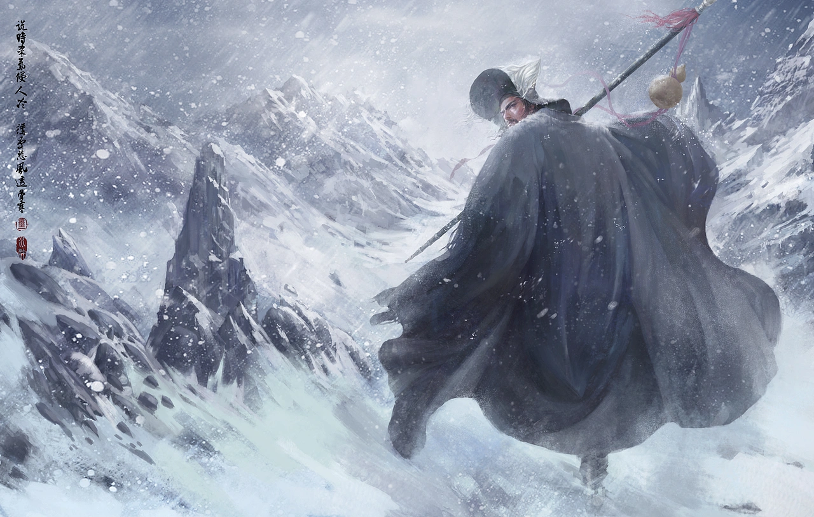

# 风吹雨打度良宵，挣残命一条

雪是傍晚落下来的。

电脑屏幕的光白得发冷，角落里弹出一条新闻——三十二岁，程序员，周末倒在家里。抢救时，他被拉进了工作群。人已死，消息却还在跳：“高工帮忙处理一下这个。”几行字，我反复看了几遍，没有惊讶，只觉得眼熟。毕竟，不是第一次有人走这条路了。

会议室里的灯一直亮着，绩效、方案、进度，被一项项摊开。问题砸在脸上，很短，也很直接，仿佛差役点名：你在干什么？你知不知道自己要干什么？你打算怎么干？我的喉咙发紧，一句也没接上。事情要清楚，要完整，要立刻能交付。每个人都像走在押解的路上，免不了被催来催去。

会议散的时候，雪已经很大了。马路被白色覆盖，路灯下的雪片被风推着转。我站在门口，看着那些被拍进朋友圈的雪，落在别人肩头。出租车司机开得很慢，收音机里放着昆曲，音质很旧，在雪夜里反而显得清楚——“遥瞻残月，暗度重关，奔走荒郊。”是《夜奔》！

一年前，我总听这段。

那时我爱骑车，爱在城北的路上一路往前，看着路灯一盏一盏退到身后。好像只要轮子在转，生活的方向盘就永远在自己手里。现在想来，那不是在奔，更像是在逃。

《水浒》里何尝不是这样？林冲被一程一程往前拨，换差事，换地方。每一步都谨小慎微，每一步都只为讨个清白。那时的雪下得也很急，关口被封住，退路也被封住。直到那一夜，他走到山神庙前——那扇门紧闭着，不是敲不开，而是根本没人打算回应。

风雪贴着脸刮，草料场在远处燃烧。此刻，不是想不想走的问题，而是再往前，已经没有命走。林冲没有时间愤怒，也来不及觉悟，只是他终于停下了，停止向一个注定会杀死他的体系证明自己是个好人。

昆曲到了尾声，雪又落回我的肩头。手机里的消息亮起，我没有再回。屏幕暗下去的瞬间，我看见自己的脸，映着窗外混沌的雪光。再往前，是不计代价，“提了枪，便出庙门投东去”，至少还有一线生机。