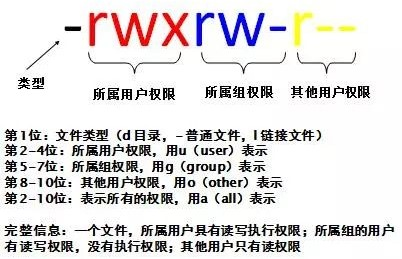

# Linux 常用的基本命令

## 一、目录管理

### 1、绝对路径和相对路径

我们知道 Linux 的目录结构为树状结构，最顶级的目录为根目录 `/`

其他目录通过挂载可以将它们添加到树中，通过解除挂载可以移除它们

在开始本教程前我们需要先知道什么是绝对路径与相对路径

**绝对路径：**

- 绝对路径的写法，由根目录 `/` 写起，例如：`/usr/share/doc` 目录

**相对路径：**

- 相对路径的写法，不是由 `/` 写起，例如想从 `/usr/share/doc` 进入 `/usr/share/man` 里面时，可以写成：`cd ../man` 

### 2、常用命令

- 可以使用 `man [命令]` 来查看各个命令的使用文档，如 ：`man cp`

- 执行 Linux 命令时，提示信息如果显示为乱码，这是由于编码问题导致，只需要修改Linux的编码即可，命令如下：

  ```shell
  - echo 'LANG="en_US.UTF-8"' >> /etc/profile
  
  source /etc/profile
  ```

- 在我们使用Linux系统命令时，可以使用以下几个技巧： 

  - Tab 键自动补全

  - 连续两次 Tab 键，给出操作提示
  - 使用上下箭头快速调出曾经使用过的命令
  - 使用 `clear` 命令或者 Ctrl+l 快捷键实现清屏

- Linux 命令格式

  ```shell
  command [-options] [parameter]
  	
  #说明: 
  #	command: 	 命令名
  #	[-options]:  选项，可用来对命令进行控制，也可以省略
  #	[parameter]: 传给命令的参数，可以是零个、一个或者多个
  	
  #注意: 
  #	[] 	 代表可选
  #	命令名、选项、参数之间用空格进行分隔
  ```

#### 1）ls （查看指定目录下的内容）

在 Linux 系统当中， `ls` 命令可能是最常被运行的。

语法：

```shell
ls [-al] [目录名称]
```

选项与参数：

**`-a`**：全部的文件，连同隐藏文件（开头为 `.` 的文件） 一起列出来；

**`-l`**：列出长数据串，包含文件的属性与权限等详细信息，但无法显示隐藏文件；

由于我们使用 `ls` 命令时经常需要加入 `-l` 选项，所以 Linux 为 `ls -l` 命令提供了一种简写方式，即 `ll`

**`-al`**：将目录下的所有文件详细列出来（包含文件属性与隐藏文件）

#### 2）cd （切换当前工作目录，即进入指定目录）

cd是 **Change Directory** 的缩写，这是用来变换工作目录的命令。

语法：

```shell
cd [相对路径或绝对路径]
```

测试：

```shell
# 切换到用户目录下
cd home  

# 使用 mkdir 命令创建 study 目录
mkdir study

# 进入 study 目录
cd study

# 回到上一级
cd ..

# 回到根目录
cd /

# 表示回到自己的家目录，也就是 /root 这个目录
cd ~
```

特殊说明：

- **~** 表示用户的home目录
- **.** 表示目前所在的目录
- **..** 表示目前目录位置的上级目录

#### 3）pwd ( 显示当前所在的目录 )

pwd 是 **Print Working Directory** 的缩写，也就是显示目前所在目录的命令。

```shell
pwd [-LP]
```

选项与参数：

**`-L`**：logical，显示当前的路径，有连接文件时，直接显示连接文件的路径，(不加参数时默认此方式)。 

**`-P`**：physical，显示当前的路径，有连接文件时，不使用连接路径，直接显示连接文件所指向的文件。 当包含多层连接文件时，显示连接文件最终指向的文件。 

测试：

```shell
# 单纯显示出目前的工作目录
pwd
/root

# 如果是链接，要显示真实地址，可以使用 -P参数
cd bin
pwd -P
/usr/bin
```

#### 4）mkdir（创建新目录）

如果想要创建新的目录的话，那么就使用mkdir (make directory)吧。

```shell
mkdir [-mp] 目录名称
```

选项与参数：

**`-m`**：配置文件的权限。直接配置，不需要看默认权限 (umask) 的脸色～

**`-p`**：帮助你直接将所需要的目录（包含上一级目录）递归创建起来！

测试：

```shell
# 进入我们用户目录下
cd /home

# 创建一个 test 文件夹
mkdir test

# 创建多层级目录的错误示范
mkdir test1/test2/test3/test4
mkdir: cannot create directory ‘test1/test2/test3/test4’:No such file or directory  # <== 没办法直接创建此目录啊！

# 加了这个 -p 的选项，可以自行帮你创建多层目录
mkdir -p test1/test2/test3/test4

# 创建权限为 rwx--x--x 的目录。
mkdir -m 711 test2
ls -l
drwxr-xr-x 2 root root  4096 Mar 12 21:55 test
drwxr-xr-x 3 root root  4096 Mar 12 21:56 test1
drwx--x--x 2 root root  4096 Mar 12 21:58 test2
```

#### 5）rmdir ( 删除空的目录 )

语法：

```shell
rmdir [-p] 目录名称
```

选项与参数：

**`-p`**：连同上一级 **为空的** 目录也一起删除

测试：

```shell
# 看看有多少目录存在？
ls -l
drwxr-xr-x 2 root root  4096 Mar 12 21:55 test
drwxr-xr-x 3 root root  4096 Mar 12 21:56 test1
drwx--x--x 2 root root  4096 Mar 12 21:58 test2

# 可直接删除掉，没问题
rmdir test

# 因为该文件夹不为空，所以无法删除
rmdir test1
rmdir: failed to remove ‘test1’: Directory not empty

# 利用 -p 这个选项，立刻就可以将 test1/test2/test3/test4 依次删除。
rmdir -p test1/test2/test3/test4

# 使用*通配符，删除名称以 itcast 开始的空目录
rmdir itcast*   
```

::: warning 注意

这个 `rmdir` 命令仅能删除空的目录，阅读下文你将学会可以使用 `rm` 命令来删除非空目录。

:::

#### 6）touch （创建文件）

```shell
# 创建文件 1.txt
touch  1.txt    

# 一次性创建文件 2.txt,3.txt,3.txt
touch  2.txt 3.txt 4.txt   
```

#### 7）cp ( 复制文件或目录 )

语法：

```shell
cp [-adfilprsu] 来源档(source) 目标档(destination)
cp [options] source1 source2 source3 .... directory
```

选项与参数：

**`-a`**：相当于 `-pdr` 的意思，至于 `pdr` 请参考下列说明(常用)

**`-p`**：连同文件的属性一起复制过去，而非使用默认属性(备份常用)

**`-d`**：若来源档为连结档的属性（link file），则复制连结档属性而非文件本身

**`-r`**：递归持续复制，用于目录的复制行为（常用）

**`-f`**：为强制（force）的意思，若目标文件已经存在且无法开启，则移除后再尝试一次

**`-i`**：若目标档（destination）已经存在时，在覆盖时会先询问动作的进行(常用)

**`-l`**：进行硬式连结（hard link）的连结档创建，而非复制文件本身

**`-s`**：复制成为符号连结档（symbolic link），亦即『捷径』文件

**`-u`**：若 destination 比 source 旧才更新 destination 

测试：

```shell
# 找一个有文件的目录，我这里找到 root目录
cd /root
ls
install.sh
cd /home

# 复制 root目录下的install.sh 到 home目录下
cp /root/install.sh /home
ls
install.sh

# 再次复制，加上-i参数，增加覆盖询问？
cp -i /root/install.sh /home
cp: overwrite ‘/home/install.sh’? y # n不覆盖，y为覆盖

# 将 itcast 目录下所有文件复制到 itheima 目录下
cp -r itcast/* ./itheima/ 	 	
```

#### 8）rm ( 移除文件或目录 )

语法：

```shell
rm [-fir] 文件或目录
```

选项与参数：

**`-f`**：就是 force 的意思，忽略不存在的文件，不会出现警告信息

**`-i`**：互动模式，在删除前会询问使用者是否动作

**`-r`**：递归删除，最常用在目录的删除了，但这是非常危险的选项！！！

测试：

```shell
# 将刚刚在 cp 的实例中创建的 install.sh删除掉！
rm -i install.sh
rm: remove regular file ‘install.sh’? y
# 如果加上 -i 的选项就会主动询问，避免你删除到错误的档名！

# 尽量不要在服务器上使用 rm -rf /
```

#### 9）mv  ( 移动文件与目录，或修改名称 )

语法：

```shell
mv [-fiu] source destination
mv [options] source1 source2 source3 .... directory
```

选项与参数：

**`-f`**：force 强制的意思，如果目标文件已经存在，不会询问而直接覆盖

**`-i`**：若目标文件（destination）已经存在时，就会询问是否覆盖

**`-u`**：若目标文件已经存在，且 source 比较新，才会更新（update）

测试：

```shell
# 复制一个文件到当前目录
cp /root/install.sh /home

# 创建一个文件夹 test
mkdir test

# 将复制过来的文件移动到我们创建的目录，并查看
mv install.sh test
ls
test
cd test
ls
install.sh

# 将文件夹重命名，然后再次查看！
cd ..
mv test mvtest
ls
mvtest
```

#### 10）tar 对文件进行打包、解包、压缩、解压

**打包**

- 打包，也称为归档，指的是一个文件或目录的集合，而这个集合被存储在一个文件中。归档文件没有经过压缩，因此，它占用的空间是其中所有文件和目录的总和。通常，归档总是会和系统备份联系在一起。

**压缩**

- 压缩是指利用算法将文件进行处理，已达到保留最大文件信息，而让文件体积变小的目的。其基本原理为，通过查找文件内的重复字节，建立一个相同字节的词典文件，并用一个代码表示。
- 压缩和归档文件类似，压缩文件也是一个文件和目录的集合，且这个集合也被存储在一个文件中，但它们的不同之处在于，压缩文件采用了不同的存储方式，使其所占用的磁盘空间比集合中所有文件大小的总和要小。
- 由于计算机处理的信息是以二进制的形式表示的，因此，压缩软件就是把二进制信息中相同的字符串以特殊字符标记，只要通过合理的数学计算，文件的体积就能够被大大压缩。把一个或者多个文件用压缩软件进行压缩，形成一个文件压缩包，既可以节省存储空间，又方便在网络上传送。
- 对文件进行压缩，很可能损坏文件中的内容，因此，压缩又可以分为有损压缩和无损压缩。

语法：

```sh
tar [-zcxvf] <fileName.extension> [files]

# 包文件后缀为 .tar 表示只是完成了打包，并没有压缩
# 包文件后缀为 .tar.gz 表示打包的同时还进行了压缩
```

选项与参数：

**`-z`**：gzip，通过 gzip 命令处理文件，gzip 可以对文件压缩或者解压

**`-c`**：create，即创建新的包文件

**`-x`**：extract，实现从包文件中还原文件

**`-v`**：verbose，显示命令的执行过程

**`-f`**：file，用于指定包文件的名称

测试：

```sh
# 打包

# 将当前目录下所有文件打包，打包后的文件名为 hello.tar
tar -cvf hello.tar ./*
# 将当前目录下所有文件打包并压缩，打包后的文件名为 hello.tar.gz
tar -zcvf hello.tar.gz ./*

# 解包

# 将hello.tar文件进行解包，并将解包后的文件放在当前目录
tar -xvf hello.tar		  			
# 将hello.tar.gz文件进行解压，并将解压后的文件放在当前目录
tar -zxvf hello.tar.gz		  		
# 将hello.tar.gz文件进行解压，并将解压后的文件放在/usr/local目录
tar -zxvf hello.tar.gz -C /usr/local     
```

## 二、基本属性

### 1、看懂文件属性

Linux 系统是一种典型的多用户系统，不同的用户处于不同的地位，拥有不同的权限。

为了保护系统的安全性，Linux系统对不同的用户访问同一文件（包括目录文件）的权限做了不同的规定。

在 Linux 中我们可以使用 `ll` 或者 `ls –l` 命令来显示一个文件的属性以及文件所属的用户和组，如：


实例中，`boot` 文件的第一个属性用 **d** 表示。**d** 在 Linux 中代表该文件是一个目录文件。

在Linux中第一个字符代表这个文件是目录、文件或链接文件等等：

- 当为[ **d** ]则是目录
- 当为[ **-** ]则是文件
- 若是[ **l** ]则表示为链接文档 ( link file )
- 若是[ **b** ]则表示为装置文件里面的可供储存的接口设备 ( 可随机存取装置 )
- 若是[ **c** ]则表示为装置文件里面的串行端口设备，例如键盘、鼠标 ( 一次性读取装置 )

接下来的字符中，以三个为一组，且均为『rwx』 的三个参数的组合。

其中，[ **r** ]代表可读(read)、[ **w** ]代表可写(write)、[ **x** ]代表可执行(execute)。

要注意的是，这三个权限的位置不会改变，如果没有权限，就会出现减号[ **-** ]进行替代。

每个文件的属性由左边第一部分的10个字符来确定（如下图）：



从左至右用0-9这些数字来表示。

第0位确定文件类型，第1-3位确定属主（该文件的所有者）拥有该文件的权限。第4-6位确定属组（所有者的同组用户）拥有该文件的权限，第7-9位确定其他用户拥有该文件的权限。

其中：

第1、4、7位表示读权限，如果用"r"字符表示，则有读权限，如果用"-"字符表示，则没有读权限；

第2、5、8位表示写权限，如果用"w"字符表示，则有写权限，如果用"-"字符表示没有写权限；

第3、6、9位表示可执行权限，如果用"x"字符表示，则有执行权限，如果用"-"字符表示，则没有执行权限。

对于文件来说，它都有一个特定的所有者，也就是对该文件具有所有权的用户。

同时，在Linux系统中，用户是按组分类的，一个用户属于一个或多个组。

文件所有者以外的用户又可以分为文件所有者的同组用户和其他用户。

因此，Linux系统按文件所有者、文件所有者同组用户和其他用户来规定了不同的文件访问权限。

在以上实例中，boot 文件是一个目录文件，属主和属组都为 root。

### 1、修改文件属性

#### 1）chgrp：更改文件属组

```shell
chgrp [-R] 属组名 文件名
```

**`-R`**：递归更改文件属组，就是在更改某个目录文件的属组时，如果加上-R的参数，那么该目录下的所有文件的属组都会更改。

#### 2）chown：更改文件属主，也可以同时更改文件属组

```shell
chown [–R] 属主名 文件名
chown [-R] 属主名：属组名 文件名
```

#### 3）chmod：更改文件9个属性（最常用的命令之一）

```shell
chmod [-R] xyz 文件或目录
```

Linux文件属性有两种设置方法，一种是数字，一种是符号。

Linux文件的基本权限就有九个，分别是 `owner/group/others` 三种身份各有自己的 `read/write/execute` 权限。

先复习一下刚刚上面提到的数据：文件的权限字符为：『-rwxrwxrwx』， 这九个权限是三个三个一组的！其中，我们可以使用数字来代表各个权限，各权限的分数对照表如下：

```
r:4     w:2     x:1
```

每种身份(owner/group/others)各自的三个权限(r/w/x)分数是需要累加的，例如当权限为：[-rwxrwx---] 分数则是：

- owner = rwx = 4+2+1 = 7
- group = rwx = 4+2+1 = 7
- others= --- = 0+0+0 = 0

```shell
chmod 770 filename
```

## 三、文件内容查看

### 1、概述

**你可以使用 `man [命令]` 来查看各个命令的使用文档，如 ：`man cp`。**

Linux系统中使用以下命令来查看文件的内容：

#### 1）cat 由第一行开始显示文件内容

语法：

```shell
cat [-AbEnTv]
```

选项与参数：

**`-A`**：相当於 -vET 的整合选项，可列出一些特殊字符而不是空白而已；

**`-b`**：列出行号，仅针对非空白行做行号显示，空白行不标行号！

**`-E`**：将结尾的断行字节 $ 显示出来；

**`-n`**：列印出行号，连同空白行也会有行号，与 -b 的选项不同；

**`-T`**：将 [tab] 按键以 ^I 显示出来；

**`-v`**：列出一些看不出来的特殊字符

测试：

```shell
# 查看网络配置: 文件地址 /etc/sysconfig/network-scripts/
cat /etc/sysconfig/network-scripts/ifcfg-eth0
DEVICE=eth0
BOOTPROTO=dhcp
ONBOOT=yes
```

#### 2）tac 由最后一行开始显示文件内容

tac 与 cat 命令刚好相反，文件内容从最后一行开始显示，可以看出 tac 是 cat 的倒着写！如：

```shell
tac /etc/sysconfig/network-scripts/ifcfg-eth0
ONBOOT=yes
BOOTPROTO=dhcp
DEVICE=eth0
```

#### 3）nl  显示内容的同时显示行号

语法：

```shell
nl [-bnw] 文件
```

选项与参数：

**`-b`**：指定行号指定的方式，主要有两种：-b a ：表示不论是否为空行，也同样列出行号(类似 cat -n)；-b t ：如果有空行，空的那一行不要列出行号(默认值)；

**`-n`**：列出行号表示的方法，主要有三种：-n ln ：行号在荧幕的最左方显示；-n rn ：行号在自己栏位的最右方显示，且不加 0 ；-n rz ：行号在自己栏位的最右方显示，且加 0 ；

**`-w`**：行号栏位的占用的位数。

测试：

```shell
nl /etc/sysconfig/network-scripts/ifcfg-eth0
1DEVICE=eth0
2BOOTPROTO=dhcp
3ONBOOT=yes
```

#### 4）more  一页一页翻动

cat 指令会一次性查看文件的所有内容，如果文件内容比较多，这个时候查看起来就不是很方便了，这个时候我们可以通过一个新的指令more。

在 more 这个程序的运行过程中，你有几个按键可以按的：

- 空白键 (space)：代表向下翻一页。
- Enter   ：代表向下翻『一行』。
- /字串   ：代表在这个显示的内容当中，向下搜寻『字串』这个关键字。
- :f    ：立刻显示出档名以及目前显示的行数。
- q    ：代表立刻离开 more ，不再显示该文件内容。
- b 或 [ctrl]-b ：代表往回翻页，不过这动作只对文件有用，对管线无用。

```sh
[root@kuangshen etc]# more /etc/csh.login
....(中间省略)....
--More--(28%) # 重点在这一行喔！你的光标也会在这里等待你的命令
```

#### 5）less  一页一页翻动，且能向前翻

less运行时可以输入的命令有：

- 空白键  ：向下翻动一页；
- [pagedown]：向下翻动一页；
- [pageup] ：向上翻动一页；
- /字串  ：向下搜寻『字串』的功能；
- ?字串  ：向上搜寻『字串』的功能；
- n   ：重复前一个搜寻 (与 / 或 ? 有关！)
- N   ：反向的重复前一个搜寻 (与 / 或 ? 有关！)
- q   ：离开 less 这个程序；

以下实例输出/etc/man.config文件的内容：

```sh
[root@kuangshen etc]# more /etc/csh.login
....(中间省略)....
:   # 这里可以等待你输入命令！
```

#### 6）head  取出文件前面几行

语法：

```
head [-n number] 文件
```

选项与参数：

**`-n`**：后面接数字，代表显示几行的意思！

默认的情况中，显示前面 10 行！若要显示前 20 行，就得要这样：

```shell
head -n 20 /etc/csh.login
```

#### 7）tail  取出文件后面几行

语法：

```shell
tail [-n number] 文件
```

选项与参数：

**`-n`**：后面接数字，代表显示几行的意思

默认的情况中，显示最后 10 行！若要显示最后 20 行，就得要这样：

```shell
tail -n 20 /etc/csh.login
```

### 2、拓展：Linux 链接概念

Linux 链接分两种，一种被称为硬链接（Hard Link），另一种被称为符号链接（Symbolic Link）。

情况下，**ln** 命令产生硬链接。

**硬连接**

硬连接指通过索引节点来进行连接。

在 Linux 的文件系统中，保存在磁盘分区中的文件不管是什么类型都给它分配一个编号，称为索引节点号（Inode Index）。

在 Linux 中，多个文件名指向同一索引节点是存在的。

比如：A 是 B 的硬链接（A 和 B 都是文件名），则 A 的目录项中的 inode 节点号与 B 的目录项中的 inode 节点号相同，即一个 inode 节点对应两个不同的文件名，两个文件名指向同一个文件，A 和 B 对文件系统来说是完全平等的。删除其中任何一个都不会影响另外一个的访问。

硬连接的作用是允许一个文件拥有多个有效路径名，这样用户就可以建立硬连接到重要文件，以防止“误删”的功能。

其原因如上所述，因为对应该目录的索引节点有一个以上的连接。只删除一个连接并不影响索引节点本身和其它的连接，只有当最后一个连接被删除后，文件的数据块及目录的连接才会被释放。也就是说，文件真正删除的条件是与之相关的所有硬连接文件均被删除。

**软连接**

另外一种连接称之为符号连接（Symbolic Link），也叫软连接。

软链接文件有类似于 Windows 的快捷方式。它实际上是一个特殊的文件。

在符号连接中，文件实际上是一个文本文件，其中包含的有另一文件的位置信息。

比如：A 是 B 的软链接（A 和 B 都是文件名），A 的目录项中的 inode 节点号与 B 的目录项中的 inode 节点号不相同，A 和 B 指向的是两个不同的 inode，继而指向两块不同的数据块。但是 A 的数据块中存放的只是 B 的路径名（可以根据这个找到 B 的目录项）。

A 和 B 之间是“主从”关系，如果 B 被删除了，A 仍然存在（因为两个是不同的文件），但指向的是一个无效的链接。

**测试：**

```shell
cd /home
touch f1 # 创建一个测试文件f1
ls
f1
ln f1 f2     # 创建f1的一个硬连接文件f2
ln -s f1 f3   # 创建f1的一个符号连接文件f3
ls -li       # -i参数显示文件的inode节点信息
397247 -rw-r--r-- 2 root root     0 Mar 13 00:50 f1
397247 -rw-r--r-- 2 root root     0 Mar 13 00:50 f2
397248 lrwxrwxrwx 1 root root     2 Mar 13 00:50 f3 -> f1
```

从上面的结果中可以看出，硬连接文件 f2 与原文件 f1 的 inode 节点相同，均为 397247，然而符号连接文件的 inode 节点不同。

```shell
# echo 字符串输出 >> f1 输出到 f1文件
echo "I am f1 file" >>f1
cat f1
I am f1 file
cat f2
I am f1 file
cat f3
I am f1 file
rm -f f1
cat f2
I am f1 file
cat f3
cat: f3: No such file or directory
```

通过上面的测试可以看出：当删除原始文件 f1 后，硬连接 f2 不受影响，但是符号连接 f1 文件无效；

依此您可以做一些相关的测试，可以得到以下全部结论：

- 删除符号连接 f3，对 f1、f2 无影响；
- 删除硬连接 f2，对 f1、f3 也无影响；
- 删除原文件 f1，对硬连接 f2 没有影响，导致符号连接 f3 失效；
- 同时删除原文件 f1，硬连接 f2，整个文件会真正的被删除。
