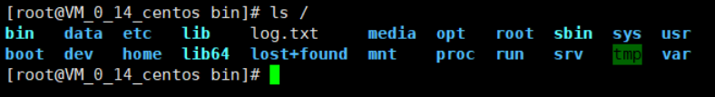

# Linux 概述及环境搭建

## 一、入门概述

### 1、我们为什么要学习Linux

Linux 诞生了很多年了，以前人们还喊着要取代 Windows 系统，但现在这个口号已经小多了。

有个词叫 **大势所趋**，任何事物的发展都有其局限性，都有其天花板。如果你想在国内再搞一个社交产品取代 QQ 和微信，也只能想想而已，基本不再可能。因为用户已经习惯于使用微信和 QQ 交流，不是说技术上实现不了，而是老百姓已经习惯了原来的产品，即使他们自己不用旧产品，亲戚朋友还是要用，这是一件没有办法的事情。

同理，用惯了 Windows 操作系统，再让大家强行切换到别的操作系统上基本上是不可能的事情，改变一个人的习惯太难了。但是，即使 Linux 没有办法深入到普通老百姓的生活中，也并不意味着 Linux 就没有用武之地了。**在服务器端，在开发领域里，Linux 反而是越来越受欢迎**，很多程序员不懂点 Linux 都觉得不好意思，Linux 在开源社区的地位依然是龙头老大。

现如今，所有的 Java 岗位，都明文要求开发人员必须掌握 Linux 的基本使用。由此可见，Linux 已经成为了现在找工作的基础门槛，我们不得不学习。

### 2、Linux 简介

Linux 内核最初只是由芬兰人林纳斯·托瓦兹（Linus Torvalds）在赫尔辛基大学上学时出于个人爱好而编写的。


Linux 是一套免费使用和自由传播的类 Unix 操作系统，是一个基于 POSIX（可移植操作系统接口） 和 UNIX 的多用户、多任务、支持多线程和多 CPU 的操作系统。

Linux 能运行主要的 UNIX 工具软件、应用程序和网络协议。它支持 32 位和 64 位硬件。Linux 继承了 Unix **以网络为核心** 的设计思想，是一个性能稳定的多用户网络操作系统。

### 3、Linux 发行版

Linux 的发行版说简单点就是将 Linux 内核与应用软件做一个打包。


目前市面上较知名的发行版有：Ubuntu、RedHat、CentOS、Debian、Fedora、SuSE、OpenSUSE、Arch Linux、SolusOS 等。

::: tip Kali linux

Kali linux 在安全渗透测试中经常使用（有兴趣做安全的同学可以了解一下!）

:::


### 4、Linux 应用领域

如今，各种场合都使用了不同的 Linux 发行版，无论是嵌入式设备，还是超级计算机。Linux 在服务器领域已经确定了自己的地位，通常服务器会使用 LAMP（Linux + Apache + MySQL + PHP）或 LNMP（Linux + Nginx+ MySQL + PHP）组合。

目前 Linux 不仅在家庭与企业中使用，并且在政府中也很受欢迎。

>巴西联邦政府由于支持 Linux 而世界闻名。
>
>有新闻报道俄罗斯军队自己制造的 Linux 发布版，作为 G.H.ost 项目已经取得成果。
>
>印度的 Kerala 联邦计划在向全联邦的高中推广使用 Linux。
>
>中国为取得技术独立，在龙芯处理器中排他性地使用 Linux。
>
>西班牙的一些地区开发了自己的 Linux 发布版，并且在政府与教育领域广泛使用，如 Extremadura 地区的 gnuLinEx 和 Andalusia 地区的 Guadalinex。
>
>葡萄牙同样使用自己的 Linux 发布版 Caixa Mágica，用于 Magalh?es 笔记本电脑和 e-escola 政府软件。
>
>法国和德国同样开始逐步采用 Linux。

### 5、Linux vs Windows

目前国内 Linux 更多的是应用于服务器上，而桌面操作系统更多使用的是 Windows。主要区别如下：

| 比较     | Windows                                                      | Linux                                                        |
| :------- | :----------------------------------------------------------- | :----------------------------------------------------------- |
| 界面     | 界面统一，外壳程序固定所有 Windows 程序菜单几乎一致，快捷键也几乎相同 | 图形界面风格依发布版不同而不同，可能互不兼容。<br />GNU/Linux 的终端机是从 UNIX 传承下来，基本命令和操作方法也几乎一致。 |
| 驱动程序 | 驱动程序丰富，版本更新频繁。<br />默认安装程序里面一般包含有该版本发布时流行的硬件驱动程序，之后所出的新硬件驱动依赖于硬件厂商提供。<br />对于一些老硬件，如果没有了原配的驱动有时很难支持。<br />另外，有时硬件厂商未提供所需版本的 Windows 下的驱动，也会比较头痛。 | 由志愿者开发，由 Linux 核心开发小组发布，很多硬件厂商基于版权考虑并未提供驱动程序，尽管多数无需手动安装，但是涉及安装则相对复杂，使得新用户面对驱动程序问题（是否存在和安装方法）会一筹莫展。<br />但是在开源开发模式下，许多老硬件尽管在Windows下很难支持的也容易找到驱动。HP、Intel、AMD 等硬件厂商逐步不同程度支持开源驱动，问题正在得到缓解。 |
| 使用     | 使用比较简单，容易入门。<br />图形化界面对没有计算机背景知识的用户使用十分有利。 | 图形界面使用简单，容易入门。<br />文字界面，需要学习才能掌握。 |
| 学习     | 系统构造复杂、变化频繁，且知识、技能淘汰快，深入学习困难。   | 系统构造简单、稳定，且知识、技能传承性好，深入学习相对容易。 |
| 软件     | 每一种特定功能可能都需要商业软件的支持，需要购买相应的授权。 | 大部分软件都可以自由获取，同样功能的软件选择较少。           |

## 二、环境搭建

Linux 的安装，安装步骤比较繁琐（操作系统本身也是一个软件），现在其实云服务器挺普遍的，价格也便宜，如果直接不想搭建，也可以直接买一台云服务器用来学习。

### 1、安装 CentOS（虚拟机安装，耗资源）

1、可以通过镜像进行安装

2、可以使用别人已经制作好的镜像，CentOS7网盘地址：[https://pan.baidu.com/s/1EPhK9nqK9AiBmuitscVy9Q](https://pan.baidu.com/s/1EPhK9nqK9AiBmuitscVy9Q)提取码：76x5

3、安装 VMware 虚拟机软件，然后打开我们的镜像即可使用

::: tip

虚拟机安装后会占用空间，也会有些卡顿。作为程序员其实可以选择购买一台自己的服务器，这样也更加接近真实的线上工作

:::

### 2、购买云服务器（推荐）

1、阿里云购买服务器：https://www.aliyun.com/minisite/goods?userCode=0phtycgr

2、购买完毕后，获取服务器的ip地址，重置服务器密码，就可以远程登录了

3、下载 Xshell 工具，进行远程连接使用。连接成功效果如下：


4、再下载 Xftp 工具，方便文件上传下载

::: warning 注意事项

如果要打开端口，需要在云服务器的安全组面板中开启对应的出入规则，不然的话会被服务器平台拦截

如果前期不好操作，推荐安装宝塔面板，可以实现傻瓜式管理服务器，安装教程：[https://www.bt.cn/bbs/thread-19376-1-1.html](https://www.bt.cn/bbs/thread-19376-1-1.html)

:::

5、开启对应的端口

6、一键安装

7、安装完毕后会得到远程面板的地址，账号，密码，就可以登录了

8、登录之后就可以可视化的安装环境和部署网站！

::: tip

关于域名

:::

如果自己的网站想要上线，就一定要购买一个域名然后进行备案；


备案的话需要一些认证和时间，备完完毕后，就可以解析到自己的网站了，这个时候就可以使用域名来进行服务器的访问！

## 三、走近Linux系统

### 1、开机登录

开机会启动许多程序。它们 在Windows 里叫做 **服务**（service），在Linux里就叫做 **守护进程**（daemon）。

开机成功后，它会显示一个文本登录界面，这个界面就是我们经常看到的登录界面，在这个登录界面中会提示用户输入用户名，而用户输入的用户将作为参数传给 `login程序` 来验证用户的身份，密码是不显示的，输完回车即可！

一般来说，用户的登录方式有三种：

- 命令行登录
- ssh 登录
- 图形界面登录

最高权限账户为 root，可以操作一切！

### 2、关机

在 Linux 领域内大多用在服务器上，很少遇到关机的操作。毕竟服务器上跑一个服务是永无止境的，除非特殊情况下，不得已才会关机

关机指令为：shutdown 

```shell
sync # 将数据由内存同步到硬盘中。

shutdown # 关机指令，你可以man shutdown 来看一下帮助文档。例如你可以运行如下命令关机：

shutdown –h 10 # 这个命令告诉大家，计算机将在10分钟后关机

shutdown –h now # 立马关机

shutdown –h 20:25 # 系统会在今天20:25关机

shutdown –h +10 # 十分钟后关机

shutdown –r now # 系统立马重启

shutdown –r +10 # 系统十分钟后重启

reboot # 就是重启，等同于 shutdown –r now

halt # 关闭系统，等同于shutdown –h now 和 poweroff
```

注意：不管是重启系统还是关闭系统，首先要运行 **sync** 命令，把内存中的数据写到磁盘中。

### 3、系统目录结构

登录系统后，在当前命令窗口下输入命令：

```shell
ls /
```

你会看到如下图所示：



树状目录结构：（一切皆文件，Linux 的一切资源都挂载在了这个 `/` 根节点下）


**以下是对这些目录的解释：**

**`/bin`**：bin 是 Binary（二进制）的缩写, 这个目录存放着最经常使用的命令，即二进制可执行文件。

**`/boot`**：这里存放的是启动 Linux 时使用的一些核心文件，包括一些连接文件以及镜像文件。

**`/dev`** ：dev 是 Device(设备)的缩写，存放的是 Linux 的外部设备，在 Linux 中访问设备的方式和访问文件的方式是相同的。

**`/etc`**：**这个目录用来存放所有的系统管理所需要的配置文件和子目录。**

**`/home`**：**用户的主目录，在 Linux 中，每个用户都有一个自己的目录，一般该目录名是以用户的账号命名的。**

**`/lib`**：这个目录里存放着系统最基本的动态连接共享库，其作用类似于 Windows 里的DLL文件。

**`/lost+found`**：这个目录一般情况下是空的，当系统非法关机后，这里就存放了一些文件。

**`/media`**：Linux 系统会自动识别一些设备，例如U盘、光驱等等，当识别后，Linux 会把识别的设备挂载到这个目录下。

**`/mnt`**：系统提供该目录是为了让用户临时挂载别的文件系统的，我们可以将光驱挂载在 /mnt/ 上，然后进入该目录就可以查看光驱里的内容了。

**`/opt`**：**这是给主机额外安装软件所摆放的目录。比如你安装一个 ORACLE 数据库则就可以放到这个目录下。默认是空的。**

**`/proc`**：这个目录是一个虚拟的目录，它是系统内存的映射，我们可以通过直接访问这个目录来获取系统信息

这个目录的内容不在硬盘上而是在内存里，我们也可以直接修改里面的某些文件，比如可以通过下面的命令来屏蔽主机的 ping 命令，使别人无法ping你的机器：

```shell
echo 1 > /proc/sys/net/ipv4/icmp_echo_ignore_all
```

**`/root`**：**该目录为系统管理员，也称作超级权限者的用户主目录。**

**`/sbin`**：s 就是 Super User 的意思，这里存放的是系统管理员使用的系统管理程序。

**`/srv`**：该目录存放一些服务启动之后需要提取的数据。

**`/sys`**：这是 Linux2.6 内核的一个很大的变化。该目录下安装了2.6内核中新出现的一个文件系统 sysfs。

sysfs 文件系统集成了下面3种文件系统的信息：针对进程信息的proc文件系统、针对设备的devfs文件系统以及针对伪终端的devpts文件系统。

该文件系统是内核设备树的一个直观反映。

当一个内核对象被创建的时候，对应的文件和目录也在内核对象子系统中被创建。

**`/tmp`**：**这个目录是用来存放一些临时文件的。**

**`/usr`**：**这是一个非常重要的目录，用户的很多应用程序和文件都放在这个目录下，类似于windows下的program files目录。**

**`/usr/bin`**：系统用户使用的应用程序。

**`/usr/sbin`**：超级用户使用的比较高级的管理程序和系统守护程序。

**`/usr/src`**：内核源代码默认的放置目录。

**`/var`**：**这个目录中存放着在不断扩充着的东西，我们习惯将那些经常被修改的目录放在这个目录下。包括各种日志文件。**

**`/run`**：是一个临时文件系统，存储系统启动以来的信息。当系统重启时，这个目录下的文件应该被删掉或清除。
