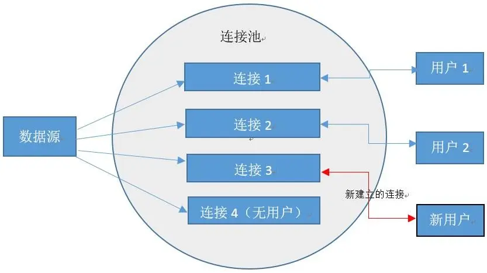

# 一文详解数据库连接池

## 概述

数据库连接池负责分配、管理和释放 **数据库连接**，它允许应用程序重复使用一个现有的数据库连接，而不是再重新建立一个。那么其中的运行机制又是怎样的呢？今天主要介绍一下数据库连接池原理和常用的连接池。

## 为什么要使用连接池

数据库连接是一种关键的、有限的、昂贵的资源，这一点在多用户的网页应用程序中体现得尤为突出。 一个数据库连接对象均对应一个物理数据库连接，如果每次操作都打开一个物理连接，使用完再关闭连接，这样显然会造成系统的性能低下。

数据库连接池的解决方案是，在应用程序启动时先建立足够多的数据库连接，并将这些连接组成一个连接池（简单说就在一个缓冲池里放了好多半成品的数据库连接对象），由应用程序动态地对缓冲池中的连接进行申请、使用和释放。对于多于连接池中连接数的并发请求，就会在请求队列中排队等待。并且应用程序可以根据池中连接的使用率，来动态增加或减少池中的连接数。

连接池技术尽可能多地 **复用** 了系统资源，大大节省了内存，提高了服务器的服务效率，能够支持更多的客户服务。通过使用连接池，将大大提高程序的运行效率，同时，我们可以通过其自身的管理机制来监视数据库连接的数量、使用情况等。

##  数据库连接池技术的优点

- **资源的复用**：由于数据库连接得到了复用，也就避免了频繁创建、释放连接引起的大量性能开销。在减少系统消耗的基础上，另一方面也增进了系统运行环境的平稳性（减少内存碎片以及数据库临时进程/线程的数量）。
- **更快的系统响应速度**：数据库连接池在初始化的过程中，往往已经创建了若干个数据库连接置于缓冲池中备用。此时连接的初始化工作均已完成。对于业务请求处理而言，直接利用现有可用连接，避免了数据库连接初始化和释放过程的时间开销，从而缩减了系统整体响应时间。
- **新的资源分配手段**：对于多应用共享同一数据库的系统而言，可在应用层通过数据库连接的配置，实现数据库连接池技术，几年钱也许还是个新鲜话题，对于目前的业务系统而言，如果设计中还没有考虑到连接池的应用，那么…….快在设计文档中加上这部分的内容吧。设置某一应用最大可用数据库连接数的限制，可以避免某一应用独占所有数据库资源。
- **统一的连接管理，避免了数据库连接的泄漏**：在较为完备的数据库连接池实现中，可根据预先的连接占用超时设定，强制收回被占用连接。从而避免了常规数据库连接操作中可能出现的资源泄漏。

## 传统的连接机制与数据库连接池运行机制区别

### 1. 不使用连接池的流程

下面以访问 MySQL 为例，执行一个 SQL 命令，如果不使用连接池，需要经过哪些流程。

不使用数据库连接池的步骤：

1. TCP 建立连接的三次握手
2. MySQL 认证的三次握手
3. 真正的 SQL 执行
4. MySQL 的关闭
5. TCP 的四次握手关闭

优点：

- 实现简单

缺点：

- 可以看到，为了执行一条 SQL，需要非常多的网络交互。

- 网络 IO 较多
- 数据库的负载较高
- 响应时间较长及 QPS 较低
- 应用频繁的创建连接和关闭连接，导致临时对象较多，GC 频繁
- 在关闭连接后，会出现大量TIME_WAIT 的TCP状态（在2个MSL之后关闭）

### 2. 使用连接池的流程

使用数据库连接池的步骤：

第一次访问的时候，需要建立连接。 但是之后的访问，均会复用之前创建的连接，直接执行SQL语句。

优点：

- 较少了网络开销
- 系统的性能会有一个实质的提升
- 没了麻烦的 TIME_WAIT 状态

## 数据库连接池的工作原理

连接池的工作原理主要由三部分组成，分别为：

### 1. 连接池的建立

一般在系统初始化时，连接池会根据系统配置建立，并在池中创建了几个连接对象，以便使用时能从连接池中获取。连接池中的连接不能随意创建和关闭，这样避免了连接随意建立和关闭造成的系统开销。

Java中提供了很多容器类可以方便的构建连接池，例如 Vector、Stack 等。

### 2. 连接池中连接的使用管理

连接池管理策略是连接池机制的核心，连接池内连接的分配和释放对系统的性能有很大的影响。其管理策略是：

当客户请求数据库连接时，首先查看连接池中是否有空闲连接，如果存在空闲连接，则将连接分配给客户使用；如果没有空闲连接，则查看当前所开的连接数是否已经达到最大连接数，如果没达到就重新创建一个连接给请求的客户；如果达到就按设定的最大等待时间进行等待，如果超出最大等待时间，则抛出异常给客户。

当客户释放数据库连接时，先判断该连接的引用次数是否超过了规定值，如果超过就从连接池中删除该连接，否则保留为其他客户服务。

该策略保证了数据库连接的有效复用，避免频繁的建立、释放连接所带来的系统资源开销。

### 3. 连接池的关闭

当应用程序退出时，关闭连接池中所有的连接，释放连接池相关的资源，该过程正好与创建相反。

## 连接池需要注意的点

### 1. 并发问题

为了使连接管理服务具有最大的通用性，必须考虑多线程环境，即并发问题。

这个问题相对比较好解决，因为各个语言自身提供了对并发管理的支持像 java、c# 等等，使用 synchronized(java)、lock(C#)关键字即可确保线程是同步的。

### 2. 事务处理

我们知道，事务具有原子性，此时要求对数据库的操作符合“ALL-OR-NOTHING”原则,即对于一组SQL语句要么全做，要么全不做。

我们知道当2个线程共用一个连接Connection对象，而且各自都有自己的事务要处理时候，对于连接池是一个很头疼的问题，因为即使Connection类提供了相应的事务支持，可是我们仍然不能确定那个数据库操作是对应那个事务的，这是由于我们有２个线程都在进行事务操作而引起的。

为此我们可以使用每一个事务独占一个连接来实现，虽然这种方法有点浪费连接池资源但是可以大大降低事务管理的复杂性。

### 3. 连接池的分配与释放

连接池的分配与释放，对系统的性能有很大的影响。合理的分配与释放，可以提高连接的复用度，从而降低建立新连接的开销，同时还可以加快用户的访问速度。

对于连接的管理可使用一个List。即把已经创建的连接都放入List中去统一管理。每当用户请求一个连接时，系统检查这个List中有没有可以分配的连接。如果有就把那个最合适的连接分配给他，如果没有就抛出一个异常给用户。

### 4. 连接池的配置与维护

连接池中到底应该放置多少连接，才能使系统的性能最佳？

**系统可采取设置最小连接数（minConnection）和最大连接数（maxConnection）等参数来控制连接池中的连接**。比方说，最小连接数是系统启动时连接池所创建的连接数。如果创建过多，则系统启动就慢，但创建后系统的响应速度会很快；如果创建过少，则系统启动的很快，响应起来却慢。这样，可以在开发时，设置较小的最小连接数，开发起来会快，而在系统实际使用时设置较大的，因为这样对访问客户来说速度会快些。最大连接数是连接池中允许连接的最大数目，具体设置多少，要看系统的访问量，可通过软件需求上得到。

如何确保连接池中的最小连接数呢？有动态和静态两种策略。动态即每隔一定时间就对连接池进行检测，如果发现连接数量小于最小连接数，则补充相应数量的新连接,以保证连接池的正常运转。静态是发现空闲连接不够时再去检查。

## 总结

时至今日，虽然每个应用（需要RDBMS的）都离不开连接池，但在实际使用的时候，连接池已经可以做到“隐形”了。也就是说在通常情况下，连接池完成项目初始化配置之后，就再不需要再做任何改动了。

## c3p0、DBCP、Druid 三大连接池的区别

- c3p0：开放的源代码的 JDBC 连接池	 
- DBCP：依赖 Jakarta commons-pool 对象池机制的数据库连接池 。
- druid：阿里出品，淘宝与支付宝专用的数据库连接池，它还包括了一个 ProxyDriver、一系列内置的JDBC组件库，一个SQL Parser。支持所有 JDBC 兼容的数据库。

连接池的配置大体可以分为：基本配置、关键配置、性能配置等

### 基本配置：连接池进行数据库连接的四个必须配置

| 基本配置 | DBPC            | C3P0        | Druid           |
| -------- | --------------- | ----------- | --------------- |
| 用户名   | username        | user        | username        |
| 密码     | password        | password    | password        |
| URL      | url             | jdbcUrl     | jdbcUrl         |
| 驱动类名 | driverClassName | driverClass | driverClassName |

在Druid连接池配置中，driverClassName 可配可不配，不配置的话可以根据 url 自动识别数据库类型，然后选择相应的driverClassName。

### 关键配置：为了发挥数据库连接池的作用

| 关键配置     | DBCP                | c3p0               | Druid         |
| ------------ | ------------------- | ------------------ | ------------- |
| 最小连接数   | minldle(0)          | miniPoolSize(3)    | minldle(0)    |
| 初始化连接数 | innitialSize(0)     | initialPoolSize(3) | initialSize   |
| 最大连接数   | maxTotal(8)         | maxPoolSize(15)    | maxActive(8)  |
| 最大等待时间 | maxWaitMillis(毫秒) | maxIdleTime(0秒)   | maxWait(毫秒) |

- 最小连接数：数据库一直保持的数据库连接数。
- 初始化连接数：连接池启动时创建的初始化数据库连接数量。
- 最大连接数：连接池能申请的最大连接数，请求超出此数时，后面的数据库连接请求被加入等待队列中。
- 最大等待时间：当没有可用连接时，连接池等待连接被归还的最大时间，超过时间则抛出异常，可设置为0或负数，无限等待。

在 DBCP 连接池的配置中，还有一个 maxldle 的属性，表示最大空闲连接数，超过的空闲连接将被释放。对应的该属性在 Druid 中不再使用，配置了也不会有效果；而 c3p0 就没有对应的属性。

数据库连接池在初始化的时候回创建 initialSize 个连接，当有数据库操作时，会从池中取出一个连接。如果连接数等于 maxActive，则会等待一段时间，等待其他操作释放掉一个连接，如果这个时间超过了 maxWait，就会报错。如果当前使用的数量没有达到 maxActive，则会判断当前是否空闲连接，有的话，直接使用空闲连接，没有的话，则新建一个连接。连接使用完毕后，放入池中，等待其他操作复用。

### 性能配置：预缓存设置、连接有效性检测设置、连接超时关闭设置	

#### 预缓存设置

用于控制 PreparedStatement 数量，提升数据库性能。

| 预缓存设置               | DBCP                      | c3p0                       | Druid                     |
| ------------------------ | ------------------------- | -------------------------- | ------------------------- |
| 开启缓存功能             | poolPreparedStatements    | maxStatements              | poolPreparedStatements    |
| 单个连接拥有的最大缓存数 | maxOpenPreparedStatements | maxStatementsPerConnection | maxOpenPreparedStatements |

连接有效性检测设置：

#### 连接有效性检测设置

连接池内部有机制判断，如果当前的总连接数少于 minildle，则会建立新的空闲连接，以保证连接数达到 minildle。如果当前连接池中某个连接处于空闲，则被物理性的关闭掉。有些数据库连接的时候有超时的限制（mysql 连接8小时后断开），或者由于网络中断等原因，连接池的连接会出现失效，这时候，设置一个 testWhileldle 参数为 true，可以保证连接池中，定时检测连接可用性，不可用的连接会被抛出或者重建，保证池中 connection 可用。

| 连接有效性检测设置 | DBCP                           | c3p0                     | Druid                         |
| ------------------ | ------------------------------ | ------------------------ | ----------------------------- |
| 申请连接检测       | testOnBorrow                   | testConnectionOnCheckin  | testOnBorrow                  |
| 是否超时检测       | testWhileldle                  |                          | testWhileldle                 |
| 空闲时间           | timeBetweenEvictionRuns Millis | idleConnectionTestPeriod | timeBetweenEvictionRunsMillis |
| 校验sql语句        | validationQuery                | preferredTestQuery       | validationQuery               |
| 归还连接检测       | testOnReturn                   | testConnectionOnCheckout | testOnReturn                  |

#### 连接超时关闭设置

用来检测当前使用的连接是否发生泄漏，所以在代码内部就假定如果一个连接建立连接时间很长，则认定为泄漏，继而强制关闭。

| 连接超时关闭设置 | DBCP                   | c3p0                     | Druid                  |
| ---------------- | ---------------------- | ------------------------ | ---------------------- |
| 是否超时关闭连接 | removeAbandoned        | breakAfterAcquireFailure | removeAbandoned        |
| 超时时间         | removeAbandonedTimeout | checkoutTimeout          | removeAbandonedTimeout |
| 是否记录日志     | logAbandoned           |                          | logAbandoned           |
