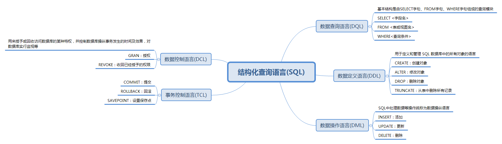
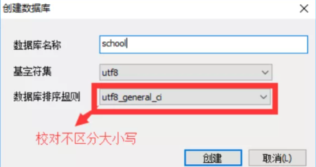

# 数据库操作

## 一、结构化查询语句分类



## 二、数据库操作

### 1、命令行操作数据库

创建数据库：create database [if not exists] 数据库名;

删除数据库：drop database [if exists] 数据库名;

查看数据库：show databases;

查看当前使用的数据库：select database();

使用数据库：use 数据库名;

### 2、对比工具操作数据库

**学习方法：**

- 对照 SQLyog 工具自动生成的语句学习
- 固定语法中的单词需要记忆



## 三、创建数据表

属于 DDL（**数据库模式定义语言 Data Definition Language**）的一种，语法：

```sql
create table [if not exists] `表名`(
   `字段名1` 列类型 [属性][索引][注释],
   `字段名2` 列类型 [属性][索引][注释],
  #...
   `字段名n` 列类型 [属性][索引][注释]
)[表类型][表字符集][注释];
```

**说明 :** 反引号用于区别 MySQL 保留字与普通字符而引入的（键盘esc下面的键）

## 四、数据值和列类型

列类型：规定数据库中该列存放的数据类型

### 1、数值型与浮点型


double 的使用格式：**字段名 double(总长度,小数点后保留的位数)**

### 2、字符串型


char 是定长字符串：

- 优点：存储性能高
- 缺点：浪费空间
- eg ： name char(10)  如果存储的数据字符个数不足10个，也会占10个的空间

varchar 是 变长字符串：

- 优点：节约空间
- 缺点：存储性能低（因为要先处理长度，而不是直接存储）
- eg ： name varchar(10) 如果存储的数据字符个数不足10个，那就数据字符个数是几就占几个的空间

### 3、日期和时间型


### 4、NULL值

- 理解为 "没有值" 或 "未知值"
- 不要用NULL进行算术运算，因为结果仍会为NULL

## 五、数据字段的属性

<font color='red'>**UnSigned**</font>

- 无符号的
- 声明该数据列不允许负数

<font color='red'>**ZEROFILL**</font>

- 0 填充的
- 不足位数的用0来填充 , 如int(3),5则为005

<font color='red'>**Auto_InCrement**</font>

- 自动增长的，每添加一条数据，自动在上一个记录数上加 1（默认）

- 通常用于设置**主键** ，且为整数类型

- 可定义起始值和步长

  - 当前表设置步长(AUTO_INCREMENT=100)：只影响当前表

  - SET @@auto_increment_increment=5 ; 影响所有使用自增的表(全局)

<font color='red'>**NULL 和 NOT NULL**</font>

- 默认为NULL，即没有插入该列的数值
- 如果设置为NOT NULL , 则该列必须有值

<font color='red'>**DEFAULT**</font>

- 默认的
- 用于设置默认值
- 例如，性别字段，默认为"男"，否则为 "女"；若无指定该列的值，则默认值为"男"的值

```sql
-- 目标 : 创建一个school数据库
-- 创建学生表(列,字段)
-- 学号int 登录密码varchar(20) 姓名,性别varchar(2),出生日期(datatime),家庭住址,email
-- 创建表之前 , 一定要先选择数据库

CREATE TABLE IF NOT EXISTS `student` (
`id` int(4) NOT NULL AUTO_INCREMENT COMMENT '学号',
`name` varchar(30) NOT NULL DEFAULT '匿名' COMMENT '姓名',
`pwd` varchar(20) NOT NULL DEFAULT '123456' COMMENT '密码',
`sex` varchar(2) NOT NULL DEFAULT '男' COMMENT '性别',
`birthday` datetime DEFAULT NULL COMMENT '生日',
`address` varchar(100) DEFAULT NULL COMMENT '地址',
`email` varchar(50) DEFAULT NULL COMMENT '邮箱',
PRIMARY KEY (`id`)
) ENGINE=InnoDB DEFAULT CHARSET=utf8

-- 显示CREATE DATABASE创建命名数据库的语句
SHOW CREATE DATABASE school;
-- 显示CREATE TABLE创建命名数据表的语句。
SHOW CREATE TABLE student;
-- 显示表结构
DESC student;  -- 设置严格检查模式(不能容错了)SET sql_mode='STRICT_TRANS_TABLES';
```

## 六、数据表的类型

### 1、设置数据表的类型

```sql
CREATE TABLE 表名(
   -- 省略一些代码
   -- Mysql注释
   -- 1. # 单行注释
   -- 2. /*...*/ 多行注释
)ENGINE = MyISAM (or InnoDB)

-- 查看mysql所支持的引擎类型 (表类型)
SHOW ENGINES;
```

MySQL的数据表的类型 : **MyISAM** , **InnoDB** , HEAP , BOB , CSV 等...

常用的 MyISAM 与 InnoDB 类型：

| 名称       | MyISAM | InnoDB          |
| ---------- | ------ | --------------- |
| 事务处理   | 不支持 | 支持            |
| 数据行锁定 | 不支持 | 支持            |
| 外键约束   | 不支持 | 支持            |
| 全文索引   | 支持   | 不支持          |
| 表空间大小 | 较小   | 较大，约 2 倍！ |

经验 ( 适用场合 ) ：

- 适用 MyISAM：节约空间及相应速度
- 适用 InnoDB：安全性 , 事务处理及多用户操作数据表

### 2、数据表的存储位置

- MySQL数据表以文件方式存放在磁盘中

  - 包括表文件，数据文件，以及数据库的选项文件

  - 位置：Mysql安装目录 \data\ 下存放数据表。目录名对应数据库名，该目录下文件名对应数据表

- 注意 :

  - \* . frm -- 表结构定义文件

  - \* . MYD -- 数据文件 ( data )
  - \* . MYI -- 索引文件 ( index )
  - InnoDB类型数据表只有一个 *.frm文件，以及上一级目录的 ibdata1 文件
  - MyISAM类型数据表对应三个文件：


### 3、设置数据表字符集

我们可为数据库、数据表、数据列设定不同的字符集，设定方法：

- 创建时通过命令来设置，如：CREATE TABLE 表名() CHARSET = utf8;
- 如无设定，则根据 MySQL 数据库配置文件 my.ini 中的参数设定

## 七、修改数据库

### 1、修改表结构 ( ALTER TABLE )

修改表名：

``` sql
ALTER TABLE 旧表名 RENAME AS 新表名
```

添加字段：

``` sql
ALTER TABLE 表名 ADD 字段名 列属性 [属性]
```

修改字段类型：

```sql
ALTER TABLE 表名 MODIFY 字段名 列类型 [属性]
```

修改字段名和字段类型（字段类型为必要参数）：

```sql
ALTER TABLE 表名 CHANGE 旧字段名 新字段名 列属性 [属性]
```

删除字段：

```sql
ALTER TABLE 表名 DROP 字段名
```

### 2、删除数据表

语法：

```sql
DROP TABLE [IF EXISTS] 表名
```

- IF EXISTS 为可选，判断是否存在该数据表
- 不加 IF EXISTS 的情况下，如果删除不存在的数据表会抛出错误

### 3、其他

1. 可用反引号（`）为标识符（库名、表名、字段名、索引、别名）包裹，以避免与关键字重名！中文也可以作为标识符！
2. 每个库目录存在一个保存当前数据库的选项文件db.opt。
3. 注释：
     - 单行注释 # 注释内容
     - 多行注释 /* 注释内容 */
     - 单行注释 -- 注释内容     （标准SQL注释风格，要求双破折号后加一空格符（空格、TAB、换行等））
4. 模式通配符：
     - _   任意单个字符
     - %  任意多个字符，甚至包括零字符
     - 单引号需要进行转义 \'
5. CMD命令行内的语句结束符可以为 ";", "\G", "\g"，仅影响显示结果。其他地方还是用分号结束。delimiter 可修改当前对话的语句结束符。
6. SQL对大小写不敏感 （关键字）
7. 清除已有语句：\c
