# Docker 入门

## 初识 Docker

### 微服务架构的问题

微服务架构虽然带来了灵活性和可扩展性，但也引入了部署和管理上的挑战，特别是在大规模系统中：

- **依赖组件的冲突**：在微服务架构中，每个服务可能依赖不同的后端技术或中间件，如 Node.js、Redis、RabbitMQ、MySQL等。这些不同的依赖项可能需要特定的库版本或配置，容易引起冲突。
- **环境一致性问题**：开发、测试和生产环境的不一致性是导致部署问题的另一个常见原因。
- **复杂的依赖关系**：微服务间的依赖关系复杂，可能导致服务启动顺序、数据一致性和事务处理等问题。

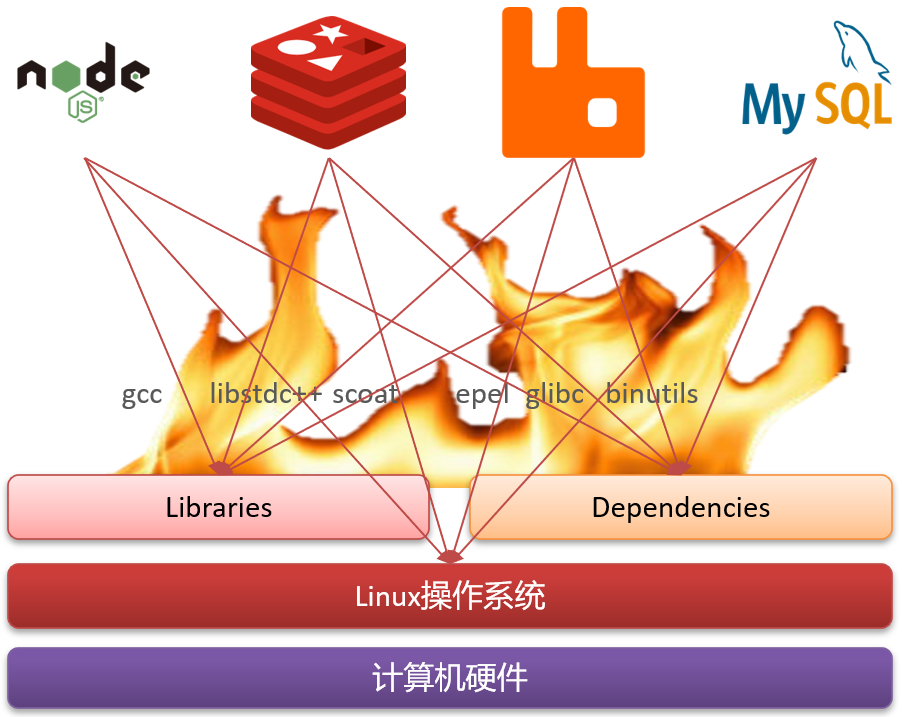

#### Docker 解决依赖兼容问题

针对在传统部署中常见的环境差异和依赖兼容性问题，Docker 利用容器技术提供了一种封装应用及其全部依赖的方法，其核心功能为：

1. **应用与依赖打包**：
   - **Libs (函数库)**：应用运行必需的库文件。
   - **Deps (依赖)**：应用运行所需的其他软件或依赖项。
   - **配置文件**：配置信息，确保应用在任何环境中都按预期工作。
   - 通过 Dockerfile 定义，所有必需的组件都被打包进一个 Docker 镜像中。
2. **隔离的容器环境**：
   - 每个 Docker 容器都在一个隔离的环境中运行，拥有自己的文件系统、网络配置和依赖库，确保不同容器间互不干扰。

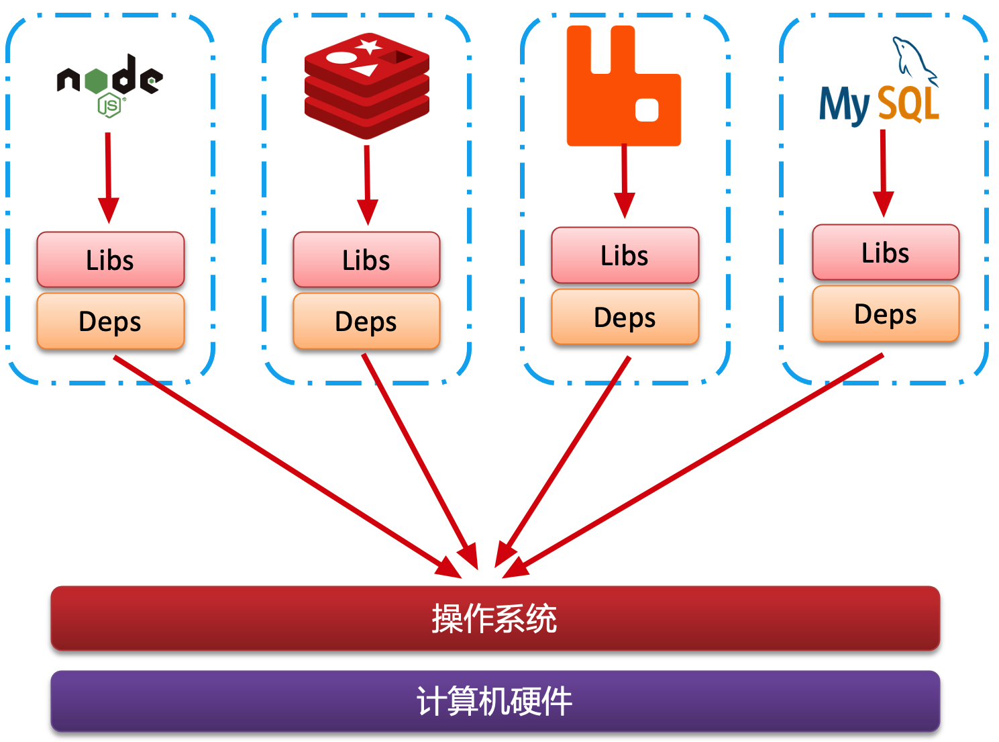

这样打包好的应用包中，既包含应用本身，也包含应用所需要的 Libs、Deps，无需在操作系统上安装这些，自然就不存在不同应用之间的兼容问题了。

尽管解决了不同应用的兼容问题，但是开发、测试等环境会存在差异，操作系统的版本也会有差异。操作系统的差异，特别是在系统应用和函数库上的差异，常常导致应用无法在不同环境中一致运行。

怎么解决这些问题呢？

#### Docker 解决操作系统环境差异

为了有效地解决操作系统环境之间的差异，理解操作系统的基本结构是关键。

以 Ubuntu 操作系统为例，其结构主要包括：

- **计算机硬件**：基本硬件组件，如 CPU、内存和磁盘等，是运行任何操作系统和应用程序的物理基础。
- **系统内核**：Linux 内核是所有 Linux 发行版的核心，包括 Ubuntu、CentOS 和 Fedora 等。内核负责与硬件交互，并提供 **内核指令** 来管理和控制硬件。
- **系统应用**：包括操作系统提供的各种应用和 **函数库**。这些库是对内核功能的高级封装，使得开发和应用运行更加方便。

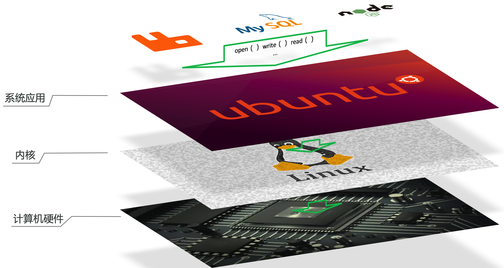

应用与计算机的交互流程：

1. 应用通过调用操作系统提供的函数库执行功能。
2. 函数库封装了内核指令集，简化了应用对硬件的操作。
3. 内核指令直接与硬件交互，执行具体的硬件操作。

在不同的 Linux 发行版中（比如 Ubuntu 和 CentOS），尽管核心内核相同（都基于 Linux），但系统应用和提供的函数库可能会有所不同：


在这种情况下，如果尝试将一个针对 Ubuntu 特定函数库编写的 MySQL 应用直接安装到 CentOS 系统上，可能会因为找不到相应的函数库或版本不匹配而出现错误：

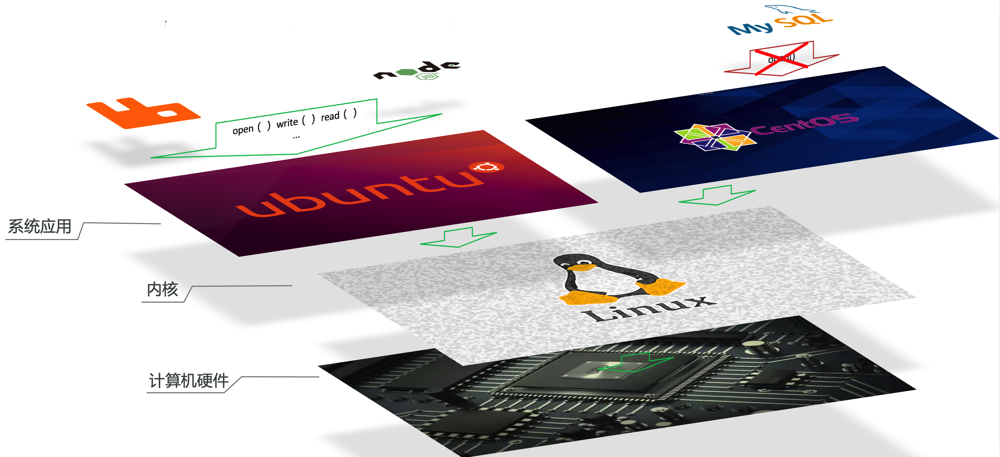

这种差异正是 Docker 通过容器化技术解决的问题，它通过将应用及其全部依赖（包括特定的系统函数库）打包在一起，确保应用在任何 Linux 系统上都能一致运行，从而避免了依赖不匹配的问题。

1. **内核级共享**：
   - Docker 容器共享宿主机的操作系统内核，但封装了应用需要的所有用户空间组件（如系统函数库）。
   - 这意味着，无论宿主机使用的是哪种 Linux 发行版（如 Ubuntu 或 CentOS），只要内核兼容，容器都可以运行。
2. **应用与系统函数库的封装**：
   - Docker 容器内包含了应用运行所需的特定版本的系统函数库，无需依赖宿主机上的库。
   - 当应用在容器内运行时，它调用的是容器内部的函数库，而非宿主机上的，从而避免了因版本不匹配或缺失库文件而引起的错误。


#### 小结

- Docker 如何解决大型项目依赖关系复杂，不同组件依赖的兼容性问题？
  - Docker 允许开发中将应用、依赖、函数库、配置一起 **打包**，形成可移植镜像
  - Docker 应用运行在容器中，使用沙箱机制，相互 **隔离**

- Docker 如何解决开发、测试、生产环境有差异的问题？
  - Docker 镜像中包含完整运行环境，包括系统函数库，仅依赖操作系统内核，因此可以在任意内核兼容的操作系统上运行

### Docker 的主要优势

- **完整封装**：Docker 使得程序及其所有依赖和运行环境可以一起被封装成一个单一的镜像。这样的镜像可以轻松迁移到任何 Linux 系统上运行，极大地提高了应用的部署灵活性。
- **隔离的运行环境**：通过沙箱机制，Docker 在运行时为每个容器提供了一个安全隔离的环境，确保应用之间互不干扰。
- **易于管理**：Docker 容器的启动和移除都可以通过简单的命令完成，使得应用的部署、测试和扩展变得更加快速和方便。

### Docker 和虚拟机的区别

Docker 和虚拟机都提供了 **应用隔离** 和 **环境一致性** 的解决方案，但它们在技术实现和性能优化上存在显著差异。

**虚拟机技术**：

- **完整的硬件级模拟**：虚拟机通过模拟整个硬件系统来运行另一个完整的操作系统。例如，在 Windows 系统中可以运行 Ubuntu，从而能够在该虚拟的 Ubuntu 系统中运行应用。
- **资源占用**：由于需要模拟整个硬件和运行完整的操作系统，虚拟机通常需要较多的系统资源（CPU、内存、存储）。
- **启动时间**：启动一个虚拟机涉及整个操作系统的启动过程，因此启动时间相对较长。

**Docker容器技术**：

- **操作系统级别的虚拟化**：Docker 容器与虚拟机不同，它不模拟硬件，也不运行完整的操作系统。相反，它仅封装应用及其依赖的函数库和配置，共享宿主机的操作系统内核。
- **资源效率**：Docker 容器由于共享宿主机的内核，因此在资源占用上更加高效。容器通常只占用必需的应用运行空间，使得硬件资源利用率更高。
- **快速启动**：Docker 容器不需要启动操作系统，启动速度远快于虚拟机，通常在几秒钟内完成。


对比来看：

| 特性     | Docker    | 虚拟机   |
| -------- | --------- | -------- |
| 性能     | 接近原生  | 性能较差 |
| 硬盘占用 | 一般为 MB | 一般为GB |
| 启动     | 秒级      | 分钟级   |

Docker 和虚拟机的主要差异：

- **实现层次**：Docker 作为一个系统进程运行，使用操作系统级虚拟化；虚拟机则模拟了完整的操作系统。
- **资源占用与性能**：Docker 在体积、启动速度和运行性能上优于虚拟机，这使得 Docker 在需要快速迭代和高效资源利用的环境中特别有用。

### Docker 架构

#### 镜像与容器

在 Docker 的生态系统中，**镜像 **和 **容器** 是两个核心概念：

- **镜像（Image）**：镜像是一个包含应用程序及其所有依赖、库文件、环境设置和配置的静态文件包。这个文件包是只读的，作为创建容器的模板。
- **容器（Container）**：当镜像被启动时，它在内存中运行并形成一个或多个 **容器**。容器是隔离的、动态的执行环境，它允许多个容器实例独立运行，基于同一个镜像。

例如，如果你下载了一个应用（如 QQ）的镜像，该镜像包含了运行该应用所需的所有文件和系统依赖。启动这个镜像就可以创建容器，实现例如同时登录多个账号等功能。

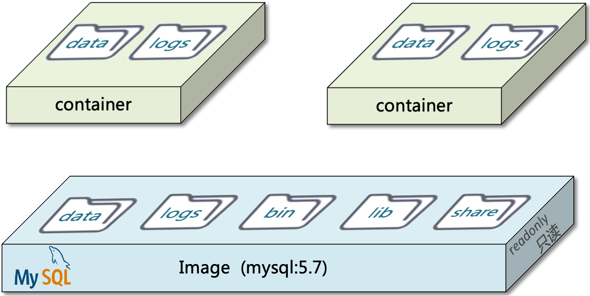

#### 镜像托管平台

市场上开源的应用程序非常多，打包这些应用往往是重复劳动。

为了提高效率，程序员就会将自己打包的应用镜像（例如 Redis、MySQL）镜像放到 **镜像托管平台** 上来共享使用，就像 GitHub 的代码共享一样。

Docker Registry 是一个存储、分发 Docker 镜像的服务。它是 Docker 镜像库的核心组件，允许用户和团队推送（push）和拉取（pull）镜像。这样，开发者可以上传自己构建的镜像到 Registry，其他用户则可以从 Registry 下载这些镜像来部署和运行容器。

**主要功能**：

- **存储和管理镜像**：Docker Registry 提供了存储、标记、管理和组织镜像的功能。
- **版本控制和回滚**：用户可以通过标签管理不同版本的镜像，方便回滚至旧版本。
- **访问控制**：支持配置权限和策略，控制谁可以访问和修改镜像。

**类型**：

- **公共 Registry**：最著名的公共 Docker Registry 是 Docker Hub，它由 Docker 官方运营，提供了数以万计的镜像供全球用户使用。除此之外，还有其他公共镜像库如 Google Container Registry、Amazon Elastic Container Registry 等。
- **私有 Registry**：企业和开发者可以部署私有 Docker Registry（如 [网易云镜像服务](https://c.163yun.com/hub) 和 [阿里云镜像库](https://cr.console.aliyun.com/)），以便在内部环境中安全地管理和存储镜像，同时提供更快的访问速度和额外的本地化服务。这对于包含敏感信息或专有软件的镜像尤其重要。

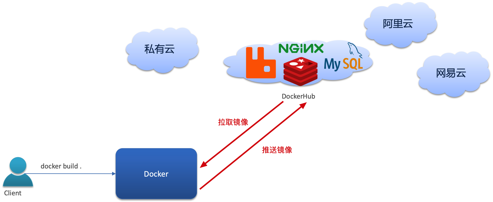

#### Docker 的客户端-服务器架构

Docker 使用客户端-服务器（Client-Server）架构：

- **服务端（Docker Daemon）**：服务端是 Docker 守护进程，运行于 **宿主机** 上，负责镜像和容器的创建、运行和监控
- **客户端（Docker Client）**：客户端可以是命令行工具或任何使用 Docker API 的应用，它通过发送命令到 Docker 守护进程来管理容器和镜像。

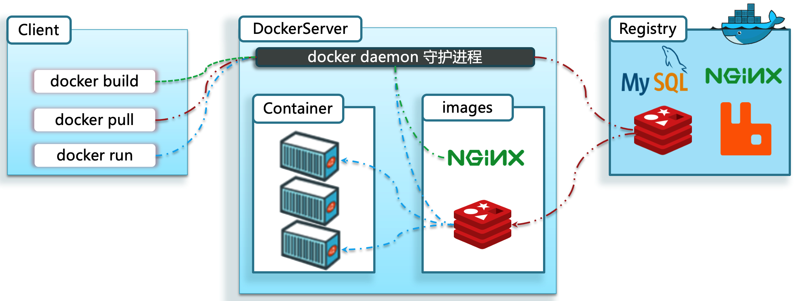

## Docker 的基本操作

### 镜像操作

#### 镜像名称的组成

Docker 镜像的名称通常由两部分组成：`[repository]:[tag]`。这里的 `repository` 是仓库名称，而 `tag` 指定了版本。如果没有明确指定 `tag`，默认值是 `latest`，表示最新版本的镜像。

例如，镜像名称 `mysql:5.7`中，`mysql` 是仓库名，`5.7` 是 tag，合起来表示 MySQL 的 5.7 版本镜像。

#### 常用镜像操作命令

以下是一些常用的 Docker 镜像操作命令：

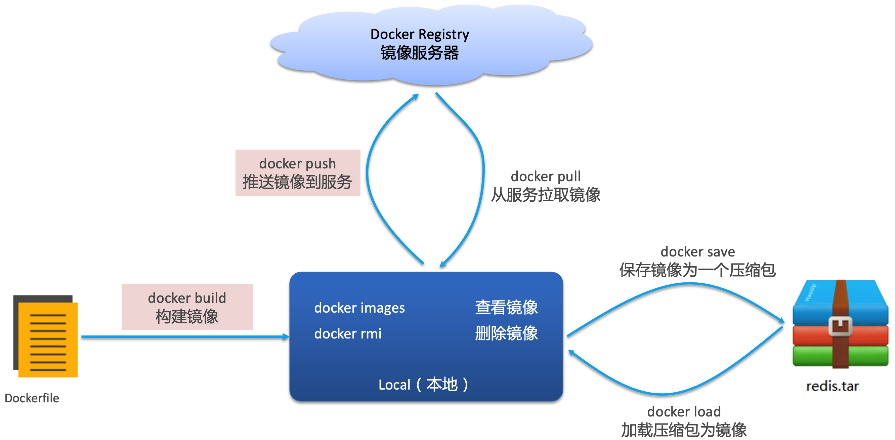

#### 案例 1：拉取并查看镜像

- **步骤 1**：在镜像托管平台（如 [DockerHub](https://hub.docker.com/)） 上搜索需要的 `nginx` 镜像

  

- **步骤 2**：拉取 `nginx` 镜像：`docker pull nginx`

  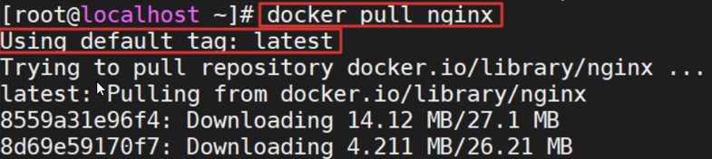

- **步骤 3**：查看已拉取的镜像：`docker images`

  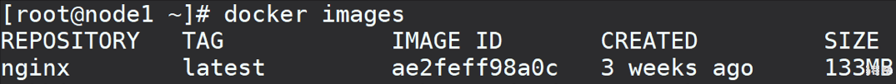

#### 案例 2：保存与导入镜像

- **步骤 1**：导出 `nginx` 镜像到磁盘，命令格式为 `docker save -o [保存的目标文件名称] [镜像名称]`

  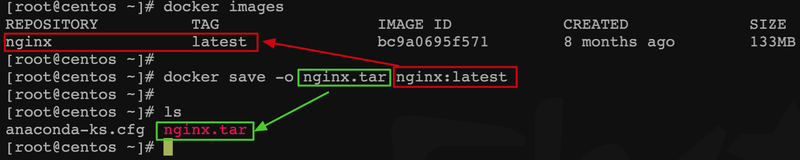

- **步骤 2**：删除本地的 `nginx` 镜像：`docker rmi nginx:latest`

- **步骤 3**：从磁盘文件加载镜像：`docker load -i nginx.tar`

  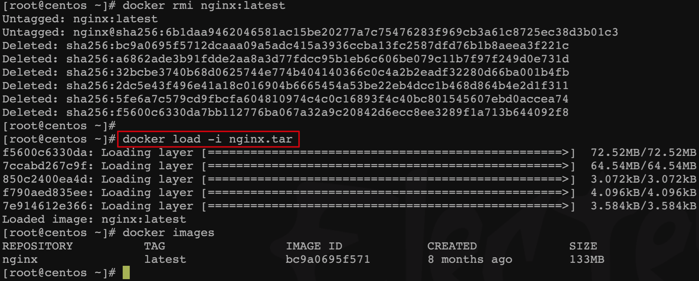

### 容器操作

容器操作涉及多个命令，用于管理容器的生命周期和状态，包括创建、运行、暂停、停止和删除：

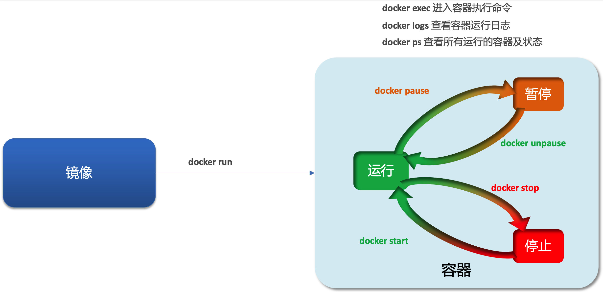

#### 容器状态

容器可以处于以下状态：

- **运行**：容器内的应用进程正在正常运行。
- **暂停**：容器中的进程被暂停，CPU 停止工作，但内存状态被保持。
- **停止**：容器中的进程已终止，相关资源如内存和 CPU 使用被释放。

#### 常见容器操作命令

- **`docker run`**：创建并启动一个新容器。
- **`docker pause`**：暂停正在运行的容器。
- **`docker unpause`**：恢复已暂停的容器。
- **`docker stop`**：停止正在运行的容器。
- **`docker start`**：启动已停止的容器。
- **`docker rm`**：删除指定的容器，但默认情况下 **不能删除正在运行的容器** 。

#### 案例 1：创建并运行容器

创建并启动名为 `containerName` 的 Nginx 容器：

```sh
docker run --name containerName -p 80:80 -d nginx
```

- `--name containerName`：指定容器名称。
- `-p 80:80`：端口映射，将宿主机的 80 端口（冒号左侧）映射到容器的 80 端口（冒号右侧）。
- `-d`：后台运行容器。
- `nginx`：使用的镜像名称。

#### 为什么需要端口映射

Docker 容器运行在隔离的网络环境中，这意味着它们拥有独立的网络栈。容器内部的网络服务（例如 Web 服务器或数据库）虽然在容器内部可以正常运行，但默认情况下，它们不会对外部网络环境（即宿主机网络）直接开放。因此，如果没有进行适当的网络配置，这些服务将无法从容器外部访问。

端口映射是解决这一隔离问题的关键。它允许外部请求通过宿主机的指定端口访问到容器内部的端口。这样做的好处是：

- **可访问性**：通过将容器内运行的服务端口映射到宿主机的端口，用户可以使用宿主机的 IP 地址和端口号来访问容器内的服务。
- **灵活性**：用户可以选择任何空闲的宿主机端口映射到容器的任何端口，这提供了极大的配置灵活性，允许多个容器共享宿主机而不会端口冲突。
- **安全性**：端口映射还可以增加安全层次，因为只有显式映射的端口对外界可见。这样可以有效地隔离和保护容器内的应用，避免直接暴露容器内部的所有服务。

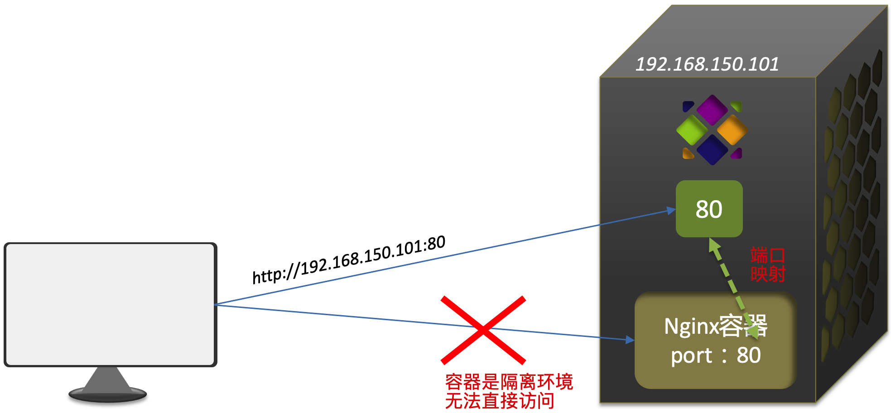


#### 案例 2：进入容器并修改内部文件

**步骤 1**：使用 `docker exec` 命令进入容器：

```sh
docker exec -it containerName bash
```

- `-it`：交互式终端。
- `containerName`：容器名称。
- `bash`：进入容器后立刻执行的命令，这里是在容器内启动 bash shell。

**步骤 2**：导航到 Nginx 的 HTML 目录：

```sh
cd /usr/share/nginx/html
```

容器内部会模拟一个独立的 Linux 文件系统，看起来如同一个 Linux 服务器一样：


**步骤 3**：修改 `index.html` 文件以改变显示内容：

```sh
sed -i 's/Welcome to nginx/欢迎您的访问/g' index.html
```

这个命令使用 `sed` 文本编辑器（容器内还没下载 `vim`）替换 HTML 页面中的默认欢迎消息。

**结果验证**：访问宿主机 IP 地址，例如 `http://192.168.150.101`，在浏览器中查看修改后的页面。

注意：`docker exec` 命令可以进入容器并修改文件，但在容器内修改文件是 **不推荐** 的行为，原因是：

- **破坏了容器的可重复性**：Docker 的一个核心优势是提供一致的环境以确保应用在不同环境中能够以相同的方式运行。如果在容器内部进行修改，这些更改通常不会被持久化或版本控制，这意味着重新启动或重新部署容器时这些修改会丢失，从而破坏了环境的一致性和可重复性。
- **难以维护和升级**：如果容器内的文件被频繁修改，每次升级或维护应用时都需要重新执行这些修改，这增加了管理的复杂性和出错的风险。更好的做法是将这些更改反映到 Docker 镜像中，通过更新镜像来推送更改。

#### 查看容器日志

在使用 Docker 管理容器时，监控容器的日志和状态是日常管理和故障排查中非常重要的方面。

要查看 Docker 容器的日志，可以使用 `docker logs` 命令。

这个命令会输出容器的 STDOUT 和 STDERR，即容器运行中生成的所有输出，包括应用日志。

**基本命令格式：**

```bash
docker logs [容器ID或名称]
```

**高级选项：**

- 使用  `-f` 或 `--follow` 选项来实时跟踪日志输出：

  ```bash
  docker logs -f my_container
  ```

- 使用 `--since`  选项来查看从某个时间点开始的日志，例如查看最近 10 分钟的日志：

  ```bash
  docker logs --since 10m my_container
  ```

- 使用 `--tail` 选项来查看最后 N 行的日志：

  ```bash
  docker logs --tail 100 my_container
  ```

#### 查看容器状态

查看容器状态可以使用 `docker ps` 命令，它列出了所有 **运行中** 的容器。

如果要查看包括停止的容器在内的所有容器，可以添加 `-a` 或 `--all` 选项。

**基本命令格式：**

```bash
docker ps [选项]
```

**示例命令：**

- 查看所有容器（运行中和已停止的）：

  ```bash
  docker ps -a
  ```

- 查看特定容器的详细状态，可以使用 `docker inspect` 命令，它提供了容器的配置和状态信息：

  ```bash
  docker inspect my_container
  ```

**高级选项：**

- 使用 `-f` 或 `--filter` 选项来根据条件过滤显示的容器，例如只查看处于“运行”状态的容器：

  ```bash
  docker ps -f "status=running"
  ```

- 使用 `--format` 来自定义输出格式，这可以让你精确控制显示的信息，例如只显示容器的 ID 和状态：

  ```bash
  docker ps --format "{{.ID}}: {{.Status}}"
  ```

### 数据卷（容器数据管理）

在之前的 Nginx 案例中，修改 Nginx 的 HTML 页面时需要进入容器内部进行操作，非常不方便。

通常情况下，许多轻量级容器镜像（如 `alpine` 或 `busybox`）不包括 `vim` 或其他全功能编辑器，以保持镜像尽可能地小。

尽管在容器内安装和使用 `vim` 是可能的，但通常不推荐在运行中的容器内进行持久化的文件修改，因为这些更改不会反映到容器镜像中，并且可能违背了容器的 **不可变** 和 **声明式管理** 原则。

此外，直接在容器内修改数据引起的另一个问题是数据持久性的缺失。在升级或删除容器时，未持久化的数据会随容器一同被删除。这种 **容器与数据的耦合** 违反了现代云原生应用推荐的最佳实践。

为了避免这些问题，并确保容器管理的最佳实践，必须将数据与容器解耦，这就要用到数据卷（Volumes）了。

#### 什么是数据卷

**数据卷** 是一种特别设计用来持久化和共享 Docker 容器数据的机制，且其生命周期独立于容器本身。

这意味着即使容器被删除，数据卷中的数据也不会丢失，可以被其他容器重新挂载和使用。

当定义一个数据卷时，我们可以指定一个宿主机上的目录，Docker 会将这个目录映射到容器内部的指定路径。

这使得容器内部的应用可以直接读写宿主机的文件系统，而这部分文件系统被封装在数据卷中。

因此，虽然从技术上讲数据卷表现为连接宿主机和容器的桥梁，但更准确的描述为：**数据卷是管理数据存取的实体**。


**主要特点**：

- **数据持久化**：数据卷保证了数据不会随容器的删除而丢失，实现了数据的持久存储。
- **数据共享**：数据卷可以被多个容器同时挂载，实现数据的共享和重用。
- **与容器解耦**：数据卷的生命周期独立于任何容器，可以在容器之间自由地连接和重用。
- **高效性能**：数据卷提供了比传统的持久化方式（如写入容器层）更高效的读写性能。

#### 数据卷的应用场景

- **数据库存储**：对于运行在容器中的数据库服务，使用数据卷存储数据库文件可以确保数据库数据的安全和持久化。
- **配置文件管理**：可以将配置文件放在数据卷中，通过挂载到容器内的特定位置，实现配置的动态加载和更新。
- **日志存储**：将应用日志输出到数据卷，可以使日志文件保持在容器重启后仍然可访问。
- **内容管理**：对于需要处理大量文件和媒体资料的应用，如 CMS 系统，使用数据卷可以提高数据的管理效率和安全性。

注意：

- 在 Docker 中，数据卷确实存储于宿主机的某个位置，但这个具体位置默认是由 Docker 管理的，不需要用户直接干预。
- Docker 自动处理数据卷的存储位置，以确保容器化环境的抽象和安全性。
- 虽然一般不推荐，但如果有必要，用户可以指定数据卷的具体存储位置。

#### 创建和管理数据卷

创建和使用数据卷的基本命令如下：

```bash
# 创建一个新的数据卷
docker volume create my_volume

# 查看所有数据卷
docker volume ls

# 查看指定数据卷的详细信息，比如数据卷指向的宿主机目录
docker volume inspect my_volume

# 删除指定数据卷
docker volume rm my_volume

# 删除所有不在使用种的数据卷
docker volume prune
```

#### 将数据卷挂载到容器

当启动容器时，可以通过 `-v` 或 `--mount` 标志来挂载数据卷到容器的指定路径。例如：

```bash
# 使用 -v 选项挂载数据卷
docker run -d -v my_volume:/path/in/container my_image

# 使用 --mount 选项挂载数据卷（推荐）
docker run -d --mount source=my_volume,target=/path/in/container my_image
```

`--mount` 标志的语法比 `-v` 更严格，更具有描述性，推荐用于新的容器部署。

这里假设 `html` 是一个已经存在的数据卷，且我们希望将其挂载到容器的 `/root/html` 目录。此外，容器将使用 `nginx` 镜像，并将容器的 80 端口映射到宿主机的 8080 端口，命令如下：

```sh
docker run \
  --name mn \
  --mount type=volume,source=html,target=/root/html[,other-options...] \
  -p 8080:80 \
  nginx \
```

- **type**：挂载的类型，主要有三种：
  - `volume`：**带数据卷的挂载模式**，会挂载一个管理的数据卷。如果指定的数据卷不存在，Docker 会自动创建它。
  - `bind`：**直接挂载模式**，挂载宿主机的一个文件或目录到容器中。
  - `tmpfs`：挂载一个临时文件系统到容器中。在容器停止后，`tmpfs` 挂载的数据将被删除。
- **source**（或 `src`）：挂载源的标识。
  - 对于 `volume` 类型，这是数据卷的名称。
  - 对于 `bind` 类型，这是宿主机上的文件或目录的路径。
  - 对于 `tmpfs`，此参数可省略。
- **target**（或 `dst`）：容器内的挂载点（即容器内的路径）。
- **readonly**：一个可选参数，如果设置，挂载点将为只读模式。
- **volume-opt**：允许设置特定于卷的选项，如 `nocopy`。

#### 挂载主机目录（Bind Mounts）

在 Docker 中，容器可以通过两种主要方式与存储资源交互，这两种方式分别是使用数据卷和直接挂载宿主机目录。每种方式的关联关系如下：

- **带数据卷的挂载模式**：
  - **路径关系**：宿主机目录 --> 数据卷 --> 容器内目录
  - **描述**：在这种模式下，宿主机的特定目录首先与数据卷相关联，数据卷再被挂载到容器内的指定目录。这种方式允许数据卷独立于任何容器的生命周期进行管理，提供数据持久化并能在多个容器间共享。

- **直接挂载模式**：
  - **路径关系**：宿主机目录 --> 容器内目录
  - **描述**：此模式直接将宿主机的目录或文件挂载到容器内的指定目录。这种方式允许容器直接访问和修改宿主机的文件系统，常用于 **开发环境** 中，以便开发者可以直接在宿主机上修改文件并立即在容器中反映这些更改。

直接挂载模式示意图：

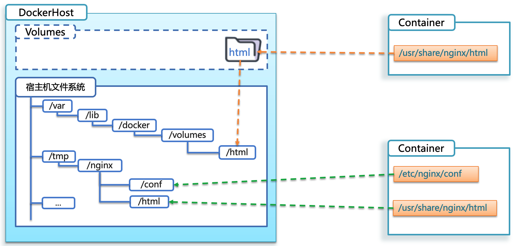

#### 使用场景比较

- **数据卷挂载**：适合 **生产环境** 和需要数据持久化的场景。数据卷的使用可以通过 Docker 的管理命令进行细致控制，如创建、备份、迁移和删除数据卷，无需直接操作宿主机文件系统。
- **直接挂载**：适合 **开发环境**，尤其是当开发者需要频繁更改挂载数据，并希望这些更改立即在容器中可见时。它减少了管理的复杂性，但可能带来安全和一致性问题，因为它允许容器直接修改宿主机的文件系统。

## Dockerfile 自定义镜像

虽然常见的镜像可以在 Docker Hub 上找到，但对于我们自己开发的项目，就必须要自己构建镜像了。

而要自定义镜像，就必须先了解镜像的结构。

### 镜像的分层结构

每个 Docker 镜像由多个层（layer）组成，每一层代表镜像构建过程中的一个步骤。这种分层架构允许 Docker 高效地存储和传输镜像，同时也支持更快速的镜像更新和共享。

Docker 镜像包含应用程序及其所需的系统函数库、环境、配置和依赖，打包在一起。

以 MySQL 镜像为例，其结构如下：


简单来说，镜像就是在系统函数库、运行环境基础上，添加应用程序文件、配置文件、依赖文件等组合，然后编写好启动脚本，之后打包在一起，所形成的文件。

所谓构建镜像，其实就是实现上述打包的过程。

#### 镜像分层的工作原理

当你使用 `Dockerfile` 构建 Docker 镜像时，每一个指令（如 `RUN`, `COPY`, `ADD`）都会创建一个新的层。例如：

```Dockerfile
FROM ubuntu:20.04
COPY . /app
RUN make /app
CMD ["./app"]
```

- `FROM` 指令设置基础镜像（这里是 `ubuntu:20.04`），是第一层。
- `COPY` 指令复制本地文件到镜像中，形成第二层。
- `RUN` 指令执行构建命令（这里是编译应用），形成第三层。
- `CMD` 指令指定容器启动时运行的命令，通常不添加新的层。

#### 镜像分层的优势和特点

1. **重用和共享**：分层结构使得重用成为可能。如果多个镜像基于同一基础镜像，那么这个基础镜像的所有层只需要在机器上保存一份，由不同的镜像共享。
2. **增量构建和存储**：当修改 `Dockerfile` 并重新构建镜像时，只有自上次构建以来有所改动的层会被重新构建。这减少了构建时间和网络带宽，因为只需上传和下载改变的层。
3. **高效管理**：分层机制也使得管理和更新镜像变得更加高效。例如，更新底层的操作系统层（如安全更新）可以在不影响上层应用的情况下进行。

### Dockerfile 语法

构建自定义镜像时，并不需要手动复制或打包文件。

通过编写 Dockerfile，我们只需定义镜像的组成，如基础镜像、文件拷贝、依赖安装、启动脚本等。Docker 会根据 Dockerfile 中的指令来自动构建镜像。

**Dockerfile** 就是一个文本文件，其中包含一个个的 **指令（Instruction）**，用指令来说明要执行什么操作来构建镜像，每一个指令都会形成一层 Layer。

| **指令**   | **说明**                                     | **示例**                    |
| ---------- | -------------------------------------------- | --------------------------- |
| FROM       | 指定基础镜像，定义镜像的构建起点             | FROM centos:6               |
| ENV        | 设置环境变量，可在后面指令使用               | ENV key value               |
| COPY       | 拷贝本地文件到镜像的指定目录                 | COPY ./mysql-5.7.rpm /tmp   |
| RUN        | 执行Linux的shell命令，一般是安装过程的命令   | RUN yum install gcc         |
| EXPOSE     | 指定容器运行时监听的端口，是给镜像使用者看的 | EXPOSE 8080                 |
| ENTRYPOINT | 镜像中应用的启动命令，容器运行时调用         | ENTRYPOINT java -jar xx.jar |

注意：`EXPOSE` 指令主要用于文档化容器将在哪些端口上提供服务。它本身并不会自动使容器的端口对外部可访问，而是起到声明容器意图使用这些端口的作用。

详细的 Dockerfile 语法说明可以参考官网文档：[Dockerfile reference](https://docker-docs.uclv.cu/engine/reference/builder/)

### 构建 Java 项目

#### 基于 Ubuntu 构建 Java 项目

- **步骤 1**：创建 `docker-demo` 目录并进入：

  ```bash
  mkdir docker-demo && cd docker-demo
  ```

- **步骤 2**：将 `docker-demo.jar` 和 `jdk8.tar.gz` 文件拷贝到此目录。

- **步骤 3**：在此目录下编写 Dockerfile 文件，内容示例：

  ```dockerfile
  # 指定基础镜像
  FROM ubuntu:16.04
  # 配置环境变量，JDK的安装目录
  ENV JAVA_DIR=/usr/local
  
  # 拷贝 JDK 和项目 JAR 包
  COPY ./jdk8.tar.gz $JAVA_DIR/
  COPY ./docker-demo.jar /tmp/app.jar
  
  # 安装 JDK
  RUN cd $JAVA_DIR \
   && tar -xf ./jdk8.tar.gz \
   && mv ./jdk1.8.0_144 ./java8
   
  # 配置环境变量
  ENV JAVA_HOME=$JAVA_DIR/java8
  ENV PATH=$PATH:$JAVA_HOME/bin
  
  # 暴露端口
  EXPOSE 8090
  # 入口，java项目的启动命令
  ENTRYPOINT ["java", "-jar", "/tmp/app.jar"]
  ```

- **步骤 4**：构建镜像

  ```bash
  docker build -t javaweb:1.0 .
  ```

- **步骤 5**：运行容器：

  ```sh
  docker run -p 8090:8090 javaweb:1.0
  ```


访问 `http://<your-vm-ip>:8090/hello/count` 来测试应用。

#### 基于 java8 构建 Java 项目

虽然可以从 Ubuntu 基础镜像开始，手动添加所需的软件包来构建 Docker 镜像，但这种方法会相对繁琐。因此，更常见的做法是利用已经包含了部分必需软件的 **预构建基础镜像** 作为起点。

以 Java 应用为例，构建其 Docker 镜像时，可以选择一个已经预装了 JDK 的基础镜像。这样做不仅简化了构建过程，还能显著减少构建时间和潜在的配置错误。

- **步骤 1**：新建目录并创建 Dockerfile：

  ```bash
  mkdir java-project && cd java-project
  ```

- **步骤 2**：拷贝 `docker-demo.jar` 到目录中。

- **步骤 3**：在此目录下编写 Dockerfile 文件，内容示例：

  ```dockerfile
  FROM java:8-alpine
  COPY ./app.jar /tmp/app.jar
  EXPOSE 8090
  ENTRYPOINT ["java", "-jar", "/tmp/app.jar"]
  ```

- **步骤 4**：构建镜像：

  ```bash
  docker build -t java-app:1.0 .
  ```

- **步骤 5**：运行容器：

  ```bash
  docker run -p 8090:8090 java-app:1.0
  ```

## Docker Compose

**Docker Compose** 是一个用于定义和运行多容器 Docker 应用程序的工具。

通过一个 YAML 文件（默认为 `docker-compose.yml`），用户可以配置应用服务所需的所有服务、网络和卷。Docker Compose 简化了多容器应用的开发、测试、部署和运维过程。

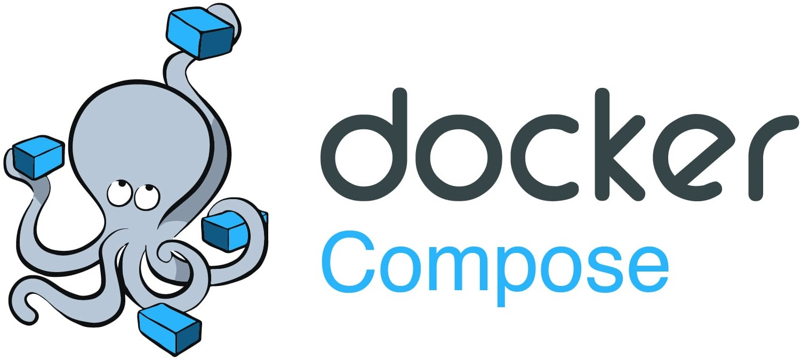

### 功能和用途

- **服务定义**：在 `docker-compose.yml` 文件中，可以定义一个或多个服务（容器），每个服务可以包括镜像信息、配置端口、连接的网络、挂载的卷等。
- **一键部署**：通过一个命令 (`docker-compose up`)，可以同时启动、停止、重建所有服务。
- **环境隔离**：每个项目可以使用独立的网络和卷，保证了不同项目之间的环境隔离。

### 主要组件

- **服务（Services）**：代表应用中的各个组件，比如数据库、前端、后端等。每个服务都会从 Docker 镜像启动一个或多个容器实例。
- **网络（Networks）**：定义服务之间如何相互通信。Docker Compose 默认为所有服务设置一个网络。
- **卷（Volumes）**：用于数据持久化和数据共享。

### docker-compose.yml 示例

```yaml
version: '3.8'  # 指定 Docker Compose 文件格式版本

services:
  web:
    image: nginx:alpine  # 使用 nginx 官方镜像
    ports:
      - "80:80"  # 将容器的 80 端口映射到宿主机的 80 端口
    networks:
      - webnet  # 连接到 webnet 网络

  database:
    image: postgres:alpine  # 使用 PostgreSQL 官方镜像
    environment:
      POSTGRES_DB: exampledb  # 设置数据库名为 exampledb
      POSTGRES_USER: user  # 设置数据库用户为 user
      POSTGRES_PASSWORD: pass  # 设置数据库密码为 pass
    networks:
      - webnet  # 连接到 webnet 网络
    volumes:
      - db-data:/var/lib/postgresql/data  # 持久化 PostgreSQL 数据到 db-data 卷

networks:
  webnet:  # 定义一个名为 webnet 的网络，服务通过此网络互联

volumes:
  db-data:  # 定义一个名为 db-data 的持久卷
```

Docker Compose 文件实质上是将多个 `docker run` 命令集成到一个可重复使用、易于维护的文本文件中。

详细的 DockerCompose 语法说明可以参考官网文档：[DockerCompose reference](https://docker-docs.uclv.cu/compose/compose-file/)

### 使用 Docker Compose 的好处

- **简化配置**：将服务的配置集中在一个文件中，避免了分散和重复的命令行参数。
- **开发效率**：快速启动、停止和重建开发环境，使得开发过程更加高效。
- **易于扩展**：可以轻松地通过修改配置文件来扩展服务的副本数。
- **适用于所有环境**：同一 `docker-compose.yml` 可用于开发、测试、生产环境，保持环境一致性。

### 如何使用

Docker Compose 的基本命令包括：

- `docker-compose up`：启动服务
- `docker-compose down`：停止并移除服务、网络、卷
- `docker-compose build`：构建或重新构建服务

## Docker 镜像仓库 

Docker 镜像仓库用于存储和分发容器镜像。要与私有镜像仓库互动，如推送和拉取镜像，首先需要对本地镜像进行重新标记（tagging），以匹配仓库的地址。以下是操作步骤：

### 推送镜像

1. **重新标记本地镜像**： 为本地镜像添加新标签，标签格式为私有仓库地址加上镜像名和标签：

   ```sh
   docker tag nginx:latest 192.168.150.101:8080/nginx:1.0
   ```

2. **推送镜像到仓库**： 将标记后的镜像推送到指定的私有仓库：

   ```sh
   docker push 192.168.150.101:8080/nginx:1.0
   ```

### 拉取镜像

从私有仓库拉取镜像到本地系统：

```sh
docker pull 192.168.150.101:8080/nginx:1.0
```

### 说明

- **标记（Tagging）**：这一步是必要的，因为它定义了镜像在私有仓库中的存储路径和名称。
- **推送（Push）**：确保你有足够的权限推送到私有仓库，且仓库服务正常运行。
- **拉取（Pull）**：拉取操作要求你有访问该私有仓库的权限，并且知道正确的镜像标签。
