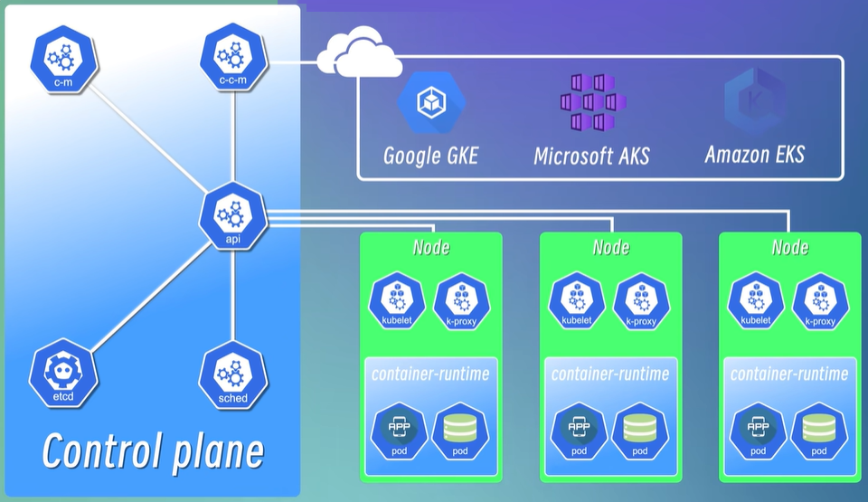

# Kubernetes 基础概念

## 什么是 Kubernetes

**Kubernetes** 是一个开源的容器编排平台，用于自动化部署、扩展和管理容器化应用。

它提供了工具和服务，支持各种容器操作，包括自动部署、扩容、缩容、更新和回滚。

Kubernetes 于2014年由 Google 开源，并且它的设计参考了 Google 多年运行生产级工作负载的经验，其前身是 Google 内部的 Borg 系统。

## 为什么要使用 Kubernetes

在 Kubernetes 出现之前，容器的管理通常依赖于 Docker 等工具。

尽管 Docker 非常适合单机容器管理，但它本身并不支持跨节点的容器管理。

随着应用规模的扩大，我们需要在多个服务器节点上运行和管理容器，这就需要更强大的工具来进行集群管理。

### 容器编排引擎的演进

- **单机管理**：Docker 最初用于单个节点的容器管理。
- **初级编排**：Docker Swarm，作为 Docker 的官方编排工具，提供了基本的集群管理功能，适合小型或简单的应用场景。
- **高级编排**：
  - **Apache Mesos**：一个更复杂的系统，支持大规模集群管理，适用于高度复杂的应用环境。
  - **Kubernetes**：从 Google 的 Borg 系统演化而来，已成为容器编排的事实标准。作为 CNCF（Cloud Native Computing Foundation）的顶级项目，Kubernetes 不仅支持大规模的容器管理，还提供高度的灵活性和强大的社区支持。

### Kubernetes 的优势

- **广泛的社区支持**：作为开源项目，Kubernetes 拥有活跃的开发者社区和丰富的中间件生态。
- **高度的可扩展性**：能够支持从小型应用到大规模企业级部署。
- **强大的功能**：包括但不限于服务发现、负载均衡、故障恢复、自动扩展和滚动更新。

通过使用 Kubernetes，企业和开发者可以有效地管理复杂的、跨多个容器的应用，确保应用的高可用性和可扩展性。Kubernetes 不仅简化了容器管理，还使得 DevOps 实践更加高效和可靠。

## Kubernetes 组件

Kubernetes 架构包括多个核心组件，它们共同协作，提供一个健壮的、可扩展的容器编排平台。

### Node（节点）

节点是 Kubernetes 集群中的工作机，可以是物理机或虚拟机。每个节点都负责运行 Pods，即容器的集合。

### Pod

Pod 是 Kubernetes 的基本调度单元，也是容器运行的环境。每个 Pod 可以包含一个或多个紧密关联的容器，这些容器共享网络和存储资源：

- **资源共享**：在同一个 Pod 中的容器可以共享 IP 地址、端口号、存储卷等，它们可以像在同一台机器上运行一样进行交互。
- **应用案例**：通常，单个服务的不同实例（例如，一个 Web 服务器）会运行在不同的 Pods 中。高度耦合的容器（例如，主应用程序和其辅助的日志记录程序）可以在同一个 Pod 中运行。

假设我们系统包括一个应用程序和一个数据库，就可以将应用程序和数据库分别放到两个不同的 Pod 中，一般情况下一个 Pod 中只运行一个容器，这样可以更好地实现应用程序的 **解耦** 和扩展。

一个 Pod 中也是可以运行多个容器的，一般仅限于这些容器是 **高度耦合** 的情况，它们之间为了共享一些配置或者资源，不得不将它们放到一个容器中

应用程序要访问数据库的话，只需要知道数据库的 IP 地址，这里的 IP 地址是 Pod 在创建的时候自动创建的，是一个 **集群内部的 IP 地址**（也就是无法从集群外部访问），Pod 之间通过这些 IP 地址进行通信。

#### Pod IP 不稳定问题

Pod 并不是稳定的实体，它们非常容易被创建或者销毁.

比如发生故障的时候，Kubernetes 会自动将发生故障的 Pod 进行销毁，并创建一个新的 Pod 替代它，此时该Pod 的 IP 也会重新分配。

如果依赖于原始 IP 地址的应用尝试访问这些 Pod，就会发生连接错误。

### Service

为了解决这个问题，Kubernetes 提供了一个名为 Service 的抽象层，它定义了逻辑上的一组 Pod 和访问这些 Pod 的策略。主要用于处理 Pod IP 地址的动态变化问题：

- **稳定的访问地址**：Service 提供一个不变的 IP 地址和 DNS 名称（**一个统一入口**），以便其他应用或服务发现并持续访问其下的 Pods。
- **负载均衡**：Service 会自动分发网络流量到后端的 Pods，即使其中某些 Pod 被替换或重新调度。

比如上面的场景，我们可以将应用程序和数据库两组 Pod 封装成两个 Service，这样应用程序就可以通过 Service 的 IP 地址访问数据库（有点像路由器和反向代理），即使 Pod 的 IP 地址发生了变化，Service 的 IP 地址也不会发生变化，Service 会自动将请求转发到其它健康的 Pod 上。

#### 正向代理

正向代理主要为客户端提供服务。在这种设置中，服务端并不知道实际发出请求的客户端 IP。

**工作流程**：

- 客户端发送请求到代理服务器。
- 代理服务器接收请求后，代替客户端向服务端发送请求。
- 服务端响应代理服务器的请求。
- 代理服务器再将数据转发给客户端。

**应用实例**：

- 常见于科学上网，通过代理服务器访问地域性内容限制的网站。

#### 反向代理

反向代理代表服务端接受来自客户端的请求。在这种模式下，客户端并不直接与后端服务的真实 IP 通信。

**工作流程**：

- 客户端向代理服务器发送请求。
- 代理服务器根据预定规则将请求转发至内部网络的某台服务器。
- 该内部服务器处理请求并返回数据给代理服务器。
- 代理服务器最终将响应传回给客户端。

**应用实例**：

- 使用 Nginx 实现的负载均衡，分发请求至后端多个服务器。

#### 代理的优势

1. **隐私保护**：隐藏用户和服务器的真实 IP，增加隐私保护。
2. **加速访问**：在代理服务器上设置缓存，减少资源重复下载，提升访问速度。
3. **突破访问限制**：绕过地理或政策限制，访问全球内容。

#### 潜在的劣势

1. **中间人风险**：代理服务器可以访问传输中的所有数据，存在隐私泄露的风险。
2. **增加延迟**：引入代理服务器可能会增加通信延迟，尤其是在代理服务器物理位置较远时。

### 内部服务与外部服务

#### 内部服务

内部服务指的是那些不需要或不能暴露给外部网络的服务。

这些服务通常包括数据库、缓存系统、消息队列等，它们仅在集群内部被其他服务访问。

这种服务的特点是对安全性和访问控制有较高要求，因此通常不对外公开。

#### 外部服务

外部服务则是需要对外暴露的服务，如后端的 API 接口和前端界面等。

这些服务需被终端用户或其他外部系统访问，因此需要特定的配置以确保可访问性和安全性。

#### Kubernetes 中的服务类型

在 Kubernetes 中，管理外部访问的服务有几种类型，常见的包括：

- **ExternalName**: 通过返回 CNAME 记录，不直接进行流量转发，而是通过 DNS 解析来连接服务。
- **LoadBalancer**: 为服务提供一个外部访问的入口点，在支持的环境下，这通常是通过云提供商的负载均衡器实现。
- **NodePort**: 这是一种常用的配置，它在集群的所有节点上开放一个端口（NodePort），并将该端口映射到内部服务的 IP 地址和端口。通过访问任何节点的 IP 地址和指定端口，外部用户可以访问服务。例如，`http://localhost:8080` 可能就是通过 NodePort 访问的。
- **ClusterIP**: 默认的服务类型，它为服务在集群内部分配一个内部 IP 地址，使得服务只能在集群内部访问。

Ingress 是用于管理从集群外部访问集群内部服务的入口和方式，可以通过 Ingress 配置不同的转发规则，从而根据不同的规则来访问不同的 Service 以及 Service 所对应的 Pod。还可以通过 Ingress 来配置域名，这样就可以从集群外部使用域名和访问 Service。

### Ingress

在开发和测试阶段，直接通过 IP 地址和端口号访问服务是一种常见做法。然而，在生产环境中，通常采用域名来访问服务（**增强用户体验，提高服务的可靠性和可维护性**）。

这就涉及到了 Ingress，一个 Kubernetes 资源，它允许通过外部访问入口来路由 HTTP 和 HTTPS 流量到内部服务。Ingress 不仅能够提供 **域名支持**，还支持 **负载均衡**、**SSL 终端** 和基于名称的虚拟托管等功能。

通过这种方式，Kubernetes 提供了一套完整的解决方案来管理服务的内部和外部访问，确保服务的可访问性同时也增强了安全控制。

### ConfigMap

在传统应用部署中，配置数据（如数据库的地址和端口）通常硬编码在配置文件或环境变量中。

这种做法将 **配置与应用程序紧密耦合**，导致每当配置变动时，必须重新编译并部署应用程序。

这不仅增加了维护难度，还可能导致服务中断，这在需要服务持续在线的场景下尤为不便。

为了解决这些挑战，Kubernetes 提供了 ConfigMap，一个用于 **存储配置数据** 的 Kubernetes 资源。

ConfigMap 允许将配置信息从应用容器镜像中解耦，从而简化容器应用的配置管理。

#### 功能和优势

- **配置解耦**：ConfigMap 将配置信息与容器镜像分离，使得容器应用配置更加灵活和动态。
- **易于更新**：当需要修改配置时，只需更新 ConfigMap 对象，无需重新构建和部署容器镜像。
- **动态配置**：ConfigMap 支持应用程序在运行时动态读取配置数据。这一点特别重要，因为它支持无需重启服务即可实现配置的热更新，从而不中断正在运行的服务。为此，应用需要设计为能够监控和响应配置文件的变化。

可以将 ConfigMap 理解为数据库连接信息的一个“反向代理”。它充当了应用和数据库间配置信息的中介，当数据库的连接信息变化时，无需改动应用程序代码或重新部署应用，只需更新 ConfigMap 即可。

### Secret

虽然 ConfigMap 非常适用于存储配置数据，但其明显的缺陷在于 **存储的数据是未加密的**。

这意味着敏感信息如密码、私钥等如果存储在 ConfigMap 中可能会存在安全风险，因为任何能访问 Kubernetes 集群的用户都可能查看 ConfigMap 的内容。

于是 Kubernetes 提供了 **Secret** 组件，用于封装敏感信息。Secret 中的数据项默认以 Base64 编码方式存储。

但 Base64 编码主要是为了处理那些在 JSON 和 YAML 中不能直接表达的数据，非常容易被解码，所以还需要配合其它手段来确保安全性。

### Volume

在 Kubernetes 中，Pod 的生命周期和存储周期通常是耦合的。当一个 Pod 被销毁或重启时，与之相关的非持久性数据也会丢失。这对于需要持久化存储的应用程序（如数据库）来说是不可接受的。

**Kubernetes 提供了 Volume 组件来解决这一问题**。Volume 允许将持久化存储资源挂载到集群中的本地磁盘或外部远程存储（如阿里云的 OSS）上，确保即使 Pod 被删除，数据依然得以保留。

### Deployment

在部署应用时，单一节点的故障可能导致服务完全不可用，即出现单点故障。为了提高应用的可用性和容错能力，可以采用多副本部署策略。

**Deployment 是 Kubernetes 中管理 Pod 副本的关键组件**，它不仅允许定义和管理应用程序的副本数量，还支持复杂的更新策略和自动扩缩容操作：

- **副本控制**：可以定义应用副本的数量（例如，设定为 3）。如果其中一个副本发生故障，Kubernetes 自动创建新的副本来替换它，确保集群中始终维持设定数量的运行副本。
- **滚动更新**：在更新应用时，Deployment 可以逐步替换旧版本的 Pod，以新版本的 Pod 逐步取代，从而无需停机即可更新应用。这种策略确保了应用的平滑升级，不影响终端用户的体验。
- **平滑升级**：这是滚动更新的一个重要特点，即在升级过程中不会对用户服务造成中断或不便。

### StatefulSet

在 Kubernetes 中，除了无状态的应用（如前端服务器），有状态的应用（如数据库）也需要特别的管理来保证高可用性和数据的一致性。

这是因为，与无状态应用不同，有状态应用如数据库，其多个副本之间存在状态差异，这些状态需要精确管理以确保数据一致性。

#### 为什么不用 Deployment 管理数据库

虽然 Deployment 组件非常适合管理无状态的应用（如无状态的 API 服务），它通过简单地复制同一个容器来扩展服务。

然而，对于需要持久化存储和唯一网络标识的数据库，Deployment 无法有效管理，因为：

- **数据一致性**：数据库复制需要复杂的数据同步机制。
- **网络标识**：数据库通常需要稳定的网络标识符以维持网络间的通信。

#### StatefulSet 的特性

为了解决这些问题，Kubernetes 提供了 **StatefulSet**，专门用于管理有状态应用。StatefulSet 为每个副本提供以下保障：

- **稳定的网络标识符**：每个副本都有一个固定的网络标识符，即使副本被重新调度。
- **持久化存储**：StatefulSet 可以使用持久卷确保即使 Pod 重启，数据也不会丢失。

#### StatefulSet 的挑战

尽管 StatefulSet 提供了许多优势，它的部署和管理比 Deployment 更复杂：

- **部署复杂性**：设置和维护 StatefulSet 涉及更多的配置，如存储绑定、网络配置等。
- **恢复策略**：StatefulSet 需要更复杂的数据备份和恢复策略以防止数据丢失。

#### 特定情况下的考虑

对于某些特定应用，如使用内存存储数据的 Redis 实例，StatefulSet 不能防止实例重启时的数据丢失。这是因为 Redis 的数据如果不持久化到外部存储，重启后内存中的数据会消失。

#### 替代方案

在某些情况下，将有状态应用从 Kubernetes 集群外独立部署可能是一个更好的选择，尤其是当这些应用的状态管理需求超出 Kubernetes 的典型用例时。独立部署可以利用专门的工具和系统，更好地满足应用的特定需求。

## Kubernetes 架构

Kubernetes 采用了 Master-Worker 架构来管理集群，确保集群的高效运行和资源分配。

### Worker Node

Worker Nodes 是集群中的工作节点，负责运行应用程序和服务。每个 Worker Node 包含以下关键组件：

#### Container Runtime

运行容器的环境，负责拉取镜像、创建和管理容器的生命周期。它是运行所有容器的基础。

#### Kubelet

在每个节点上运行，负责 Pod 的生命周期管理，包括创建、启动、监控、重启和销毁 Pod。

Kubelet 定期与 API Server 通信，获取 Pod 规范（Specs）的更新，并报告节点状态。

#### Kube-Proxy

负责为 Pod 提供网络代理和负载均衡服务。它确保内部和外部通信的网络流量能正确路由到目标 Pod，同时处理节点间的网络隔离和流量转发。

注意：虽然 `kube-proxy` 和 `Ingress` 都处理网络流量，但 `kube-proxy` 更多关注集群 **内部** 的服务通信和负载均衡，而 `Ingress` 则提供了一个高级的、可配置的方式来管理从 **外部网络** 到集群内部服务的访问。

### Master Node

Master Node 是 Kubernetes 集群的控制平面，负责全局的管理和调度，其包含以下关键组件：

#### Kube-apiserver

集群的中心枢纽，负责提供集群的 API 接口服务。作为集群的网关，它处理所有组件间的通信以及用户与集群的交互：

- **请求路由**：所有请求首先通过 kube-apiserver，它负责将这些请求路由到适当的组件。
- **认证和授权**：kube-apiserver 进行请求的认证、授权和访问控制，确保只有合法和授权的操作能够被执行。
- **数据校验**：它还负责对所有 CRUD（创建、读取、更新、删除）操作进行数据校验和处理。

#### Scheduler

监控集群中的资源使用情况，并基于调度策略决定将 Pod 调度到哪个节点上：

- **资源优化**：调度器选择资源空闲最多的节点来部署新的 Pod，优化资源利用率和负载均衡。
- **调度决策**：基于多种因素，如资源需求、亲和性规则、污点和容忍度等，进行智能调度。

#### Controller Manager

管理集群中的各种资源对象的生命周期，包括 Node、Pod、Service 等：

- **状态管理**：持续监控资源状态，并根据预设策略作出响应，如自动替换故障的 Pod。
- **故障处理**：在节点或服务发生故障时自动进行恢复操作，如重新调度和启动新的 Pod。

#### etcd

一个高可用的键值存储系统，用于持久化存储集群的所有重要状态信息：

- **数据一致性**：作为集群的主数据存储，etcd 保证数据的一致性和可靠性。
- **查询支持**：支持高效的数据查询，是集群状态恢复和运维任务的基础。

#### Cloud Controller Manager

允许集群与云服务提供商的底层云基础设施集成，负责管理与云相关的组件：

- **云资源管理**：处理与云平台相关的任务，如节点的自动创建和同步云负载均衡器设置。
- **平台抽象**：为不同的云平台提供一致的管理界面，使 Kubernetes 能够在多云环境中无缝运行。